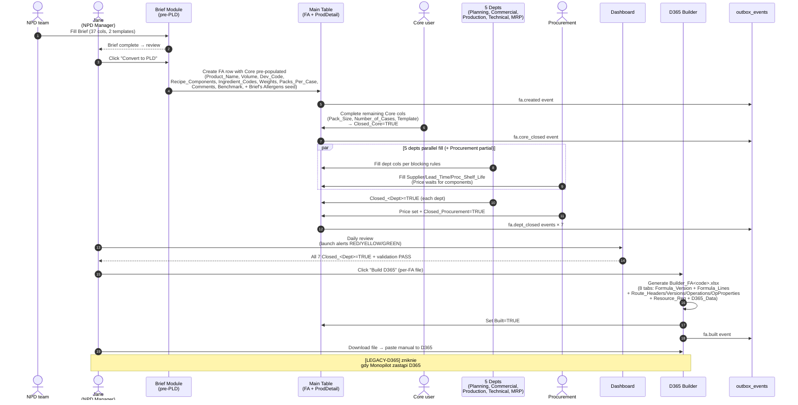
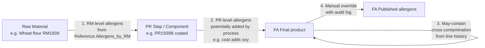

# PRD 01-NPD — Monopilot MES (primary module, Phase B.2)

> **Module 01-NPD to primary module Monopilot** — zastępuje Smart PLD v7 (Excel/VBA) w pełnej funkcjonalności + incorporuje Brief pre-PLD stage + generuje D365 Builder output dla bridge-period.
>
> **Reality fidelity (Phase D P4):** Phase B.2 replikuje v7 1:1 (7 depts z fixed names, 69 Main Table cols, cascading + workflow rules). Speculation (inne orgi, advanced AI, autonomous agents) deferred do Phase C/D.
>
> **Markery [UNIVERSAL] / [APEX-CONFIG] / [EVOLVING] / [LEGACY-D365]** stosowane wszędzie per 00-FOUNDATION §2.

---

## Executive Summary

**Co robi moduł 01-NPD:** zarządza pełnym lifecyclem Product (FA) od momentu NPD brief → przez 7-dept parallel fill (Core, Planning, Commercial, Production, Technical, MRP, Procurement) → do D365 Builder paste-ready output. Replaces 22-tab Smart_PLD_v7.xlsm z pełnym zakresem functionality.

**Pozycja w build plan:**
- PRD writing: **Phase B.2** (1-3 sesji).
- Build/implementation: **#1 primary module** (po 00-FOUNDATION meta, sekwencyjnie z rozbiciem 01-NPD-a do 01-NPD-e, patrz §13).
- Reality source: `Smart_PLD_v7.xlsm` (69 cols Main Table, 22 tabs, 7 depts, 8 D365 Builder tabs) + brief 1/2.xlsx (37 cols, 2 templates) + `Builder_FA5101.xlsx` (reference docelowy D365 output, 7 tabów).

**Strategiczna rola:** "Primary module" bo:
1. 01-NPD pokrywa ~90% scope v7 (gdy to zbudowane, v7 Excel może zostać wyłączone — P2 Two-systems principle wymaga parallel-run przez ~12 mies.)
2. Wszystkie pozostałe moduły (02-SETTINGS admin wizard, 03-TECHNICAL product master, 11-SHIPPING GS1/EPCIS, itd.) budowane po tym mają FA jako fundament.
3. D365 Builder integration stage 1 (per 00-FOUNDATION §4.1) jest inline w 01-NPD — bridge do D365 przez 12 mies. dual-maintenance.

**Dwa wielkie dodatki vs pre-Phase-D PRD:**
1. **Brief module jako pre-PLD NPD stage** (nowa funkcjonalność — dziś dane brief są manual rewrite do Core; Monopilot auto-convert)
2. **Allergens multi-level cascade** RM → PR_step → FA (Phase D decision #16, [UNIVERSAL] food-mfg per Reg EU 1169/2011 + 2021/382)

---

## §1 — Module Scope

### 1.1 In scope (Phase B.2 rewrite + Phase C4 refinement)

| Area | Phase B.2 | Phase C4+ |
|---|---|---|
| Main Table (FA CRUD, 69 cols) | ✅ full | Extensions per [EVOLVING] items |
| 7 dept proxy views + schema-driven metadata (Reference.DeptColumns) | ✅ full | Multi-tenant variation (per ADR-030) |
| Cascading rules (4 cascade chains) | ✅ full | DSL editor (02-SETTINGS) |
| Workflow rules (Closed/Done, autofilter, blocking, row/cell status, Built) | ✅ full | — |
| Allergens multi-level cascade (RM → PR_step → FA) | ✅ full ([UNIVERSAL]) | VITAL 3.0 precautionary labeling, mass balance |
| Brief module pre-PLD stage (2 templates, 37 cols, Convert-to-PLD) | ✅ full | 3rd/Nth template support, admin wizard |
| D365 Builder output (8 tabs per-FA `Builder_FA<code>.xlsx`, N+1 products per FA, OP=10 always) | ✅ full [LEGACY-D365] | Deprecation path when D365 retired |
| Validation rules (V01-V06 + new V07-V08) | ✅ full | Rule engine DSL editor |
| Dashboard NPD-scoped (counters, alerts RED/YELLOW/GREEN, per-dept Done/Pending/Blocked) | ✅ full | Cross-module extend w 12-REPORTING |
| Multi-component ProdDetail (per-component rows, aggregate Main Table comma-sep) | ✅ full | Main Table vs ProdDetail semantics freeze |
| Event emission (FA lifecycle events → outbox → downstream consumers) | ✅ full | MQTT bridge, ML feature store |

### 1.2 Out of scope — later phases

| Out of scope | Phase / moduł docelowy |
|---|---|
| Admin UI wizard dla schema/rules editing | 02-SETTINGS (Phase C1) |
| Product master CRUD (separate from FA spec) | 03-TECHNICAL (Phase C1) |
| BOM versioning + co-products + routing costs | 03-TECHNICAL (Phase C1) |
| PO/TO/WO state machines + RELEASE-to-warehouse | 04-PLANNING-BASIC (Phase C2) |
| LP lifecycle + GRN + FEFO picking | 05-WAREHOUSE (Phase C2) |
| Scanner PWA (Receive/Move/Pick/Count) | 06-SCANNER-P1 (Phase C2) |
| MRP demand forecasting | 07-PLANNING-EXT (Phase C3) |
| WO execution + changeover gate + operator sign-off | 08-PRODUCTION (Phase C3) |
| CCP monitoring + HACCP runtime + holds | 09-QUALITY (Phase C4) |
| Cost roll + variance + landed cost | 10-FINANCE (Phase C4) |
| SO + ASN + EPCIS shipping events + Peppol invoicing | 11-SHIPPING (Phase C4) |
| Full dashboards (OEE, shift perf, period reports) | 12-REPORTING (Phase C5) |
| CMMS + predictive maintenance | 13-MAINTENANCE (Phase C5) |
| Multi-site (APEX + EDGE activation) | 14-MULTI-SITE (Phase C5) |
| OEE real-time + digital twin | 15-OEE (Phase C5) |
| Comarch / EDI EDIFACT / Supplier portals / Customer portals | INTEGRATIONS stages 2/3/4/5 (Phase C4/C5) |

### 1.3 Exclusions (nigdy — out of scope Monopilot całości)

- **GL / AP / AR / cash management** — zostaje D365 / Xero / Comarch (R8, MES-TRENDS §3)
- **HR / payroll / CRM** — osobne domeny
- **On-premise deployment** — SaaS only (EU/US regional data planes)
- **Custom code per-tenant** — schema-driven config (ADR-028) + rule engine DSL (ADR-029)
- **Blockchain traceability** — GS1 Digital Link + EPCIS 2.0 wystarczą (MES-TRENDS §2)

---

## §2 — Personas + RBAC

### 2.1 Personas (reality v7 mapped + Monopilot enhancements)

| Persona | Reality v7 | Monopilot scope | Markers |
|---|---|---|---|
| **NPD Manager** (Jane @ Apex) | Owner całego procesu PLD; Add Product macro trigger; D365 Builder click; Dashboard daily review | 01-NPD orchestrator role; jedyny user z `d365_builder.execute` + `fa.create` permissions | role [UNIVERSAL], osoba [APEX-CONFIG] |
| **NPD team (Core)** | 3 osoby (w tym Jane); wypełnia Core section (7 cols); Brief fill | 01-NPD Core section fill; Brief form fill; Convert-to-PLD button | [UNIVERSAL] |
| **Planning manager** | Primary_Ingredient_Pct, Runs_Per_Week, Date_Code | Planning section fill + Dashboard read | [UNIVERSAL] |
| **Commercial manager** | Launch_Date, Article_Number, Bar_Codes, Cases_Per_Week_W1-3 | Commercial section fill + Dashboard read | [UNIVERSAL] |
| **Production manager** | Processes 1-4, Yields, Line, Equipment_Setup, Resource_Requirement, Rate, PR Codes | Production section + ProdDetail rows (per component) | [UNIVERSAL] |
| **Technical / Quality manager** | Dziś: Shelf_Life. Future: Allergens multi-level | Technical section + Allergens validation | [UNIVERSAL] (HACCP regulatory) |
| **MRP manager** | Packaging specs (Box, Labels, Web, Sleeves, Cartons, Tara, Pallet) | MRP section fill | [UNIVERSAL] |
| **Procurement manager** | Supplier, Lead_Time, Proc_Shelf_Life (starts early); Price waits for components | Procurement section fill | [UNIVERSAL] |

### 2.2 Role permissions matrix (01-NPD scope)

Permissions modeled w `Reference.RolePermissions` (schema-driven per ADR-028). Base role set:

| Permission | `npd_manager` | `core_user` | `<dept>_manager` | `<dept>_user` | `admin` | `viewer` |
|---|---|---|---|---|---|---|
| `fa.create` | ✅ | ✅ | ❌ | ❌ | ✅ | ❌ |
| `fa.delete` | ✅ | ❌ | ❌ | ❌ | ✅ | ❌ |
| `brief.create` | ✅ | ✅ | ❌ | ❌ | ✅ | ❌ |
| `brief.convert_to_fa` | ✅ | ❌ | ❌ | ❌ | ✅ | ❌ |
| `core.write` | ✅ | ✅ | ❌ | ❌ | ✅ | ❌ |
| `<dept>.write` (Planning/Commercial/etc.) | ✅ | ❌ | ✅ (own dept) | ✅ (own dept) | ✅ | ❌ |
| `dashboard.view` | ✅ | ✅ | ✅ | ✅ | ✅ | ✅ |
| `d365_builder.execute` | ✅ | ❌ | ❌ | ❌ | ❌ | ❌ |
| `closed_flag.unset` (reopen dept) | ✅ | ✅ (own Core) | ✅ (own dept) | ❌ | ✅ | ❌ |
| `schema.edit` (add/remove Main Table col) | ❌ | ❌ | ❌ | ❌ | ✅ | ❌ |
| `rule.edit` (modify DSL rules) | ❌ | ❌ | ❌ | ❌ | ✅ | ❌ |
| `risk.write` | ✅ | ❌ | ❌ | ❌ | ✅ | ❌ |
| `compliance_doc.write` | ✅ | ❌ | ✅ (Technical/Quality) | ❌ | ✅ | ❌ |
| `formulation.create_draft` | ✅ | ✅ | ❌ | ❌ | ✅ | ❌ |
| `formulation.lock` | ✅ | ❌ | ❌ | ❌ | ✅ | ❌ |
| `recipe.submit_for_trial` | ✅ | ✅ | ❌ | ❌ | ✅ | ❌ |
| `pilot.promote_to_bom` | ✅ | ❌ | ❌ | ❌ | ✅ | ❌ |
| `npd.gate.advance` | ✅ | ❌ | ❌ | ❌ | ✅ | ❌ |
| `npd.gate.approve` | ✅ | ❌ | ❌ | ❌ | ✅ | ❌ |

Marker: struktura permissions = [UNIVERSAL]. Konkretne permissions names + mapping to Apex roles = [APEX-CONFIG] (inni klienci mogą rename / rearrange per ADR-030 + ADR-031).

> **[N-U6 per gap-backlog 2026-04-30]** Permissions `risk.write`, `compliance_doc.write` (§18, §19), `formulation.create_draft`, `formulation.lock`, `recipe.submit_for_trial` (§17.11.1), `pilot.promote_to_bom` (Stage-Gate G3→G4), `npd.gate.advance`, `npd.gate.approve` (previously §17.9 only) added per UX coverage of stage-screen surfaces and Risk/Compliance modules.

### 2.3 MFA + audit

- `d365_builder.execute` wymaga MFA re-auth (high-impact operation, paste to external D365)
- `fa.delete` wymaga confirmation modal + audit log entry
- `schema.edit` + `rule.edit` wymaga MFA + audit (production schema changes)

---

## §3 — End-to-End Flow

### 3.1 High-level sequence (Mermaid)



### 3.2 Stages summary

| Stage | Trigger | Owner | Output | Duration ref |
|---|---|---|---|---|
| **Stage 0 — Brief** | NPD idea | NPD team | Brief row complete (37 cols) | variable |
| **Stage 1 — Convert + Core setup** | Jane click Convert | Core user (w/ Jane supervision) | FA row created, Closed_Core=TRUE | hours—days |
| **Stage 2 — Parallel dept fill** | Closed_Core=TRUE | 5 depts (Planning, Commercial, Production, Technical, MRP) + Procurement partial | 6 dept Closed flags | weeks—months |
| **Stage 3 — Procurement Price finalization** | Production + MRP components ready | Procurement | Closed_Procurement=TRUE | days |
| **Stage 4 — Closure + validation** | All 7 Closed=TRUE | Jane | Status_Overall=Complete + validation PASS | hours |
| **Stage 5 — D365 Builder** | Jane click Build | Jane (via button) | Builder_FA<code>.xlsx + Built=TRUE | seconds (auto) |
| **Stage 6 — Paste-back** | Builder output ready | Jane | FA live in D365 | minutes |

**Timing constraint [APEX-CONFIG]:** Brief handoff → launch minimum **24 tygodnie** (hardcoded business rule, configurable per org in Phase C1 via `Reference.AlertThresholds`).

---

## §4 — Entity Model

### 4.1 Primary entities (01-NPD scope)

| Entity | Cardinality | Storage | Notes |
|---|---|---|---|
| **FA** (Product) | 1 row per product launch | Main Table, 69 cols typed | PK = `Product_Code` (format `FA*`, [APEX-CONFIG]); source of truth |
| **ProdDetail** | N per FA (1 per component for multi-comp) | `prod_detail` table, ~20 cols | Foreign key `Product_Code`; per-component Manufacturing_Operation_1..4 + Yield + Line + Equipment_Setup + PR codes |
| **Brief** | 1 row (single-comp) OR N rows (multi-comp) | `brief` table, 37 cols + `brief_version` metadata | 2 templates; pre-PLD upstream stage |
| **Dept proxy views** | 7 views (read-through schema-driven) | Not stored — computed from Main Table + Reference.DeptColumns | Per-dept filtered columns + blocking states |
| **Reference tables** | 8-10 tabs (config) | `Reference.*` tables | DeptColumns (metadata), PackSizes, Templates, Lines_By_PackSize, Equipment_Setup_By_Line_Pack, ManufacturingOperations (configurable per tenant), CloseConfirm, Allergens (new), D365_Constants (new), AlertThresholds (new) |
| **outbox_events** | Monotonic ordered (append-only) | `outbox_events` table (per 00-FOUNDATION §10) | Domain events for downstream consumers |
| **audit_events** | Append-only | `audit_events` table | Every FA mutation logged (SOC 2/GDPR/FDA 21 CFR 11) |

### 4.2 Core schema-driven backbone (ADR-028)

Wszystkie metadata dla Main Table cols żyją w `Reference.DeptColumns`:

```sql
CREATE TABLE "Reference.DeptColumns" (
    column_name    TEXT PRIMARY KEY,
    tenant_id      UUID NOT NULL,
    dept           TEXT NOT NULL,        -- 'Core' | 'Planning' | 'Commercial' | 'Production' | 'Technical' | 'MRP' | 'Procurement' | 'System'
    data_type      TEXT NOT NULL,        -- 'text' | 'number' | 'date' | 'dropdown' | 'auto'
    dropdown_source TEXT,                -- nazwa innej Reference.* tabeli (gdy data_type='dropdown')
    blocking_rule  TEXT,                 -- '' | 'Core done' | 'Pack_Size filled' | 'Line filled' | 'Core + Production done' | (custom DSL)
    required_for_done BOOLEAN NOT NULL,
    display_order  INT NOT NULL,
    marker         TEXT NOT NULL,        -- 'UNIVERSAL' | 'APEX-CONFIG' | 'EVOLVING' | 'LEGACY-D365'
    schema_version INT NOT NULL,
    created_at     TIMESTAMPTZ DEFAULT now()
);
CREATE INDEX ON "Reference.DeptColumns" (tenant_id, dept, display_order);
```

Runtime engine (01-NPD server) czyta DeptColumns → generuje:
- **React forms** (RHF + Zod resolver)
- **Server validators** (Zod runtime per request, per 00-FOUNDATION §5 R4)
- **Per-dept views** (filtered columns per dept)
- **Cell locks** (blocking_rule evaluated per row + user state)
- **Required_for_done checks** (IsAllRequiredFilled per dept)

Storage FA rows (hybrid core + JSONB per 00-FOUNDATION §5 R2):

> **Table-naming note (per 00-FOUNDATION §4.3-AMENDMENT, ADR-034 finalisation):** the physical table name in 01-NPD-a DDL is **`product`** (Option B, generic multi-industry name). The legacy alias `fa` is retained as a read-only SQL view (`CREATE VIEW fa AS SELECT * FROM product;`) for D365 Builder + integrations through Phase C1. PRD code blocks below still show `fa` to keep cross-references with v3.x stable; treat as `product` in implementation. Event aggregate prefix `fa.*` is unaffected (decoupled from storage — see 00-FOUNDATION §10 + `_meta/specs/event-naming-convention.md`).

```sql
-- Phase E-0 / 01-NPD-a actual DDL: rename "fa" → "product" + compat view (see note above)
CREATE TABLE fa (
    product_code        TEXT PRIMARY KEY,
    tenant_id      UUID NOT NULL,
    -- Core cols (8)
    product_name   TEXT,
    pack_size      TEXT,
    number_of_cases NUMERIC,
    recipe_components    TEXT,
    ingredient_codes        TEXT,           -- auto-derived
    template       TEXT,
    closed_core    TEXT,
    -- Planning (4)
    primary_ingredient_pct       NUMERIC,
    runs_per_week  NUMERIC,
    date_code_per_week TEXT,
    closed_planning TEXT,
    -- (Commercial, Production, Technical, MRP, Procurement cols analogously)
    -- ... 69 cols total
    -- System (10)
    done_core      BOOLEAN,
    -- (done flags per dept × 7)
    status_overall TEXT,           -- enum Phase D #3: 'Built' | 'Complete' | 'Alert' | 'InProgress' | 'Pending'
    days_to_launch INT,            -- computed on-the-fly (per Phase D #4)
    built          BOOLEAN,        -- [LEGACY-D365]
    -- L3/L4 extensions
    ext_jsonb      JSONB,          -- tenant extensions (L3 per ADR-031)
    private_jsonb  JSONB,          -- org-private (L4)
    schema_version INT NOT NULL,
    -- AI/trace-ready (per 00-FOUNDATION §10 R13)
    model_prediction_id UUID,
    epcis_event_id UUID,
    external_id    TEXT,           -- D365 Item RecId bridge-period
    -- Audit
    created_at     TIMESTAMPTZ DEFAULT now(),
    created_by_user UUID NOT NULL,
    created_by_device TEXT,
    app_version    TEXT
);
ALTER TABLE fa ENABLE ROW LEVEL SECURITY;
CREATE INDEX ON fa (tenant_id, status_overall, days_to_launch);
CREATE INDEX ON fa (tenant_id, launch_date) WHERE built = FALSE;
```

### 4.3 ProdDetail (multi-component)

```sql
CREATE TABLE prod_detail (
    id             UUID PRIMARY KEY DEFAULT gen_random_uuid(),
    product_code        TEXT NOT NULL REFERENCES fa(product_code) ON DELETE CASCADE,
    tenant_id      UUID NOT NULL,
    intermediate_code TEXT NOT NULL,            -- e.g., 'PR123H', 'WIP456B', 'BATCH001' (format per Reference.CodePrefixes)
    component_index INT NOT NULL,                -- 1-based order w Recipe_Components
    manufacturing_operation_1      TEXT,        -- FK to Reference.ManufacturingOperations.operation_name
    manufacturing_operation_2      TEXT,        -- FK to Reference.ManufacturingOperations.operation_name
    manufacturing_operation_3      TEXT,        -- FK to Reference.ManufacturingOperations.operation_name
    manufacturing_operation_4      TEXT,        -- FK to Reference.ManufacturingOperations.operation_name
    operation_yield_1       NUMERIC,
    operation_yield_2       NUMERIC,
    operation_yield_3       NUMERIC,
    operation_yield_4       NUMERIC,
    line           TEXT,
    equipment_setup         TEXT,
    yield_line     NUMERIC,
    resource_requirement       TEXT,
    rate           NUMERIC,
    intermediate_code_p1     TEXT,                         -- auto (Manufacturing_Operation_N suffix)
    intermediate_code_p2     TEXT,
    intermediate_code_p3     TEXT,
    intermediate_code_p4     TEXT,
    intermediate_code_final  TEXT,                         -- auto (format per Phase D #10)
    slice_count    INT,                          -- from brief
    component_weight NUMERIC,                    -- from brief
    created_at     TIMESTAMPTZ DEFAULT now()
);
CREATE INDEX ON prod_detail (product_code);
CREATE INDEX ON prod_detail (tenant_id, product_code);
```

**Phase D decision #1 (multi-component semantyka):**
- Main Table Manufacturing_Operation_1..4 + Line + Equipment_Setup + Intermediate_Code_Final = **aggregate** (comma-sep concat), gdy FA ma N komponentów
- ProdDetail = **source of truth per-component** (każdy może mieć inne processes)
- Main Table aggregate auto-derived z ProdDetail gdy N > 1; gdy N == 1, ProdDetail ma 1 row = mirror Main Table

### 4.4 Brief entity

```sql
CREATE TABLE brief (
    brief_id       UUID PRIMARY KEY DEFAULT gen_random_uuid(),
    tenant_id      UUID NOT NULL,
    template       TEXT NOT NULL,                -- 'single_component' | 'multi_component'
    dev_code       TEXT NOT NULL,                -- np. 'DEV26-037'
    status         TEXT NOT NULL,                -- 'draft' | 'complete' | 'converted' | 'abandoned'
    product_name   TEXT,
    volume         NUMERIC,
    product_code        TEXT REFERENCES fa(product_code),  -- filled po Convert-to-PLD
    converted_at   TIMESTAMPTZ,
    converted_by_user UUID,
    created_at     TIMESTAMPTZ DEFAULT now()
);

CREATE TABLE brief_lines (
    id             UUID PRIMARY KEY DEFAULT gen_random_uuid(),
    brief_id       UUID NOT NULL REFERENCES brief(brief_id) ON DELETE CASCADE,
    tenant_id      UUID NOT NULL,
    line_type      TEXT NOT NULL,                -- 'product' | 'component' | 'summary'
    line_index     INT NOT NULL,                 -- row order
    -- Section A: Product Details (13 cols C1-C13)
    product        TEXT,
    volume         NUMERIC,
    dev_code       TEXT,
    component      TEXT,
    slice_count    INT,
    supplier       TEXT,
    code           TEXT,
    price          TEXT,                         -- 'see recipe' or NUMERIC
    weights        NUMERIC,
    pct            NUMERIC,                      -- % primary ingredient content [N-U7 per gap-backlog 2026-04-30]
    packs_per_case INT,
    comments       TEXT,
    benchmark_identified TEXT,
    -- Section B: Packaging (24 cols C14-C37)
    primary_packaging TEXT,
    secondary_packaging TEXT,
    base_web_code  TEXT,
    base_web_price NUMERIC,
    top_web_type   TEXT,
    sleeve_carton_code TEXT,
    sleeve_carton_price NUMERIC,
    packaging_ext  JSONB                        -- C21-C37 truncated — full rescan w §14 open item
);
```

### 4.5 Manufacturing Operations (Configuration)

Reference table for configurable manufacturing operations per tenant (replaces hardcoded Process_1..4 with dynamic naming and suffix assignment):

```sql
CREATE TABLE "Reference.ManufacturingOperations" (
    id              UUID PRIMARY KEY DEFAULT gen_random_uuid(),
    tenant_id       UUID NOT NULL,
    operation_name  TEXT NOT NULL,         -- e.g., "Mix", "Knead", "Bake", "Coat", "Synthesis", "Drying"
    process_suffix  TEXT NOT NULL UNIQUE,  -- e.g., "MX", "KN", "BK", "CT", "SY", "DR" (2-4 chars per tenant)
    description     TEXT,
    operation_seq   INT,                   -- order in recipe (1, 2, 3, 4...)
    industry_code   TEXT,                  -- 'bakery', 'pharma', 'fmcg' for seeding
    is_active       BOOLEAN DEFAULT TRUE,
    marker          TEXT NOT NULL,         -- 'ORG-CONFIG' (tenant-configurable in Phase C1)
    created_at      TIMESTAMPTZ DEFAULT now(),
    UNIQUE(tenant_id, operation_name)
);
```

**Seed for Bakery:**
```json
[
  { "operation_name": "Mix", "process_suffix": "MX", "operation_seq": 1, "industry_code": "bakery" },
  { "operation_name": "Knead", "process_suffix": "KN", "operation_seq": 2, "industry_code": "bakery" },
  { "operation_name": "Proof", "process_suffix": "PR", "operation_seq": 3, "industry_code": "bakery" },
  { "operation_name": "Bake", "process_suffix": "BK", "operation_seq": 4, "industry_code": "bakery" }
]
```

**Seed for Pharmacy:**
```json
[
  { "operation_name": "Synthesis", "process_suffix": "SY", "operation_seq": 1, "industry_code": "pharma" },
  { "operation_name": "Separation", "process_suffix": "SE", "operation_seq": 2, "industry_code": "pharma" },
  { "operation_name": "Crystallization", "process_suffix": "CZ", "operation_seq": 3, "industry_code": "pharma" },
  { "operation_name": "Drying", "process_suffix": "DR", "operation_seq": 4, "industry_code": "pharma" }
]
```

---

## §5 — Main Table Schema (69 cols)

Per `Reference.DeptColumns` [UNIVERSAL pattern] + [APEX-CONFIG values] zgodnie z v7 reality.

### 5.1 Summary per dept

| Dept | Cols | Required_for_done | Blocking_rule | Markers dominant |
|---|---|---|---|---|
| Core (+Product_Code) | 8 | 4 | `""` | [UNIVERSAL] structure, [APEX-CONFIG] values |
| Planning | 4 | 3 | `Core done` | [APEX-CONFIG] |
| Commercial | 8 | 7 | `Core done` | [UNIVERSAL] (GS1 barcodes) + [APEX-CONFIG] |
| Production | 19 | 5 | `Pack_Size filled` / `Line filled` | [APEX-CONFIG] |
| Technical | 2 (+N allergens [EVOLVING]) | 1 (+ allergens) | `Core done` | [UNIVERSAL] food-mfg |
| MRP | 13 | 8 | `Core + Production done` | [APEX-CONFIG] |
| Procurement | 5 | 4 | `Core done` (Price → `Core + Production done`) | [APEX-CONFIG] |
| System | 10 | 0 | auto-calc | [UNIVERSAL] + [LEGACY-D365] (Built) |
| **Total** | **69** | **~33** | mixed | — |

### 5.2 Core (8 cols + Product_Code PK)

| # | Column | Type | Dropdown | Blocking | Required | Marker | Cascade notes |
|---|---|---|---|---|---|---|---|
| 1 | `Product_Code` | TEXT | — | — | PK | [UNIVERSAL] | V01 format `FA*` |
| 2 | `Product_Name` | TEXT | — | `""` | ✅ | [UNIVERSAL] | V02 non-empty |
| 3 | `Pack_Size` | TEXT | `PackSizes` | `""` | ✅ | [APEX-CONFIG] | Cascade: clears Line, Equipment_Setup |
| 4 | `Number_of_Cases` | NUMERIC | — | `""` | ✅ | [APEX-CONFIG] | = ilość cases na palecie |
| 5 | `Recipe_Components` | TEXT | — | `""` | ✅ | [APEX-CONFIG] | Cascade: auto-builds Ingredient_Codes + SyncProdDetailRows |
| 6 | `Ingredient_Codes` | AUTO | — | `""` | No (derived) | [APEX-CONFIG] | Auto z Recipe_Components (comma-sep transform) |
| 7 | `Template` | TEXT | `Templates` | `""` | No | [APEX-CONFIG] | Cascade: ApplyTemplate (fills ProdDetail Manufacturing_Operation_1..4) |
| 8 | `Closed_Core` | TEXT | `CloseConfirm` | `""` | No | [UNIVERSAL] | Flag completion |

### 5.3 Core extensions from Brief (Phase B.2 adds)

Dodawane w Phase B.2 (z brief mapping — patrz §9):

| Col | Type | Source brief | Marker |
|---|---|---|---|
| `Volume` | NUMERIC | brief.Volume | [EVOLVING] → [APEX-CONFIG] |
| `Dev_Code` | TEXT | brief.Dev_Code | [EVOLVING] → [UNIVERSAL] (NPD identifier pattern) |
| `Weights` | NUMERIC | brief.Weights | [EVOLVING] |
| `Packs_Per_Case` | INT | brief.Packs_Per_Case | [EVOLVING] (różne od Number_of_Cases — patrz §9) |
| `Comments` | TEXT | brief.Comments | [EVOLVING] |
| `Benchmark` | TEXT | brief.Benchmark_Identified | [EVOLVING] |
| `Price_Brief` | NUMERIC or 'see recipe' | brief.Price | [EVOLVING] — distinguished od Procurement.Price (final) |

Total Core po Phase B.2 = **15 cols** (8 core + 7 brief extensions).

### 5.4 Planning (4 cols)

| # | Column | Type | Blocking | Required | Notes |
|---|---|---|---|---|---|
| 9 | `Primary_Ingredient_Pct` | NUMERIC | `Core done` | ✅ | Z briefu `%`; candidate to migrate do Core (Phase D decision #14 — stays w Planning) |
| 10 | `Runs_Per_Week` | NUMERIC | `Core done` | ✅ | |
| 11 | `Date_Code_Per_Week` | TEXT | `Core done` | ✅ | |
| 12 | `Closed_Planning` | TEXT | `Core done` | No | |

### 5.5 Commercial (8 cols)

| # | Column | Type | Blocking | Required | Marker |
|---|---|---|---|---|---|
| 13 | `Launch_Date` | DATE | `Core done` | ✅ | [UNIVERSAL] — napędza Dashboard alerts |
| 14 | `Department_Number` | TEXT | `Core done` | ✅ | [APEX-CONFIG] retailer-specific |
| 15 | `Article_Number` | TEXT | `Core done` | ✅ | [APEX-CONFIG] klient-specific |
| 16 | `Bar_Codes` | TEXT | `Core done` | ✅ | [UNIVERSAL] GS1 (R15 — prefer GTIN natively) |
| 17 | `Cases_Per_Week_W1` | NUMERIC | `Core done` | ✅ | |
| 18 | `Cases_Per_Week_W2` | NUMERIC | `Core done` | ✅ | |
| 19 | `Cases_Per_Week_W3` | NUMERIC | `Core done` | ✅ | |
| 20 | `Closed_Commercial` | TEXT | `Core done` | No | |

### 5.6 Production (19 cols + N ProdDetail per component)

| # | Column | Type | Blocking | Req | Cascade | Notes |
|---|---|---|---|---|---|---|
| 21 | `Manufacturing_Operation_1` | TEXT (dropdown from Reference.ManufacturingOperations) | `Pack_Size filled` | No | → Intermediate_Code_P1 (suffix from config) | Operation name configurable per tenant (e.g., Mix, Knead, Bake, Coat) |
| 22 | `Operation_Yield_1` | NUMERIC | `Pack_Size filled` | No | | |
| 23 | `Manufacturing_Operation_2` | TEXT | `Pack_Size filled` | No | → Intermediate_Code_P2 | |
| 24 | `Operation_Yield_2` | NUMERIC | `Pack_Size filled` | No | | |
| 25 | `Manufacturing_Operation_3` | TEXT | `Pack_Size filled` | No | → Intermediate_Code_P3 | |
| 26 | `Operation_Yield_3` | NUMERIC | `Pack_Size filled` | No | | |
| 27 | `Manufacturing_Operation_4` | TEXT | `Pack_Size filled` | No | → Intermediate_Code_P4 | |
| 28 | `Operation_Yield_4` | NUMERIC | `Pack_Size filled` | No | | |
| 29 | `Line` | TEXT (filtered dropdown Lines_By_PackSize) | `Pack_Size filled` | ✅ | → Equipment_Setup (auto) | |
| 30 | `Equipment_Setup` | AUTO | `Line filled` | ✅ | Lookup z Equipment_Setup_By_Line_Pack | |
| 31 | `Yield_Line` | NUMERIC | `Line filled` | ✅ | | |
| 32 | `Resource_Requirement` | TEXT | `Line filled` | No | | |
| 33 | `Rate` | NUMERIC | `Line filled` | ✅ | | |
| 34 | `Intermediate_Code_P1` | AUTO | `""` | No | | Suffix from Reference.ManufacturingOperations.process_suffix |
| 35 | `Intermediate_Code_P2` | AUTO | `""` | No | | |
| 36 | `Intermediate_Code_P3` | AUTO | `""` | No | | |
| 37 | `Intermediate_Code_P4` | AUTO | `""` | No | | |
| 38 | `Intermediate_Code_Final` | AUTO | `""` | No | Format `WIP<process_suffix_sequence><final_suffix>` (Phase D #10), multi-comp = comma-sep | Tenant-configurable per Reference.CodePrefixes |
| 39 | `Closed_Production` | TEXT | `Pack_Size filled` | No | | |

Production jest N:1 z FA przez ProdDetail (multi-component scenariusze). Main Table Manufacturing_Operation_1..4 + Line + Equipment_Setup + Intermediate_Code_Final = aggregate; ProdDetail = per-component source of truth. Manufacturing operations configurable per tenant via Reference.ManufacturingOperations (suffix from config, not hardcoded A/B/C/D).

### 5.7 Technical (2 cols baseline + N allergen fields [EVOLVING] → [UNIVERSAL])

| # | Column | Type | Blocking | Req | Marker |
|---|---|---|---|---|---|
| 40 | `Shelf_Life` | TEXT | `Core done` | ✅ | [UNIVERSAL] food-mfg |
| 41 | `Closed_Technical` | TEXT | `Core done` | No | |

**Allergens extension (Phase B.2 — patrz §8):**

| Col | Type | Source | Marker |
|---|---|---|---|
| `Allergens` | TEXT[] lub JSONB | Multi-level cascade RM → PR_step → FA | [UNIVERSAL] (EU FIC 1169/2011) |
| `May_Contain` | TEXT[] | Cross-contamination manual + rule-derived | [UNIVERSAL] |
| `Allergen_Override_Reason` | TEXT | Gdy manual override auto-cascade (legacy single-value field; per-row history lives in `fa_allergen_overrides` — patrz §8.10) | [UNIVERSAL] (audit) |

> **[N-U4 per gap-backlog 2026-04-30]** Per-allergen-row override history (allergen × FA × actor × timestamp) stored in dedicated `fa_allergen_overrides` table — see §8.10. The `Allergen_Override_Reason` TEXT col on `fa` retains the most recent global reason for backward-compat with v7 reports.

### 5.8 MRP (13 cols)

| # | Column | Type | Blocking | Required |
|---|---|---|---|---|
| 42 | `Box` | TEXT | `Core + Production done` | ✅ |
| 43 | `Top_Label` | TEXT | `Core + Production done` | ✅ |
| 44 | `Bottom_Label` | TEXT | `Core + Production done` | No |
| 45 | `Web` | TEXT | `Core + Production done` | No |
| 46 | `MRP_Box` | TEXT | `Core + Production done` | ✅ |
| 47 | `MRP_Labels` | TEXT | `Core + Production done` | ✅ |
| 48 | `MRP_Films` | TEXT | `Core + Production done` | ✅ |
| 49 | `MRP_Sleeves` | TEXT | `Core + Production done` | No |
| 50 | `MRP_Cartons` | TEXT | `Core + Production done` | No |
| 51 | `Tara_Weight` | NUMERIC | `Core + Production done` | ✅ |
| 52 | `Pallet_Stacking_Plan` | TEXT | `Core + Production done` | ✅ |
| 53 | `Box_Dimensions` | TEXT | `Core + Production done` | ✅ |
| 54 | `Closed_MRP` | TEXT | `Core + Production done` | No |

**V04 validation** (D365 material check): Box / Top_Label / Bottom_Label / Web + Core.Recipe_Components + Core.Ingredient_Codes walidowane przeciwko D365 Import snapshot — Found/NoCost/Missing status per cell.

### 5.9 Procurement (5 cols)

| # | Column | Type | Blocking | Req | Notes |
|---|---|---|---|---|---|
| 55 | `Price` | NUMERIC | `Core + Production done` (Phase D decision #7 — updated z reality `Core done`) | ✅ | Blocking zaostrzony vs v7 (zgodnie z business rule "czeka na components") |
| 56 | `Lead_Time` | NUMERIC | `Core done` | ✅ | Days |
| 57 | `Supplier` | TEXT | `Core done` | ✅ | |
| 58 | `Proc_Shelf_Life` | NUMERIC | `Core done` | ✅ | Per-supplier (może różnić się od Technical.Shelf_Life) |
| 59 | `Closed_Procurement` | TEXT | `Core done` | No | |

### 5.10 System (10 cols, auto-calc)

| # | Column | Type | Logic | Marker |
|---|---|---|---|---|
| 60-66 | `Done_Core` … `Done_Procurement` | BOOLEAN | `IsAllRequiredFilled(dept) AND Closed_<Dept>='Yes'` (Phase D decision #2 — independent readiness) | [UNIVERSAL] |
| 67 | `Status_Overall` | TEXT | Enum 5-state (Phase D #3): `Built` / `Complete` (all 7 done) / `Alert` (Days_To_Launch ≤10 + missing) / `InProgress` (some closed) / `Pending` (none closed) | [UNIVERSAL] |
| 68 | `Days_To_Launch` | INT | Computed on-the-fly: `Launch_Date - TODAY()` (Phase D #4 — not persisted) | [UNIVERSAL] |
| 69 | `Built` | BOOLEAN | Set by D365 Builder (M08 equivalent); auto-reset FALSE on any edit incl. ProdDetail (Phase D #8 — fix applied) | [LEGACY-D365] |

---

## §6 — Cascading Rules

Implementowane jako **rule engine DSL** (ADR-029) — JSON stored w `Reference.Rules`, nie hardcoded. Runtime engine (`01-NPD/lib/cascade-engine.ts`) interpretuje.

### 6.1 Cascade chains (4 główne)

#### Chain 1: Pack_Size → Line → Equipment_Setup

```json
{
  "rule_id": "cascade_pack_size",
  "rule_type": "cascading",
  "trigger": "fa.pack_size.change",
  "actions": [
    { "clear": ["fa.line", "fa.equipment_setup"] }
  ]
}

{
  "rule_id": "cascade_line_to_equipment_setup",
  "rule_type": "cascading",
  "trigger": "fa.line.change",
  "conditions": [
    {"fa.pack_size": "NOT_EMPTY"},
    {"fa.line": "NOT_EMPTY"}
  ],
  "actions": [
    { "auto_fill": "fa.equipment_setup",
      "source": "Reference.Equipment_Setup_By_Line_Pack",
      "lookup_by": {"Line": "fa.line", "Pack_Size": "fa.pack_size"}
    }
  ]
}
```

Line dropdown = filtered by `Reference.Lines_By_PackSize.Supported_Pack_Sizes` CONTAINS `fa.pack_size`.

#### Chain 2: Manufacturing_Operation_N → Intermediate_Code_P<N> → Intermediate_Code_Final

```json
{
  "rule_id": "cascade_process_to_intermediate_code",
  "rule_type": "cascading",
  "trigger": "prod_detail.manufacturing_operation_{n}.change",
  "conditions": [
    {"prod_detail.manufacturing_operation_{n}": "NOT_EMPTY"}
  ],
  "actions": [
    { "auto_fill": "prod_detail.intermediate_code_p{n}",
      "source": "Reference.ManufacturingOperations",
      "lookup_by": {"operation_name": "prod_detail.manufacturing_operation_{n}"},
      "return": "process_suffix",
      "formula": "WIP-<process_suffix>-<sequence_number>"
    }
  ],
  "then": { "invoke": "recalc_intermediate_code_final" }
}

{
  "rule_id": "recalc_intermediate_code_final",
  "rule_type": "cascading",
  "actions": [
    { "compute": "prod_detail.intermediate_code_final",
      "formula": "WIP<process_suffix_sequence><final_suffix>",
      "inputs": ["fa.ingredient_codes", "prod_detail.intermediate_code_p1..p4"]
    }
  ],
  "validate": {
    "rule": "suffix_match",
    "compare": "UCase(Right(recipe_components_component, 1)) == UCase(last_suffix)",
    "on_fail": {"warn": "MISMATCH: Recipe_Component operation suffix is 'X' but last Intermediate_Code suffix is 'Y' (generic ingredient/component code wording per ADR-034 v3.1) [N-U7 per gap-backlog 2026-04-30]", "severity": "V06"}
  }
}
```

#### Chain 3: Recipe_Components → Ingredient_Codes + SyncProdDetailRows

```json
{
  "rule_id": "cascade_recipe_components",
  "rule_type": "cascading",
  "trigger": "fa.recipe_components.change",
  "actions": [
    { "auto_fill": "product.ingredient_codes",
      "formula": "parse_recipe_components(product.recipe_components).map(code => Reference.CodePrefixes['ingredient'].prefix + extract_digits(code)).join(', ')"
    },
    { "invoke": "sync_prod_detail_rows",
      "args": {"product_code": "product.product_code", "recipe_components": "product.recipe_components"}
    }
  ]
}
```

`sync_prod_detail_rows` = idempotent: parse Recipe_Components comma-sep → delete ProdDetail rows with PR codes nie w list → create missing rows → keep existing matches. Emit events per row added/removed.

#### Chain 4: Template → ApplyTemplate (ProdDetail)

```json
{
  "rule_id": "apply_template_operations",
  "rule_type": "workflow",
  "actions": [
    { "lookup": "Reference.Templates", "by": {"template_name": "args.template"} },
    { "for_each": "template.operations",
      "copy_to": "prod_detail",
      "fields": {
        "manufacturing_operation_1": "template.operation_1_name",
        "manufacturing_operation_2": "template.operation_2_name",
        "manufacturing_operation_3": "template.operation_3_name",
        "manufacturing_operation_4": "template.operation_4_name"
      }
    },
    { "invoke": "recalc_intermediate_code_final" }
  ]
}
```

**Note:** Template now applies operation names (not hardcoded Process_1..4), respecting tenant configuration in Reference.ManufacturingOperations.

### 6.2 Cascade downstream refresh

| Changed col | Refresh targets |
|---|---|
| Core.Pack_Size | Production view (cell unlocks) |
| Production.Line | Production + MRP views |
| Core.Template | All 5 non-Core views (Production, Planning, Commercial, Technical, Procurement) |
| Core other cols | Planning + Commercial + Technical + Procurement (+ Production dla Recipe_Components) |
| Production other cols | MRP view |
| **Any edit** | `Built = FALSE` (auto-reset), emit `fa.edit` event → outbox |
| **Any edit** | Dashboard counters recalc (invalidate cache) |

### 6.3 Cascade performance

- Per-edit cascade: target < 200ms P95 (single FA scope)
- Multi-component ProdDetail sync: target < 500ms dla ≤10 components
- Downstream view refresh: incremental (only affected dept views), not full re-render

---

## §7 — Workflow Rules

Workflow-as-data (ADR-029 §4). Stored w `Reference.Rules` with `rule_type` = `gate` / `conditional_required` / `workflow_state`.

### 7.1 Blocking rules (4 kanoniczne + extensible)

Per 00-FOUNDATION §7, Apex baseline:

| Rule ID | Semantyka | Evaluator |
|---|---|---|
| `""` (empty) | Always unlocked | return TRUE |
| `Core done` | All Core required cols filled AND Closed_Core=Yes | `IsAllRequiredFilled('Core', fa) AND fa.closed_core = 'Yes'` |
| `Pack_Size filled` | fa.pack_size NOT NULL/empty | `fa.pack_size IS NOT NULL AND fa.pack_size <> ''` |
| `Line filled` | fa.line NOT NULL/empty | `fa.line IS NOT NULL AND fa.line <> ''` |
| `Core + Production done` | Core done AND ProdDetail complete (all rows have Line+Equipment_Setup+Rate+≥1 process) | `Core rule AND IsProdDetailComplete(fa)` |

**Extensible:** Admin UI (Phase C1, 02-SETTINGS) pozwala na dodawanie custom blocking rules w DSL. Phase B.2 implementuje te 4 baseline.

### 7.2 Cell + row status colors

Derived rules, runtime-computed:

| State | Cell behavior | Row status |
|---|---|---|
| Blocking rule NOT met | Gray locked `#D0D0D0` | `Waiting` (gray row `#E0E0E0`) |
| Blocking met, editable | White unlocked | `Ready` (white) |
| Data_Type=`Auto` (derived) | Light-green locked `#E0FFE0` | — |
| D365 material Found | Green `#C0FFC0` | — |
| D365 material NoCost | Yellow `#C0FFFF` + comment | — |
| D365 material Missing | Red `#C0C0FF` + comment | — |
| All required filled, row | — | `Ready to Close` (green `#C0FFC0`) |
| Days_To_Launch ≤ 10 + missing | — | `ALERT - N days` (red `#C0C0FF`) |

**Phase D #18 - Alert thresholds w `Reference.AlertThresholds`:**

| Level | Threshold | Color | Source |
|---|---|---|---|
| RED | `days_to_launch <= 10` | #C0C0FF | [APEX-CONFIG] (configurable) |
| YELLOW | `days_to_launch <= 21 AND missing_data IS NOT EMPTY` | #C0FFFF | [APEX-CONFIG] |
| GREEN | otherwise | #C0FFC0 | — |

### 7.3 Closed / Done flag semantics

Per 00-FOUNDATION + Phase D decisions:

**`Closed_<Dept>` (manual, dropdown):**
- User dept manager marks dept as complete
- Autofilter hides row w dept proxy view (tab)
- Enforcement: server-side check `IsAllRequiredFilled(dept)` przed allow Closed=Yes (enforcement stricter than v7 reality)

**`Done_<Dept>` (auto, computed):**
- `Done_<Dept> = IsAllRequiredFilled(dept) AND Closed_<Dept> = 'Yes'` (Phase D decision #2 — independent readiness)
- Monopilot: computed view, nie persisted column
- Used przez: Dashboard counters, alert logic, Status_Overall computation

**`Status_Overall` (auto, enum):**
- `Built` — fa.built = TRUE (D365 Builder executed)
- `Complete` — all 7 Done_<Dept> = TRUE AND fa.built = FALSE
- `Alert` — days_to_launch ≤ 10 AND missing_data NOT EMPTY
- `InProgress` — at least 1 Closed_<Dept> = 'Yes' but not all
- `Pending` — no Closed_<Dept> = 'Yes'

### 7.4 Built flag + auto-reset

```
fa.built lifecycle:
  FALSE → TRUE : D365 Builder executes successfully (Jane click)
  TRUE → FALSE : ANY edit on ANY FA cell (Main Table) OR ProdDetail row (fix Phase D #8 — Production edits też reset)
```

Implementation: after-update trigger na `fa` + `prod_detail` tables:

```sql
CREATE OR REPLACE FUNCTION reset_built_on_edit() RETURNS trigger AS $$
BEGIN
  IF OLD.built = TRUE THEN
    NEW.built := FALSE;
    INSERT INTO outbox_events(tenant_id, event_type, aggregate_type, aggregate_id, payload, app_version)
    VALUES (NEW.tenant_id, 'fa.built_reset', 'fa', NEW.product_code,
            jsonb_build_object('reason', 'edit', 'edited_by', current_user), 'phase_b2');
  END IF;
  RETURN NEW;
END $$ LANGUAGE plpgsql;

CREATE TRIGGER fa_built_reset BEFORE UPDATE ON fa
  FOR EACH ROW WHEN (OLD.built = TRUE) EXECUTE FUNCTION reset_built_on_edit();

-- Analogicznie dla prod_detail (reset fa.built via FK lookup)
```

### 7.5 Autofilter (per-dept)

Dept view w UI:
- Default filter: `WHERE tenant_id = current_tenant AND closed_<dept> != 'Yes'` (hide closed rows)
- User toggle: "Show closed" — removes filter
- Performance: indexed `(tenant_id, closed_<dept>)` composite

### 7.6 FA create (AddProduct equivalent) + Product_Code generation

Phase B.2 decision (reality open question — patrz §14 open item):

**Option A (chosen):** `Product_Code` manual input z walidacją V01 format `FA*` (np. `FA0042`, `FA5101`). User-entered przy create.

**Option B (rejected):** Auto-generated sequential (nie, bo Apex kultura opiera się na meaningful codes — np. FA5101 = product category).

**Option C (future, Phase C):** Hybrid — auto-propose next FA code (sequential or pattern-based), user może override.

**FA create flow:**
1. Jane clicks "Create FA" (w UI) OR "Convert to PLD" w Brief UI
2. Input Product_Code (manual, V01 validate)
3. If from Brief: pre-populate Core cols + brief extensions (Volume, Dev_Code, etc.)
4. Emit `fa.created` event → outbox
5. Redirect to FA detail view (Core section active)

---

## §8 — Allergens Multi-Level Cascade [UNIVERSAL food-mfg]

Phase D decision #16 + MES-TRENDS-2026 §2. Zastępuje v7 "Technical ma tylko Shelf_Life" — **core feature Phase B.2**.

### 8.1 Conceptual model



### 8.2 Reference.Allergens table

```sql
CREATE TABLE "Reference.Allergens" (
    allergen_code  TEXT PRIMARY KEY,
    tenant_id      UUID NOT NULL,
    allergen_name  TEXT NOT NULL,         -- 'Gluten', 'Milk', 'Eggs', 'Fish', 'Crustaceans', 'Molluscs',
                                          -- 'Peanuts', 'TreeNuts', 'Soy', 'Celery', 'Mustard', 'Sesame',
                                          -- 'Sulphites', 'Lupin' (EU FIC 14)
    regulatory_framework TEXT NOT NULL,   -- 'EU_FIC_1169_2011' | 'US_FALCPA' | 'UK_FIR' | 'custom'
    seed_source    TEXT,                  -- 'EU14_default' | 'org_added'
    display_name_pl TEXT,
    display_name_uk TEXT,
    display_name_ro TEXT,
    marker         TEXT NOT NULL,
    created_at     TIMESTAMPTZ DEFAULT now()
);
-- Seed dla Apex: 14 EU allergens per Reg 1169/2011 Annex II
```

**Seed 14 EU (EU FIC 1169/2011):** Cereals containing gluten / Crustaceans / Eggs / Fish / Peanuts / Soybeans / Milk / Nuts (tree nuts — 8 types) / Celery / Mustard / Sesame seeds / Sulphur dioxide & sulphites (>10mg/kg) / Lupin / Molluscs.

[UNIVERSAL] pattern (regulatory), [APEX-CONFIG] seed per tenant (org może dodać custom np. Gorczycę jako lokalna Polska wariacja).

### 8.3 Reference.Allergens_by_RM

```sql
CREATE TABLE "Reference.Allergens_by_RM" (
    id             UUID PRIMARY KEY DEFAULT gen_random_uuid(),
    ingredient_codes        TEXT NOT NULL,
    tenant_id      UUID NOT NULL,
    allergen_code  TEXT NOT NULL REFERENCES "Reference.Allergens"(allergen_code),
    confidence     TEXT NOT NULL,         -- 'confirmed' | 'may_contain' | 'trace'
    source         TEXT NOT NULL,         -- 'supplier_spec' | 'manual' | 'lab_test'
    last_verified  DATE,
    created_at     TIMESTAMPTZ DEFAULT now()
);
CREATE UNIQUE INDEX ON "Reference.Allergens_by_RM" (tenant_id, ingredient_codes, allergen_code);
```

### 8.4 Reference.Allergens_added_by_Process

Nowa tabela — process steps mogą **dodawać** allergens (np. Coat step używa soy sauce):

```sql
CREATE TABLE "Reference.Allergens_added_by_Process" (
    id             UUID PRIMARY KEY DEFAULT gen_random_uuid(),
    tenant_id      UUID NOT NULL,
    process_name   TEXT NOT NULL,         -- z Reference.Processes
    allergen_code  TEXT NOT NULL,
    confidence     TEXT NOT NULL,         -- 'confirmed' (always added), 'conditional' (depends on recipe)
    recipe_condition TEXT                 -- JSON condition (when confidence='conditional')
);
```

### 8.5 Cascade rule

```json
{
  "rule_id": "cascade_allergens",
  "rule_type": "cascading",
  "trigger": ["fa.recipe_components.change", "fa.ingredient_codes.change", "prod_detail.process_*.change"],
  "actions": [
    { "compute": "fa.allergens",
      "formula": "union(rm_allergens, process_allergens)",
      "inputs": [
        { "alias": "rm_allergens",
          "source": "Reference.Allergens_by_RM",
          "join": "ingredient_codes IN parse_ingredient_codess(fa.ingredient_codes)",
          "filter": "confidence = 'confirmed'",
          "select": "allergen_code"
        },
        { "alias": "process_allergens",
          "source": "Reference.Allergens_added_by_Process",
          "join": "process_name IN (prod_detail.manufacturing_operation_1..manufacturing_operation_4 where product_code = fa.product_code)",
          "filter": "confidence = 'confirmed' OR recipe_condition_satisfied",
          "select": "allergen_code"
        }
      ]
    },
    { "compute": "fa.may_contain",
      "formula": "union(may_contain_rm, may_contain_line_history)",
      "inputs": [
        { "alias": "may_contain_rm",
          "source": "Reference.Allergens_by_RM",
          "filter": "confidence IN ('may_contain', 'trace')",
          "select": "allergen_code"
        },
        { "alias": "may_contain_line_history",
          "source": "line_changeover_history",
          "lookup": "line_last_24h",
          "filter": "prev_wo.allergens DIFF current_fa.allergens",
          "select": "allergen_code"
        }
      ]
    }
  ],
  "post": { "invoke": "recompute_technical_required_fields" }
}
```

### 8.6 Manual override

Technical manager może override auto-cascade (np. supplier spec updated, new lab result):
1. UI allows select/deselect allergens w Technical section
2. System records `Allergen_Override_Reason` (TEXT) + user + timestamp
3. Audit event emitted
4. Override **does not clear auto-cascade source** — next cascade re-applies, user sees diff

### 8.7 UI integration

**Technical section widget:**
- Auto-derived allergens (read-only badges z source tooltip — "From RM1939 (supplier spec)")
- May-contain badges (lighter color)
- Override checkbox per allergen (requires reason)
- "Refresh allergens" button (re-run cascade)

**Labelling preview (handoff do 11-SHIPPING Phase C4):**
- Bold/underlined allergens w ingredients list (EU FIC requirement)
- QUID calculation
- Front-of-pack compliance

### 8.8 Regulatory compliance

| Regulation | Requirement | Covered by |
|---|---|---|
| EU FIC 1169/2011 | 14 allergens mandatory + highlighting | §8.2 seed, §8.6 UI |
| Reg 2021/382 | Allergen management in food business operations | §8.4 process-level tracking, §8.5 cascade, §8.6 audit |
| VITAL 3.0 (voluntary) | Reference doses for precautionary labeling | Phase C4+ (not Phase B.2) |
| Mass balance allergens | Input vs output reconciliation | Phase C5 (15-OEE or dedicated) |

### 8.9 Open items allergens

- Brief allergens lokalizacja (Phase D §10 #1) — rescan brief full schema, rescan C21-C37 TBD
- VITAL 3.0 reference doses integration (Phase C4+)
- Cross-line carryover calculation (Phase C3 w 08-PRODUCTION changeover gate)

### 8.10 `fa_allergen_overrides` — per-row override schema [N-U4 per gap-backlog 2026-04-30]

UX `allergen_override_modal` (modals.jsx:389-428) writes one row per (FA × allergen × actor × timestamp) — replaces the v7 single-TEXT field with a full audit history.

```sql
CREATE TABLE fa_allergen_overrides (
    id              UUID PRIMARY KEY DEFAULT gen_random_uuid(),
    tenant_id       UUID NOT NULL REFERENCES tenants(id),
    product_code    TEXT NOT NULL REFERENCES fa(product_code) ON DELETE CASCADE,
    allergen_code   TEXT NOT NULL REFERENCES "Reference.Allergens"(allergen_code),
    action          TEXT NOT NULL,        -- 'add' | 'remove' (vs auto-cascade)
    reason          TEXT NOT NULL CHECK (length(reason) >= 10),
    actor_user_id   UUID NOT NULL,
    actor_role      TEXT NOT NULL,
    supersedes_id   UUID REFERENCES fa_allergen_overrides(id), -- chain previous override
    superseded_at   TIMESTAMPTZ,                                -- NULL when current
    created_at      TIMESTAMPTZ NOT NULL DEFAULT now(),
    schema_version  INT NOT NULL DEFAULT 1
);
CREATE INDEX ON fa_allergen_overrides (tenant_id, product_code, allergen_code) WHERE superseded_at IS NULL;
CREATE INDEX ON fa_allergen_overrides (tenant_id, product_code, created_at DESC);
```

**Semantics:**
- One row per allergen change. New override on same (FA, allergen) sets `supersedes_id` to prior current row + bumps prior `superseded_at`.
- "Current effective override set" = `WHERE superseded_at IS NULL`. §8.5 cascade reads this set last to compute `fa.allergens` final.
- `audit_events` row mirrors each insert (table='fa_allergen_overrides', op='INSERT'). RLS scopes per tenant.
- RBAC: `<dept>.write` for Technical/Quality (action='add' or 'remove'). NPD Manager bypass.

---

## §9 — Brief Module (NPD-upstream)

Pre-PLD stage. 2 templates, 37 cols, Convert-to-PLD button. Dziś dane są manual rewrite — Monopilot auto-converts z traceability link.

### 9.1 Templates

| Template | Use case | Pattern |
|---|---|---|
| `single_component` | 1 product = 1 row (np. Pulled Chicken Shawarma) | 1 brief_lines row z line_type='product' |
| `multi_component` | 1 product = N components (np. Italian Platter: Prosciutto + Pepperoni + Provolone) | 1 row line_type='product' + N rows line_type='component' + 1 row line_type='summary' |

### 9.2 Brief form UI

**Section A: Product Details (13 fields C1-C13)** — patrz §4.4 brief_lines schema.

**Section B: Packaging (24 fields C14-C37)** — C14-C20 zeskanowane w Phase A Session 3. **C21-C37 full rescan w Phase B.2 start** (§14 open item #1).

**Validation in-form:**
- Product required
- Dev_Code format `DEV<year><month>-<seq>` (per §14 open item #8 — sequence semantics TBD)
- Volume numeric > 0 (per product row)
- Multi-component: summary row weights = sum(component weights) ± tolerance (validation)
- Brief status enum: `draft` / `complete` / `converted` / `abandoned`

### 9.3 Convert-to-PLD button

**Gate conditions:**
- Brief status = `complete`
- Jane role (`brief.convert_to_fa` permission)
- All required brief fields filled
- Target Product_Code provided (or auto-proposed)

**Actions:**
1. Create FA row (Main Table) — pre-populated Core:
   - `fa.product_name` ← `brief.product`
   - `fa.volume` ← `brief.volume`
   - `fa.dev_code` ← `brief.dev_code`
   - `fa.weights` ← `brief.weights`
   - `fa.packs_per_case` ← `brief.packs_per_case`
   - `fa.comments` ← `brief.comments`
   - `fa.benchmark` ← `brief.benchmark_identified`
   - `fa.price_brief` ← `brief.price` (distinct od Procurement.Price final)
   - `fa.ingredient_codes` ← generated from brief.components (transform brief.code → RM format)
   - `fa.recipe_components` ← generated from brief.components (concat PR codes)
2. Create ProdDetail rows — 1 per component z line_type='component' (multi-comp) lub 1 default row (single-comp)
3. Pre-populate Technical.Allergens z brief.components → cascade RM allergens (per §8)
4. Pre-populate MRP packaging fields z brief packaging section:
   - `fa.web` ← `brief.base_web_code`
   - `fa.mrp_sleeves` ← `brief.sleeve_carton_code`
   - (partial — brief → MRP full mapping w §9.5)
5. Create Procurement pre-fill:
   - `fa.supplier` ← `brief.supplier` (per first component w multi-comp; [EVOLVING] decision)
6. Set `brief.status = 'converted'`, `brief.product_code`, `brief.converted_at`, `brief.converted_by_user`
7. Emit `brief.converted` + `fa.created` events → outbox

**User experience:**
- Jane reviews pre-populated FA w Core section
- Core user completes remaining fields (Pack_Size, Number_of_Cases — palletizing decision, Template)
- Sets Closed_Core=Yes → triggers 6-dept parallel fill

### 9.4 Brief ↔ FA traceability

- `brief.product_code` (FK to fa) — 1:1 link
- `fa.brief_id` (FK to brief) — reverse lookup
- Read-only link w both UIs (brief view shows linked FA; FA view shows source brief)
- Brief **freeze** po convert (status='converted', read-only) — edits require reopen + new convert flow

### 9.5 Brief → PLD mapping table

Consolidated mapping (zgodny z BRIEF-FLOW.md §4):

| Brief col (C#) | PLD target | Transform | Marker |
|---|---|---|---|
| Product (C1) | fa.product_name | 1:1 | [UNIVERSAL] |
| Volume (C2) | fa.volume (NEW) | 1:1 | [EVOLVING] → [APEX-CONFIG] |
| Dev Code (C3) | fa.dev_code (NEW) | 1:1 | [UNIVERSAL] |
| Components (C4) | prod_detail.manufacturing_operation_1..4 (per component) + recipe_components generation | Per-component per Reference.Templates + tenant's Reference.ManufacturingOperations | [ORG-CONFIG] |
| Slice Count (C5) | prod_detail.slice_count (NEW) | Per-component | [EVOLVING] |
| Supplier (C6) | fa.supplier (per-FA) or prod_detail.supplier (per-component) | TBD Phase B.2 start | [EVOLVING] |
| Code (C7) | fa.ingredient_codes generation | `RM` + digits from brief.code | [APEX-CONFIG] |
| Price (C8) | fa.price_brief (NEW) | TEXT or NUMERIC | [EVOLVING] |
| Weights (C9) | fa.weights (NEW, per-FA) + prod_detail.component_weight (per-component) | 1:1 | [EVOLVING] |
| % (C10) | fa.primary_ingredient_pct (Planning, stays per Phase D #14) | 1:1 | [APEX-CONFIG] |
| Packs Per Case (C11) | fa.packs_per_case (NEW) | 1:1 | [EVOLVING] |
| Comments (C12) | fa.comments (NEW) | 1:1 | [EVOLVING] |
| Benchmark Identified (C13) | fa.benchmark (NEW) | 1:1 | [EVOLVING] |
| Primary Packaging (C14) | fa.box / fa.mrp_box context | Partial mapping | [APEX-CONFIG] |
| Secondary Packaging (C15) | fa.mrp_cartons / pallet | Partial | [APEX-CONFIG] |
| Base Web/Tray/Bag Code (C16) | fa.web | 1:1 | [APEX-CONFIG] |
| Base Web/Tray/Bag Price (C17) | (new MRP or Procurement field) | NEW | [EVOLVING] |
| Top Web Type (C18) | MRP metadata | NEW | [EVOLVING] |
| Sleeve/Carton Code (C19) | fa.mrp_sleeves / fa.mrp_cartons | 1:1 | [APEX-CONFIG] |
| Sleeve/Carton Price (C20) | Procurement-related (NEW) | NEW | [EVOLVING] |
| **C21-C37** | **TBD — rescan w Phase B.2 start** | — | [EVOLVING] |

Mapping stored w `Reference.BriefFieldMapping` (L2 config per tenant, admin-editable w Phase C1 02-SETTINGS).

### 9.6 Open items brief

- C21-C37 full rescan (§14 open item #1)
- Allergens lokalizacja (§14 open item #3)
- Multi-component Volume wypełnione czy empty (§14 open item #4)
- Brief → Multi-FA split semantyka (§14 open item #5)
- Supplier per-FA vs per-component (§14 open item #19)

---

## §10 — D365 Builder Output [LEGACY-D365]

Phase D decision #19-22. 8 tabs per-FA file `Builder_FA<code>.xlsx` zgodnie z reference `Builder_FA5101.xlsx` + dodane `D365_Data` tab.

### 10.1 Output format decyzja (Phase D #21)

**Per-FA file** (`Builder_FA<code>.xlsx`) — każda FA generuje osobny plik Excel w formacie D365 Builder. 8 tabów każdy. Jane downloads file → paste tab-by-tab do D365 web UI.

**Alternative (Bulk):** Single workbook z wszystkimi FA — rejected (user preference Session 3: "odrebny plik excel").

### 10.2 8 output tabs (per-FA file)

| # | Tab | Cols | Role | Rows per FA |
|---|---|---|---|---|
| 1 | `D365_Data` | 4-6 | Item master header (Product_Code / Product_Name / type='BOM' / 'Standard') | 1 |
| 2 | `Formula_Version` | 17 | Formula header (FORMULAID / MANUFACTUREDITEMNUMBER / PRODUCTIONSITEID / ...) | 1 |
| 3 | `Formula_Lines` | 29 | Formula ingredients (1 per RM + 1 per PM) | N (materials count) |
| 4 | `Route_Headers` | 6 | Route header (ROUTEID / APPROVERPERSONNELNUMBER / PRODUCTGROUPID) | 1 |
| 5 | `Route_Versions` | 10 | Route version info | 1 |
| 6 | `Route_Operations` | 8 | Production operations (1 per Manufacturing_Operation_N, OP=10/20/30/40) | M (non-empty operations) |
| 7 | `Route_OpProperties` | 25 | Operations details (resource, time, cost category) | M |
| 8 | `Resource_Req` | 7 | Resource requirements (link op → line/machine) | M |

### 10.3 N+1 products per FA (Phase D decision #19)

**Rule:** Każdy process step = osobny D365 product (N procesów → N+1 products łącznie, bo final FA + N intermediate PR products).

Przykład — FA `FA5101` z Manufacturing_Operation_1=Strip, Manufacturing_Operation_2=Slice:
- Product #1: `PR5101A` (Strip intermediate)
- Product #2: `PR5101F` (Slice intermediate, suffix F z Reference.Processes)
- Product #3: `FA5101` (final FA product)

Builder generuje 3 Formula_Version entries (1 per product) w tym samym workbook. Każdy ma własne Formula_Lines + Route_* entries.

**OP=10 always** (Phase D decision #19) — każdy individual D365 product ma OPERATIONNUMBER=10 jako pierwszy krok (D365 convention).

### 10.4 Reference.D365_Constants

Nowa tabela Phase B.2 — centralizuje Apex-specific D365 values (Phase D decision #22):

```sql
CREATE TABLE "Reference.D365_Constants" (
    constant_key   TEXT PRIMARY KEY,
    tenant_id      UUID NOT NULL,
    constant_value TEXT NOT NULL,
    description    TEXT,
    marker         TEXT NOT NULL,       -- 'LEGACY-D365' + 'APEX-CONFIG'
    last_updated   TIMESTAMPTZ
);
```

**Seed dla Apex:**

| Key | Value | Use |
|---|---|---|
| `PRODUCTIONSITEID` | `FNOR` | Apex Production Site |
| `APPROVERPERSONNELNUMBER` | `APX100048` | Approver ID (Jane lub default) |
| `CONSUMPTIONWAREHOUSEID` | `ApexDG` | Warehouse code |
| `PRODUCTGROUPID_FG` | `FinGoods` | Finished Goods group |
| `PRODUCTGROUPID_PR` | (TBD) | PR intermediates group |
| `COSTINGOPERATIONRESOURCEID_DEFAULT` | `APXProd01` | Default resource (override per Line w Phase C) |
| `FLUSHINGPRINCIPLE` | `Finish` | Materials consumed at Finish |
| `LINETYPE` | `Item` | Default line type |
| `CONSUMPTIONTYPE` | `Variable` | |
| `CONSUMPTIONCALCULATIONFORMULA` | `Formula0` | |
| `OPERATIONPRIORITY` | `Primary` | |
| `NEXTOPERATIONLINKTYPE_TERMINAL` | `None` | Dla ostatniej operacji |

Admin może edit wartości w Phase C1 (02-SETTINGS Admin UI).

### 10.5 Mapping Main Table → Builder

```
Product_Code                              → ITEMNUMBER, MANUFACTUREDITEMNUMBER, DISPLAYPRODUCTNUMBER
Product_Code + "-L01"                     → FORMULAID, ROUTEID, ROUTENAME, VERSIONNAME
Product_Name                         → FORMULANAME
Recipe_Components (parsed)                 → N × Formula_Lines row (ITEMNUMBER = RM<digits>)
  - QUANTITY: obliczany z recipe (v7 dziś hardcoded=1; Phase B.2 requires input lub calc logic)
Box, Top_Label, Bottom_Label,
  Web, MRP_Box..Cartons               → N × Formula_Lines row (ITEMNUMBER = material code, QUANTITY=1 default)
Yield_Line OR combined Yields P1..4  → YIELDPERCENTAGE
Manufacturing_Operation_1..4 (non-empty)             → N × Route_Operations row (OPERATIONNUMBER = (10, 20, 30, 40) per step
  - NEXTROUTEOPERATIONNUMBER links consecutive: P1→P2→P3→P4, last → 0 (terminal)
Line                                 → COSTINGOPERATIONRESOURCEID (lookup Line → D365 resource code)
Rate                                 → PROCESSTIME / PROCESSQUANTITY (derivation TBD)
Resource_Requirement                             → LOADPERCENTAGE / RESOURCEQUANTITY (TBD)

Hardcoded / from Reference.D365_Constants:
  PRODUCTIONSITEID, APPROVERPERSONNELNUMBER, CONSUMPTIONWAREHOUSEID,
  PRODUCTGROUPID, FLUSHINGPRINCIPLE, LINETYPE, CONSUMPTIONTYPE, itd.
```

### 10.6 Gate + execution

**Gate** (pre-execute):
- `status_overall = 'Complete'` (all 7 Done_<Dept> = TRUE)
- V01-V06 validation PASS
- V07 allergens complete (new)
- V04 all material codes Found/NoCost w D365 (w `D365 Import` cache)
- MFA re-auth (high-impact)

**Execution:**
1. Compute Builder data (in-memory)
2. Generate xlsx using `exceljs` lib (server-side, not client Excel)
3. Store artifact w `fa_builder_outputs` table:
   ```sql
   CREATE TABLE fa_builder_outputs (
       id UUID PRIMARY KEY DEFAULT gen_random_uuid(),
       product_code TEXT NOT NULL, tenant_id UUID NOT NULL,
       file_path TEXT NOT NULL,    -- S3/blob storage path
       generated_at TIMESTAMPTZ, generated_by_user UUID,
       app_version TEXT,
       superseded_at TIMESTAMPTZ    -- when Built=FALSE auto-reset happens
   );
   ```
4. Set `fa.built = TRUE`
5. Emit `fa.built` event → outbox
6. Response: download URL (signed, 24h expiry)
7. Jane downloads → paste to D365

### 10.6.1 D365 Guided Build Wizard [N-A1 per gap-backlog 2026-04-30]

**Source:** UX MODAL-10 + `d365_wizard_modal` (modals.jsx:431-594). Replaces single-click flow when user opts for guided path; the simple §10.6 single-click + MFA flow remains available for power users.

**Flow — 8 sequential steps (modal `dismissible=false` once Execute begins):**

| # | Step | Server Action | Validations / Output |
|---|---|---|---|
| 1 | **Validate** | `wizardValidate(productCode)` | Runs V01–V08 (§12). Blocks Next if any FAIL. |
| 2 | **Data Review** | `wizardDataPreview(productCode)` | Read-only summary of Core/Production/MRP/Procurement values, parity check vs `product` row. |
| 3 | **BOM Preview** | `wizardBomPreview(productCode)` | Computes `fa_bom_view` rows (§10.7) with D365 status badges (Found/NoCost/Missing). |
| 4 | **Allergen Check** | `wizardAllergenAudit(productCode)` | Asserts §8 cascade complete + V07 PASS + manual overrides have reason. |
| 5 | **D365 Constants** | `wizardConstantsCheck()` | Reads `Reference.D365_Constants`; warns on missing/empty values. |
| 6 | **N+1 Preview** | `wizardN1Preview(productCode)` | Lists every D365 product to be generated (1 final FA + N intermediates per §10.3). |
| 7 | **MFA Confirm** | `wizardMfaChallenge()` | TOTP / WebAuthn step-up per §2.3. |
| 8 | **Execute** | `wizardExecute(productCode)` | Identical to §10.6 execution + per-phase SSE progress events. |

**Progress stream:** Server-Sent Events on `app/(npd)/fa/d365-progress-stream/route.ts` emitting `fa.builder.progress` events keyed by phase (`validate`, `bom_preview`, `allergen_check`, `constants_check`, `n1_preview`, `mfa`, `execute_compute`, `execute_xlsx`, `execute_persist`, `execute_emit`). Client subscribes via `EventSource` and renders linear progress per phase.

**Transactional rollback:** If any phase after step 8 starts fails (xlsx generation, persist to `fa_builder_outputs`, outbox emit) the entire build is rolled back in one DB transaction; `fa.built` remains FALSE. Wizard surfaces inline error + "Retry from step 8" button. Modal becomes dismissible again only after success or final-rollback.

### 10.7 BOM tab relationship

V7 miał BOM tab jako **user-facing intermediate** (`Product_Code | Component_Type | Component_Code | Quantity | Process_Stage | Source | D365_Status`). Phase D decision #20: BOM + D365 Builder = **osobne features z wspólnym trigger** (pre-flight check).

**Monopilot implementation Phase B.2:**
- BOM view (UI) = computed on-the-fly via explicit SQL view **`fa_bom_view`** (read-only) — see DDL below
- BOM export = `bom_export_csv(product_code)` Server Action streaming CSV from `fa_bom_view`
- D365 Builder (§10.6) = osobny button, generates Builder_FA<code>.xlsx

Wspólny trigger: oba zależą od `status_overall = 'Complete'`. Oba mogą być wywołane niezależnie przez Jane.

**`fa_bom_view` DDL [N-U3 per gap-backlog 2026-04-30]:**

```sql
CREATE OR REPLACE VIEW fa_bom_view AS
SELECT
    f.product_code,
    f.tenant_id,
    bom.row_seq,
    bom.component_type,           -- 'RM' (raw material) | 'PM' (packaging material)
    bom.component_code,
    bom.quantity,
    bom.process_stage,            -- which Manufacturing_Operation row uses it (NULL for FA-level packaging)
    bom.source,                   -- 'recipe_components' | 'mrp_box' | 'mrp_label' | ...
    COALESCE(d.status, 'Empty')   AS d365_status,  -- 'Found' | 'NoCost' | 'Missing' | 'Empty'
    d.comment                     AS d365_comment
FROM fa f
JOIN LATERAL fa_bom_compute(f.product_code) AS bom ON TRUE
LEFT JOIN d365_import_cache d
    ON d.tenant_id = f.tenant_id AND d.code = bom.component_code;
```

UX SCR-03h (`fa_bom_tab`, fa-screens.jsx:823-868) renders this view directly. Per-row badges: green=Found, yellow=NoCost, red=Missing. Type badge (RM/PM) drives column grouping. CSV export button calls `bom_export_csv(product_code)` Server Action emitting `Content-Type: text/csv` with same column ordering. RBAC: `dashboard.view` (read) + `bom.export` (export, defaults to NPD Manager + dept managers).

### 10.8 V04 D365 material validation

Implementowane w Phase B.2 (przeniesione z v7 M05):

```
ValidateCodeAgainstD365(code) returns {status, comment}:
  status ∈ {Found, NoCost, Missing, Empty}

  Source: d365_import_cache table (synced from D365 via integration adapter,
          periodically; user can re-sync via button "Refresh D365 Cache")
  
  Comma-separated handling (e.g., Recipe_Components "PR123H, PR345A"):
    Split by comma, validate each, return WORST status (Missing > NoCost > Found)

UI coloring:
  Found   → green cell
  NoCost  → yellow + comment "Price missing in D365"
  Missing → red + comment "Material not in D365 - request creation"
  Empty   → no color (skip)
```

### 10.9 D365 retirement path

Gdy Monopilot zastąpi D365 (Phase D+ after ~12-18 mies):
- Feature flag `integration.d365.enabled = false`
- D365 Builder UI hidden
- `fa.built` flag semantics change (optional: renamed `fa.exported` with generic export target)
- `Reference.D365_Constants` deprecated (data remains for historical builds)
- `outbox_events` type `fa.built` continues but consumer changes

---

## §11 — Dashboard (NPD-scoped)

Phase B.2 implementuje NPD-specific dashboard. Pełny 12-REPORTING Phase C5 rozszerzy (OEE, shift performance, period reports).

### 11.1 Dashboard layout

```
┌─ APEX FOODS — Product Launch Dashboard ───────────────────────────┐
│                                                                    │
│ ┌─ Summary ────────────┐  ┌─ Department Progress ────────────────┐ │
│ │ Total Active: 23     │  │ Dept       | Done | Pending | Blocked│ │
│ │ Fully Complete: 5    │  │ Core       |   8  |    12   |    3   │ │
│ │ Pending: 15          │  │ Planning   |   5  |    10   |    8   │ │
│ │ Built for D365: 3    │  │ Commercial |   7  |    11   |    5   │ │
│ │                      │  │ Production |   4  |     9   |   10   │ │
│ └──────────────────────┘  │ Technical  |  13  |     5   |    5   │ │
│                           │ MRP        |   3  |     8   |   12   │ │
│                           │ Procurement|   5  |    10   |    8   │ │
│                           └──────────────────────────────────────┘ │
│                                                                    │
│ ┌─ Open Products — Launch Alerts ──────────────────────────────┐   │
│ │ Product_Code | Launch_Date | Days Left | Alert | Missing Data    │   │
│ │ FA0042  | 2026-05-01  |    12     |  🟡   | Tech: Shelf... │   │
│ │ FA0043  | 2026-04-28  |     9     |  🔴   | MRP: Tara...  │   │
│ │ FA0044  | 2026-04-22  |     3     |  🔴   | (2 missing)    │   │
│ │ FA0045  | 2026-05-25  |    36     |  🟢   | —              │   │
│ └──────────────────────────────────────────────────────────────┘   │
│                                                                    │
│ [Click FA row → navigate to FA detail view]                        │
└────────────────────────────────────────────────────────────────────┘
```

### 11.2 Counters logic

```sql
-- Dashboard summary (per tenant, refreshed real-time via RLS-scoped view)
CREATE OR REPLACE VIEW dashboard_summary AS
SELECT
  tenant_id,
  COUNT(*) FILTER (WHERE product_code IS NOT NULL) AS total_active,
  COUNT(*) FILTER (WHERE status_overall = 'Complete') AS fully_complete,
  COUNT(*) FILTER (WHERE status_overall IN ('InProgress', 'Pending', 'Alert')) AS pending,
  COUNT(*) FILTER (WHERE built = TRUE) AS total_built
FROM fa
GROUP BY tenant_id;
```

Per-dept breakdown (8 depts × 3 counters) — done/pending/blocked.

### 11.3 Launch alerts

```sql
CREATE OR REPLACE VIEW launch_alerts AS
SELECT
  product_code, launch_date,
  (launch_date - CURRENT_DATE) AS days_left,
  CASE
    WHEN launch_date IS NULL OR (launch_date - CURRENT_DATE) <= 10 THEN 'RED'
    WHEN (launch_date - CURRENT_DATE) <= 21 AND (SELECT missing_data FROM missing_data_view WHERE product_code = f.product_code) <> '' THEN 'YELLOW'
    ELSE 'GREEN'
  END AS alert_level,
  (SELECT string_agg(dept || ': ' || col_name, '. ') FROM missing_required_cols WHERE product_code = f.product_code) AS missing_data
FROM fa f
WHERE built = FALSE AND status_overall <> 'Complete'
ORDER BY days_left ASC;
```

Thresholds (10 / 21 days) stored w `Reference.AlertThresholds` — configurable per tenant (Phase D decision #18).

### 11.4 Missing Data text generation

Per FA, list wszystkich Required_for_done cols gdzie Main Table cell jest empty. Format:
```
"Core: Recipe_Components. Planning: Primary_Ingredient_Pct. MRP: Box. Tech: Shelf_Life."
```

### 11.5 Dashboard refresh [N-U5 per gap-backlog 2026-04-30]

**Phase B.2 contract:** UI polls `/api/dashboard/summary` every **30 s** via SWR `refreshInterval: 30000` (or equivalent SSE) — this is the normative contract, not a fallback. Acceptance criterion: alert refresh latency ≤ 30 s p95.

- **Event-driven cache invalidation:** outbox consumer subscribes `fa.*` events → invalidates dashboard cache (Redis or materialized view refresh) so the next 30 s poll returns fresh data.
- **30 s polling (NORMATIVE Phase B.2):** SWR `refreshInterval: 30000` against `/api/dashboard/summary`. Same contract for `launch_alerts` endpoint.
- **WebSocket push:** **deferred to Phase C5** (12-REPORTING). Not in Phase B.2 scope; do not introduce client websocket dependency.

### 11.6 Dashboard access (per §2.2 permissions)

- `dashboard.view` = wszystkie role (NPD Manager + dept managers + users + viewer)
- Filtered: dept managers widzą tylko per-dept breakdown dla własnego dept + all launch alerts
- NPD Manager (Jane) widzi full dashboard + D365 Builder button inline per FA

### 11.7 Dashboard interactive controls [N-U8 per gap-backlog 2026-04-30]

UX prototype (`dashboard_screen`) exposes interactive controls referenced previously only in §10.8.

| Control | Behavior | Backing action |
|---|---|---|
| **Show-built toggle** | Default OFF (hides FAs where `built=TRUE`). When ON, includes built FAs in alerts list and counters. URL persistence `?showBuilt=true`. | Client-side filter on already-fetched dashboard payload; no extra request. |
| **Refresh D365 Cache button** | Triggers `refreshD365Cache()` Server Action; renders inline toast + `last_synced_at` timestamp. Throttled: max 1 invocation per 60 s per tenant (server-side guard). | `refreshD365Cache()` → re-syncs `d365_import_cache` (§10.8) + emits `d365.cache.refreshed`. |
| **Last-sync timestamp** | Renders `d365_import_cache.last_synced_at` (max across rows) next to button. Auto-updates on 30 s poll (§11.5). | Read-only from `d365_import_cache_meta` view. |
| **Per-dept filter chips** | Click filters launch-alerts table to FAs missing data in that dept. URL persistence `?dept=mrp`. Debounced 200 ms. | Client-side filter; no extra request. |
| **Alert search** | Free-text search across Product_Code + Product_Name. Debounced 300 ms. | Client-side filter. |

**Throttle/debounce contract:** Refresh-D365 button disables for 60 s after click and shows countdown. Search/filter inputs debounced (200–300 ms) to avoid jitter. RBAC: Refresh-D365 requires `d365_builder.execute` (NPD Manager only).

---

## §12 — Validation Rules

Current V01-V06 z v7 + 2 new Phase B.2 rules. Stored w `Reference.Rules` z `rule_type='validation'`.

| Rule | Description | Severity | Scope | Trigger |
|---|---|---|---|---|
| **V01** | Product_Code must start with `FA*` (regex `^FA[A-Z0-9]+$`) | FAIL | fa.product_code | fa create/edit |
| **V02** | Product_Name non-empty | FAIL | fa.product_name | Core save |
| **V03** | Pack_Size in `Reference.PackSizes` | FAIL | fa.pack_size | Core save |
| **V04** | Material codes Found/NoCost in D365 Import (Box, Top_Label, Bottom_Label, Web, Recipe_Components, Ingredient_Codes + new: MRP_* cols per §14 open item) | WARN (NoCost) / FAIL (Missing) | Multiple material cols | All saves; bulk D365 Builder pre-check |
| **V05-\<Dept\>** | Dept complete: IsAllRequiredFilled AND Closed_<Dept>=Yes | INFO (status badge) | Per dept | All saves |
| **V06** | Manufacturing_Operation suffix matches Intermediate_Code suffix — lookup operation_name → process_suffix from Reference.ManufacturingOperations; compare extracted suffix from intermediate_code_final == process_suffix | FAIL w/ MISMATCH comment | Per ProdDetail row | Production edit |
| **V07** (new) | Allergens complete: auto-cascade has no nulls + any manual override has reason | WARN | fa.allergens | Technical save |
| **V08** (new) | Brief mapping complete: if fa.brief_id, all required brief→FA fields populated (see explicit field list below) | INFO | fa created from brief | Convert-to-PLD, fa edit |

**V08 explicit field list [N-U10 per gap-backlog 2026-04-30]** — matches UX MODAL-03 13-field table; validator MUST check each:

| # | Brief field | FA field | Required for V08 PASS |
|---|---|---|---|
| 1 | `brief.product_name` | `fa.product_name` | ✅ |
| 2 | `brief.volume` | `fa.volume` | ✅ |
| 3 | `brief.dev_code` | `fa.dev_code` | ✅ |
| 4 | `brief.recipe_components` (parsed) | `fa.recipe_components` | ✅ |
| 5 | `brief.code` (per row) | `fa.ingredient_codes` (derived) | ✅ |
| 6 | `brief.weights` | `fa.weights` | ✅ |
| 7 | `brief.pct` | `fa.primary_ingredient_pct` | ✅ |
| 8 | `brief.packs_per_case` | `fa.packs_per_case` | ✅ |
| 9 | `brief.comments` | `fa.comments` | optional (warn if missing) |
| 10 | `brief.benchmark_identified` | `fa.benchmark` | optional (warn if missing) |
| 11 | `brief.allergens_seed` | `fa.allergens` (initial cascade) | ✅ |
| 12 | `brief.primary_packaging` | `fa.box` (or `fa.mrp_box`) | ✅ |
| 13 | `brief.secondary_packaging` | `fa.mrp_cartons` | ✅ |

V08 returns PASS only when all ✅ rows are non-empty AND every brief→FA mapping wrote successfully (`brief_to_fa_audit.status='applied'`).

### 12.1 Validation UI integration

- **Per-cell:** inline warning/error icon + hover tooltip
- **Per-dept:** V05-\<Dept\> shown as "Ready to Close" badge (green when PASS)
- **Per-FA:** Validation Status panel (FA detail view) — all V01-V08 results w tabeli, click for details
- **Dashboard:** Failing FAs highlighted w alerts section
- **Pre-D365-Builder gate:** All validations MUST pass (V04 Missing → FAIL blocks)

### 12.2 Rule engine integration

Validations są rule_type='validation' w `Reference.Rules`. Admin może (Phase C1) dodać custom validations w DSL. Base 8 validations seed per Apex + editable thresholds (e.g., V04 can be configured "Missing blocks" vs "Missing warns").

---

## §13 — Dependencies + Build Sequence

### 13.1 Dependencies (implementation-time)

| Dependency | Provided by | Phase | Role |
|---|---|---|---|
| Outbox pattern + event emission | 00-FOUNDATION §10 (R1) | B.1 ✅ | FA lifecycle events |
| Schema-driven runtime (Zod + json-schema-to-zod) | 00-FOUNDATION §5-6 (R4) | B.1 ✅ | Form + validator generation |
| RLS + tenant_id patterns | 00-FOUNDATION §8 (R3) | B.1 ✅ | Multi-tenant isolation |
| Rule engine DSL runtime | 00-FOUNDATION §7 (ADR-029) | B.1 docs; B.2 impl | Cascading + gates + validations |
| i18n infrastructure | 00-FOUNDATION §11 (R11) | B.1 ✅ (infra); B.2 (Apex translations) | pl/en/uk/ro labels |
| GS1 lib (shared) | 00-FOUNDATION §5 (R15) | B.1 docs; B.2 impl w Bar_Codes | GTIN parsing |
| D365 adapter (`@monopilot/d365-adapter`) | 00-FOUNDATION §5 (R8) | B.2 minimal impl (D365 Import cache sync); C1 full | Material validation V04 |
| PostHog flags | 00-FOUNDATION §5 (R6) | B.1 ✅ | Feature flags (e.g., `allergens_cascade.enabled`) |
| Manufacturing Operations configuration | 02-SETTINGS (Phase C1 Admin UI) | C1 impl | Process definition UI (admin editable per tenant) |

### 13.2 Build sequence (implementation post-writing)

Per 00-FOUNDATION §4.2, 01-NPD implementation sequential z 5 sub-parts:

| # | Sub-module | Scope | Stories sample |
|---|---|---|---|
| **01-NPD-a** | Core dept cols + cascade + workflow | Main Table 69 cols (7 dept sections + System) physical name **`product`** (per 00-FOUNDATION §4.3-AMENDMENT) with `fa` as read-only compat view, ProdDetail table, cascade engine (4 chains), workflow rules (blocking + Closed/Done + autofilter + Status_Overall + Built flag + auto-reset), FA create/edit CRUD, 7 dept proxy views (schema-driven), validation V01-V06 | NPD-a.1 Create FA · NPD-a.2 Cascade Pack_Size→Line→Equipment_Setup · NPD-a.3 Multi-comp ProdDetail sync · NPD-a.4 Closed/Done flags · NPD-a.5 Autofilter · NPD-a.6 `product` table + `fa` compat view DDL · ... |
| **01-NPD-b** | Brief import tool | brief + brief_lines tables, 2 templates UI, brief form Section A + B, Convert-to-PLD button, brief ↔ FA traceability, brief field mapping | NPD-b.1 Brief create · NPD-b.2 Multi-comp brief rows · NPD-b.3 Convert pre-populate · NPD-b.4 Allergen seed from components · ... |
| **01-NPD-c** | Allergens multi-level cascade | Reference.Allergens + Allergens_by_RM + Allergens_added_by_Process tables, cascade rule impl, Technical UI widget, manual override + audit, labelling preview partial | NPD-c.1 Seed EU14 · NPD-c.2 RM→FA cascade · NPD-c.3 PR step adds · NPD-c.4 May-contain · NPD-c.5 Override UI · ... |
| **01-NPD-d** | D365 Builder output | Reference.D365_Constants table + seed, Builder_FA<code>.xlsx generator (8 tabs, exceljs), N+1 products pattern, V04 D365 material validation, fa_builder_outputs storage, download UI | NPD-d.1 Formula_Version · NPD-d.2 Formula_Lines · NPD-d.3 Route tabs · NPD-d.4 N+1 products · NPD-d.5 V04 cache sync · ... |
| **01-NPD-e** | Dashboard subset | dashboard_summary view, per-dept breakdown, launch alerts (RED/YELLOW/GREEN), Missing_Data text generation, counters, Reference.AlertThresholds | NPD-e.1 Summary counters · NPD-e.2 Dept breakdown · NPD-e.3 Alerts · NPD-e.4 Missing data · NPD-e.5 FA detail navigation · ... |
| **01-NPD-f** | Stage-Gate pipeline | npd_projects + gate_checklist_items + gate_approvals tables, Pipeline kanban/list/split views (§17.12), CreateProjectWizard, GateChecklistPanel, AdvanceGateModal, GateApprovalModal, ApprovalHistoryTimeline, RBAC npd.gate.advance/approve, Reference.GateChecklistTemplates seed | NPD-f.1 Project CRUD · NPD-f.2 Gate checklist schema · NPD-f.3 Gate advancement action · NPD-f.4 Gate approval + e-signature · NPD-f.5 Pipeline views (kanban/table/split) · NPD-f.6 CreateProjectWizard · ... |
| **01-NPD-g** [N-U9 per gap-backlog 2026-04-30] | Recipe + Formulation editor | `formulations`, `formulation_versions`, `formulation_ingredients`, `formulation_calc_cache`, `formulation_audit_log` tables; Server Actions `getFormulation`/`saveDraft`/`submitForTrial`/`lockVersion`/`compareVersions`/`recomputeCalc`; live cost/nutrition/allergen recompute; Submit-for-trial; Compare versions; Lock | NPD-g.1 Schema + seed · NPD-g.2 Server actions + pure calc · NPD-g.3 RecipeScreen UI · NPD-g.4 Save/Compare/Lock modals · NPD-g.5 Cost panel · NPD-g.6 Nutrition panel |
| **01-NPD-h** [N-U9 per gap-backlog 2026-04-30] | Stage screens: Nutrition + Costing + Sensory | `nutrition_profiles` + `nutrition_allergens` + `nutri_score_results` + `costing_breakdowns` + `costing_waterfall_steps` + `sensory_panels` + `sensory_attribute_scores` + `sensory_panelist_comments` schemas; 9-step waterfall UI; 3 margin scenarios + what-if sliders; V07 margin ≥ 15%; sensory radar chart; V08 sensory ≥ 7.0 (defer per D4) | NPD-h.1 Nutrition schema + UI · NPD-h.2 Costing schema + waterfall · NPD-h.3 V07 margin rule · NPD-h.4 Sensory schema + radar |
| **01-NPD-i** [N-U9 per gap-backlog 2026-04-30] | Approval (gate extension) + Risk Register + Compliance Docs | Reuses §17 gates with 7-criteria summary; `Reference.ApprovalChainTemplates` (single vs multi); ApprovalScreen UI (gates + chain cards) + e-signature; **Risk Register** (`risks` table, score=likelihood×impact, V18 built-blocker, RiskRegisterScreen + RiskAddModal) per §18; **Compliance Docs** (`compliance_docs` + signed-URL service, MIME allowlist, 20MB limit, expiry job ≤30d) per §19; dashboard tiles (Open High risks · Expiring docs ≤30d) | NPD-i.1 Approval gates view · NPD-i.2 Approval chain modes · NPD-i.3 ApprovalScreen UI · NPD-i.4 V08 sensory rule · NPD-i.10 Risk schema · NPD-i.12 Risk API + V18 · NPD-i.13 Compliance docs API + expiry job · NPD-i.14 RiskRegisterScreen · NPD-i.15 ComplianceDocsScreen · NPD-i.16 Dashboard tiles |

Każdy sub-module end-to-end (stories → QA → regression → done) przed następnym. Oczekiwane sesje per sub-module: 01-NPD-a (5-8 sesji), 01-NPD-b (3-4), 01-NPD-c (3-4), 01-NPD-d (4-5), 01-NPD-e (2-3), 01-NPD-f (3-4), 01-NPD-g (5-7), 01-NPD-h (3-4), 01-NPD-i (4-6). Łącznie ~32-45 sesji implementacji [N-U9 per gap-backlog 2026-04-30].

---

## §14 — Open Items (carry-forward)

Łącznie 20 items — 8 Phase D + 4 Research + 8 reality/Phase B.2 discovery.

### Phase D EVOLVING §19 carry-forward

1. **Brief full schema C21-C37** — rescan kompletny brief z user; needed dla Phase B.2 start (`[EVOLVING]`)
2. **Brief allergens lokalizacja** — `[EVOLVING]` — rescan full brief + confirm z user (§8.9, §9.6)
3. **Multi-component Volume w brief 2** — sample miał empty; clarify Phase B.2 start
4. **Brief → Multi-FA split** — gdy brief 2 multi-comp staje się multiple FAs vs 1 FA z N ProdDetail. Business rule TBD
5. **Hard-lock semantyka ADR-028 open** — schema.edit / rule.edit permissions per role (Phase C1)
6. **Rule engine versioning ADR-029 open** — v1 active vs v2 draft (Phase D+ impl)
7. **Upgrade L2/L3/L4 opt-in granularity ADR-031 open** — per-feature opt-in; framework w MES-TRENDS §5.4
8. **Commercial upstream od briefu** — Commercial vs NPD-internal brief source (deferred)

### Research §10.3 carry-forward

9. **Storage partition strategy** — partition by tenant_id? Rekomendacja start bez, monitor EXPLAIN
10. **Event bus MVP consumer** — Azure Service Bus (rec) vs SQS/RabbitMQ
11. **LLM platform** — Claude API direct (rec) + Modal dla custom
12. **Peppol access point vendor** — Storecove/Pagero/Tradeshift (deferred C4)

### Reality discovery + Phase B.2 new items

13. **Product_Code generation semantyka** — manual input w v7, ale format convention (FA + year + seq? FA + product group? meaningful) — confirmed "manual" Phase B.2, future auto-propose Phase C
14. **Done_<Dept> logic** (Phase D decision #2) — confirmed `IsAllRequiredFilled AND Closed_Dept=Yes` (independent readiness); NIE formula Excel-style mirror
15. **Built auto-reset scope** (Phase D decision #8) — fix applied: ProdDetail edits też resetują (v7 bug). Impl w §7.4 trigger
16. **Multi-component ProdDetail vs Main Table semantyka** (Phase D decision #1) — Main Table aggregate comma-sep, ProdDetail source of truth
17. **Price blocking rule tightening** (Phase D decision #7) — v7 miał `Core done`, Phase B.2 zaostrza do `Core + Production done` (dopuszczalne user override reason)
18. **Dev_Code format** — `DEV<YY><MM>-<seq>` — confirm sequence semantics (per-year vs per-month) w Phase B.2 start
19. **Supplier per-FA vs per-component** — brief 2 ma supplier per-row (per-component). V7 Procurement jednokrotny per-FA. Decyzja Phase B.2 start: per-component (w prod_detail + aggregate na fa.supplier comma-sep)
20. **V04 scope expansion** — rozszerzyć o MRP_Box, MRP_Labels, MRP_Films, MRP_Sleeves, MRP_Cartons (v7 nie walidowało). Decyzja: **TAK** w Phase B.2 (consistency)

---

## §15 — Success Criteria

### Funkcjonalne (Phase B.2 acceptance)

- [ ] 7 dept proxy views działają (schema-driven z Reference.DeptColumns)
- [ ] 4 cascade chains enforce correctly (Pack_Size→Equipment_Setup cascade, Manufacturing_Operation_N→Intermediate_Code, Recipe_Components→Ingredient_Codes+SyncComponentRows, Template→Manufacturing_Operation application)
- [ ] Blocking rules (4 baseline) work (Core done / Pack_Size filled / Line filled / Core + Production done)
- [ ] Closed/Done flags + autofilter działa
- [ ] Status_Overall enum (5-state) computed correctly
- [ ] Built flag + auto-reset (including ProdDetail edits — fix Phase D #8)
- [ ] Multi-component ProdDetail: aggregate w Main Table comma-sep, source w ProdDetail
- [ ] Brief module: 2 templates UI, Convert-to-PLD pre-populates Core + allergens seed + ProdDetail rows, traceability brief↔FA
- [ ] Allergens cascade RM→PR_step→FA działa (EU14 seed + cascade + override + audit)
- [ ] D365 Builder: generates `Builder_FA<code>.xlsx` with 8 tabs (Data + Formula_Version + Formula_Lines + 4×Route + Resource_Req), N+1 products per FA, OP=10 always, Reference.D365_Constants applied
- [ ] V01-V08 validations implemented + UI integration
- [ ] Dashboard: counters + per-dept breakdown + launch alerts RED/YELLOW/GREEN + Missing Data text
- [ ] Outbox events emitted dla lifecycle: fa.created / fa.core_closed / fa.dept_closed × 7 / fa.built / fa.built_reset / brief.converted / fa.allergens_changed

### Niefunkcjonalne

- [ ] Cascade per-edit < 200ms P95 (single FA)
- [ ] Multi-component ProdDetail sync < 500ms dla ≤10 components
- [ ] Dashboard initial load < 2s (100+ FAs)
- [ ] Dashboard alert refresh ≤ 30s po change
- [ ] D365 Builder generation < 5s per FA
- [ ] Traceability query (brief ↔ FA) < 100ms
- [ ] RLS coverage 100% na **`product`** (physical table per 00-FOUNDATION §4.3-AMENDMENT — formerly `fa`; `fa` retained as read-only compat view through Phase C1) / prod_detail / brief / brief_lines / fa_builder_outputs tables
- [ ] Outbox events < 50ms write latency, idempotent consumer

### Compliance

- [ ] EU FIC 1169/2011: 14 allergens seed + highlighting flag w labelling prep
- [ ] Reg 2021/382: allergen management w rule engine (cascade + audit)
- [ ] BRCGS v9 audit-ready: immutable audit log (audit_events), digital signatures dla Closed_<Dept> + Built
- [ ] GDPR: right-to-erasure function czyści fa/prod_detail/brief PII
- [ ] SOC 2: access control + encryption + append-only audit (ADR-031 + §7.3)
- [ ] Schema traceability-ready: epcis_event_id hook, external_id (D365 RecId bridge)

---

## §16 — References

### Phase B context

- [`00-FOUNDATION-PRD.md`](00-FOUNDATION-PRD.md) v3.0 — 6 principles + markers + tech stack + R1-R15 + ADR-028/029/030/031
- [`_foundation/decisions/MONOPILOT-V2-ARCHITECTURE.md`](_foundation/decisions/MONOPILOT-V2-ARCHITECTURE.md) — Phase D 6 principles + 23 decisions + 15 modules renumbering
- [`_foundation/research/MES-TRENDS-2026.md`](_foundation/research/MES-TRENDS-2026.md) — §9 01-NPD rollup + §2 food-mfg + §3 D365 + §6 AI/LLM

### Phase 0 foundation

- [`_foundation/META-MODEL.md`](_foundation/META-MODEL.md) §1 Level a / §2 Level b / §5 D365 mapping / §8 workflow-as-data
- [`_foundation/decisions/ADR-028-schema-driven-column-definition.md`](_foundation/decisions/ADR-028-schema-driven-column-definition.md)
- [`_foundation/decisions/ADR-029-rule-engine-dsl-and-workflow-as-data.md`](_foundation/decisions/ADR-029-rule-engine-dsl-and-workflow-as-data.md)
- [`_foundation/decisions/ADR-030-configurable-department-taxonomy.md`](_foundation/decisions/ADR-030-configurable-department-taxonomy.md)
- [`_foundation/decisions/ADR-031-schema-variation-per-org.md`](_foundation/decisions/ADR-031-schema-variation-per-org.md)
- [`_foundation/patterns/REALITY-SYNC.md`](_foundation/patterns/REALITY-SYNC.md)

### Phase A reality sources (primary inputs dla 01-NPD)

- [`_meta/reality-sources/pld-v7-excel/PROCESS-OVERVIEW.md`](_meta/reality-sources/pld-v7-excel/PROCESS-OVERVIEW.md) — end-to-end flow, 7 depts, Jane orchestrator, brief upstream
- [`_meta/reality-sources/pld-v7-excel/DEPARTMENTS.md`](_meta/reality-sources/pld-v7-excel/DEPARTMENTS.md) — 7 depts detail, handoff map, Core/Technical naming
- [`_meta/reality-sources/pld-v7-excel/MAIN-TABLE-SCHEMA.md`](_meta/reality-sources/pld-v7-excel/MAIN-TABLE-SCHEMA.md) — 69 cols full schema, Reference.DeptColumns metadata, Required_for_done per dept
- [`_meta/reality-sources/pld-v7-excel/CASCADING-RULES.md`](_meta/reality-sources/pld-v7-excel/CASCADING-RULES.md) — 4 cascade chains, Reference lookup tables, cascade refresh map
- [`_meta/reality-sources/pld-v7-excel/WORKFLOW-RULES.md`](_meta/reality-sources/pld-v7-excel/WORKFLOW-RULES.md) — status colors, blocking mechanism, autofilter, Built flag, Dashboard alerts, Worksheet_Change flow
- [`_meta/reality-sources/pld-v7-excel/REFERENCE-TABLES.md`](_meta/reality-sources/pld-v7-excel/REFERENCE-TABLES.md) — 8 config tables (PackSizes/Templates/Lines_By_PackSize/Equipment_Setup_By_Line_Pack/Processes/CloseConfirm/EmailConfig/DeptColumns)
- [`_meta/reality-sources/pld-v7-excel/D365-INTEGRATION.md`](_meta/reality-sources/pld-v7-excel/D365-INTEGRATION.md) — D365 Import, D365 Builder 8 tabs, V04 validation, Builder_FA5101.xlsx reference, Apex constants
- [`_meta/reality-sources/pld-v7-excel/EVOLVING.md`](_meta/reality-sources/pld-v7-excel/EVOLVING.md) — 15 areas in change + priority matrix MUST/SHOULD/COULD/WON'T
- [`_meta/reality-sources/brief-excels/README.md`](_meta/reality-sources/brief-excels/README.md)
- [`_meta/reality-sources/brief-excels/BRIEF-FLOW.md`](_meta/reality-sources/brief-excels/BRIEF-FLOW.md) — 2 templates, 37 cols, brief ↔ PLD mapping table

### Reference files

- `C:\Users\MaKrawczyk\PLD\v7\Smart_PLD_v7.xlsm` — active PLD v7 workbook (reality ground truth)
- `C:\Users\MaKrawczyk\OneDrive - IPL LIMITED\Desktop\PLD\brief 1.xlsx` — single-component brief template
- `C:\Users\MaKrawczyk\OneDrive - IPL LIMITED\Desktop\PLD\brief 2.xlsx` — multi-component brief template
- `C:\Users\MaKrawczyk\OneDrive - IPL LIMITED\Desktop\PLD\Builder_FA5101.xlsx` — D365 Builder output reference (7 tabs, FA5101 "Test Pork Slices 300g")

### Sibling modules (downstream PRDs — post Phase B.2)

- [`02-SETTINGS-PRD.md`](02-SETTINGS-PRD.md) — pre-Phase-D, pending Phase C1 rewrite (admin UI wizard for schema/rules + Reference.* editing)
- [`03-TECHNICAL-PRD.md`](03-TECHNICAL-PRD.md) — pre-Phase-D, Phase C1 (product master / BOM / co-products — extends 01-NPD FA core)
- [`05-WAREHOUSE-PRD.md`](05-WAREHOUSE-PRD.md) — Phase C2 (LP lifecycle — consumes FA spec)
- [`08-PRODUCTION-PRD.md`](08-PRODUCTION-PRD.md) — Phase C3 (WO execution, allergen-aware changeover gate)
- [`09-QUALITY-PRD.md`](09-QUALITY-PRD.md) — Phase C4 (CCP/HACCP — extends Technical Allergens)
- [`11-SHIPPING-PRD.md`](11-SHIPPING-PRD.md) — Phase C4 (GS1 Digital Link, EPCIS, Peppol — uses FA allergens + labelling)
- [`12-REPORTING-PRD.md`](12-REPORTING-PRD.md) — Phase C5 (extends Dashboard)
- [`14-MULTI-SITE-PRD.md`](14-MULTI-SITE-PRD.md) — Phase C5 (site_id activation, tenant variation)

### HANDOFFs (chronological context)

- [`_meta/handoffs/2026-04-17-phase-0-close-and-phase-a-bootstrap.md`](_meta/handoffs/2026-04-17-phase-0-close-and-phase-a-bootstrap.md)
- [`_meta/handoffs/2026-04-17-phase-a-close.md`](_meta/handoffs/2026-04-17-phase-a-close.md)
- [`_meta/handoffs/2026-04-18-phase-d-close.md`](_meta/handoffs/2026-04-18-phase-d-close.md)
- [`_meta/handoffs/2026-04-18-research-close.md`](_meta/handoffs/2026-04-18-research-close.md) — aktywny przed Phase B.2

### External standards

- EU Regulation 1169/2011 — https://eur-lex.europa.eu/eli/reg/2011/1169/oj/eng
- EU Commission Regulation 2021/382 (allergen management) — https://eur-lex.europa.eu/eli/reg/2021/382/oj
- GS1 Application Identifiers — https://ref.gs1.org/ai/
- GS1 Digital Link — https://www.gs1.org/standards/gs1-digital-link
- BRCGS Food Safety Issue 9 — https://www.food-safety.com/articles/8046-brcgs-food-safety-issue-9
- D365 F&O Data Management Framework — https://learn.microsoft.com/en-us/dynamics365/fin-ops-core/dev-itpro/data-entities/

---

## §17 — Stage-Gate Pipeline (NPD project lifecycle)

Design prototype: `gate-screens.jsx`, `pipeline.jsx`, `project.jsx`
Implementation sub-module: **01-NPD-f**

### 17.1 Overview

The Stage-Gate pipeline tracks an NPD project from initial idea through to production launch via 5 gates (G0–G4). Each gate has a structured checklist; G3 and G4 require formal approval with e-signature. This workflow is parallel to the FA/dept workflow: an NPD project maps 1:1 to one FA once the project reaches G3 (Development).

### 17.2 Gate definitions

| Gate | Label         | Enters from | Exits to | Requires approval |
|------|---------------|-------------|----------|-------------------|
| G0   | Idea          | project create | G1    | ❌ (self-advance) |
| G1   | Feasibility   | G0          | G2       | ❌ (self-advance) |
| G2   | Business Case | G1          | G3       | ❌ (self-advance) |
| G3   | Development   | G2          | G4       | ✅ (e-signature)  |
| G4   | Testing       | G3          | Launched | ✅ (e-signature)  |

`STAGE_TO_GATE` mapping (prototype): `{ brief: "G0", recipe: "G1", trial: "G2", approval: "G3", handoff: "G4" }`

### 17.3 Project entity

```sql
CREATE TABLE npd_projects (
    id              UUID PRIMARY KEY DEFAULT gen_random_uuid(),
    tenant_id       UUID NOT NULL REFERENCES tenants(id),
    code            TEXT NOT NULL UNIQUE,        -- NPD-001 format
    name            TEXT NOT NULL,
    type            TEXT NOT NULL,               -- 'Recipe · Standard' | 'Recipe · Premium' | ... [APEX-CONFIG seed; generic per ADR-034, N-U7 per gap-backlog 2026-04-30]
    current_gate    TEXT NOT NULL DEFAULT 'G0',  -- G0..G4 | 'Launched'
    current_stage   TEXT NOT NULL DEFAULT 'brief', -- brief|recipe|trial|approval|handoff
    prio            TEXT NOT NULL DEFAULT 'normal', -- 'high' | 'normal' | 'low'
    owner           TEXT,
    target_launch   DATE,
    notes           TEXT,
    product_code         TEXT REFERENCES fa(product_code), -- linked once G3 reached
    start_from      TEXT,                         -- 'blank' | 'clone' | 'template'
    clone_source    TEXT,                         -- BOM code if start_from='clone'
    -- R13 columns
    created_at      TIMESTAMPTZ DEFAULT now(),
    created_by_user UUID,
    created_by_device UUID,
    app_version     TEXT,
    model_prediction_id UUID,
    epcis_event_id  UUID,
    external_id     TEXT,
    schema_version  INT NOT NULL DEFAULT 1
);
```

### 17.4 Gate checklist schema

```sql
CREATE TABLE gate_checklist_items (
    id              UUID PRIMARY KEY DEFAULT gen_random_uuid(),
    tenant_id       UUID NOT NULL REFERENCES tenants(id),
    project_id      UUID NOT NULL REFERENCES npd_projects(id) ON DELETE CASCADE,
    gate_code       TEXT NOT NULL,              -- G0..G4
    category_code   TEXT NOT NULL,              -- 'technical' | 'business' | 'compliance'
    item_text       TEXT NOT NULL,
    required        BOOLEAN NOT NULL DEFAULT FALSE,
    completed_at    TIMESTAMPTZ,
    completed_by_user UUID,
    evidence_file   TEXT,
    created_at      TIMESTAMPTZ DEFAULT now(),
    schema_version  INT NOT NULL DEFAULT 1
);
CREATE INDEX ON gate_checklist_items (tenant_id, project_id, gate_code);
```

### 17.5 Gate approvals schema

```sql
CREATE TABLE gate_approvals (
    id              UUID PRIMARY KEY DEFAULT gen_random_uuid(),
    tenant_id       UUID NOT NULL REFERENCES tenants(id),
    project_id      UUID NOT NULL REFERENCES npd_projects(id),
    gate_code       TEXT NOT NULL,
    decision        TEXT NOT NULL,              -- 'approved' | 'rejected'
    approver_user_id UUID NOT NULL,
    notes           TEXT,
    rejection_reason TEXT,
    esigned_at      TIMESTAMPTZ,
    esign_hash      TEXT,                       -- SHA-256(user_id + project_id + gate + timestamp)
    created_at      TIMESTAMPTZ DEFAULT now(),
    schema_version  INT NOT NULL DEFAULT 1
);
```

### 17.6 Gate advancement flow

**For G0–G2 (no approval required):**
1. User reviews checklist on `GateChecklistPanel` (route.stage = "checklist")
2. User clicks "Advance to {next gate}" → `AdvanceGateModal` opens
3. Modal shows: required items count, blocker list (required + not done), notes textarea (disabled if blockers)
4. Server Action `advanceProjectGate`: validates no blockers in DB, updates `npd_projects.current_gate`, inserts `gate_events` record, emits `npd.gate.advanced` outbox event

**For G3–G4 (approval required):**
1. User clicks "Request Approval" → `GateApprovalModal` opens
2. Modal shows: project header, approve/reject radio, notes
3. On approve: e-signature overlay appears (password + confirmation checkbox)
4. Server Action `approveProjectGate`: verifies password via bcrypt, creates `gate_approvals` record with `esigned_at` + `esign_hash`, advances gate, emits `npd.gate.approved` outbox event

**Blocker rule:** `getBlockers(gate) = gate_checklist_items WHERE project_id=? AND gate_code=? AND required=TRUE AND completed_at IS NULL`

### 17.7 Approval history

`ApprovalHistoryTimeline` renders `gate_approvals` records in reverse chronological order. Shows: gate label, approver name + role, decision (approved=green/rejected=red), date, e-signature hash (expandable). BRCGS audit-ready: immutable records.

### 17.8 Pipeline views

`Pipeline` screen provides two views of all active NPD projects:
- **Kanban:** one column per gate (G0–G4 + Launched), project cards draggable between columns for quick stage advance
- **List:** tabular view with columns Code, Name, Type, Current Gate, Priority, Owner, Target Launch, Progress

`CreateProjectWizard` is a 4-step wizard: Basics → Brief → Starting point (blank/clone/template) → Review & create. On create: inserts `npd_projects` + seeds default `gate_checklist_items` from `Reference.GateChecklistTemplates`.

### 17.9 RBAC (Stage-Gate additions)

| Permission | Roles |
|---|---|
| `npd.project.create` | npd_manager, admin |
| `npd.project.view` | all (dashboard.view) |
| `npd.checklist.write` | npd_manager, core_user, admin |
| `npd.gate.advance` | npd_manager, admin |
| `npd.gate.approve` | npd_manager, admin |

### 17.10 Reference.GateChecklistTemplates

Configurable per tenant (admin UI Phase C1). Default seed provides standard checklist items per gate per category, mapped from `GATE_CHECKLISTS` constant in gate-screens.jsx prototype. Seeded per project on `CreateProject`.

### 17.11 Stage Screen Specifications [N-U2 / N-A2 per gap-backlog 2026-04-30]

UX prototypes (`recipe_screen`, `nutrition_screen`, `costing_screen`, `sensory_screen`, `approval_screen`) are anchored here. Each stage screen mounts at `/npd/pipeline/[projectId]?stage=<recipe|nutrition|costing|sensory|approval>`. Sub-modules: 01-NPD-g (Recipe), 01-NPD-h (Nutrition+Costing+Sensory), 01-NPD-i (Approval).

#### 17.11.1 Recipe / Formulation editor (sub-module 01-NPD-g)

**Tables:** `formulations`, `formulation_versions`, `formulation_ingredients`, `formulation_calc_cache`, `formulation_audit_log` (5 new tables; `Reference.RawMaterials` + `Reference.NutritionTargets` seeds).

```sql
CREATE TABLE formulations (
    id              UUID PRIMARY KEY DEFAULT gen_random_uuid(),
    tenant_id       UUID NOT NULL,
    project_id      UUID NOT NULL REFERENCES npd_projects(id),
    product_code    TEXT REFERENCES fa(product_code),
    current_version_id UUID,
    locked_at       TIMESTAMPTZ, locked_by_user UUID,
    created_at      TIMESTAMPTZ DEFAULT now(), schema_version INT DEFAULT 1
);
CREATE TABLE formulation_versions (
    id UUID PRIMARY KEY DEFAULT gen_random_uuid(),
    formulation_id UUID REFERENCES formulations(id) ON DELETE CASCADE,
    version_number INT NOT NULL,
    state          TEXT NOT NULL,        -- 'draft' | 'submitted_for_trial' | 'locked'
    batch_size_kg  NUMERIC, target_yield_pct NUMERIC, target_price_eur NUMERIC,
    created_at     TIMESTAMPTZ DEFAULT now(), created_by_user UUID,
    UNIQUE(formulation_id, version_number)
);
CREATE TABLE formulation_ingredients (
    id UUID PRIMARY KEY DEFAULT gen_random_uuid(),
    version_id UUID REFERENCES formulation_versions(id) ON DELETE CASCADE,
    rm_code TEXT NOT NULL, qty_kg NUMERIC, pct NUMERIC,
    cost_per_kg_eur NUMERIC, allergens_inherited TEXT[],
    sequence INT NOT NULL
);
```

**Server Actions:** `getFormulation`, `saveDraft` (debounced 800 ms), `submitForTrial`, `lockVersion`, `compareVersions`, `recomputeCalc` (pure functions for cost/nutrition/allergen). Cascade hooks rewrite `Core.Recipe_Components` + trigger §6 Chain 3.

**UI:** ingredients table with CRUD rows, batch/yield/target-price inputs, Composition stacked bar (proportions per RM), live cost/nutrition/allergen recompute (<50 ms p95). Save/Compare/Lock modals (side-by-side diff up to 50 rows × 2 versions). Submit-for-trial CTA gated on `totalPct ∈ [99.99, 100.01]` AND every RM has cost AND no missing nutrition target.

**RBAC:** `formulation.create_draft`, `formulation.lock`, `recipe.submit_for_trial` (§2.2).

#### 17.11.2 Nutrition (sub-module 01-NPD-h)

**Tables:** `nutrition_profiles` (FK FA), `nutrition_allergens`, `nutri_score_results`. Seed `Reference.Nutrients` (codes for 7 nutrients).

**Computation:** Weighted sum from `Reference.RawMaterials.nutrition_per_100g` over `formulation_ingredients`. Per-100 g + per-portion rendered in 7-row table (energy / fat / saturates / carbs / sugars / protein / salt). Traffic-light bars driven by `Reference.NutritionTargets`. Allergens auto-detected from RM cascade (§8.5). Nutri-Score grade computed via standard algorithm; persisted to `nutri_score_results`.

**UI:** Read-only stage screen rendering nutrition table + allergen card + Nutri-Score grade letter (A–E). Actions: Export CSV, Export label PDF (stub Phase B.2; full impl Phase C4 in 11-SHIPPING).

#### 17.11.3 Costing (sub-module 01-NPD-h)

**Tables:** `costing_breakdowns` (FK fa_id, scenario UNIQUE), `costing_waterfall_steps`. Seed `Reference.AlertThresholds` (margin warn ≤ 15 %).

**9-step waterfall:** Raw materials → Yield loss → Process labour → Packaging → Overhead → Logistics → Margin → Distributor → Retail. Each step renders as SVG/CSS bar with delta vs prior. 3 margin scenarios (target / pessimistic / optimistic) shown as row highlights. What-if sliders persist as scenarios (named, retrievable).

**V07 margin rule:** Scenario margin < 15 % displays warn badge; configurable per tenant via `Reference.AlertThresholds`. Hard fail at < 0 %.

#### 17.11.4 Sensory (sub-module 01-NPD-h, status TBD per D4)

**Tables:** `sensory_panels`, `sensory_attribute_scores`, `sensory_panelist_comments`.

**UI:** SVG radar chart over N attributes (texture, aroma, flavor, appearance, mouthfeel — configurable). Attribute mini-bars. Panelist comments list. **V08 rule:** mean overall score ≥ 7.0 (1–10 scale).

**Status:** BUILD if FA Technical dept does NOT absorb it as single `overall_score` cell; otherwise reduce to single FA cell + score history. **Decision pending (D4).** If reduced, §17.11.4 collapses to 1 paragraph + cell ref + V08 simplified.

#### 17.11.5 Approval (sub-module 01-NPD-i — gate extension)

Reuses §17 gates (G3, G4) with 7-criteria summary card derived from V01–V08 evaluation:

- C1: Recipe locked (`formulations.locked_at IS NOT NULL`)
- C2: Nutrition complete + Nutri-Score grade ∈ {A, B, C}
- C3: Margin ≥ 15 % in target scenario
- C4: Sensory mean ≥ 7.0 (or N/A if D4 reduces)
- C5: All allergens audited (V07 PASS)
- C6: 0 Open High risks (§18 V18)
- C7: Compliance docs valid + non-expired (§19)

Each criterion renders as pass/warn/pending badge. **Approval chain modes:** single-approver vs multi-approver, configured via `Reference.ApprovalChainTemplates` seed:

```sql
CREATE TABLE "Reference.ApprovalChainTemplates" (
    template_id  TEXT PRIMARY KEY, tenant_id UUID NOT NULL,
    chain_mode   TEXT NOT NULL,             -- 'single' | 'multi'
    steps        JSONB NOT NULL,            -- [{role, order, required_count}]
    created_at   TIMESTAMPTZ DEFAULT now()
);
```

**Approval screen UI:** 2 cards (gates summary + chain status), Submit-for-approval CTA, badges Done/Awaiting/Pending. E-signature flow per §17.6 (G3/G4). RBAC: `npd.gate.advance`, `npd.gate.approve`.

#### 17.11.6 LEGACY notes (Trial / Pilot / Handoff / Packaging) [BL-NPD-02]

Per BL-NPD-02 (banner-applied prototype review), these legacy R&D stages are **deprecated** in favour of the FA + Stage-Gate + sibling-PRD model. Migration map for impl:

| Legacy stage | Successor location | Rationale |
|---|---|---|
| **Trial** | FA Technical dept (`fa.shelf_life`, allergens cascade) | Trial outputs are Technical attributes |
| **Pilot** | FA Production dept + 02-PRODUCTION (Phase C2) | Pilot run = first WO in 02-PROD |
| **Handoff** | Stage-Gate G4 → "Launched" + 04-BOM | Handoff = formal G4 e-sign + BOM publish |
| **Packaging** | Brief packaging cols (C14–C19) + MRP dept | Packaging specs already in Brief + MRP |

LEGACY banner CSS reuse note: prototypes carry red banner; PRD references treat them as historical context only. Plan task `T-01NPDlegacy-002` documents migration paths.

### 17.12 Pipeline View Modes [N-A3 per gap-backlog 2026-04-30]

`Pipeline` screen supports **3 view modes** controlled by URL query `?view=kanban|table|split` (default `kanban`).

| Mode | Layout | Behaviour |
|---|---|---|
| **kanban** | One column per gate (G0–G4 + Launched). Project cards drag-and-drop between columns via `@dnd-kit/core`. | DnD invokes `advanceGate(projectId, targetGate)` Server Action with **adjacency guard**: forward to N+1 only; backward blocked; non-adjacent blocked. Optimistic UI update reverted on 422 ADJACENCY_VIOLATION. |
| **table** | Tabular view, sortable columns: Code · Name · Type · Current Gate · Priority · Owner · Target Launch · Progress. | URL persistence `?sort=field&dir=asc\|desc`. Row click → ProjectDetail. |
| **split** | Two-pane: left `TableView` (compact rows, single selection) + right sticky `ProjectDetail` panel. | URL persistence `?view=split&selected=<projectId>`. Selection survives refresh. Min-width breakpoint: ≥ 1280 px (falls back to table on smaller screens). |

**Adjacency guard rules (kanban + split DnD):**

```
allowAdvance(currentGate, targetGate):
  if targetGate == nextGate(currentGate): allow
  else if targetGate == currentGate: noop
  else: reject 422 ADJACENCY_VIOLATION
```

`nextGate` map: `G0→G1, G1→G2, G2→G3, G3→G4, G4→Launched`. Reverse moves forbidden in this UI; admin reverse only via Server Action `revertGate` (audit-logged).

### 17.13 — *(reserved for future view modes)*

---

## §18 — Risk Register (per FA) [N-A4 per gap-backlog 2026-04-30]

Per-FA risk register surfaced via UX `RiskRegisterScreen` (`docs-screens.jsx:56-106`) + `RiskAddModal` (MODAL-07, `modals.jsx:297-346`). Sub-module: 01-NPD-i.

```sql
CREATE TABLE risks (
    id              UUID PRIMARY KEY DEFAULT gen_random_uuid(),
    tenant_id       UUID NOT NULL,
    product_code    TEXT NOT NULL REFERENCES fa(product_code) ON DELETE CASCADE,
    title           TEXT NOT NULL CHECK (length(title) BETWEEN 3 AND 300),
    description     TEXT NOT NULL CHECK (length(description) BETWEEN 10 AND 500),
    likelihood      INT NOT NULL CHECK (likelihood BETWEEN 1 AND 3),  -- 1=low, 2=med, 3=high
    impact          INT NOT NULL CHECK (impact BETWEEN 1 AND 3),
    score           INT GENERATED ALWAYS AS (likelihood * impact) STORED,
    bucket          TEXT GENERATED ALWAYS AS (
                        CASE WHEN likelihood*impact >= 6 THEN 'High'
                             WHEN likelihood*impact >= 3 THEN 'Med'
                             ELSE 'Low' END) STORED,
    state           TEXT NOT NULL DEFAULT 'Open',  -- 'Open' | 'Mitigated' | 'Closed'
    mitigation      TEXT,
    owner_user_id   UUID,
    closed_at       TIMESTAMPTZ, closed_by_user UUID,
    created_at      TIMESTAMPTZ NOT NULL DEFAULT now(),
    schema_version  INT NOT NULL DEFAULT 1
);
CREATE INDEX ON risks (tenant_id, product_code, state);
CREATE INDEX ON risks (tenant_id, bucket) WHERE state='Open';
```

**Score formula:** `score = likelihood × impact` (1..9).
**Buckets:** `High ≥ 6`, `Med 3–5`, `Low < 3`.
**Lifecycle:** `Open → Mitigated → Closed`. Reopen allowed (state back to `Open`); audit each transition.
**RBAC:** `risk.write` (write/close/reopen) — NPD Manager + admin. `risk.view` = `dashboard.view`.

**V18 — built-blocker validation rule:** FA cannot transition to `built=TRUE` while any `risks` row with `bucket='High' AND state='Open'` exists. V18 evaluated in §10.6 wizard step 1 + single-click pre-flight + dashboard tile. Severity: FAIL.

**Audit:** every CRUD writes `audit_events` row. Mitigation/Close/Reopen require non-empty `reason` (≥ 10 chars).

---

## §19 — Compliance Documents (per FA) [N-A4 per gap-backlog 2026-04-30]

Per-FA document attachments surfaced via UX `ComplianceDocsScreen` (`docs-screens.jsx:6-53`) + `DocUploadModal` (`modals.jsx:667-689`). Sub-module: 01-NPD-i.

```sql
CREATE TABLE compliance_docs (
    id              UUID PRIMARY KEY DEFAULT gen_random_uuid(),
    tenant_id       UUID NOT NULL,
    product_code    TEXT NOT NULL REFERENCES fa(product_code) ON DELETE CASCADE,
    doc_type        TEXT NOT NULL,    -- 'CoA' | 'SDS' | 'Spec' | 'Cert' | 'Other'
    title           TEXT NOT NULL CHECK (length(title) BETWEEN 3 AND 300),
    file_path       TEXT NOT NULL,    -- S3/blob path (tenant-isolated bucket)
    mime_type       TEXT NOT NULL CHECK (mime_type IN
                        ('application/pdf',
                         'application/vnd.openxmlformats-officedocument.spreadsheetml.sheet',
                         'application/vnd.openxmlformats-officedocument.wordprocessingml.document')),
    file_size_bytes BIGINT NOT NULL CHECK (file_size_bytes <= 20 * 1024 * 1024),  -- 20 MB
    version_number  INT NOT NULL DEFAULT 1,
    expires_at      DATE,
    uploaded_by_user UUID NOT NULL,
    uploaded_at     TIMESTAMPTZ NOT NULL DEFAULT now(),
    deleted_at      TIMESTAMPTZ,                          -- soft-delete
    schema_version  INT NOT NULL DEFAULT 1,
    UNIQUE (tenant_id, product_code, doc_type, version_number)
);
CREATE INDEX ON compliance_docs (tenant_id, product_code) WHERE deleted_at IS NULL;
CREATE INDEX ON compliance_docs (tenant_id, expires_at) WHERE deleted_at IS NULL AND expires_at IS NOT NULL;
```

**File constraints:**
- MIME allowlist: PDF, XLSX, DOCX (3 types only; reject anything else at upload).
- Max size: 20 MB (validated client + server).
- Storage: per-tenant bucket; signed URLs with TTL ≤ 15 minutes.
- Versioning: explicit (`version_number`); overwrite forbidden — new upload = new row with bumped version.
- Soft-delete: `deleted_at` set; row retained for audit.

**Expiry warnings (nightly job):**
- ≤ 30 days remaining → dashboard tile "Expiring docs" badge.
- Past expiry → dashboard tile "Expired" red badge + email to doc owner + NPD Manager.
- Implemented as cron `0 2 * * *` running `compliance_docs_expiry_scan()` SECURITY DEFINER function.

**RBAC:** `compliance_doc.write` (upload, soft-delete, set expiry) — NPD Manager + Technical/Quality manager + admin. Read = `dashboard.view`. Audit every upload/delete/access (signed-URL grant).

---

## APPENDIX A — Industry Configuration Guide

This section demonstrates how Reference.CodePrefixes and Reference.ColumnLabels enable multi-industry support.

### Example 1: Bakery

**Product Code:** FG-2026-BRD-001 (FG prefix for Finished Good)
**Recipe Components:** WIP001, WIP002 (WIP prefix for Work-In-Progress)
**Ingredient Codes:** ING-FLOUR, ING-WATER, ING-SALT

**Column Label Mappings (Bakery vs. generic):**
- `product_code` → "Product ID" (not FA Code)
- `recipe_components` → "Recipe Ingredients"
- `ingredient_codes` → "Ingredient Codes"
- `primary_ingredient_pct` → "Flour %" (main ingredient)
- `manufacturing_operation_1` → "Mix Step"
- `manufacturing_operation_2` → "Knead Step"
- `manufacturing_operation_3` → "Proof Step"
- `manufacturing_operation_4` → "Bake Step"
- `equipment_setup` → "Oven Config"

**Manufacturing Operations (Reference.ManufacturingOperations seed):**
- Mix (MX)
- Knead (KN)
- Proof (PR)
- Bake (BK)

**Recipe Example Flow:**
```
RM0001 (Flour) + RM0002 (Water) → MIX → WIP-MX-0000001
Then: WIP-MX-0000001 + ING001 (Salt) → KNEAD → WIP-KN-0000002
Then: WIP-KN-0000002 → PROOF → WIP-PR-0000003
Then: WIP-PR-0000003 → BAKE → WIP-BK-0000004 (Final: FA-BRD-0001)
```

**Equipment Examples:** Oven 1, Oven 2, Cooling Tunnel, Packaging Line
**PackSizes (Bakery-specific):** 250g, 500g, 1kg, 1.5kg
**Shelf Life:** 7 days (ambient) or 14 days (refrigerated)
**Regulatory:** BRCGS v9 Food Safety (same as all food industries)

### Example 2: Pharmacy

**Product Code:** PROD-PHM-024 (PROD prefix)
**Recipe Components:** BATCH-SYN-001, BATCH-FILT-002 (BATCH prefix for synthesis/processing)
**Ingredient Codes:** API-ASPIRIN, FILLER-TALC (API prefix for Active Pharmaceutical Ingredients)

**Column Label Mappings (Pharmacy-specific):**
- `product_code` → "Product Code"
- `recipe_components` → "Batch Components"
- `ingredient_codes` → "Active/Inactive Ingredients"
- `primary_ingredient_pct` → "API Content %" (Active Pharmaceutical Ingredient)
- `manufacturing_operation_1` → "Synthesis"
- `manufacturing_operation_2` → "Separation"
- `manufacturing_operation_3` → "Crystallization"
- `manufacturing_operation_4` → "Drying"
- `equipment_setup` → "Reactor Setup"

**Manufacturing Operations (Reference.ManufacturingOperations seed):**
- Synthesis (SY)
- Separation (SE)
- Crystallization (CZ)
- Drying (DR)

**Recipe Example Flow:**
```
RM-ASPIRIN-PRECURSOR → SYNTHESIS → BATCH-SY-0000001
Then: BATCH-SY-0000001 → SEPARATION → BATCH-SE-0000002
Then: BATCH-SE-0000002 → CRYSTALLIZATION → BATCH-CZ-0000003
Then: BATCH-CZ-0000003 → DRYING → BATCH-DR-0000004 (Final: PROD-PHM-024)
```

**Equipment Examples:** Reactor 1, Reactor 2, Centrifuge, Rotary Dryer, Encapsulator
**PackSizes (Pharma-specific):** 10ml, 30ml, 100ml, 1L (medicinal units)
**Shelf Life:** 24-36 months (at 25°C/60% RH per ICH Q1A)
**Regulatory:** GMP (21 CFR 211 - US) or equivalent regional GMP; ICH Q1A stability guidelines; CoA (Certificate of Analysis) required; NOT BRCGS (food-specific)

### Example 3: FMCG (Consumer Goods)

**Product Code:** PROD-FMCG-2026-001 (PROD prefix)
**Recipe Components:** WIP-MIX-001, WIP-FILL-002 (WIP for work-in-progress)
**Ingredient Codes:** ING-WATER, ING-FRAGRANCE, ING-PRESERVATIVE (ING for ingredients)

**Column Label Mappings (FMCG-specific - Cosmetics/Beverages/Household):**
- `product_code` → "SKU" or "Product Code"
- `recipe_components` → "Formula Components"
- `ingredient_codes` → "Ingredient List"
- `primary_ingredient_pct` → "Water %" or "Active Content %"
- `manufacturing_operation_1` → "Mix"
- `manufacturing_operation_2` → "Fill"
- `manufacturing_operation_3` → "Seal"
- `manufacturing_operation_4` → "Label"
- `equipment_setup` → "Filler Config"

**Manufacturing Operations (Reference.ManufacturingOperations - varies by product type):**
- **Cosmetics:** Mix (MX) → Fill (FL) → Seal (SL) → Label (LB) → QC (QC) → Packaging (PK)
- **Beverages:** Blend (BL) → Carbonation (CB) → Bottle (BT) → Label (LB) → Chill (CH) → Pack (PK)
- **Household:** Mix (MX) → Fill (FL) → Cap (CP) → Label (LB) → Wrap (WR) → Carton (CT)

**Equipment Examples:** Mixer, Liquid Filler, Sealer, Labeler, Case Packer
**PackSizes (FMCG-specific):** 100ml, 250ml, 500ml, 1L (beverages); 50g, 100g, 200g (cosmetics)
**Shelf Life:** 12-24 months (varies widely - cosmetics 24mo, beverages 12mo, household 18mo)
**Regulatory:** Per product type - cosmetics (ISO 22716 GMP), beverages (FDA food safety), household (local chemical safety); NOT GMP or BRCGS (different regulatory scope)

## Changelog

- **v3.4 (2026-04-30, Phase E-0 prep — UX→PRD coverage uplift)** — Applied gap-backlog `_meta/plans/2026-04-30-ux-prd-plan-gap-backlog.md` MODULE 01-NPD updates (N-U1..N-U10) and additions (N-A1..N-A4). UPDATES: §2.2 RBAC +7 perms (`risk.write`, `compliance_doc.write`, `formulation.create_draft`, `formulation.lock`, `recipe.submit_for_trial`, `pilot.promote_to_bom`, `npd.gate.advance`, `npd.gate.approve`); §5.7 `Allergen_Override_Reason` deferred to §8.10 audit table; §6.1 Chain 2 V06 MISMATCH copy → generic per ADR-034; §10.7 `fa_bom_view` SQL view + `bom_export_csv` action explicit; §11.5 30 s polling normative for Phase B.2 (WebSocket → Phase C5); §12 V08 13-field explicit list; §13.2 +3 sub-modules (01-NPD-g/h/i). ADDITIONS: §10.6.1 D365 Guided Build Wizard (8 steps + SSE progress + transactional rollback); §17.11 Stage Screen Specifications (6 sub-sections: Recipe/Formulation, Nutrition, Costing, Sensory, Approval, LEGACY notes); §17.12 Pipeline View Modes (kanban/table/split + adjacency guard); §8.10 `fa_allergen_overrides` schema; §11.7 Dashboard interactive controls; §18 Risk Register + V18 built-blocker; §19 Compliance Documents (signed URLs, expiry job, MIME allowlist). ADR-034 hygiene: `% meat content` → `% primary ingredient content`, project type seed `Meat · Cold cut/Smoked` → generic `Recipe · Standard/Premium`. Coverage 50 % → ≥ 85 %. Audit: `_meta/audits/2026-04-30-prd-amendments-01-npd.md`.

- **v3.3 (2026-04-30, Phase E-0 prep)** — Aligned with 00-FOUNDATION v4.1 §4.3-AMENDMENT (table-naming decision, Option B per ADR-034): physical table for the FA aggregate is now **`product`** with `fa` as a read-only backward-compat SQL view through Phase C1. Added table-naming note above §4.2 DDL block. Updated §13.2 build sequence: 01-NPD-a now explicitly emits `CREATE TABLE product (...)` + `CREATE VIEW fa AS SELECT * FROM product;` (story NPD-a.6). Updated §15 acceptance criteria: RLS coverage references `product` table (with `fa` listed as compat view). Event aggregate prefix `fa.*` is unchanged (decoupled per `_meta/specs/event-naming-convention.md`). No semantic schema change — column list, cascade rules, validations, and lifecycle events are identical.

- **v3.2 (2026-04-30)** — Phase B.2 finalization. Fixed validation code collision in 02-SETTINGS (V-SET-40..45 → V-SET-MFG-01..06, avoiding conflict with Module Toggles). Added Phase B.2 migration spec to 00-FOUNDATION §9.1: backward-compatible handling of existing tenants with hardcoded Process_1..4 (seed as generic operations, optional regeneration via Phase C1 wizard). Aligned with 00-FOUNDATION v4.0 §9.1 (Manufacturing Operations configuration pattern) and 02-SETTINGS v3.4 §8.9 (admin UI specification). Cascade engine ready for implementation: Chain 2 (manufacturing_operation_N → process_suffix lookup → intermediate_code_pN generation) fully specified. Dynamic suffix pattern WIP-<suffix>-<seq> works across Bakery/Pharmacy/FMCG industries. All cross-references updated (01-NPD §5.6, §6, §9.5, §12 validation rules, §13 acceptance criteria).

- **v3.1 (2026-04-30)** — Multi-industry generalization + dynamic process configuration. Renamed meat-specific columns to generic equivalents (Finish_Meat → Recipe_Components, RM_Code → Ingredient_Codes, Meat_Pct → Primary_Ingredient_Pct, Process_1..4 → Manufacturing_Operation_1..4, PR_Code_* → Intermediate_Code_*, Dieset → Equipment_Setup, Staffing → Resource_Requirement, FA_Code → Product_Code, Factory Article → Product). Added Reference.ManufacturingOperations table: manufacturing operations now configurable per tenant with dynamic suffix assignment (instead of hardcoded A/B/C/D). Intermediate code generation uses Reference.ManufacturingOperations.process_suffix per operation. Seed data provided for Bakery (Mix/Knead/Proof/Bake), Pharmacy (Synthesis/Separation/Crystallization/Drying), FMCG. Updated Chain 2 + Chain 4 cascading rules + V06 validation to reference dynamic operations. Added Appendix A with industry configuration examples and recipe example flows. Generic framework supports multiple industries via Reference.CodePrefixes, Reference.ColumnLabels, and Reference.ManufacturingOperations configuration (per ADR-034 v3.1).

- **v3.0 (2026-04-19)** — Phase B.2 full rewrite. Renumbered from 09-NPD → 01-NPD (primary module). Phase D aligned: 6 principles + markers + 23 decisions (incl. #1 multi-comp, #2 Done independent, #3 Status_Overall 5-enum, #7 Price blocking tightened, #8 Built auto-reset fix, #10 Intermediate_Code_Final format, #16 allergens multi-level, #18 alert thresholds, #19-22 D365 Builder N+1+per-FA+constants). R1-R15 research adopted (event-first, JSONB hybrid, RLS, Zod runtime, GS1-first, i18n, schema AI/trace-ready). Brief module added (2 templates, 37 cols, Convert-to-PLD). Allergens multi-level cascade RM→PR_step→FA implementowane. D365 Builder N+1 products per FA + Reference.D365_Constants + 8 tabs per-FA file. Dashboard NPD-scoped + RED/YELLOW/GREEN alerts. V07-V08 new validations. Build sequence 01-NPD-a/b/c/d/e (per 00-FOUNDATION §4.2 sequential per sub-module).

- **v1.1 (2026-02-18)** — old 09-NPD PRD, 937 lines, pre-Phase-D. Premium Add-on positioning, stage-gate concept, trial BOMs, sample mgmt. Superseded fully przez v3.0.

---

*PRD 01-NPD v3.4 — Phase E-0 prep alignment + UX→PRD coverage uplift (gap-backlog 2026-04-30 N-U1..U10 / N-A1..A4 applied; coverage 50 %→≥85 %). Next: Phase E-0 implementation (`00-FOUNDATION-impl-a..i` foundation tasks, then 01-NPD-a..f, then 01-NPD-g/h/i per §13.2).*
