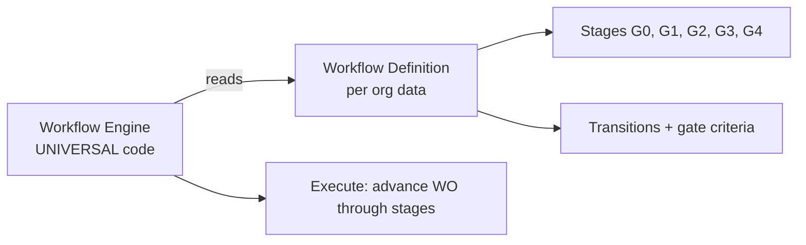

# ADR-029 — Rule engine DSL + workflow as data

**Status:** ACCEPTED
**Date:** 2026-04-17
**Context:** Monopilot Migration Phase 0
**Extends:** [ADR-007 Work order state machine](ADR-007-work-order-state-machine.md) — silnik state-machine staje się bazą universal workflow engine
**Related meta-model:** [META-MODEL.md §2](META-MODEL.md) (rule engine — Level "b") + [§8](META-MODEL.md) (workflow as data)

---

## Context

PLD v7 (Phase A reality source) implementuje cascading dependencies `Pack_Size → Line → Dieset → Material` oraz conditional required (`MRP_Category` required gdy MRP dept aktywny) oraz Stage-Gate checklist (G2 → G3 wymaga `BOM_complete=true AND Costing_approved=true`). Każda z tych reguł jest dziś hardcoded w VBA.

Monopilot musi obsługiwać ten typ logiki dla **wielu orgs bez per-client code**. Dodatkowo: workflow state machine Apexa = NPD Stage-Gate G0→G4, ale inny klient może mieć G0→G3, albo inny zestaw bramek, albo inny kompletnie workflow. Jeden engine musi obsługiwać wszystkie.

Rozwiązanie: **mini DSL** (interpretowany z danych, twardy scope 4 obszarów) + **jeden universal runtime engine** dla wszystkich 16 modułów Monopilot.

---

## Decision

### DSL scope — twardy limit 4 obszarów

Rozszerzanie DSL poza te 4 obszary **zabronione bez nowego ADR**. To mitigacja ryzyka R1 ze spec-a §7.2 ("half-baked database inside database") — patrz sekcja "Scope enforcement" niżej.

| Obszar | Opis | Marker runtime / definicja |
|---|---|---|
| (a) Cascading dropdowns | "Pole Y dopuszczalne wartości zależą od wartości pola X" (1-level lub multi-level chain) | `[UNIVERSAL]` silnik / `[APEX-CONFIG]` konkretne łańcuchy |
| (b) Conditional required | "Pole Z required gdy predykat P prawdziwy" (predykat = kombinacja wartości pól + toggles dept) | `[UNIVERSAL]` silnik / `[APEX-CONFIG]` konkretne warunki |
| (c) Gate entry criteria | "Stage S można opuścić gdy checklist C complete" (checklist = dane, nie kod) | `[UNIVERSAL]` silnik / `[APEX-CONFIG]` konkretne bramki |
| (d) Workflow definitions | State machine (nodes = stages, edges = transitions) zdefiniowana jako struktura danych | `[UNIVERSAL]` silnik / `[APEX-CONFIG]` konkretne definicje |

**Jeden** universal runtime engine interpretuje wszystkie 4 obszary dla wszystkich 16 modułów — nie piszemy silnika per moduł.

### DSL semantyka (high-level, bez konkretnej składni)

**Predykaty:**
- field-comparison: `=`, `≠`, `>`, `<`, `≥`, `≤`, `in`, `not in`, `empty`, `not empty`
- boolean combinators: AND / OR / NOT
- reference-lookup: czy wartość pola istnieje w reference table (z ADR-028)

**Actions:**
- allow-values — ograniczenie zbioru opcji dropdown-u (obszar a)
- set-required — podniesienie flagi required na polu (obszar b)
- block-transition — zablokowanie przejścia workflow stage (obszar c, d)
- require-checklist — wymaganie kompletu checklist items (obszar c)

**Referencje wartości (wszystkie obszary):**
- literał (string, number, boolean, date)
- other-field-value (wartość innego pola tego samego rekordu)
- reference-table-lookup (wiersz z reference-tabeli — [ADR-028](ADR-028-schema-driven-column-definition.md))
- org-config-value (wartość z Settings org-a, np. toggle modułu — [ADR-011](ADR-011-module-toggle-storage.md))

### Składnia DSL — otwarte do implementation phase, rekomendowana hybryda

| Opcja | Pros | Cons |
|---|---|---|
| 1. Mermaid-style pseudo-code | Wizualne, dobre do dokumentacji | Słabe jako runtime (parsing, ewaluacja) |
| 2. JSON Schema z reserved keys | Runtime-friendly, łatwe walidować schemat | Trudne do human-edit gołym okiem |
| 3. Textual DSL (pseudo-angielski) | Łatwe do czytania, dobra UX w Settings | Wymaga parsera (utrzymanie) |

**Rekomendacja: hybryda.** JSON jako **runtime form** (silnik interpretuje JSON), Mermaid pseudo-code w **docs** (wizualizacja dla architektów / reviewerów), textual opis w **Settings UI** (co administrator widzi i edytuje — forma wizardowa, która kompiluje się do JSON). Uzasadnienie: różne audiences, różne formy — nie zmuszamy jednej reprezentacji.

### Workflow as data (szczegół — META-MODEL §8)

- Silnik workflow = universal code (patrz "(d) Workflow definitions" w tabeli wyżej).
- Definicja workflow per org = dane (JSON w config-tabeli). Stages, kryteria bramek, transitions, owners stage-ów.
- Apex dostaje predefiniowaną definicję NPD Stage-Gate G0→G4 `[APEX-CONFIG]`.
- Inny klient: G0→G3 albo kompletnie inny workflow — zmiana w Settings / JSON edit, nie w kodzie.
- Workflow-as-data rozszerza [ADR-007](ADR-007-work-order-state-machine.md) — silnik state-machine staje się uniwersalny, definicje są danymi per org.

---

## Rationale

1. **Uniwersalność.** Jeden silnik dla 16 modułów (NPD, Planning, Production, QA, Procurement, ...). Bez DSL — każdy moduł miałby własny hardcoded rule set, koszt utrzymania rośnie liniowo z liczbą modułów × liczbą orgs.
2. **Multi-tenant ([ADR-031](ADR-031-schema-variation-per-org.md)).** Definicje per org (Layer L3 w ADR-031), RLS izoluje. Zmiana reguły jednego org-a nie dotyka innego.
3. **Ewolucyjność.** Apex zmienia regułę (nowa bramka, nowy wymagany dział) bez dewelopera — insert / update w config-tabeli, audytowane.
4. **Bezpieczeństwo.** DSL ograniczony scope (4 obszary, skończony zestaw predykatów i actions) — **nie Turing-complete**. Nie da się napisać nieskończonej pętli, SQL injection, dostępu do systemu plików. Sandboxing z definicji.

---

## Trade-offs accepted

1. **Edge cases poza DSL → code-driven escape hatch.** Reguły, które nie mieszczą się w 4 obszarach (np. zaawansowane obliczenia kosztów roll-up, integracyjne transformacje) **muszą** iść do code-driven (twardy escape hatch per moduł, jawnie dokumentowany). DSL to nie panaceum.
2. **Debugging reguł wymaga dedicated UI tools.** "Dlaczego ta wartość nie jest dozwolona?" — potrzebujemy rule tracer / why-tool w Settings. Inwestycja w tooling.
3. **Performance runtime evaluator.** Cascading chain o długości 4 × 60 kolumn × N rekordów = profil uwagi. Caching strategy (metadata cache per request, invalidation na config change) niezbędny — szczegóły w implementation Phase D.

---

## Alternatives considered (rejected)

- **A) Hardcoded if/else per moduł.** Odrzucone — nie skaluje, duplikacja logiki, niemożliwy multi-tenant bez rewrite per klient.
- **B) Full Rules Engine (Drools, Camunda DMN, OPA).** Odrzucone — over-scope (META-MODEL §3 YAGNI). Wielka powierzchnia, wymaga dedykowanego utrzymania, uczenia, deployment-u. Nasze 4 obszary pokrywają realną potrzebę bez tej inwestycji.
- **C) Frontend-only validation.** Odrzucone — nie działa w multi-tenant API security model. Walidacja musi być egzekwowana po stronie serwera (RLS / API layer), inaczej klient z uprawnieniami może obejść reguły.

---

## Scope enforcement — "twardy limit"

Ten ADR **explicite zabrania** rozszerzania DSL poza 4 obszary (a, b, c, d) bez nowego ADR. Procedura rozszerzenia (jeśli kiedyś potrzebna):

1. Nowy ADR uzasadniający dlaczego obszar CRUD (META-MODEL §1) lub escape hatch code-driven (META-MODEL §3) nie wystarcza.
2. Explicit update [META-MODEL.md §2.1](META-MODEL.md) — nowy obszar (e).
3. Review przez architekta — nie można dopisać "w locie".

Mitiguje ryzyko **R1** (schema-driven overreach → "half-baked database inside database") z spec-a §7.2.

---

## Markery

- **Silnik rule engine / workflow engine** = `[UNIVERSAL]` z definicji (jeden kod dla wszystkich klientów).
- **Każda konkretna reguła** (cascading chain, conditional required, gate checklist, workflow definition) = `[APEX-CONFIG]` lub `[EVOLVING]`.

Przykłady Apexa:
- Cascading `Pack_Size → Line → Dieset → Material` `[APEX-CONFIG]`
- Conditional required `MRP_Category required gdy dept MRP active` `[APEX-CONFIG]` `[EVOLVING]` (MRP dept potencjalnie split — spec §7.2)
- Gate G2→G3 checklist (`BOM_complete`, `Costing_approved`) `[APEX-CONFIG]`
- NPD Stage-Gate workflow G0→G4 `[APEX-CONFIG]`

---

## Open questions (→ Phase B / implementation Phase D)

- **Konkretna biblioteka parsera** dla textual DSL — wybór lib (Chevrotain? Nearley? custom?) w implementation phase, nie blokuje Phase 0.
- **Wersjonowanie reguł** — reguła v1 active w produkcji vs v2 draft w Settings, mechanizm promocji i rollback — decyzja Phase D.
- **Rule tracer UX** — jak administrator ma zobaczyć "dlaczego to pole jest required" / "dlaczego ten value niedozwolony" — projekt UI w Phase B.
- **Promocja obszaru `[EVOLVING]` → `[APEX-CONFIG]` lub `[UNIVERSAL]`** (META-MODEL §6.3) — procedura review.

---

## Related

- [META-MODEL.md §2](META-MODEL.md) — primary reference (rule engine Level "b")
- [META-MODEL.md §8](META-MODEL.md) — workflow as data
- [ADR-007 Work order state machine](ADR-007-work-order-state-machine.md) — engine basis, extended by this ADR
- [ADR-008 Audit trail strategy](ADR-008-audit-trail-strategy.md) — zmiany reguł audytowane
- [ADR-011 Module toggle storage](ADR-011-module-toggle-storage.md) — org-config-value referencje w DSL
- [ADR-028 Schema-driven column definition](ADR-028-schema-driven-column-definition.md) — reguły referencują kolumny
- [ADR-031 Schema variation per org](ADR-031-schema-variation-per-org.md) — rules per org (Layer L3)
- Spec: [`docs/superpowers/specs/2026-04-17-monopilot-migration-design.md`](../../../docs/superpowers/specs/2026-04-17-monopilot-migration-design.md) §2.1 punkt 2 + punkt 8, §7.2 R1
