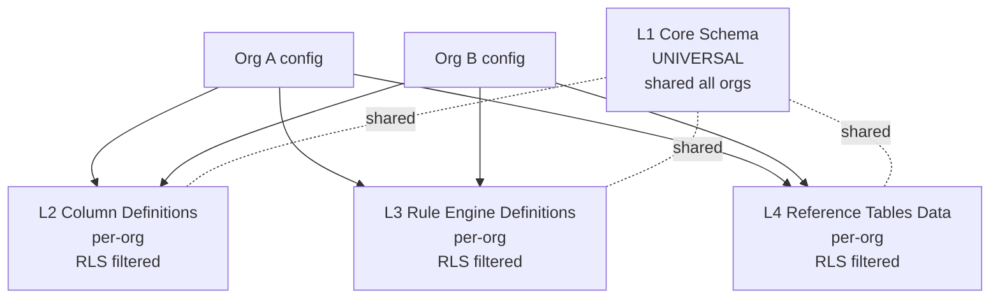

# ADR-031 — Schema variation per org (multi-tenant foundation)

**Status:** ACCEPTED
**Date:** 2026-04-17
**Context:** Monopilot Migration Phase 0
**Extends:** [ADR-003 Multi-tenancy RLS](ADR-003-multi-tenancy-rls.md) — ADR-003 izoluje *dane*, ADR-031 dodaje warstwę izolacji *schemy* (konfiguracji)
**Related meta-model:** [META-MODEL.md §4](META-MODEL.md) (multi-tenant variation points)

---

## Context

Dotychczas: [ADR-003](ADR-003-multi-tenancy-rls.md) definiuje RLS jako mechanizm izolacji **danych** per org — wszystkie orgs współdzielą *identyczną* schemę bazy, a RLS polices filtrują wiersze po `org_id`. To wystarcza dla aplikacji, w których wszystkie orgs mają takie same kolumny, takie same reguły, takie same taksonomie.

Monopilot target: również **konfiguracja schemy** per org — które kolumny istnieją w Main Table ([ADR-028](ADR-028-schema-driven-column-definition.md)), jakie reguły i workflow ([ADR-029](ADR-029-rule-engine-dsl-and-workflow-as-data.md)), jakie działy ([ADR-030](ADR-030-configurable-department-taxonomy.md)), jakie wartości reference-tables.

Apex = **pierwsza** konfiguracja, **nie jedyna**. Musimy jednoznacznie zdefiniować: co zmienia się per org (i jak), co pozostaje wspólne dla wszystkich orgs.

---

## Decision — 4 warstwy schema

| Layer | Scope | Marker | Change process | Examples |
|---|---|---|---|---|
| **L1 — Core infrastructure schema** | Stała dla wszystkich orgs, DDL na poziomie DB | `[UNIVERSAL]` | Migration + nowy ADR (release cycle) | `users`, `organizations`, `roles`, `audit_log`, `license_plates`, `lot_genealogy`, reference universal (EU-14 allergens, GS1 format) |
| **L2 — Schema-driven column definitions** | Per org, wiersze w config tables | `[UNIVERSAL]` meta-struktura, `[APEX-CONFIG]` konkretne kolumny | Settings CRUD (ADR-028), audytowane | NPD Main Table columns per Apex, Production WO cols, QA inspection cols |
| **L3 — Rule engine definitions** | Per org, wiersze w config tables | `[UNIVERSAL]` silnik, `[APEX-CONFIG]` konkretne reguły | Settings rule editor (ADR-029), audytowane | Cascading chains `Pack_Size → Line → Dieset`, gate criteria G2→G3, workflow definitions G0→G4 |
| **L4 — Reference tables data** | Per org (struktura wspólna z L1 / L2, treść per org) | `[UNIVERSAL]` structure, `[APEX-CONFIG]` data | Settings CRUD | Apex `PackSizes` values, `Lines` values, `Dieset` values, departamenty (ADR-030) |

### RLS pattern extended

Standardowy users-lookup RLS ([ADR-013](ADR-013-rls-org-isolation-pattern.md)) stosuje się do L2 / L3 / L4 **tak samo** jak do L1 i tabel transakcyjnych. Nowe policies dla config-tables używają identycznego szablonu semantycznego: `org_id filtered through users lookup`. Nie reinwention — wystarczy reużycie wzorca z ADR-013.

### Seed strategy

- Nowy org przy onboardingu dostaje **seed template**: "food-manufacturing-SMB default" (zestaw kolumn, reguł, działów, reference tables typowych dla food-manufacturing SMB).
- Po seed-ingu org customize w Settings — zmienia labele, dodaje kolumny, edytuje reguły, dostosowuje taksonomię działów.
- **Apex = seed + 12+ miesięcy customizacji** (historical) — Apex zostaje seeded z **PLD v7 reality** z Phase A (nie z generic food-manufacturing-SMB default), bo ma historię i uproszczenie do generic template-u byłoby regresem.
- Template = **dane**, nie kod. Template-y utrzymywane jak każdy config row, wersjonowane.

### Upgrade strategy (META-MODEL §4.4)

- L1 changes (universal) → propagują automatycznie do wszystkich orgs przy release-ie (DDL migration, no opt-in).
- L2 / L3 / L4 changes (universal defaults, np. Monopilot uwalnia nową `[UNIVERSAL seed]` kolumnę) → wymagają **opt-in per org** w Settings (review przez administratora). Mitiguje konflikt z istniejącym `[APEX-CONFIG]` override.

Konkretny mechanizm opt-in (UI review, bulk accept, per-obszar granularność) — implementation Phase D.

---

## Diagram — 4 warstwy

---

## Rationale

1. **Multi-tenant from day 1 — business requirement.** Monopilot jako platforma MES dla wielu food-manufacturing klientów. Bez schema variation nie ma multi-tenancy godnego tej nazwy.
2. **PLD v7 migration nie będzie rewrite.** Apex dostaje seed zawierający PLD v7 reality z Phase A — te ~60–80 kolumn, 7 działów, reguły cascading i Stage-Gate. Bez L2/L3/L4 = rewrite PLD v7 w kodzie per każdy element. Z L2/L3/L4 = insert do config-tables.
3. **D365 replacement długoterminowy.** Inni klienci Monopilot (potencjalnie) nie mają D365 integration — kolumny oznaczone `[LEGACY-D365]` (META-MODEL §5) są wyłączone przez feature flag (`integration.d365.enabled=false`, [ADR-011](ADR-011-module-toggle-storage.md)), nie istnieją operacyjnie u tych klientów, ale kod/engine jest jeden.
4. **Spójność z pozostałymi ADRs Phase 0.** [ADR-028](ADR-028-schema-driven-column-definition.md), [ADR-029](ADR-029-rule-engine-dsl-and-workflow-as-data.md), [ADR-030](ADR-030-configurable-department-taxonomy.md) operują właśnie na tych 4 warstwach — ten ADR formalizuje taksonomię.

---

## Trade-offs accepted

1. **Seed template maintenance overhead.** Templates ("food-manufacturing-SMB default") muszą być curated — ktoś je utrzymuje, aktualizuje gdy Monopilot uwalnia nowe universal features. Template ownership → do ustalenia w Phase B.
2. **Generic UI component dyscyplina.** Każdy widok UI (formularz, tabela, dropdown, filtr raportu) **musi** renderować schema-driven z L2/L3/L4. Widok "hardcoded dla Apexa" = regres. Code-review enforcement.
3. **Cross-org reporting.** Raport agregujący po wszystkich orgs (np. "total WO w systemie") wymaga service-role z explicit `org_id` filter — szczegóły w [ADR-013](ADR-013-rls-org-isolation-pattern.md) trade-off section.
4. **Upgrade strategy complexity.** L1 auto propagate vs L2/L3/L4 opt-in — dwa różne flow, wymagają UI i audit traili dla opt-in decisions.

---

## Alternatives considered (rejected)

- **A) One schema for all clients (bez schema variation).** Odrzucone — spec fundamental rejection. Nie odpowiada na problem "inny klient ma inną strukturę".
- **B) Separate DB per tenant.** Odrzucone — operational overhead (backupy × N, migracje × N, monitoring × N), regres w [ADR-003](ADR-003-multi-tenancy-rls.md) reasoning (RLS jako kompromis koszt / izolacja). Dodatkowo: cross-org analytics niemożliwe bez ETL-u.
- **C) Schema per industry (np. "food-manufacturing-schema", "pharma-schema").** Odrzucone — nie skaluje nawet wewnątrz jednej industry (Apex vs typowy food-manufacturing SMB bez MRP, bez D365, z inną taksonomią działów). Template per industry może być *seed-em*, nie twardą schemą.

---

## Markery

- **L1** = `[UNIVERSAL]` per definition.
- **L2 / L3 / L4** = `[UNIVERSAL]` dla **meta-schemy** (struktura config-tables, atrybuty kolumn, struktura DSL reguł), `[APEX-CONFIG]` dla **konkretnej zawartości** per org (nazwy kolumn, wartości reference-tables, konkretne reguły).
- `[LEGACY-D365]` dla kolumn / walidacji / templates w L2/L3/L4, które istnieją tylko z powodu D365 integration — wyłączone feature flagiem (META-MODEL §5.1).

---

## Open questions (→ Phase D / Phase B)

- **(a) Migrowalność template-ów między orgami** ("copy config from org X to org Y" / "export config as template"). Useful dla onboardingu klientów podobnych do istniejących — decyzja Phase D.
- **(b) Upgrade workflow gdy Monopilot uwalnia nową kolumnę `[UNIVERSAL]`** — czy automatycznie (rozszerza seed), czy opt-in per org (administratorzy widzą propozycję w Settings i akceptują)? Szkic w §4.4 META-MODEL, pełna decyzja w ADR-031 implementation Phase D.
- **(c) Granularność opt-in** — per kolumna, per moduł, per zestaw reguł? Do Phase B.

---

## Related

- [META-MODEL.md §4](META-MODEL.md) — primary reference (multi-tenant variation points)
- [ADR-003 Multi-tenancy RLS](ADR-003-multi-tenancy-rls.md) — extended by this ADR (data isolation → + schema variation)
- [ADR-011 Module toggle storage](ADR-011-module-toggle-storage.md) — feature flags per org (`integration.d365.enabled` etc.)
- [ADR-012 Role-permission storage](ADR-012-role-permission-storage.md) — per-org role matrix (L4)
- [ADR-013 RLS org isolation pattern](ADR-013-rls-org-isolation-pattern.md) — szablon RLS reużywany dla L2/L3/L4
- [ADR-028 Schema-driven column definition](ADR-028-schema-driven-column-definition.md) — Layer L2
- [ADR-029 Rule engine DSL + workflow as data](ADR-029-rule-engine-dsl-and-workflow-as-data.md) — Layer L3
- [ADR-030 Configurable department taxonomy](ADR-030-configurable-department-taxonomy.md) — Layer L4 (departamenty)
- Spec: [`docs/superpowers/specs/2026-04-17-monopilot-migration-design.md`](../../../docs/superpowers/specs/2026-04-17-monopilot-migration-design.md) §2.1 punkt 4, §7.2
