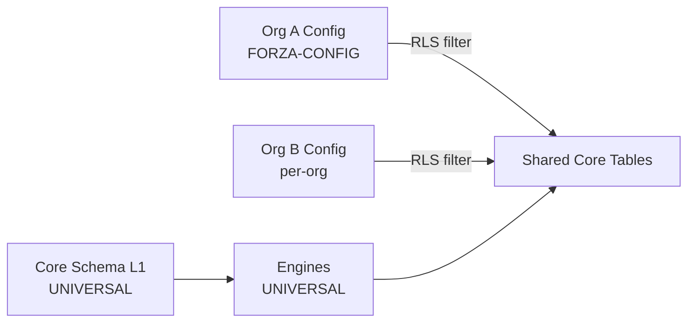

# META-MODEL — Schema-driven vs Code-driven w Monopilot

**Status:** ACCEPTED
**Date:** 2026-04-17
**Context:** Monopilot Migration Phase 0
**Related:** [ADR-028 Schema-driven column definition](ADR-028-schema-driven-column-definition.md), [ADR-029 Rule engine DSL + workflow as data](ADR-029-rule-engine-dsl-and-workflow-as-data.md), [ADR-030 Configurable department taxonomy](ADR-030-configurable-department-taxonomy.md), [ADR-031 Schema variation per org](ADR-031-schema-variation-per-org.md) (wszystkie planowane w tej samej fazie)
**Extends (partial):** [ADR-003 Multi-tenancy RLS](ADR-003-multi-tenancy-rls.md), [ADR-011 Module toggle storage](ADR-011-module-toggle-storage.md), [ADR-012 Role-permission storage](ADR-012-role-permission-storage.md)
**Source spec:** [`docs/superpowers/specs/2026-04-17-monopilot-migration-design.md`](../../../docs/superpowers/specs/2026-04-17-monopilot-migration-design.md) §2.1 + §2.2

---

## Purpose

Meta-model to kontrakt architektoniczny Monopilot. Definiuje co w systemie jest **schema-driven** (edytowalne przez użytkownika w Settings, bez dewelopera) a co **code-driven** (w repozytorium, pod release cycle).

Wszystkie 16 modułów `new-doc/` są projektowane przez tę soczewkę — każdy dokument modułu jawnie oznacza markerem które wymaganie jest uniwersalne, konfigurowalne per-org, jeszcze ewoluujące, albo istnieje tylko z powodu D365.

Ten dokument jest kontraktem, który decyduje co agent może zmienić **konfiguracją** (Settings / DB / rule engine data), a co wymaga **zmiany kodu** (release, ADR, PR). Jest fundamentem — wszystkie 4 nowe ADR-y (028–031) oraz warstwa reality-sources cross-referują tu.

---

## §1 — Schema-driven domain (Level "a")

Level "a" to obiekty CRUD-owalne w Settings bez dewelopera. Administrator / power-user org-u może je zmienić z UI, zmiany są natychmiast widoczne, nie wymagają release-u.

### 1.1 Zakres Level "a"

| Obszar | Co zawiera (metadata) | Powiązany ADR | Przykład Forza (marker) |
|---|---|---|---|
| Kolumny tabel głównych | label, type, required, owner dept, visible-for-role, validation, default | ADR-028 | Kolumna `Pack_Size` [FORZA-CONFIG] |
| Departamenty | name, code, color, sort, leader | ADR-030 | 7 działów Forzy [FORZA-CONFIG] |
| Reguły walidacji per kolumna | required / regex / range / enum | ADR-028 | Regex GS1-128 [UNIVERSAL] |
| Reference tables | PackSizes, Lines, Dieset, Templates, EmailConfig + nowe lookup-y | ADR-010 extended | Forza PackSizes [FORZA-CONFIG] |
| Role × permissions matrix | kto co może (CRUD × moduł × pole) | ADR-012 + ADR-031 | Matrix Forzy [FORZA-CONFIG] |
| Module toggles | feature flags per org (moduł włączony / wyłączony) | ADR-011 | `integration.d365.enabled` [LEGACY-D365] |
| Status colors / workflow stages / gate checklist items | UI i rule metadata | ADR-029 | NPD Stage-Gate G0→G4 [FORZA-CONFIG] |
| Notification templates | email body, triggery, mapowanie zdarzenie→odbiorca | — | Forza email templates [FORZA-CONFIG] |

### 1.2 Zasada

Każda pozycja z tej listy **musi** mieć UI w Settings (roles, departments, columns, rules, toggles, templates). Dodanie nowej kolumny przez administratora Forzy = insert w tabeli konfiguracji, bez rebuilda. Silnik renderu UI czyta metadane i generuje formularze / tabele / walidacje dynamicznie.

### 1.3 Co NIE jest Level "a"

- Nazwy tabel głównych (products, license_plates, work_orders) — stałe, kod polega na nich.
- Relacje FK między tabelami głównymi — stałe, zmiana wymaga migracji + ADR.
- Silnik walidacji (sam regex engine, enum comparator) — kod. Same **reguły** (który regex) — dane.

---

## §2 — Rule engine furtka (Level "b")

Level "b" to mały DSL (interpretowany z danych, nie kodu) dla obszarów, które nie są płaskim CRUD-em ale muszą być konfigurowalne per-org bez dewelopera. Silnik rule engine to **jeden** universal runtime dla wszystkich 16 modułów.

### 2.1 Scope Level "b" — twardy limit 4 obszarów

Rozszerzanie poza te 4 obszary wymaga nowego ADR. To mitigacja ryzyka R1 ze spec-a §7.2: "half-baked database inside database".

1. **Cascading dropdowns** — zależności wyboru jednego pola od innego.
   Przykład: Pack_Size → Line → Dieset → Material `[FORZA-CONFIG]`. Administrator definiuje łańcuch w Settings, silnik filtruje opcje drugiego pola na podstawie wartości pierwszego.
2. **Conditional required** — pole staje się wymagane gdy zachodzi warunek.
   Przykład: "pole MRP_Category required gdy Dept MRP aktywny" `[FORZA-CONFIG]`.
3. **Gate entry criteria** — dynamiczne checklisty bramek (Stage-Gate).
   Przykład: "G2 → G3 wymaga: BOM_complete=true AND Costing_approved=true" `[FORZA-CONFIG]`.
4. **Workflow definitions as data** — state machine jako JSON/DB, interpretowana przez universal engine. Zobacz §8.

### 2.2 Marker discipline

- Silnik rule engine = `[UNIVERSAL]` (kod, jeden dla wszystkich klientów).
- Każda konkretna reguła zapisana w DB = `[FORZA-CONFIG]` lub `[EVOLVING]`.

### 2.3 Dyscyplina rozszerzania

Propozycja dodania 5-tego obszaru Level "b" wymaga:
- Nowego ADR uzasadniającego dlaczego CRUD (§1) nie wystarcza.
- Explicit update META-MODEL.md (nowa sekcja §2.1).
- Review przez architekta — nie można dopisać "w locie".

Limit = 4 obszary. Konkretna składnia DSL (JSON schema? textual DSL? Mermaid-like? pseudo-code?) — decyzja należy do ADR-029, otwarta w Phase 0.

---

## §3 — Code-driven domain (YAGNI)

Code-driven to obszary, które pozostają w repozytorium kodu. Zmiana wymaga PR, release, ADR (dla istotnych). YAGNI zasada: nie robimy schema-driven tego, co nie jest konfigurowalne per klient albo jest matematyką / integracją / regulatoryjne.

### 3.1 Obszary code-driven

| Obszar | Uzasadnienie | Marker |
|---|---|---|
| Workflow state machine **engine** (silnik, nie definicje) | Meta-warstwa, interpretuje workflow data z §2/§8. Rozszerza [ADR-007](ADR-007-work-order-state-machine.md) | [UNIVERSAL] |
| Integracje zewnętrzne (D365, email providers, scanner SDK) | SDK-specific; integracja kontraktem zewnętrznym | [UNIVERSAL] dla engine, [LEGACY-D365] dla D365 connector |
| Obliczenia kosztów BOM | Matematyka niekonfigurowalna per user (roll-up, unit conversion, yield) | [UNIVERSAL] |
| UI layouts (strukturalnie stabilne) | Routing, nawigacja, strukturalne komponenty — strukturalnie stabilne między orgs | [UNIVERSAL] |
| Silnik rule engine (meta-warstwa §2) | Interpretuje Level "b" — sam nie jest konfigurowalny | [UNIVERSAL] |
| Silnik renderu raportów (Table/Aggregation/Trend) | Universal code components, content z konfiguracji org-a | [UNIVERSAL] |
| GS1 parser / LPN encoder / FIFO/FEFO algorytmy | Standardy branżowe, regulatoryjne | [UNIVERSAL] |

### 3.2 Zasada decyzyjna "schema vs code"

Pytanie testowe przed wrzuceniem do Level "a"/"b":
- Czy inny klient prawdopodobnie będzie chciał to mieć inaczej? → schema-driven.
- Czy to matematyka lub integracja? → code.
- Czy to regulatoryjne / branżowe standardy? → code.
- Czy zmiana wymaga code-review architektonicznego? → code.

---

## §4 — Multi-tenant variation points

Monopilot jest multi-tenant from day 1. Model wariacji opiera się o [ADR-003](ADR-003-multi-tenancy-rls.md) (RLS) + nowy ADR-031. Każdy org ma *własną konfigurację* na tych samych tabelach. `org_id` izoluje schema.

### 4.1 Co się zmienia per-org vs co jest stałe

| Warstwa | Scope | Marker ogólny |
|---|---|---|
| Core schema tabel (users, organizations, audit_log, license_plates, lot_genealogy) | Stałe dla wszystkich orgs | [UNIVERSAL] |
| Engines (workflow engine, rule engine, BOM calc, GS1 parsers) | Stałe | [UNIVERSAL] |
| Integracje | Stałe kod + feature flag per org | [UNIVERSAL] dla core, [LEGACY-D365] dla D365 |
| Config tables (kolumny, reguły, role, departamenty, reference) | Per-org, filtrowane RLS | [FORZA-CONFIG] lub [UNIVERSAL seed] + [FORZA-CONFIG override] |
| Transactional data (produkty, WO, LPN, audyt) | Per-org, RLS | (nie dotyczy — dane operacyjne) |

### 4.2 Diagram multi-tenant variation

### 4.3 Seed + override

Nowy org przy onboardingu dostaje **seed konfiguracji** (universal food-manufacturing defaults). Następnie org override-uje to, co ma mieć inaczej. Forza = pierwsza konfiguracja, nie jedyna — seed i Forza-config są rozdzielone.

### 4.4 Upgrade strategy

Gdy Monopilot uwalnia nowe UNIVERSAL features (np. nowa universal kolumna), każdy org dostaje:
- Auto dla universal core changes (nowa tabela, nowy engine).
- Opt-in (review w Settings) dla nowych universal defaults które mogłyby nadpisać istniejący FORZA-CONFIG.

Konkretny mechanizm (auto vs opt-in per obszar) — decyzja w ADR-031 + implementation phase post-C.

---

## §5 — Migracja z D365 (mapa pojęć)

Monopilot docelowo zastępuje D365. Mapa pojęć D365 ↔ Monopilot high-level:

| D365 encja | Monopilot schema-driven equivalent | Marker |
|---|---|---|
| D365 Item | `products` + schema-driven extra cols | [UNIVERSAL] + [FORZA-CONFIG] dla extra cols |
| D365 ItemNumber format | Regex validation w schema | [LEGACY-D365] dopóki D365 integration active |
| D365 Builder output | Integration export template | [LEGACY-D365] |
| D365 BOM | `bom_snapshot` ([ADR-002](ADR-002-bom-snapshot-pattern.md)) | [UNIVERSAL] |
| D365 Costing extra fields | Schema-driven extra cols | [FORZA-CONFIG] |

Szczegółowa mapa żyje w `_meta/reality-sources/d365-integration/` (powstaje w późniejszej fazie po Phase A).

### 5.1 Dyscyplina `[LEGACY-D365]`

Marker `[LEGACY-D365]` dla wszystkiego, co istnieje **tylko** z powodu D365 — zniknie po D365 replacement. Kontrolowane feature flag-iem `integration.d365.enabled` (Module toggle, §1).

Przykłady:
- Pola bufforowe do serializacji w formacie D365 Builder.
- Walidacje zgodności z D365 ItemNumber range.
- Export templates do D365 paste.

Gdy `integration.d365.enabled=false` — te pola / walidacje / templates są ukryte, ale nie kasowane (historia).

---

## §6 — Universal vs Forza-specific (zasada dokumentacyjna)

Każdy dokument modułu **musi** jawnie oznaczać markerem każde wymaganie, kolumnę i regułę. Tabela decyzyjna:

| Kryterium | Marker |
|---|---|
| Fundamentalne dla food-manufacturing MES (każdy klient to ma) | `[UNIVERSAL]` |
| Konfigurowalne w Settings (Forza ustawiła tak, inny org może mieć inaczej) | `[FORZA-CONFIG]` |
| Projekt jeszcze się zmienia (trzymamy w DB nawet jeśli dziś tylko Forza) | `[EVOLVING]` |
| Istnieje tylko z powodu D365 (zniknie po migracji) | `[LEGACY-D365]` |

### 6.1 Conflict resolution

Gdy wymaganie jest zarówno uniwersalne jak i ma konkretną wartość Forza: użyj `[UNIVERSAL]` dla **zasady**, `[FORZA-CONFIG]` dla **wartości**.

Przykład: "System MUSI obsługiwać allergeny `[UNIVERSAL]`. Forza używa 14 EU allergens `[FORZA-CONFIG]`."

### 6.2 Marker discipline — obowiązkowa

- Brak markera na wymaganiu = błąd review, blokuje akceptację dokumentu.
- Marker niekompletny (np. tylko `[FORZA-CONFIG]` tam gdzie jest zasada universal) = błąd review.
- Zmiana markera wymaga decision log w dokumencie (kiedy i dlaczego zmieniono).

### 6.3 EVOLVING — specjalny przypadek

Marker `[EVOLVING]` sygnalizuje że obszar jeszcze się zmienia (np. Forza MRP dziś 1 dział, docelowo 2). Decyzja projektowa: **trzymamy w DB** (schema-driven) nawet jeśli dziś tylko Forza ma daną konfigurację, bo wiemy że to będzie się zmieniać i kod nie powinien hardcoded-ować rzeczywistości in-flight.

Promocja `[EVOLVING]` → `[FORZA-CONFIG]` lub `[UNIVERSAL]` następuje gdy obszar się stabilizuje (decyzja w review).

---

## §7 — Custom reports (refinement)

Raporty **nie** są pisane per-client w kodzie. Zamiast tego: report templates to universal code components (Table Report, Aggregation Report, Trend Report). Content (które kolumny, filtry, grupowania) czytany z konfiguracji org-a.

Dodanie kolumny przez Forzę = raport automatycznie może jej użyć, bez dewelopera. Tańsze niż full no-code report builder, skalowalne.

### 7.1 Warstwy raportu

| Warstwa raportu | Stan | Marker |
|---|---|---|
| Silnik renderu (Table / Aggregation / Trend) | Universal code components | [UNIVERSAL] |
| Metadane raportu (kolumny, filtry, grupowania, sort) | Per org, schema-driven w Settings | [FORZA-CONFIG] |
| Dane źródłowe | Per org (RLS) | (dane operacyjne) |

### 7.2 YAGNI — co NIE jest custom report

- Pełny no-code query builder (ad-hoc SQL UI) — **nie** w scope. Zbyt drogie, zbyt ryzykowne.
- Per-user custom reports — **nie** w scope Phase 0. Raporty = per-org config.
- Custom visualizacja (pivot, drill-down beyond aggregation) — YAGNI, dopóki nie ma explicit user story.

---

## §8 — Custom workflows (refinement)

Workflow to **dane** (JSON/DB), nie kod. Silnik workflow = universal code napisany raz. Definicja workflow (stages, kryteria, transitions) = dane per org.

### 8.1 Przykłady

- Forza: predefiniowana definicja NPD Stage-Gate G0→G4 `[FORZA-CONFIG]`.
- Inny klient: np. G0→G3 — zmiana w Settings / JSON, nie w kodzie `[FORZA-CONFIG]` (inny org).
- Workflow WO state machine: universal engine rozszerza [ADR-007](ADR-007-work-order-state-machine.md), definicja stanów per org `[FORZA-CONFIG]`.

Workflow-as-data jest częścią rule engine (§2 punkt d). Silnik nie wie o "Stage-Gate" — wie o state machines interpretowanych z danych.

### 8.2 Warstwy workflow

| Warstwa workflow | Stan | Marker |
|---|---|---|
| State machine engine | Universal code | [UNIVERSAL] |
| Workflow definition (stages, transitions, gate criteria) | Per org, schema-driven | [FORZA-CONFIG] |
| Current workflow state per entity | Dane transakcyjne (per org, RLS) | (dane operacyjne) |
| Historia przejść | Audit trail ([ADR-008](ADR-008-audit-trail-strategy.md)) | [UNIVERSAL] |

### 8.3 YAGNI — co NIE jest w scope

- Wizualny workflow designer (drag-and-drop BPMN) — YAGNI. JSON edit w Settings wystarcza dla Phase 0.
- Parallel branches / sub-workflows — YAGNI dopóki user story tego wymaga.
- Human tasks / approval chains beyond simple gates — częściowo w scope §2 punkt c, pełna sub-workflow logic YAGNI.

---

## Deliverable checklist

Lista Phase 0 deliverables:

- [ ] `META-MODEL.md` (ten plik)
- [ ] `ADR-028-schema-driven-column-definition.md`
- [ ] `ADR-029-rule-engine-dsl-and-workflow-as-data.md` (DSL + workflow as data)
- [ ] `ADR-030-configurable-department-taxonomy.md`
- [ ] `ADR-031-schema-variation-per-org.md`
- [ ] Supersede markers na sprzecznych istniejących ADRs:
  - [ ] [ADR-003 Multi-tenancy RLS](ADR-003-multi-tenancy-rls.md) — partial supersede (ADR-031 rozszerza scope)
  - [ ] [ADR-011 Module toggle storage](ADR-011-module-toggle-storage.md) — partial supersede (rozszerzone w §1 module toggles)
  - [ ] [ADR-012 Role-permission storage](ADR-012-role-permission-storage.md) — partial supersede (rozszerzone o schema-driven matrix)
  - [ ] [ADR-015 Centralized constants pattern](ADR-015-centralized-constants-pattern.md) — review dla konfliktu z schema-driven domain

---

## Open questions (do Phase D / Phase B)

- **Konkretna składnia DSL** (JSON schema? textual DSL? pseudo-code?) — otwarte, finalne decisions w ADR-029 Phase 0, szczegóły w implementation phase post-C.
- **Który konkretnie subset kolumn NPD jest UNIVERSAL vs FORZA-CONFIG** — otwarte, rozstrzygane w Phase B po reality sync Phase A (PLD v7 Main Table ~60-80 kolumn wymaga review).
- **Upgrade strategy gdy Monopilot uwalnia nowe UNIVERSAL features** (auto vs opt-in per org, per-obszar) — szkic w §4.4, pełna decyzja w ADR-031 + implementation phase.
- **Promocja `[EVOLVING]` → stały marker** — proces review (kto decyduje, kiedy). Szkic w §6.3, pełna procedura do ustalenia w Phase B.
- **Relacja META-MODEL ↔ reality-sources** — jak reality source (PLD v7, D365, Access) feeduje `[EVOLVING]` decisions. Do uszczegółowienia w REALITY-SYNC pattern (Phase A).
