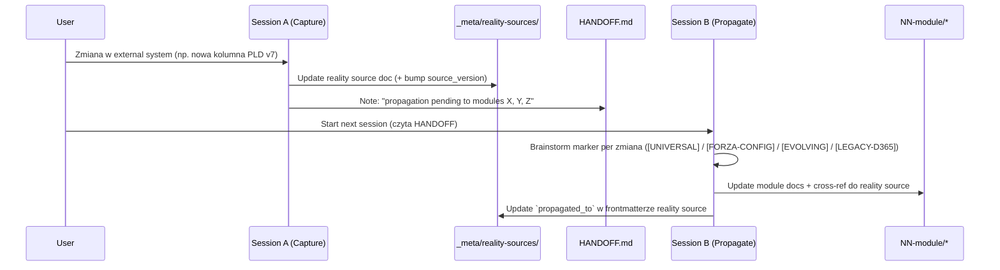

# REALITY-SYNC — pattern dyscypliny sync reality sources

## Purpose

Zapobieganie rozjechaniu się (drift) dokumentacji Monopilot z zewnętrznymi **reality sources** — realnymi systemami używanymi obecnie w firmie Forza (Smart PLD v7 Excel/VBA, Power Automate, D365, Access DBs, inne Excels). Przez najbliższe 12 miesięcy trwa **dual maintenance**: PLD v7 żyje i jest aktywnie rozwijany, równolegle powstaje dokumentacja Monopilot. Bez twardej dyscypliny sync reality sources rozjadą się z `new-doc/` w ciągu tygodni.

REALITY-SYNC uzupełnia [`DOCUMENTATION-SYNC.md`](./DOCUMENTATION-SYNC.md) — tamten pokrywa sync `code ↔ docs` wewnątrz repo, ten pokrywa sync `external-reality ↔ docs`. Oba wzorce dzielą infrastrukturę audytu (DOC-AUDITOR agent, drift score, quality gates).

---

## §1 — Reality sources inventory

Każdy reality source ma dedykowany katalog pod `new-doc/_meta/reality-sources/<source>/`. Katalog to "chronicle" (kronika) — nie live-spec, nie system source of truth, lecz dokumentacyjny snapshot rzeczywistości zewnętrznej wraz z historią zmian.

| Source | Ścieżka w `_meta/reality-sources/` | Status | Phase target | Owner agent (skill) |
|---|---|---|---|---|
| PLD v7 Excel/VBA | `pld-v7-excel/` | Active reality | Phase A (3 sesje) | `reality-sync-workflow`, `vba-pipeline` hook |
| Power Automate flows | `power-automate/` | Planned | Later (po Phase C) | `reality-sync-workflow` |
| D365 integration | `d365-integration/` | Planned | Phase D+ | `reality-sync-workflow` + marker `[LEGACY-D365]` |
| Access databases | `access-databases/` | Planned | Later | `reality-sync-workflow` |
| Other Excels (operational) | `other-excels/` | Planned | Later | `reality-sync-workflow` |

PLD v7 jest pierwszym i w tej chwili jedynym "active reality" — pozostałe źródła są zidentyfikowane, ale ich dokumentacja rusza dopiero gdy dany segment biznesu wchodzi w zakres migracji.

---

## §2 — Sync triggers (4 kategorie)

Cztery klasy zdarzeń uruchamiające sync. Każdy trigger ma odpowiedzialnego i konkretny `what`:

| Trigger | When | Who | What |
|---|---|---|---|
| Reality source change detected | Zmiana w external system (np. nowa kolumna PLD v7, nowy flow Power Automate) | Developer / użytkownik robiący zmianę | Natychmiastowa aktualizacja `_meta/reality-sources/<source>/*` w **tej samej sesji** co zmiana w źródle |
| Periodic reality audit | Raz na kwartał | `reality-sync-workflow` agent (delegacja do DOC-AUDITOR) | Pełny scan źródeł vs `_meta/reality-sources/*`, generacja drift report |
| Module documentation change | Zmiana w `NN-module/*` z backing reality | Module writer | Warn jeśli reality source out-of-date; block update albo dopisać TODO do backlogu |
| Release gate | Przed zamknięciem fazy (A/B/C/D) | Phase owner | Cała reality layer musi mieć `sync_status: current` |

Trigger 1 jest **krytyczny** — to on zapobiega głównemu ryzyku R2 (dual maintenance drift, spec §7.2). Pozostałe trzy to siatka bezpieczeństwa.

---

## §3 — Two-session pattern (obowiązkowy)

Sync reality → moduły **nigdy** nie odbywa się w jednej sesji. Podział na dwie sesje wymusza refleksję nad markerem (§4) i chroni przed naiwnym kopiowaniem realiów Forza do modułu, który ma opisywać "universal MES".

### Session A — Capture reality

- Identyfikuj zmianę w zewnętrznym systemie (co się zmieniło, kiedy, kto zmienił).
- Zaktualizuj `_meta/reality-sources/<source>/<plik>.md` — dopisz sekcję historyczną, bump `source_version` i `last_sync`, ustaw `sync_status: needs_review` (bo moduły jeszcze nie zaktualizowane).
- Zanotuj w HANDOFF.md: "propagation pending to: module X, Y, Z" + krótki opis co propagować.
- **Nie propaguj** w tej samej sesji. Nawet jeśli zmiana wygląda trywialnie.

### Session B — Propagate

- Czytaj HANDOFF z poprzedniej sesji.
- Per zmiana wykonaj **brainstorm markera**: czy to cecha uniwersalna MES, czy specyfika Forza, czy rzecz w trakcie ewolucji, czy artefakt integracji D365.
- Zaktualizuj właściwe moduły Monopilot — każda propagowana zmiana linkuje z powrotem do reality source (pełna ścieżka).
- Zamknij pętlę: w reality source ustaw `sync_status: current`, uzupełnij listę `propagated_to`.

### Zasada żelazna

NIGDY nie propagujemy w tej samej sesji co capture. Brainstorm markera wymaga świeżego kontekstu i odstępu — szybki copy-paste w jednej sesji gwarantuje błędne oznaczenia i Forza-specific info w `[UNIVERSAL]` częściach.

---

## §4 — Markery at sync time

Każda propagowana zmiana dostaje marker **przed** update modułu. Brainstorm markera jest kluczową aktywnością Session B i bez niego propagacja nie rusza. Pełna definicja markerów — zobacz `documentation-patterns/SKILL.md`. Skrócona tabela decyzyjna:

| Marker | Znaczenie | Kiedy używać |
|---|---|---|
| `[UNIVERSAL]` | Fundamentalne dla food-manufacturing MES | Gdy zmiana dotyczy fundamentu branży (traceability batcha, BOM, allergens, audit trail) |
| `[FORZA-CONFIG]` | Forza-specific, konfigurowalne per organizację | Gdy zmiana jest konkretnie Forza (nowa kolumna "Dział 14", lokalny rollup, ich nomenklatura) |
| `[EVOLVING]` | Jeszcze się zmienia, nie jest stabilne | Gdy Forza eksperymentuje, pattern nie ustabilizowany |
| `[LEGACY-D365]` | Istnieje tylko z powodu D365 | Gdy zmiana wynika z ograniczeń integracji D365, zniknie po wchłonięciu |

Brak markera = propagacja zablokowana. Pattern `[UNIVERSAL]` bez review → domyślnie downgrade do `[FORZA-CONFIG]` (zasada "konserwatywna uniwersalność").

---

## §5 — Drift detection

Drift reality źle się kumuluje. Kwartalny audyt + quality gate per phase + on-demand check przy module change.

| Drift score | Status | Action |
|---|---|---|
| < 10% | 🟢 GREEN | Reality source current, propagation complete — kontynuujemy normalnie |
| 10–25% | 🟡 YELLOW | Reality source out-of-date albo propagacja w backlogu — dopisz doc tasks do następnego sprintu |
| > 25% | 🔴 RED | Priorytet — blokuj nową pracę w modułach zależnych do czasu resyncu |

### Wzór drift score

**Drift = (reality_changes − propagated_changes) / reality_changes × 100**

gdzie:
- `reality_changes` — liczba zmian zarejestrowanych w reality source od ostatniego audytu,
- `propagated_changes` — liczba zmian, które dostały update w modułach + cross-ref do reality source.

### Cadence

- Per-phase close (quality gate — zobacz §7).
- Periodic quarterly scan (trigger 2, §2).
- Integracja z DOCUMENTATION-SYNC.md — oba wzorce dzielą agenta DOC-AUDITOR, który liczy oba rodzaje driftu w jednym przebiegu.

---

## §6 — Version tagging reality source files

Każdy plik w `_meta/reality-sources/<source>/` ma frontmatter z wersjonowaniem. Pozwala to odróżnić wersję naszego doc-u od wersji zewnętrznego artefaktu i wiedzieć dokładnie, które moduły konsumowały którą wersję reality.

| Field | Znaczenie |
|---|---|
| `doc_version` | Wersja tego konkretnego doc-u (semver) — rośnie przy każdej edycji tego pliku |
| `source_version` | Wersja / hash zewnętrznego artefaktu (np. PLD v7 file version, D365 release, numer flow Power Automate) |
| `last_sync` | Data ostatniego sync w formacie `YYYY-MM-DD` |
| `sync_status` | `current` / `outdated` / `needs_review` (semantyka jak w DOCUMENTATION-SYNC.md §Version Tagging) |
| `propagated_to` | Lista modułów, które dostały update wynikający z ostatnich zmian tego pliku (np. `["09-npd", "12-production"]`) |

`sync_status: current` oznacza, że zarówno reality source jest up-to-date względem zewnętrznego artefaktu, JAK I wszystkie moduły w `propagated_to` wchłonęły zmiany. Jeden z tych warunków niespełniony → `outdated` lub `needs_review`.

---

## §7 — Quality gates per phase

Każda faza zamyka się twardym gatem na reality layer:

| Faza | Gate |
|---|---|
| Phase A | Sync complete dla PLD v7 — 8 docs w `_meta/reality-sources/pld-v7-excel/*`, markery na wszystkim, `sync_status: current`, user potwierdził reality |
| Phase B | Propagacja complete dla modułu NPD; cross-walk report NPD ↔ PLD v7 bez dziur; wszystkie nowe wymagania NPD mają cross-ref do reality source |
| Phase C | Wszystkie 15 modułów dostały propagację z PLD v7 reality (batching 5×3, cross-review Claude po każdym batchu) |
| Phase D | Cross-reality review — PLD v7 + D365 + inne źródła reconciled, sprzeczności rozstrzygnięte przez ADR, marker `[LEGACY-D365]` przypięty wszędzie gdzie trzeba |

Release gate nie przechodzi, dopóki żaden plik reality source nie ma `sync_status` innego niż `current`.

---

## §8 — Integration with VBA pipeline (PLD v7 specific)

Smart PLD v7 jest aktywnie rozwijany przez skill `vba-pipeline` (zobacz user memory: `project_smart_pld`). Żeby trigger 1 z §2 nie był zależny od dyscypliny człowieka, robimy hook:

- Każda zmiana PLD v7 przechodząca przez `vba-pipeline` (stages: codex → review → e2e_test → qa → regression → done) wystawia przypomnienie / hook: **"add `_meta/reality-sources/pld-v7-excel/*` update to this session"**. To wymusza Session A capture bez wyjątków.
- Update samego `vba-pipeline/SKILL.md` o sekcję "Reality sync checkpoint" — osobny task, poza zakresem tego pattern-a.

Analogiczne hooki powstają dla kolejnych reality sources w miarę ich wchłaniania (np. Power Automate flow export → trigger Session A capture).

---

## §9 — Anti-patterns

- ❌ **Update modułu Monopilot bez update reality source.** Drift pewny. Moduł traci zakotwiczenie w rzeczywistości biznesowej, a reality source przestaje być ground truth.
- ❌ **Update reality source i modułu w jednej sesji.** Brakuje brainstormu markera — `[UNIVERSAL]` dostaną rzeczy Forza-specific, kompletnie psując przyszłą multi-tenancy.
- ❌ **Brak markera w propagowanej zmianie.** Niemarkowana zmiana to nieidentyfikowalna odpowiedzialność: czy to fundament, czy specyfika klienta?
- ❌ **Usuwanie informacji z reality source bez historii.** Reality source to **chronicle**, nie live-spec — stare przepływy zostają w sekcji historycznej nawet jeśli dziś nieaktualne. Bez historii tracimy uzasadnienie decyzji, które kiedyś były świadome.
- ❌ **Pominięcie reality layer przy update modułu** (próba skrótu "po co chronicle, mam w głowie"). Moduł zawsze linkuje do reality source tam, gdzie opisuje proces zakotwiczony w realnym systemie Forza.
- ❌ **Tłumaczenie dokładnej kopii reality source do modułu.** Moduł ma być abstrakcją — reality source jest źródłem, nie tekstem do copy-paste.

---

## §10 — Related

- [`DOCUMENTATION-SYNC.md`](./DOCUMENTATION-SYNC.md) — wzór strukturalny (code ↔ docs sync). REALITY-SYNC jest external-reality analogue; oba wzorce dzielą agenta DOC-AUDITOR i semantykę `sync_status`.
- Spec: `docs/superpowers/specs/2026-04-17-monopilot-migration-design.md` §4.5 (główny opis pattern-a), §7.2 R2 (risk mitigation — dual maintenance drift), §8 (glossary: "Reality source", "Marker").
- Skill `reality-sync-workflow` (Task 10) — operational guide dla agentów; jak krok-po-kroku wykonać Session A / Session B.
- Skill `documentation-patterns` — sekcja Markers z pełną definicją i drzewem decyzyjnym.
- `META-MODEL.md` §5 (D365 mapping context) — tło dla markera `[LEGACY-D365]` i reality source `d365-integration/`.
- User memory: `project_smart_pld` — kontekst PLD v7 jako active reality source (Phase A scope).
