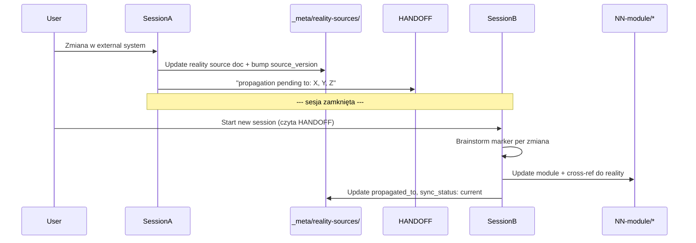

## When to Use

Aplikuj skill gdy:

- **Zmiana w reality source** — np. nowa kolumna w `Smart_PLD_v7.xlsm`, nowy flow w Power Automate, nowa encja w D365, kolumna w Access DB. Trigger natychmiastowy.
- **Review dokumentu modułowego** — `new-doc/NN-module/*` który ma backing reality source. Sprawdzasz czy moduł zgadza się z ostatnim snapshotem reality.
- **Start Phase A lub Phase B sesji** — zawsze invokuj skill na początku sesji, która dotyka modułu z reality backing.
- **Integracja z `vba-pipeline`** — hook checkpoint po `regression` stage każdej zmiany PLD v7 (Session A trigger).
- **Periodic quarterly audit** — DOC-AUDITOR agent scan → drift report → review tym skillem.

Pomijaj gdy: piszesz czysto universal koncept bez reality backing (ADR architektoniczny, pattern doc), robisz refactoring nazewnictwa w docs bez zmiany semantyki.

---

## Core principle — Two-session pattern (obowiązkowy)

Sync reality → moduły **NIGDY** nie odbywa się w jednej sesji. Podział na dwie sesje wymusza świeży kontekst dla brainstormu markera i chroni przed naiwnym copy-paste rzeczywistości Apexa do modułu opisującego "universal MES".

| Sesja | Cel | Output |
|---|---|---|
| **Session A — Capture** | Zidentyfikuj zmianę w external system → update `_meta/reality-sources/<source>/*` | Reality source doc updated + HANDOFF note "propagation pending to: module X, Y, Z" |
| **Session B — Propagate** | Read HANDOFF → brainstorm markera per zmiana → update moduły Monopilot | Moduł updated + cross-ref do reality source + reality source `propagated_to` field updated |

**Zasada żelazna:** Session A i Session B są **oddzielone czasowo** (różne sesje, minimum kilka godzin / następny dzień). Nie robimy obu w jednym sit-down.

---

## Step-by-step — Session A (Capture)

1. **Zidentyfikuj zmianę** — co się zmieniło, kiedy, kto zmienił, dlaczego (poszukaj uzasadnienia biznesowego).
2. **Otwórz `_meta/reality-sources/<source>/<plik>.md`** (np. `_meta/reality-sources/pld-v7-excel/main-table.md`).
3. **Dopisz sekcję historyczną** — stary stan + zmiana + nowy stan. NIE kasuj starej zawartości — reality source to *chronicle*, nie live-spec.
4. **Bump frontmatter:**
   - `source_version` — nowa wersja zewnętrznego artefaktu (PLD v7 file version / D365 release / flow export ID).
   - `last_sync` — dzisiejsza data `YYYY-MM-DD`.
   - `sync_status: needs_review` — bo moduły jeszcze nie zaktualizowane.
5. **HANDOFF.md** — zapisz: "propagation pending to: [modules]" + krótki opis per zmiana (1-2 zdania co propagować).
6. **Zamknij sesję.** NIE propaguj w tej samej sesji — nawet jeśli zmiana wygląda trywialnie. Brainstorm markera wymaga świeżego kontekstu.

---

## Step-by-step — Session B (Propagate)

1. **Read HANDOFF** z poprzedniej sesji — wszystkie pending propagations.
2. **Per zmiana — brainstorm markera** (kluczowa aktywność; bez niej propagacja nie rusza):
   - Czy to fundament branży food-manufacturing (traceability, BOM, allergeny, audit trail, regulatoryjne)? → `[UNIVERSAL]`
   - Czy to specyfika Apexa (lokalna nomenklatura, konkretny dział, wewnętrzny proces)? → `[APEX-CONFIG]`
   - Czy pattern jeszcze niestabilny (Apex eksperymentuje, splits pending)? → `[EVOLVING]`
   - Czy wynika z D365 integration (zniknie po migracji)? → `[LEGACY-D365]`
   - Niepewność → downgrade do `[APEX-CONFIG]` (zasada konserwatywnej uniwersalności).
3. **Aktualizuj moduł(y) Monopilot** — każda propagowana zmiana linkuje z powrotem do reality source (pełna ścieżka). Moduł to *abstrakcja*, nie copy-paste reality.
4. **Zamknij pętlę w reality source:**
   - `sync_status: current`.
   - Dodaj moduły do `propagated_to` list.
   - Bump `doc_version` reality source (edit = nowa wersja docu).
5. **Jeśli zmiana jest warta ADR** → invokuj `architecture-adr` skill.

---

## Anti-patterns

- ❌ **Update modułu bez update reality source.** Drift pewny w ciągu tygodni. Moduł traci zakotwiczenie w rzeczywistości, reality source przestaje być ground truth.
- ❌ **Update reality source + modułu w jednej sesji.** Brakuje świeżego brainstormu markera — `[UNIVERSAL]` dostaną rzeczy Apex-specific, kompletnie psując multi-tenancy.
- ❌ **Brak markera w propagowanej zmianie.** Nieidentyfikowalna odpowiedzialność (fundament czy specyfika klienta?) → blocker review.
- ❌ **Pomijanie reality layer "bo mam w głowie".** Reality source = chronicle instytucjonalna; twoja pamięć nie liczy się w onboardingu kolejnego developera.
- ❌ **Copy-paste reality source 1:1 do modułu.** Moduł = abstrakcja universal MES + per-org configurability, nie kronika Apexa. Tłumacz, nie kopiuj.
- ❌ **Usuwanie informacji z reality source bez historii.** Historyczne przepływy zostają w sekcji historycznej. Bez historii tracimy uzasadnienie decyzji.
- ❌ **`sync_status: current` bez faktycznego update modułów.** Pole jest kontraktem — current oznacza *zarówno* reality source up-to-date *jak i* moduły wchłonęły zmianę.

---

## Reality sources registry (bootstrap)

Obecny stan rejestru źródeł (za REALITY-SYNC §1):

| Source | Ścieżka | Status | Phase target |
|---|---|---|---|
| PLD v7 Excel/VBA | `_meta/reality-sources/pld-v7-excel/` | Active reality | Phase A (3 sesje) |
| Power Automate flows | `_meta/reality-sources/power-automate/` | Planned | Later (po Phase C) |
| D365 integration | `_meta/reality-sources/d365-integration/` | Planned | Phase D+ |
| Access databases | `_meta/reality-sources/access-databases/` | Planned | Later |
| Other Excels (operational) | `_meta/reality-sources/other-excels/` | Planned | Later |

PLD v7 = pierwszy active reality. Pozostałe ruszają gdy odpowiedni segment biznesu wchodzi w zakres migracji.

---

## Drift detection (cadence)

| Kiedy | Co sprawdzamy | Action |
|---|---|---|
| **Per-phase close** (A/B/C/D quality gate) | Wszystkie reality sources w scope fazy mają `sync_status: current` | Gate nie przechodzi dopóki któryś jest `needs_review` / `outdated` |
| **Periodic quarterly** | Full scan źródeł vs `_meta/reality-sources/*` (DOC-AUDITOR agent) | Drift score report — GREEN <10% / YELLOW 10-25% / RED >25% |
| **On-demand** (każda zmiana modułu z reality backing) | Warn jeśli reality source out-of-date | Block update albo dopisać TODO do backlogu sprintu |
| **VBA pipeline hook** (PLD v7) | Po `regression` stage każdej zmiany v7 | Reminder "add Session A capture do tej sesji" |

**Drift score formula:** `(reality_changes − propagated_changes) / reality_changes × 100`.

---

## Handoff do innych skilli

| Gdy | Użyj skilla | Dlaczego |
|---|---|---|
| Brainstorm markera w Session B (kluczowy punkt) | `documentation-patterns` | Pełna definicja 4 markerów + conflict resolution + asymetria |
| Nowa kolumna z reality — decision schema-driven vs code-driven | `schema-driven-design` | 3 pytania decyzyjne przed propagacją |
| Nowa reguła z reality (cascading / gate / workflow) | `rule-engine-dsl` | Weryfikacja scope DSL |
| Per-org variation decision | `multi-tenant-variation` | L1/L2/L3/L4 layer placement |
| Zmiana PLD v7 VBA | `vba-pipeline` | Session A trigger hook po regression stage |
| Zmiana warta własnego ADR | `architecture-adr` | ADR template |

---

## Verification Checklist

### Po Session A

- [ ] Reality source file updated — sekcja historyczna dopisana (stara zawartość nie skasowana).
- [ ] Frontmatter: `source_version` bumped, `last_sync` = dzisiaj, `sync_status: needs_review`.
- [ ] HANDOFF.md zawiera listę pending propagations (modules + description).
- [ ] Sesja zamknięta BEZ update modułów Monopilot.

### Po Session B

- [ ] Każda propagowana zmiana ma marker (brainstorm udokumentowany w commit / handoff).
- [ ] Moduły Monopilot zaktualizowane z cross-ref (pełna ścieżka) do reality source.
- [ ] Reality source: `sync_status: current`, `propagated_to` zawiera moduły, `doc_version` bumped.
- [ ] Żaden marker `[UNIVERSAL]` nie jest przypięty bez cross-walk z innymi reality sources (zasada konserwatywnej uniwersalności).

---

## Related

- [`REALITY-SYNC.md`](../../patterns/REALITY-SYNC.md) — primary (pattern definition)
- [`DOCUMENTATION-SYNC.md`](../../patterns/DOCUMENTATION-SYNC.md) — wzór strukturalny (code ↔ docs analogue)
- [`META-MODEL.md`](../../decisions/META-MODEL.md) §5 (D365 mapping context dla markera `[LEGACY-D365]`)
- Skill `documentation-patterns` — markery (Session B brainstorm)
- Skill `schema-driven-design` — decyzja schema vs code dla nowych kolumn
- Skill `rule-engine-dsl` — nowe reguły z reality
- Skill `multi-tenant-variation` — layer placement per-org
- Skill `vba-pipeline` — PLD v7 trigger hook
- Spec: [`docs/superpowers/specs/2026-04-17-monopilot-migration-design.md`](../../../../docs/superpowers/specs/2026-04-17-monopilot-migration-design.md) §4.5, §7.2 R2
- User memory: `project_smart_pld` — PLD v7 active reality context
