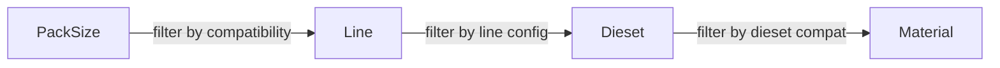
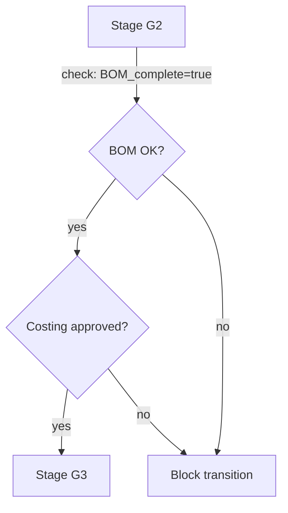
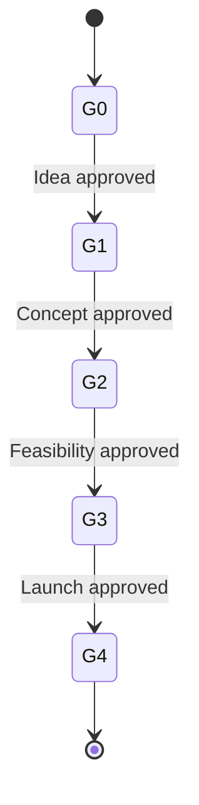

## When to Use

Aplikuj skill gdy:

- Projektujesz **regułę walidacji dynamicznej** w dowolnym module (np. "Pole X required gdy Dept Y aktywny").
- Projektujesz **cascading dropdown** (np. Pack_Size → Line → Dieset → Material).
- Definiujesz **gate entry criteria** dla workflow (Stage-Gate, WO transitions).
- Opisujesz **workflow definition** w module docs (state machine + transitions + warunki).
- Robisz **review propozycji reguły** — sprawdzasz czy mieści się w scope DSL czy wymaga code-driven implementation.
- Piszesz **ADR dla nowej reguły** — weryfikujesz czy nie rozszerza DSL poza 4 obszary (wymaga nowego ADR o ile tak).

Pomijaj gdy: reguła jest matematyczna (BOM cost roll-up), integracyjna (D365 push), algorytmiczna (FIFO/FEFO picking), regulatoryjna (GS1 parser).

---

## Scope — 4 obszary DSL (twardy limit per ADR-029)

DSL rule-engine pokrywa **dokładnie 4 obszary**. Rozszerzenie poza nie wymaga nowego ADR (mitigacja R1 ze spec §7.2 — "half-baked database inside database").

| # | Obszar | Przykład | Marker |
|---|---|---|---|
| (a) | **Cascading dropdowns** | Pack_Size → Line → Dieset → Material | silnik `[UNIVERSAL]`, łańcuchy `[FORZA-CONFIG]` |
| (b) | **Conditional required** | "Pole `MRP_Category` required gdy Dept MRP aktywny" | silnik `[UNIVERSAL]`, reguły `[FORZA-CONFIG]` |
| (c) | **Gate entry criteria** | "Stage G2 → G3 wymaga: BOM_complete=true AND Costing_approved=true" | silnik `[UNIVERSAL]`, checklisty `[FORZA-CONFIG]` |
| (d) | **Workflow definitions as data** | NPD Stage-Gate G0→G4 jako JSON/DB row | silnik `[UNIVERSAL]`, definicja `[FORZA-CONFIG]` |

**Twardy limit:** Jeśli Twoja reguła nie mieści się w żadnej z tych 4 kategorii → nie próbuj rozszerzać DSL "w locie". Zaproponuj nowe ADR + aktualizację META-MODEL §2.

---

## When NOT to use DSL

Przejdź na **code-driven** implementację gdy:

- **Reguły matematyczne** — BOM costing formulas, yield calculation, unit conversion. Silnik liczący to kod, nie data.
- **Integracje zewnętrzne** — D365 export push, email provider API, scanner SDK callbacks. Kontrakt zewnętrzny żyje w kodzie.
- **Logika transakcyjna** — FIFO/FEFO picking algorithm, LPN allocation, shortage detection. Algorytmy regulatoryjne / performance-critical → kod.
- **Regulatoryjne** — GS1-128 parsing, HACCP CCP enforcement, traceability forward/backward <30s. Standardy branżowe zakotwiczone w kodzie (z testami).
- **UI strukturalne** — routing, layouts, nawigacja. Stabilne między orgs (META-MODEL §3).

---

## Semantic primitives

DSL operuje na semantycznych prymitywach (opisane słownie, bez konkretnej składni — decyzja JSON vs textual odroczona, zob. ADR-029 open questions).

**Predicates (warunki):**

- Field comparisons: `=`, `≠`, `>`, `<`, `≥`, `≤`, `in <set>`, `not in <set>`.
- Boolean combinators: `AND`, `OR`, `NOT`.
- Existence checks: `is_empty`, `is_not_empty`.

**Actions (konsekwencje):**

- `allow-values(<set>)` — filtrowanie opcji cascading.
- `set-required(<field>, <bool>)` — conditional required.
- `block-transition(<stage_from>, <stage_to>, <reason>)` — gate blocking.
- `require-checklist(<checklist_id>)` — gate expansion.

**References (skąd biorą się wartości):**

- Literals (stałe wartości).
- Other-field-value (dynamicznie ściągnięte z innego pola tego samego rekordu).
- Reference-table-lookup (FK do `pack_sizes`, `lines`, …).
- Org-config-value (feature flag, module toggle — ADR-011).

---

## Documentation format

Gdy opisujesz regułę w **ADR / module docs / PRD** — używaj:

1. **Tabeli decyzyjnej** — kolumny warunki, kolumny akcje. Każdy wiersz = jedna reguła. Tabela jest najbardziej review-able.
2. **Mermaid state diagram** — dla workflow-as-data (obszar d) i dla cascading flow (obszar a).
3. **Prozy** — opis semantyki reguły (co, kiedy, dlaczego, dla kogo).
4. **Markerów** — na każdej regule (`[UNIVERSAL]` / `[FORZA-CONFIG]` / `[EVOLVING]`).

**NIE używaj** w docs konkretnego JSON / SQL / TypeScript code — to należy do:

- `stories/context/*.yaml` contract files (specyfikacja implementacyjna).
- Kodu samego w sobie (repo implementacyjne post-Phase C).

Docs opisują *co i dlaczego*, nie *jak dokładnie w składni JSON*.

---

## Mermaid examples

### Cascading flow (obszar a)

### Gate criteria (obszar c)

### Workflow as data (obszar d)

---

## Anti-patterns

- ❌ **DSL over-reach** — dodawanie "just one more case" poza 4 obszary bez ADR. Każdy taki "just one" mnoży complexity engine-u i rozmywa kontrakt meta-modelu.
- ❌ **Hardcoded if/else per moduł** — 16 modułów × N reguł każdy = unmaintainable, nie multi-tenant, brak audit trail zmian reguł.
- ❌ **Full Rules Engine (Drools / easy-rules)** — over-scope. Te silniki są Turing-complete; celem DSL jest debuggability (musi się dać pokazać admin-owi jedną tabelkę).
- ❌ **Frontend-only validation** — nie działa dla API security w multi-tenant. Reguły muszą być enforced backend-side (silnik server-side, frontend renderuje UI feedback).
- ❌ **Turing-complete DSL** — celowo ograniczony scope. Jeśli reguła wymaga pętli / rekursji → to nie reguła, to algorytm (code-driven).
- ❌ **Copy reguły między orgami ręcznie** — reguły są `[FORZA-CONFIG]` per org, ale wzorce mogą być seed-owane przez template (zob. `multi-tenant-variation`).
- ❌ **Brak markera na regule** — blocker review (zob. `documentation-patterns`).

---

## Markers application

Dyscyplina markerów w DSL rule-engine:

| Artefakt | Marker | Uzasadnienie |
|---|---|---|
| Silnik DSL runtime (interpreter) | `[UNIVERSAL]` | Jeden kod dla wszystkich org-ów |
| Konkretny cascading chain (np. Pack_Size → Line) | `[FORZA-CONFIG]` | Definicja per org |
| Gate checklist items (BOM_complete, Costing_approved) | `[FORZA-CONFIG]` | Forza-specific nazwy / progi |
| Workflow definition (G0→G4) | `[FORZA-CONFIG]` | Inny org może mieć G0→G3 |
| Reguła w trakcie eksperymentu | `[EVOLVING]` | Forza testuje, trzymaj w DB |
| Reguła wymuszana przez D365 integration | `[LEGACY-D365]` | Zniknie gdy feature flag D365 off |

---

## Handoff do innych skilli

| Gdy | Użyj skilla | Dlaczego |
|---|---|---|
| Reguła referencuje schema-driven pole (np. `column.required` check) | `schema-driven-design` | Weryfikacja czy kolumna jest meta-row w `column_definitions` |
| Reguła różni się per org (prawie zawsze) | `multi-tenant-variation` | Layer L3 Rule Engine Definitions + RLS pattern |
| Marker na regule | `documentation-patterns` | Obowiązkowy dla każdej nowej reguły |
| Reguła pochodzi z reality source (PLD v7 VBA validation) | `reality-sync-workflow` | Session A capture + Session B propagation z brainstormem markera |

---

## Verification Checklist

- [ ] Reguła mieści się w jednej z 4 kategorii DSL (a / b / c / d). Jeśli nie → STOP, propose ADR.
- [ ] Reguła NIE jest: matematyczna / integracyjna / algorytmiczna / regulatoryjna (te są code-driven).
- [ ] Reguła udokumentowana jako tabela decyzyjna / Mermaid / proza — NIE jako inline JSON/SQL w docs.
- [ ] Każda reguła ma marker.
- [ ] Gate criteria referencują schema-driven pola (weryfikowane w `schema-driven-design`).
- [ ] Silnik DSL oznaczony `[UNIVERSAL]`, konkretne reguły `[FORZA-CONFIG]` / `[EVOLVING]`.
- [ ] Cross-reference do ADR-029 w dokumencie definiującym regułę.

---

## Related

- [`META-MODEL.md`](../../decisions/META-MODEL.md) §2 (Level "b" — rule engine furtka) i §8 (workflow as data) — primary
- [ADR-029 Rule engine DSL + workflow as data](../../decisions/ADR-029-rule-engine-dsl-and-workflow-as-data.md) — definicja scope 4 obszarów + extension discipline
- [ADR-007 Work order state machine](../../decisions/ADR-007-work-order-state-machine.md) — bazowy engine dla workflow-as-data (rozszerzany przez ADR-029)
- [ADR-028 Schema-driven column definition](../../decisions/ADR-028-schema-driven-column-definition.md) — reguły referencują kolumny definiowane w ADR-028
- Skill `schema-driven-design` — poprzedzający krok (kolumny muszą istnieć zanim reguła może je referencować)
- Skill `multi-tenant-variation` — L3 layer (Rule Engine Definitions)
- Skill `documentation-patterns` — markery obowiązkowe
- Spec: [`docs/superpowers/specs/2026-04-17-monopilot-migration-design.md`](../../../../docs/superpowers/specs/2026-04-17-monopilot-migration-design.md) §2.1 punkty 2 + 8, §7.2 R1
