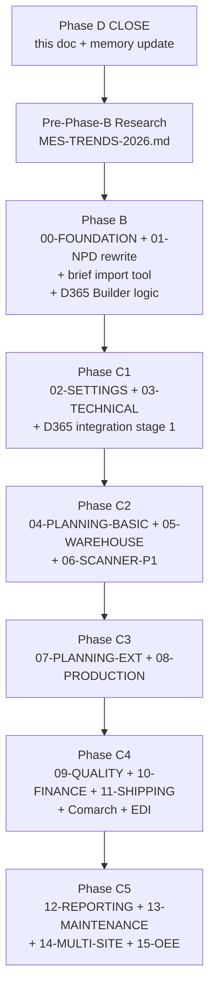

# MONOPILOT-V2-ARCHITECTURE — Phase D closure

**Status:** ACCEPTED
**Date:** 2026-04-18
**Phase:** D (architecture closure — zamknięcie przed Phase B NPD rewrite)
**Supersedes:** partial — pre-Phase-0 ADRs 001-027 gdzie konflikt z nowymi decyzjami
**Extends:** [META-MODEL](META-MODEL.md), [ADR-028](ADR-028-schema-driven-column-definition.md), [ADR-029](ADR-029-rule-engine-dsl-and-workflow-as-data.md), [ADR-030](ADR-030-configurable-department-taxonomy.md), [ADR-031](ADR-031-schema-variation-per-org.md)
**Source sessions:** Phase A (3 sesje reality capture, 10 docs) + Phase D closure session (23 open questions settled)

---

## Purpose

Ten dokument zamyka architekturę Monopilot v2 przed Phase B (NPD rewrite). Konsoliduje:
- 23 architectural decisions wynikające z open questions Phase A (EVOLVING §19)
- 6 architektonicznych zasad (principles) formalizowanych w Phase D
- Nową numerację 15 modułów + build order
- Plan Phase B/C1-C5 + multi-stage integracje
- Pre-Phase-B industry research step

Wszystkie decyzje są ground truth dla Phase B propagation (09-NPD → 01-NPD rewrite) oraz Phase C batch sequence.

---

## §1 — Zasady architektoniczne (6 principles)

### 1.1 Easy extension contract (P1)

**Zasada:** Monopilot NPD module = **1:1 reality v7 + extension points** (nie speculation, nie refactor, tylko faithful reproduction + clean add-column pathway).

**Cytat user (Phase A Session 3):** *"plan NPD jak najbardziej zbliżony do tego co teraz mamy. ale zakładamy łatwą rozbudowę."*

**Realizacja:** ADR-028 full realization (schema-driven admin UI: add column / add rule / add config table = 1 click, zero dev).

**Marker:** `[UNIVERSAL]` principle (każda firma benefituje).

### 1.2 Two-systems principle (P2)

**Zasada:** v7 Excel i Monopilot webapp to **ten sam logiczny system**, różne warstwy prezentacji. Ta sama data model, te same reguły biznesowe — UX adaptowany do technologii.

**Przykład:** Dashboard w Excel = statyczna tabela; w Monopilot = interactive Gantt chart / Kanban / real-time dashboard. **Data source identical.**

**Konsekwencja:** Przy pisaniu PRD dla Monopilot, logika biznesowa = 1:1 v7 reality. UX/display layer = technology-appropriate (modal edit dla multi-component, Gantt dla alertów, itp.).

**Marker:** `[UNIVERSAL]` principle.

### 1.3 Schema-driven + rule engine DSL (P3)

**Zasada:** META-MODEL §1 (Level "a") + §2 (Level "b") są kontraktem. Wszystko co Apex zmienia "często" = dane w config-tabelach. 4 obszary rule engine (ADR-029) = twardy limit.

**Realizacja:** Reference tables = config-tabele per org. Rule engine Level "b" interpretuje JSON z DB. Admin UI kompiluje wizard → JSON.

### 1.4 Reality fidelity (P4)

**Zasada:** Phase B = 1:1 reality v7. Speculation ("MRP split", "Meat_Pct migration do Core", "approval chain") = odroczone do explicit user request w Phase C+.

**Konsekwencja:** Unikamy rewrite na starcie. Monopilot day 1 = faithful PLD v7 reproduction. Future extensions = `[EVOLVING]` areas dokumentowane w EVOLVING.md, implementowane gdy user priorytetuje.

### 1.5 Multi-tenant from day 1 (P5)

**Zasada:** ADR-031 4-warstwowa izolacja (L1 universal core / L2-L4 per-org). Apex = pierwsza konfiguracja, nie jedyna. Nigdy hardcoding Apex-specific w kodzie aplikacji.

### 1.6 Marker discipline (P6)

**Zasada:** META-MODEL §6 — każde wymaganie, kolumna, reguła MUSI mieć marker `[UNIVERSAL]` / `[APEX-CONFIG]` / `[EVOLVING]` / `[LEGACY-D365]`. Brak = review block.

---

## §2 — Schema decisions (Group 1, 8/8 settled)

### 2.1 Multi-component semantyka (pkt 1)

**Decision:** Main Table cols = **agregacja komponentów** gdy N>1 components. ProdDetail (v7) / `formulation_items` (Monopilot) = per-component detail.

**Agregacja rules:**
- `Process_1..4` — distinct union, comma-sep gdy różne per component
- `Line` / `Dieset` — value gdy wszystkie same; `"Multi"` gdy różne
- `Yield_*`, `Staffing`, `Rate` — puste w Main Table (żyją per-component)
- `PR_Code_Final` — comma-sep concat z wszystkich per-component finals (pkt 10b)
- `Meat_Pct` i inne % — comma-sep values per component (np. `"48, 32, 30"`)

**Excel (v7):** M04.SyncProdDetailRows + nowa M04.AggregateMainTableCols przy każdej zmianie.
**Monopilot:** computed view z `formulation_items` albo stored + trigger-updated.

**Marker:** `[UNIVERSAL]` pattern (multi-component handling), `[APEX-CONFIG]` aggregation rules per column.

### 2.2 Done_<Dept> semantyka (pkt 2)

**Decision:** `Done_<Dept> = IsAllRequiredFilled(dept, row)` (auto-computed readiness). Independent of `Closed_<Dept>` (manual sign-off).

**Konsekwencja:**
- `Done=TRUE AND Closed=NO` → UI badge "Ready to Close" (prompt dla dept manager)
- `Done=TRUE AND Closed=Yes` → dept fully complete
- `Done=FALSE AND Closed=Yes` → warning (closed prematurely, unusual state)

**Excel (v7):** Dodać M01.ComputeDoneFlags — update Done_<Dept> przy każdym M03 writeback.
**Monopilot:** Done jako computed view (SQL). Closed jako stored + audit log.

**Marker:** `[UNIVERSAL]` pattern.

### 2.3 Status_Overall enum (pkt 3)

**Decision:** 5 wartości (priority order, pierwsza pasująca):

1. **`Built`** — `Built=TRUE` (wysłane do D365, brak edycji od build)
2. **`Complete`** — wszystkie 7 `Closed_<Dept>=Yes` AND V01-V06 PASS (Ready to Build)
3. **`Alert`** — `Days_To_Launch ≤ 10` AND missing required data
4. **`InProgress`** — ≥1 `Closed_<Dept>=Yes` ale nie wszystkie
5. **`Pending`** — default (nic nie zamknięte)

**Builder gate** (per user pkt 8): `Status_Overall="Complete"` AND `Built=FALSE` → build eligible. Post-build: `Status_Overall="Built"` → skip przy następnym scan.

**Marker:** `[UNIVERSAL]` pattern + `[APEX-CONFIG]` enum values.

### 2.4 Days_To_Launch (pkt 4)

**Decision:** Computed on-the-fly, nie persistowane.
- v7: Excel formula `=Launch_Date - TODAY()`
- Monopilot: SQL expression / derived column / React compute

**Marker:** `[UNIVERSAL]`.

### 2.5 FA_Code generation (pkt 5)

**Decision:** Hybryda — system proponuje `FA<NNNN>` (last+1), user **zatwierdza/edytuje przed save**. Auto nigdy nie trafia do DB bez human approval.

**Format pattern:** schema-driven per org (ADR-028). Apex default: `FA<NNNN>`. Inne orgi: konfigurowalne template.

**Marker:** `[APEX-CONFIG]` format, `[UNIVERSAL]` pattern hybrid generator.

### 2.6 Dev_Code vs FA_Code (pkt 6)

**Decision:** **Dwa zupełnie różne, niezależne kody** coexist w PLD row.
- `Dev_Code` (Core col, from brief, e.g. `DEV26-037`) — NPD upstream traceability
- `FA_Code` (Core PK, e.g. `FA5101`) — PLD/D365 identifier

**Brak relacji formatowej** — nie ma algorytmu `DEV26-037 → FA5101`. Link = "ten sam PLD row". Bidirectional traceability brief ↔ PLD.

**Marker:** `[APEX-CONFIG]` both formats.

### 2.7 Price blocking rule (pkt 7)

**Decision:** Zmień `Reference.DeptColumns` R56 (Procurement.Price): `Core done` → `Core + Production done`.

**Per-col blocking** (pozostałe Procurement cols zostają `Core done`):

| Procurement col | Blocking_Rule |
|---|---|
| Supplier | `Core done` |
| Lead_Time | `Core done` |
| Proc_Shelf_Life | `Core done` |
| **Price** | **`Core + Production done`** ← change |
| Closed_Procurement | `Core done` |

VBA M01.IsBlockingMet już obsługuje `Core + Production done` (MRP używa). Zmiana = edit 1 cell w Reference.

**Marker:** `[APEX-CONFIG]`.

### 2.8 Built auto-reset (pkt 8)

**Decision:** Bug fix — **każda edycja** (Main Table OR ProdDetail) resetuje `Built=FALSE`.

**Fix:** Dodać reset w M03 Production branch + M04.CascadeProdDetail.

**Builder lifecycle** (per user):
1. 7 produktów w systemie. 4 mają `Status_Overall="Complete"`, 3 pending
2. Jane klika "Build D365" → 4 produkty → per FA file `Builder_FA<code>.xlsx` z N+1 D365 products (FA + PR intermediates) → `Built=TRUE`
3. Kolejne 2 produkty stają się `Complete`. Jane ponownie klika "Build" → tylko 2 nowe (pozostałe 4 skipped bo `Built=TRUE`)
4. Edit any FA post-build → `Built=FALSE` → eligible ponownie

**Marker:** `[UNIVERSAL]` pattern (staleness tracking), `[LEGACY-D365]` feature.

---

## §3 — Rule engine decisions (Group 2, 3/3 settled)

### 3.1 DSL składnia (pkt 9)

**Decision:** Hybryda (per ADR-029 rekomendacji):
- **Runtime form:** JSON w config-tabeli (silnik parsuje)
- **Docs form:** Mermaid / textual w `_foundation/` + reality-sources
- **Admin UI form:** wizard z dropdownami kompilującymi się do JSON (non-technical user nigdy nie widzi JSON-a)

Non-technical user = dept manager. Technical admin = może edytować JSON jeśli potrzeba.

**Marker:** `[UNIVERSAL]` (3-forma pattern).

### 3.2 PR_Code_Final format (pkt 10)

**10a Decision:** Format `PR<digits><letter>` = `[APEX-CONFIG]` schema-driven per org. Monopilot trzyma template w config: `"{prefix}{rm_digits}{last_process_suffix}"`.

**10b Decision (multi-component):** Main Table `PR_Code_Final` = **comma-sep concat** PR_Code_Final z wszystkich ProdDetail rows. Per-component finals żyją w ProdDetail/formulation_items.

**Przykład:** FA z 3 components (PR123H, PR345R, PR678F) → Main Table.PR_Code_Final = `"PR123H, PR345R, PR678F"`.

### 3.3 Blocking rules extension (pkt 11)

**Decision:** Monopilot wspiera rule engine obszar (b) conditional required (ADR-029) — blocking rules są **danymi** w config-tabeli, parsowane przez universal engine. Admin może dodać nową regułę przez Settings bez dewelopera.

**4 obecne v7 rules** (`""` / `Core done` / `Pack_Size filled` / `Line filled` / `Core + Production done`) = Apex seed data.

**Limit:** ADR-029 predykaty (field-comparison / AND-OR-NOT / reference-lookup / org-config) — nie Turing-complete.

**V7:** pozostaje 4 hardcoded rules (legacy, nie rozszerzamy).

---

## §4 — Business decisions (Group 3, 7/7 settled)

### 4.1 Technical naming (pkt 12)

**Decision:** Dept name `Technical` (1:1 reality v7). Monopilot stabilny code `TECH`, label `[APEX-CONFIG]` per org (inne orgi mogą nazywać `Quality` / `QA` / `Food Safety`).

### 4.2 Brief = pierwszy ekran NPD module (pkt 13)

**Decision:** Brief JEST w 01-NPD module w Monopilot (nie "upstream zewnętrzny"). Flow: **Brief → PLD → depts parallel → closure → D365 Builder**.

**Strategia 2-fazowa:**
- **Faza C (start):** Tool "Import brief from Excel" — czyta brief xlsx → tworzy PLD row z Core pre-populated
- **Faza C (later):** Native brief UI w 01-NPD module (37 pól Brief Sheet V1) — osobny ekran, pierwszy krok NPD pipeline

**Marker:** `[UNIVERSAL]` pattern (NPD upstream → downstream), `[APEX-CONFIG]` Brief Sheet V1 schema.

### 4.3 Meat_Pct location (pkt 14)

**Decision:** Zostaje w Planning (reality fidelity). Multi-component agregacja = comma-sep (pkt 1). Location Planning vs Core = sekundarne (decyzja dotyczy struktury, agregacja jest krytyczna).

### 4.4 Material consumption tabela (pkt 15)

**Decision:** **Nowa tabela** `Reference.Dieset_Material_Consumption` (N:1 Dieset → materials).

**Schema:**
```
Dieset_Code | Material_Type | Quantity | Unit
DIE_20x30_L5 | Folia        | X.XX     | m
DIE_20x30_L5 | Label        | 1        | each
...
```

**Trigger:** cascade z Line → Dieset → lookup Material_Consumption → populate BOM/Formula_Lines z real quantities (nie hardcoded 1).

**Marker:** `[APEX-CONFIG]` data, `[UNIVERSAL]` composite-key lookup pattern.

### 4.5 Allergens multi-level cascade (pkt 16) **CRITICAL**

**Decision:** Allergens **NIE są** tylko "RM → FA direct inheritance". Są **multi-level chain**:

```
RM_xxx (allergen_A) 
  → PR_xxxA (inherit A) 
  → PR_xxxxH (inherit A + add B if new ingredient with allergen at Smoke+Tumble step)
  → FA_xxxx (inherit A+B ∪ other components' allergens)
```

**Core rule:** Każdy PR (process step output) ma **własny allergen set** = `previous_step_allergens ∪ ingredients_added_at_this_step`. Proces step może **dodać** nowy allergen jeśli wymaga nowego ingredient.

**Data model:**

| Table | Purpose |
|---|---|
| `Reference.Allergens` | EU14 + custom seed (code, name_EN, name_PL, icon_url, is_eu_mandatory, active) |
| `Product_Allergens` | Junction RM ↔ Allergens (RM has allergens) |
| `Process_Step_Ingredients` (NEW) | PR_step → additional ingredients added at this step |
| `Ingredient_Allergens` | Junction ingredient ↔ allergens |

**Derivation query (Monopilot):** recursive CTE traversing chain, UNION allergen sets.

**V7 Excel implementation:**
- Nowa tabela `Reference.Allergens` (seed EU14)
- Nowa tabela `Reference.Process_Ingredients` (PR step → additional ingredients)
- Nowa kolumna Technical: `Allergens` w Main Table (auto-computed, comma-sep)
- M04.CascadeAllergens — rekurencja po chain

**Brief allergens location:** TBD (Phase B brief rescan).

**Marker:** `[UNIVERSAL]` pattern (food-mfg EU regulation 1169/2011), `[UNIVERSAL seed]` EU14, `[APEX-CONFIG]` custom allergens.

### 4.6 Multi-component CloseProduction (pkt 17)

**Decision:** Strict all-must-complete (v7 current zachowane). Closed_Production requires **all components** complete. Guarantees D365 Builder nie buduje niekompletnego BOM.

Per-component progress widoczny w Monopilot UI (modal/expandable), ale Closed flag = all-or-nothing.

### 4.7 Alert thresholds (pkt 18)

**Decision:** `Reference.Alert_Thresholds` config table w Monopilot.

```
Level  | Days_Threshold | Condition
RED    | 10             | Days_To_Launch ≤ 10 OR no Launch_Date
YELLOW | 21             | Days_To_Launch ≤ 21 AND missing_data != ""
```

Apex seed 10/21. Inne orgi configurable.

**V7:** hardcoded w M07 zostaje (nie rozszerzamy legacy).

---

## §5 — Integration decisions (Group 4, 5/5 settled)

### 5.1 M08 Builder — Apex logic (pkt 19) **CRITICAL**

**Decision:** Każdy process step = **osobny D365 product**. `OPERATIONNUMBER = 10` zawsze (nie sequence).

**Przykład:** FA_xxx z RM_xxx → Process_1 "A" (Strip) → Process_2 "H" (Dice):

**Builder tworzy 3 osobne D365 products:**

1. **PR_xxxA** (Strip output)
   - Formula_Lines: RM_xxx (1 line)
   - Route: OP=10

2. **PR_xxxH** (Dice output)
   - Formula_Lines: PR_xxxA (1 line)
   - Route: OP=10

3. **FA_xxx** (final packed)
   - Formula_Lines: PR_xxxH + Box + Top_Label + Web + ... (N lines)
   - Route: OP=10

**Każdy product** ma pełny set 8 D365 tabs (Formula_Version, Formula_Lines, Route_Headers, Route_Versions, Route_Operations, Route_Operations&Properties, Resource_Requirements, + D365_Data item master).

**Multi-component FA:** suma wszystkich PR intermediates across all components + FA. Np. Italian Platter z 3 components, każdy z 2-step chain → 6 PR products + 1 FA = 7 D365 products per 1 PLD row.

**Implementation priority:**
1. Formula_Version (item header, per product)
2. Formula_Lines (component chain referencing — key)
3. Route_Headers → Route_Versions → Route_Operations → Route_OpProperties → Resource_Req

Wszystkie 8 tabs HIGH — brak kompletu = D365 import fails.

### 5.2 BOM + Builder relationship (pkt 20)

**Decision:** Osobne feature, wspólny trigger.

- **"Build" button** = D365 Builder (eksport zewnętrzny, per-FA file)
- **BOM tab** w PLD = internal operational view (material summary dla audit/planning)
- BOM NIE jest inputem dla Builder (M08 czyta Main Table bezpośrednio)

Build button flow:
1. Collect FA gdzie `Status_Overall="Complete"` AND `Built=FALSE`
2. Per FA: generuje `Builder_FA<code>.xlsx` z wszystkimi PR intermediates + FA (§5.1)
3. Set `Built=TRUE` per FA
4. BOM tab aktualizowany niezależnie (per FA save albo osobny "Refresh BOM")

### 5.3 Per-FA file structure (pkt 21)

**Decision:** `Builder_FA<code>.xlsx` zawiera **wszystkie produkty** dla tego FA (FA + wszystkie PR intermediates), każdy z pełnym 8-tab set.

**Benefits:**
- Clean per-FA paste workflow do D365 (1 plik = 1 complete product chain)
- Multi-FA build = N plików naraz (Jane wybiera folder `D365_Build_2026-04-18`)
- Historia per-FA (audit trail)

**V7:** M08 wygeneruje osobny plik przez `Workbooks.Add` + save.
**Monopilot:** per-FA JSON/Excel export + future D365 API.

### 5.4 D365 constants tabela (pkt 22)

**Decision:** **Nowa tabela** `Reference.D365_Constants` (schema-driven per org).

**Schema:**
```
Constant_Name               | Value       | Description
PRODUCTIONSITEID            | FNOR        | Apex North production site
APPROVERPERSONNELNUMBER     | FOR100048   | Default approver
CONSUMPTIONWAREHOUSEID      | ApexDG      | Default warehouse
PRODUCTGROUPID              | FinGoods    | Finished goods group
COSTINGOPERATIONRESOURCEID  | FProd01     | Default resource
CONSUMPTIONCALCULATIONFORMULA | Formula0  | Calc method
FLUSHINGPRINCIPLE           | Finish      | Material flush timing
LINETYPE                    | Item        | Formula line type
OPERATIONPRIORITY           | Primary     | Operation priority
NEXTOPERATIONLINKTYPE       | None        | Next op link
...
```

Feature flag `integration.d365.enabled` kontroluje widoczność.

**V7:** dodać nową tabelę w Reference sheet, M08 odczytuje przy build.
**Monopilot:** config table w 02-SETTINGS Admin UI.

**Marker:** `[LEGACY-D365]` + `[APEX-CONFIG]`.

### 5.5 CloseConfirm approval chain (pkt 23)

**Decision:** Binary default (1:1 v7). Architecture ready for future state machine via ADR-029 workflow-as-data (obszar d).

Apex może przejść na approval chain gdy Monopilot wejdzie w cały NPD (decision deferred).

**Data model:**
- `Reference.CloseConfirm` seed: 1 value "Yes" (binary)
- Monopilot: workflow definitions jako dane — jeśli kiedykolwiek potrzeba state machine, zmiana w config-table, nie kod

---

## §6 — Module numbering (new build order)

**15 modułów w nowej numeracji (build order = PRD rewrite order):**

| Nowy # | Moduł | Stary # | Scope | Phase |
|---|---|---|---|---|
| **00** | **FOUNDATION** | 00 | Infra, engines, ADRs, schema-driven runtime, rule engine interpreter, workflow engine | **B (first)** |
| **01** | **NPD** | 09 | Full PLD v7 equivalent (7 depts, brief, D365 Builder, allergens) | **B (primary)** |
| 02 | SETTINGS | 01 | Admin UI dla config tables + rule engine DSL wizard | C1 |
| 03 | TECHNICAL | 02 | Product master + BOM + Shelf life + Allergens full + HACCP basic | C1 |
| 04 | PLANNING-BASIC | 04a | Items creation (product master extension) | C2 |
| 05 | WAREHOUSE | 03 | Storage, LP, GRN, basic TO | C2 |
| 06 | SCANNER-P1 | 05a | Scan + move (pick/put) + counting + create | C2 |
| 07 | PLANNING-EXT | 04b | Orders to production (WO orchestration) | C3 |
| 08 | PRODUCTION | 06 | WO execution (completely different feature from PLD.Production dept) | C3 |
| 09 | QUALITY | 08 | Ongoing QA, NCR, CAPA, HACCP full | C4 |
| 10 | FINANCE | 10 | Costing, variance, margin, Comarch | C4 |
| 11 | SHIPPING | 07 | SO, allocation, picking, packing, dispatch | C4 |
| 12 | REPORTING | 15 | Dashboards, KPIs, materialized views, scorecards | C5 |
| 13 | MAINTENANCE | 14 | CMMS, MWO, PM scheduling | C5 |
| 14 | MULTI-SITE | 11 | Multi-org expansion, cross-site ops | C5 |
| 15 | OEE | 12 | Uptime/Performance/Quality aggregation | C5 |

**INTEGRATIONS (stary 13) = multi-stage, rozproszone:**

| Integration stage | Target | Phase |
|---|---|---|
| D365 Builder | 01-NPD + 03-TECHNICAL | **B** |
| Excel imports (brief) | 01-NPD | **B** |
| Excel imports per dept | 03-07 each | C1-C2 per module |
| Comarch Optima | 10-FINANCE | C4 |
| EDI (ORDERS/INVOIC/DESADV) | 11-SHIPPING | C4 |
| Supplier portal | 03/04/10 | C3-C4 |
| Customer portal | 11 | C5 |
| D365 API (gdy dostępne) | 01 + 15 | future (post-C5) |

Każda integracja = mini-spec w osobnym `INTEGRATION-<name>.md` + hooks w module target PRD.

---

## §7 — Krytyczne uwagi re: istniejące PRDs

Skan 15 PRDs ujawnił:

1. **Istniejące PRDs mają szerszy scope niż PLD v7** — Shipping, Finance variance, Quality CAPA/HACCP full, Maintenance CMMS, OEE, Multi-site, Reporting materialized views, EDI.
2. **Phase 1/2 split w istniejących PRDs ≠ Monopilot Migration Phase B/C/D** — istniejące były pisane pre-reality-capture. Wymagają re-definition.
3. **NPD PRD stary (09) ma minimalny scope** — w migration staje się primary rewrite (pełne PLD v7 equivalent).
4. **Moduły "department-named" (06-PRODUCTION, 09-QUALITY) = zupełnie inne features** niż PLD v7 dept sections. Same people, different purpose: PLD Production dept = spec definition; 08-PRODUCTION module = WO execution on line.

**Re-definition action (per Phase C batch):**
- Każdy PRD rewrite definiuje nowe MUST/SHOULD/COULD/WON'T (per EVOLVING §1 easy extension principle)
- Markery wszędzie
- Cross-refs do reality docs (pld-v7-excel + brief-excels)
- Sub-sections mapowane na Phase C batches (moduły mogą być rozbite na kawałki wykonywane po różnych prerequisites)

---

## §8 — Pre-Phase-B: Industry research (one-pass)

**User decision (Phase D):** Jeden research pass przed Phase B, potem wykorzystywany w każdym PRD rewrite (token-efficient, no duplicate research).

**Research scope (Phase D+ before Phase B start):**
- Latest MES trends 2026 (scanner-first, offline PWA, React Server Components admin)
- Food-mfg best practices (HACCP/allergens/traceability post-1169/2011)
- D365 replacement patterns (competitor MES stacks)
- Schema-driven architecture in modern SaaS (Retool, Airtable, Notion Databases — what to borrow, what to reject)
- Multi-tenant SaaS patterns (RLS vs app-level, upgrade strategies)
- AI/ML applications in food-mfg MES (demand forecasting, yield optimization, QA anomaly detection)
- Mobile UX for industrial scanners (Zebra TC52, Honeywell CT60)
- Supply chain / Procurement digital trends (supplier portals, EDI evolution)

**Output:** `_foundation/research/MES-TRENDS-2026.md` (single doc, referenced per PRD).

**Task 0 przed Phase B.**

---

## §9 — Phase plan (revised)



**Sesje estimate:** Research (~2h) + Phase B (3-4 sesje, 00-FOUNDATION refresh + 01-NPD full rewrite) + Phase C (5 batchów × 2-3 sesje = ~12-15 sesji).

**Total remaining:** ~20-22 sesji post-Phase-D.

---

## §10 — Open items (carry-forward do Phase B)

Z Phase A EVOLVING §19 nie-settled w Phase D (deferred przez explicit user decision):

1. **Brief allergens lokalizacja** — rescan brief pełny schema (C21-C37) w Phase B start
2. **Multi-component Volume w brief 2** — clarify z user (sample miał empty — typowe czy pomyłka?)
3. **Brief → Multi-FA split** — gdy brief 2 multi-component staje się multiple FAs vs 1 FA z N components w ProdDetail? Business rule TBD Phase B
4. **Hard-lock semantyka** (ADR-028 open) — "tylko developer" czy "tylko superadmin" — Phase B
5. **Rule engine versioning** (ADR-029 open) — v1 active vs v2 draft — Phase D+ implementation
6. **Upgrade strategy L2/L3/L4 opt-in granularity** (ADR-031 open) — Phase B
7. **Commercial upstream od briefu** (pkt 13 deferred) — Commercial vs NPD-internal brief source — future
8. **MRP split na 2** — user confirmed nieaktualne, pozostaje 1 dept. Re-visit gdy org internal potrzebuje split

---

## §11 — Memory update instructions

Po Phase D close:

1. Update `project_monopilot_migration.md`:
   - Phase D status: COMPLETE (2026-04-18)
   - Phase B next: 00-FOUNDATION + 01-NPD (after research pass)
   - Remaining: ~20-22 sesji (research + B×3-4 + C×12-15)
   - Replace "Phase D recommended" language z "Phase D COMPLETE"

2. Cross-ref `project_smart_pld.md`:
   - Reality v7 jest teraz ground truth (Phase A + D complete)
   - v7 zmiany trigger REALITY-SYNC do `_meta/reality-sources/pld-v7-excel/*`
   - Dual maintenance 12 miesięcy pozostaje

---

## §12 — Related

- [META-MODEL.md](META-MODEL.md) — architectural contract (Levels a, b, code)
- ADRs 028-031 (Phase 0) — foundational decisions extended by this doc
- [`_meta/reality-sources/pld-v7-excel/`](../../_meta/reality-sources/pld-v7-excel/) — 8 reality docs (Phase A)
- [`_meta/reality-sources/brief-excels/`](../../_meta/reality-sources/brief-excels/) — brief reality (Phase A)
- [`_meta/handoffs/2026-04-17-phase-a-close.md`](../../_meta/handoffs/2026-04-17-phase-a-close.md) — Phase A final HANDOFF
- [`_foundation/patterns/REALITY-SYNC.md`](../patterns/REALITY-SYNC.md) — dual maintenance pattern
- User memories (auto-memory system):
  - `project_monopilot_migration.md` — do update post-Phase-D
  - `project_smart_pld.md` — cross-ref
  - `feedback_local_file_first.md` — scripts discipline

---

## §13 — Sign-off

**Phase D CLOSED (2026-04-18).** 23 open questions settled. 6 principles documented. 15 modules renumbered. Phase plan rewritten (B/C1-C5). Pre-Phase-B research step added.

**Next:** Update memory + write HANDOFF Phase D → Research → Phase B bootstrap.
