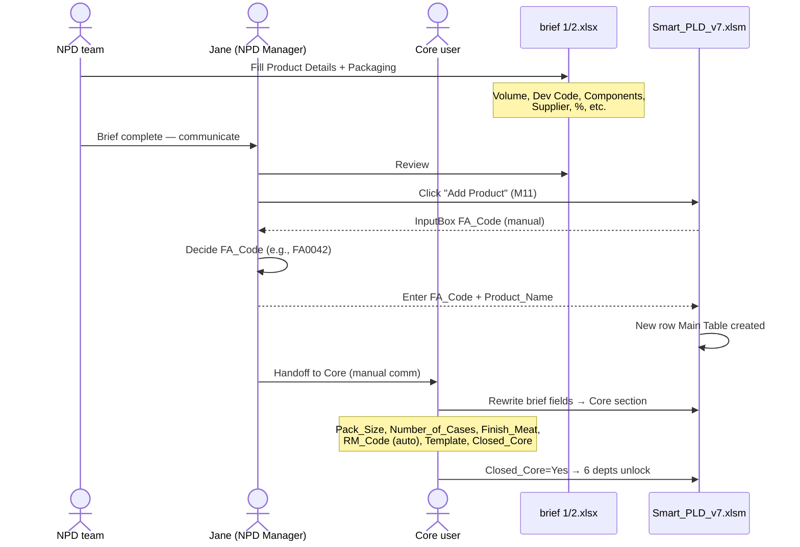
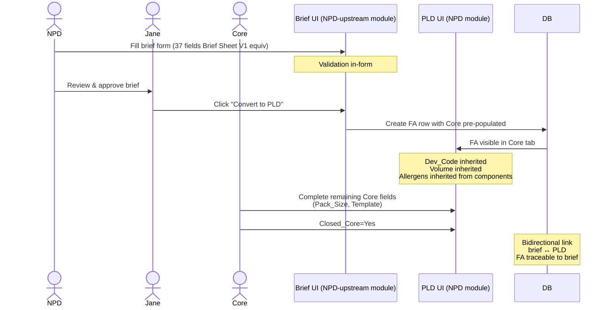

# BRIEF-FLOW — Brief Sheet V1 structure + mapping → PLD v7

**Reality sources:**
- `C:\Users\MaKrawczyk\OneDrive - IPL LIMITED\Desktop\PLD\brief 1.xlsx`
- `C:\Users\MaKrawczyk\OneDrive - IPL LIMITED\Desktop\PLD\brief 2.xlsx`

**Phase:** A Session 3 (capture, NEW reality source init)
**Related:** [`../pld-v7-excel/PROCESS-OVERVIEW.md`](../pld-v7-excel/PROCESS-OVERVIEW.md) §2 (upstream brief stage), [`../pld-v7-excel/EVOLVING.md`](../pld-v7-excel/EVOLVING.md) §2 (brief integration roadmap), [`../pld-v7-excel/MAIN-TABLE-SCHEMA.md`](../pld-v7-excel/MAIN-TABLE-SCHEMA.md) (target mapping Core section)

---

## Purpose

Dokument kodyfikuje **brief Excel format** używany przez NPD team w Apex jako **pre-PLD** etap NPD. Brief jest upstream reality source — dane w brief są ręcznie przepisywane do PLD v7 Core section przez Jane / Core user. Ten dokument jest **pierwszym reality-source file** w nowym katalogu `_meta/reality-sources/brief-excels/`.

Brief jest:
- **Upstream PLD v7** — kiedy NPD team wpisuje brief, PLD jeszcze nie istnieje dla tego produktu
- **Handoff bridge** — gdy brief complete, Jane klika handoff do Core → PLD row powstaje
- **Separate reality source** — żyje osobno, ma własny lifecycle, ma własną dokumentację (ten plik)

Monopilot target (Phase C post-B): brief = **NPD-upstream module** w Monopilot, z "Convert to PLD" button który auto-tworzy row w PLD z pre-populated Core section.

---

## §1 — Known templates (2)

**Session 3 user clarification:** Tylko 2 briefy istnieją dzisiaj. Wcześniej (Session 1) wspomniany "3-ci brief" był pomyłką użytkownika (miał na myśli brief 1 lub 2).

| File | Filename | Scope | Use case |
|---|---|---|---|
| Brief 1 | `brief 1.xlsx` | Single-component | 1 product = 1 wiersz |
| Brief 2 | `brief 2.xlsx` | Multi-component | 1 product = N wierszy (per component) + sumująca waga wiersz |

Oba pliki mają **identyczny schema** (Brief Sheet V1, 37 kolumn). Różnica: brief 2 fill pattern (multi-row per product), brief 1 fill pattern (one row per product).

**Przykłady (z scan Session 1):**

### Brief 1 sample content

| Product | Volume | Dev Code | Components | ... | Price | ... | % | Packs Per Case | ... |
|---|---|---|---|---|---|---|---|---|---|
| Pulled Chicken Shawarma - A58.. | 8000 | DEV26-037 | *(empty)* | ... | see recipe | ... | *(empty)* | 6 | ... |
| Pulled Ham Hock - A5818 | 10000 | DEV26-038 | *(empty)* | ... | see recipe | ... | *(empty)* | 6 | ... |

Single-product-per-row. Components column empty (brief 1 type nie rozbija na components).

### Brief 2 sample content

| Product | Volume | Dev Code | Components | Slice Count | Supplier | Code | ... | Weights | % |
|---|---|---|---|---|---|---|---|---|---|
| Italian Meat and Cheese Platter | *(empty)* | DEV26-023 (c1433) | Italian Prosciutto | 3 | Negroni | FRM7013 | ... | 40 | 32.7868... |
| *(empty)* | *(empty)* | *(empty)* | Italian Pepperoni | 10 | Negroni | FRM7152 | ... | 42 | 34.4262... |
| *(empty)* | *(empty)* | *(empty)* | Provolone Cheese | 6 | Futura | FRM7047 | ... | 40 | 32.7868... |
| *(empty)* | *(empty)* | *(empty)* | *(empty)* | *(empty)* | *(empty)* | *(empty)* | *(empty)* | **122** | *(empty)* |

Multi-row pattern: pierwszy row ma Product + Dev Code, kolejne rows mają same Components (inherit implied Product). Ostatni wiersz (weight only) = total weight sum.

Marker:
- Single vs multi-component pattern = `[APEX-CONFIG]` (inne firmy mogą nie mieć multi-comp variant albo mają inny format)
- 2 templates istnienie = `[APEX-CONFIG]`

---

## §2 — Brief Sheet V1 schema (37 kolumn, 2 sekcje)

### 2.1 Physical layout

Oba briefy share identyczny schema. Sheet name = `Brief Sheet V1`.

```
Row 1  →  Section headers (merged): "Product Details" + "Packaging"
Row 2  →  Column names (37 cols)
Row 3+ →  Data rows (per product albo per component w brief 2)
```

### 2.2 Section A: Product Details (C1–C13, 13 cols)

| C# | Column_Name | Typ | Znaczenie | v7 PLD target |
|---|---|---|---|---|
| 1 | Product | Text | Product Name (np. "Pulled Chicken Shawarma - A58...") | → Core.Product_Name (1:1) |
| 2 | Volume | Number | **Całkowity wolumen zamówienia** (np. 8000) | → **NEW** Core.Volume `[EVOLVING]` |
| 3 | Dev Code | Text | Development identifier (np. "DEV26-037") | → **NEW** Core.Dev_Code `[EVOLVING]` |
| 4 | Components | Text | Component name (brief 2 multi-row) | → context dla Core.Finish_Meat parse (?) |
| 5 | Slice Count | Number | Ile plastrów per component (brief 2) | → **NEW** per-component ProdDetail field `[EVOLVING]` |
| 6 | Supplier | Text | Supplier of this component | → Procurement.Supplier (z brief per-component) |
| 7 | Code | Text | Supplier code (np. RM1939, FRM7013) | → Core.RM_Code (or similar) |
| 8 | Price | Text ("see recipe" albo number) | Tentative price from supplier | → **NEW** Core.Price_Brief `[EVOLVING]` — distinguished from final Procurement.Price |
| 9 | Weights | Number | Waga pakunku | → **NEW** Core.Weights `[EVOLVING]` |
| 10 | % | Number | Procent content (np. meat %) | → Planning.Meat_Pct albo migrate do Core `[EVOLVING]` |
| 11 | Packs Per Case | Number | Ile pakietów produktu w jednym case (np. 6, 10) | → **NEW** Core.Packs_Per_Case `[EVOLVING]` — NIE 1:1 z Number_of_Cases |
| 12 | Comments | Text | Free-text notes | → **NEW** Core.Comments `[EVOLVING]` |
| 13 | Benchmark Identified | Text (Y/N albo product reference) | R&D benchmark competitor product | → **NEW** Core.Benchmark `[EVOLVING]` |

**7 z 13 Product Details cols nie ma odpowiednika w v7 dziś** (Volume, Dev Code, Slice Count, Price brief, Weights, Packs Per Case, Comments, Benchmark).

### 2.3 Section B: Packaging (C14–C37, 24 cols)

**Częściowo zeskanowane** (Session 1 scan pokazał 20 cols z 24, część truncated). Znane z scan:

| C# | Column_Name | v7 PLD target |
|---|---|---|
| 14 | Primary Packaging - list com.. (truncated) | → MRP related (Box context) |
| 15 | Secondary Packaging - i.e. b.. (truncated) | → MRP.MRP_Cartons / Pallet |
| 16 | Base Web / Tray / Bag Code | → MRP.Web (e.g., FTRA061, FFLM1501) |
| 17 | Base Web / Tray / Bag Price | → **NEW** MRP.Web_Price `[EVOLVING]` or Procurement context |
| 18 | Top Web Type (printed or pla..) | → **NEW** MRP metadata (printed / plain) `[EVOLVING]` |
| 19 | Sleeve / Carton Code | → MRP.MRP_Sleeves / MRP_Cartons |
| 20 | Sleeve / Carton Price | → **NEW** Procurement related `[EVOLVING]` |
| 21-37 | (truncated w scan, further Packaging fields) | TBD — rescan full coverage |

**Action Phase B:** Full rescan cols 21-37 z brief pełny schema. To jest lista kolumn która potrzebuje deeper walk-through z user.

---

## §3 — Multi-component pattern (brief 2 only)

### 3.1 Structure brief 2

Brief 2 pozwala na 1 product z N components. Physical pattern:

```
Row 1 (section headers)
Row 2 (col headers)
Row 3 — Product: "Italian Platter" | Volume: | Dev Code: DEV26-023 | Component: "Italian Prosciutto" | Slice Count: 3 | ... | Weights: 40 | %: 32.79
Row 4 — Product: ""               | ""     | ""                  | Component: "Italian Pepperoni"  | Slice Count: 10 | ... | Weights: 42 | %: 34.43
Row 5 — Product: ""               | ""     | ""                  | Component: "Provolone Cheese"   | Slice Count: 6 | ... | Weights: 40 | %: 32.79
Row 6 — Product: ""               | ""     | ""                  | Component: ""                   | ""             | ... | Weights: 122 | "" ← sum
```

**Reguły parsing:**

1. Rows z non-empty Product column = **start nowego produktu**. Dev Code + Volume tylko tutaj.
2. Rows z empty Product + non-empty Components = **continuation** poprzedniego produktu (per-component details).
3. Row z empty Product + empty Components + non-empty Weights = **sum row** (total weight validation).
4. Empty row (all empty) = product separator.

**Components row inheritance:** wszystkie components implicitnie należą do ostatniego non-empty Product row above.

### 3.2 Implicit hierarchy

```
Product: Italian Platter (DEV26-023)
├── Component: Italian Prosciutto (3 slices, 40g, 32.79%)
├── Component: Italian Pepperoni (10 slices, 42g, 34.43%)
└── Component: Provolone Cheese (6 slices, 40g, 32.79%)
    Total: 122g
```

Parse logic wymaga **stateful row walking** (track last seen Product). Current assumption — brief 2 uses continue-from-above pattern.

### 3.3 Mapping do PLD v7 Main Table + ProdDetail

**v7 PLD Main Table** ma single row per FA. Multi-component z brief 2 = multi-row w ProdDetail + aggregate w Main Table.

**Mapping:**
- Main Table.FA_Code = generowany w PLD (FA* format, manual input)
- Main Table.Product_Name = brief.Product (Italian Platter)
- Main Table.Dev_Code (future) = brief.Dev Code (DEV26-023)
- Main Table.Finish_Meat = comma-sep PR codes komponentów (e.g., `PR1000, PR1001, PR1002` gdzie PR codes są generowane lub pobierane z RM mapping)
- Main Table.Volume (future) = brief.Volume (ale brief 2 ma Volume empty? TBD)
- **Per-component w ProdDetail:** N wierszy, 1 per component:
  - FA_Code + PR_Code + Process_1..4 (do wypełnienia Core User) + Yield + Line + Dieset + ...

### 3.4 Multi-component uncertainty

Brief 2 sample has `Volume=empty` (tylko row 3 would have, but sample shows empty). Może to znaczy:
- (a) Volume dla Italian Platter TBD (user wypełni później)
- (b) Volume w multi-component brief **nie jest wypełniany** (inna business rule)
- (c) Pomyłka w sample

**Phase B action:** Clarify z user — czy brief 2 ma Volume per product (czyżnie w sample był omitted)?

### 3.5 Marker

Multi-component pattern in brief = `[APEX-CONFIG]`. Pattern "hierarchical multi-row" = `[APEX-CONFIG]` (inne firmy używają inny format, e.g., separate sheet per component, or flat structure z duplicate Product name per row).

---

## §4 — Mapping brief → PLD (full table)

Konsolidacja z PROCESS-OVERVIEW §2.3 + extension z Session 3 insights:

| Brief field (col) | v7 PLD today | Monopilot target | Marker |
|---|---|---|---|
| Product (C1) | Core.Product_Name | Same | `[UNIVERSAL]` (pattern) + `[APEX-CONFIG]` format |
| Volume (C2) | — (brak) | Core.Volume (NEW) | `[EVOLVING]` → `[APEX-CONFIG]` |
| Dev Code (C3) | — (brak) | Core.Dev_Code (NEW) | `[EVOLVING]` → `[APEX-CONFIG]` |
| Components (C4) | context dla Finish_Meat | Per-component ProdDetail seed | `[APEX-CONFIG]` |
| Slice Count (C5) | — (brak) | ProdDetail.Slice_Count (NEW) | `[EVOLVING]` |
| Supplier (C6) | Procurement.Supplier (per-FA, not per-component) | Per-component Procurement.Supplier | `[APEX-CONFIG]` |
| Code (C7) | Core.RM_Code (auto z Finish_Meat) | RM_Code seed | `[APEX-CONFIG]` |
| Price (C8) | — ("see recipe" placeholder) | Core.Price_Brief NEW (tentative); Procurement.Price = final | `[EVOLVING]` |
| Weights (C9) | — (brak) | Core.Weights (NEW) | `[EVOLVING]` |
| % (C10) | Planning.Meat_Pct | Same albo migrate to Core | `[EVOLVING]` (migration decision Phase B) |
| Packs Per Case (C11) | — (brak) | Core.Packs_Per_Case (NEW) | `[EVOLVING]` — distinct z Number_of_Cases (palletizing) |
| Comments (C12) | — (brak) | Core.Comments (NEW) | `[EVOLVING]` |
| Benchmark Identified (C13) | — (brak) | Core.Benchmark (NEW) | `[EVOLVING]` |
| Primary Packaging (C14) | MRP section context | MRP spec | `[APEX-CONFIG]` |
| Secondary Packaging (C15) | MRP.MRP_Cartons / Pallet | Same | `[APEX-CONFIG]` |
| Base Web/Tray/Bag Code (C16) | MRP.Web | Same | `[APEX-CONFIG]` |
| Base Web/Tray/Bag Price (C17) | — | NEW MRP.Web_Price albo Procurement | `[EVOLVING]` |
| Top Web Type (C18) | — | NEW MRP metadata | `[EVOLVING]` |
| Sleeve/Carton Code (C19) | MRP.MRP_Sleeves / MRP_Cartons | Same | `[APEX-CONFIG]` |
| Sleeve/Carton Price (C20) | — | NEW Procurement related | `[EVOLVING]` |
| C21–C37 (truncated) | TBD | TBD | TBD |

**Summary:**
- **6 z 13 Product Details** mapują się do existing v7 cols (Product, Components (via Finish_Meat), Supplier, Code (via RM_Code), %, Primary Packaging — pozostałe **7 to new Core/ProdDetail cols**)
- **20+ z 24 Packaging** częściowo mapują do MRP cols — pełne mapping wymaga rescan C21-C37
- **~7-10 brand new cols** Core potencjalnie dodane w Monopilot (Volume, Dev_Code, Price_Brief, Weights, Packs_Per_Case, Comments, Benchmark, plus maybe Weights / packaging metadata)

---

## §5 — Allergens w brief

**User Session 3:** "alergeny są przekazywane w brief".

**Nie zidentyfikowano explicit Allergens column** w scan brief 1/2 (pierwsze 20 cols scan pokazał Product Details + początek Packaging). Allergens mogą być:
- (a) W Comments field (free-text)
- (b) W Components field (rozszerzone jak "Italian Prosciutto (contains: meat, sulphites)")
- (c) W kolumnach C21-C37 jeszcze nieskanowanych
- (d) W osobnym sheet/file

**Action Phase B:** rescan brief pełny + confirm z user gdzie alergeny siedzą today. Docelowo w Monopilot: dedicated field (multi-select allergens z Reference.Allergens).

Marker: `[EVOLVING]` — format allergens w brief TBD.

---

## §6 — Brief handoff workflow

### 6.1 Current (Excel dual files)



**Pain points dzisiaj:**
- Manual rewrite brief → Core (7+ fields)
- FA_Code manual (nie auto-generated z brief Dev_Code)
- No traceability brief ↔ PLD (brak link)
- No allergen pre-population
- Brief + PLD są ortogonalne — edit brief nie propaguje do PLD

### 6.2 Monopilot target



### 6.3 Marker

Brief handoff workflow = `[EVOLVING]` (integracja brief ↔ PLD jest w roadmapie Phase B+C). Pattern NPD-upstream → downstream = `[UNIVERSAL]` (każda firma ma gate early-stage → formalized product spec).

---

## §7 — HANDOFF do Phase B / Phase C

**Moduły Monopilot do dodać/update:**

- `NN-npd-upstream/` albo `09-npd/` extension (Phase C) — brief module as NPD-upstream:
  - Brief form UI (37 fields Brief Sheet V1)
  - 2 templates (single-component / multi-component)
  - "Convert to PLD" button → API call
  - Traceability link brief_id ↔ fa_code
- `09-npd/` (Phase B adresat #1 for brief context) — add cross-reference "Core fields sourced from brief"
- `20-settings/` (Phase C) — brief field-to-PLD-col mapping config (admin can change mapping per org)

**Nowe Reference tables planned (Phase C):**
- `Brief_Templates` (current 2 templates — single / multi-component, admin can add more)
- `Brief_Field_Mapping` (brief field → PLD target col + transform rule)

---

## §8 — Open questions Phase B

1. **Full Packaging cols rescan** (C21-C37) — rescan pełny schema
2. **Multi-component Volume** — czy brief 2 ma Volume wypełnione per product (sample był empty — to typowe czy pomyłka?)
3. **Allergens lokalizacja w brief** — gdzie w brief są alergeny dzisiaj (Comments free-text, Components field, osobno)?
4. **Brief ↔ PLD traceability model** — bidirectional link czy brief "freeze" po Convert to PLD?
5. **Brief → Multi-FA split** — gdy brief 2 multi-component staje się multiple FAs (każda component osobne FA) zamiast 1 FA z ProdDetail? Business rule TBD
6. **Core cols adding order** — które z 7 new cols (Volume / Dev_Code / etc.) mają najwyższy priority dla Phase B
7. **Packs_Per_Case vs Number_of_Cases explicit definition** — pattern i semantyka potwierdzić z user
8. **Dev_Code format** — `DEV<year><month>-<seq>` (DEV26-037 = April 2026, 37-th dev)? Sekwencja per year czy per month? Auto-generated w Monopilot?

---

## §9 — Related

- [`../pld-v7-excel/PROCESS-OVERVIEW.md`](../pld-v7-excel/PROCESS-OVERVIEW.md) §2 (upstream brief stage) + §9 (brief-to-PLD mapping table)
- [`../pld-v7-excel/MAIN-TABLE-SCHEMA.md`](../pld-v7-excel/MAIN-TABLE-SCHEMA.md) — target schema Core section dla brief mapping
- [`../pld-v7-excel/EVOLVING.md`](../pld-v7-excel/EVOLVING.md) §2 (brief integration roadmap) + §3 (Core cols expansion from brief)
- [`../pld-v7-excel/DEPARTMENTS.md`](../pld-v7-excel/DEPARTMENTS.md) §3.1 Core — NPD team ownership + brief handoff
- [`_foundation/META-MODEL.md`](../../../_foundation/META-MODEL.md) §5 (brief = pre-D365, related do D365 mapping)
- Reality files:
  - `C:\Users\MaKrawczyk\OneDrive - IPL LIMITED\Desktop\PLD\brief 1.xlsx` — single-component template
  - `C:\Users\MaKrawczyk\OneDrive - IPL LIMITED\Desktop\PLD\brief 2.xlsx` — multi-component template
- Archived reference:
  - `_archive/new-doc-2026-02-16/09-npd/stories/08.11.handoff-wizard.md` — wizard dla handoff patterns
  - `_archive/new-doc-2026-02-16/09-npd/stories/08.12.handoff-formulation-to-bom.md` — NPD handoff semantyka
