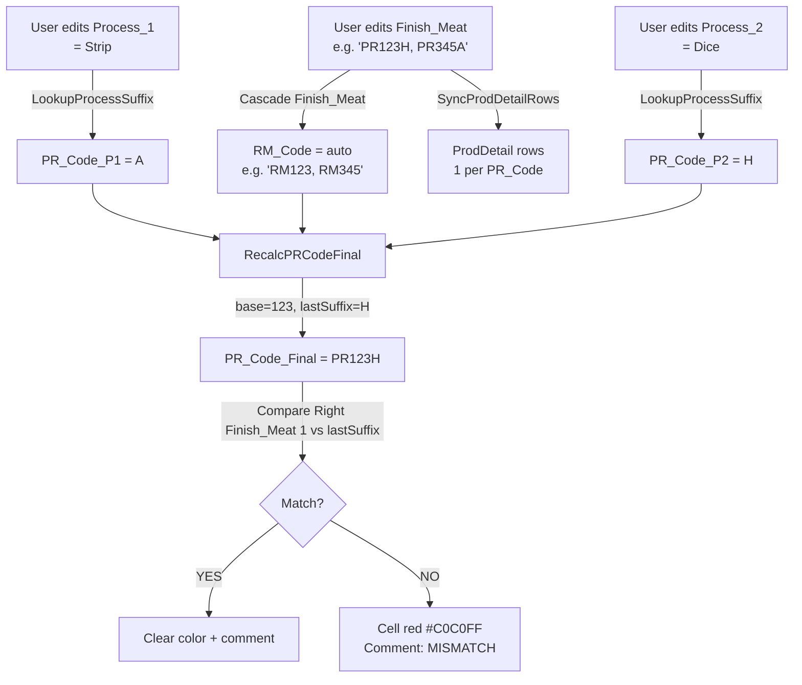
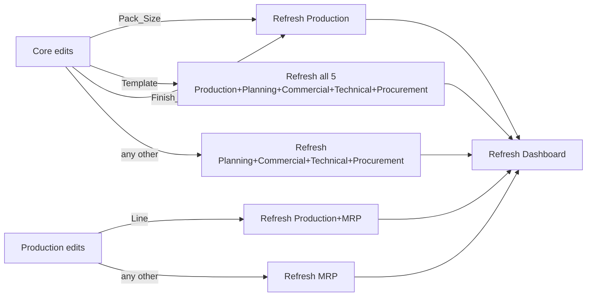

# CASCADING-RULES — Pack_Size → Line → Dieset + PR Codes + Template

**Reality source:** `C:\Users\MaKrawczyk\PLD\v7\vba\M04_Cascade.bas` + `Reference.Lines_By_PackSize` + `Reference.Dieset_By_Line_Pack` + `Reference.Processes` + `Reference.Templates`
**Phase:** A Session 2 (capture)
**Related:** [`MAIN-TABLE-SCHEMA.md`](./MAIN-TABLE-SCHEMA.md), [`WORKFLOW-RULES.md`](./WORKFLOW-RULES.md), [`_foundation/META-MODEL.md`](../../../_foundation/META-MODEL.md) §2, [`_foundation/decisions/ADR-029-rule-engine-dsl-and-workflow-as-data.md`](../../../_foundation/decisions/ADR-029-rule-engine-dsl-and-workflow-as-data.md)

---

## Purpose

Dokument kodyfikuje wszystkie reguły kaskadowe (cascading) w Smart PLD v7 — co zmienia co, w jakiej kolejności, z jakich tabel lookup. Cascade to **Level "b" rule engine** z META-MODEL §2.1 (cascading dropdowns = obszar 1), częściowo zrealizowany w v7 VBA (hardcoded w M04, ale lookup tables są danymi w Reference).

**Scope:**
- Pack_Size → Line → Dieset (core cascade)
- Process_N → PR_Code_P<N> → PR_Code_Final (PR generation)
- Finish_Meat → RM_Code (auto-build) + SyncProdDetailRows (multi-component)
- Template → ApplyTemplate (fills Process_1..4 w ProdDetail)

Wszystkie cascade trigger'y odpalane są z `M04_Cascade.CascadeFromChange(colName, mtRow)`, wywołane przez `M03_WriteBack.DeptTab_WriteBack` gdy user edituje cell w proxy dept tab.

---

## §1 — Pack_Size → Line → Dieset (core cascade)

Najważniejsza kaskada v7. Decyduje o material consumption (przez Dieset) i o capacity (przez Line).

### 1.1 Pack_Size zmieniony `[APEX-CONFIG]`

**Trigger:** User edytuje Pack_Size w Core proxy tab (dropdown z `Reference.PackSizes`).
**Source:** `Reference.PackSizes` (5 values: `20x30cm / 25x35cm / 18x24cm / 30x40cm / 15x20cm`)

**Efekt (M04 lines 12-18):**
```
CLEAR Main Table.Line    = ""
CLEAR Main Table.Dieset  = ""
```

**Powód:** Zmiana Pack_Size unieważnia wcześniejszy Line (linia może nie wspierać nowego Pack_Size) i automatycznie Dieset (zależy od Line + Pack_Size).

**Downstream refresh (M03 `RefreshAffectedDepts`):** → refresh Production tab (cell locks się przeliczają — teraz Line jest unlocked, Dieset gray blocked dopóki Line nie wybrane).

### 1.2 Line zmieniony `[APEX-CONFIG]`

**Trigger:** User edytuje Line w Production proxy tab.
**Source:** `Reference.Lines_By_PackSize` z **filtrowanym dropdown** — user widzi tylko linie wspierające aktualny Pack_Size.

**Filtered dropdown logic (M02 `BuildFilteredLineList`):**
```
Odczytaj Reference.Lines_By_PackSize:
  Line    | Supported_Pack_Sizes
  Line5   | 20x30, 25x35
  Line6   | 20x30, 18x24
  Line17  | 20x30, 30x40
  Line3   | 15x20, 18x24
  Line9   | 25x35, 30x40

Per row: jeśli Pack_Size (bez "cm") w Supported_Pack_Sizes → dodaj Line do dropdown list.
```

Przykład: Pack_Size = `20x30cm` → dropdown = `Line5, Line6, Line17` (3 opcje). Pack_Size = `15x20cm` → dropdown = `Line3` (1 opcja).

**Efekt (M04 lines 20-37 + LookupDieset):**
```
IF Line != "" AND Pack_Size != "":
   Main Table.Dieset = LookupDieset(Line, Pack_Size)
```

`LookupDieset` szuka w `Reference.Dieset_By_Line_Pack` wiersza pasującego do (Line, Pack_Size) i zwraca Dieset code.

### 1.3 Reference.Dieset_By_Line_Pack `[APEX-CONFIG]`

10 kombinacji (Line × Pack_Size → unique Dieset code):

| Line | Pack_Size | Dieset |
|---|---|---|
| Line5 | 20x30 | `DIE_20x30_L5` |
| Line5 | 25x35 | `DIE_25x35_L5` |
| Line6 | 20x30 | `DIE_20x30_L6` |
| Line6 | 18x24 | `DIE_18x24_L6` |
| Line17 | 20x30 | `DIE_20x30_L17` |
| Line17 | 30x40 | `DIE_30x40_L17` |
| Line3 | 15x20 | `DIE_15x20_L3` |
| Line3 | 18x24 | `DIE_18x24_L3` |
| Line9 | 25x35 | `DIE_25x35_L9` |
| Line9 | 30x40 | `DIE_30x40_L9` |

**Format Dieset code:** `DIE_<PackSize_without_cm>_L<LineNumber>`.

**Downstream refresh (M03 `RefreshAffectedDepts`):** Line change → refresh Production + refresh MRP (MRP cells były blocked przez `Core + Production done`, teraz potencjalnie unblocked).

### 1.4 Diagram kaskady Pack_Size → Line → Dieset


### 1.5 Marker

- Cascade mechanizm (rule engine Level "b" obszar 1) = `[UNIVERSAL]`
- Konkretne reguły (PackSizes values, Lines, Dieset codes) = `[APEX-CONFIG]`
- Format `DIE_X_LN` dla Dieset codes = `[APEX-CONFIG]`

### 1.6 Evolving: material consumption per Dieset

Dziś Dieset code jest **samym identyfikatorem** (nie ma dodatkowej metadata jak m/each folii per dieset). **Do dodania:**

| Dieset | Pack_Size | Line | Folia_m | Folia_each | Notes |
|---|---|---|---|---|---|
| DIE_20x30_L5 | 20x30 | Line5 | ? | ? | TBD |

Opcje implementacji:
- (a) Extra cols w `Reference.Dieset_By_Line_Pack` (C4-5+ na Folia_m, Folia_each)
- (b) Nowa tabela `Reference.Dieset_Material_Consumption` w sheet Reference

Decyzja Phase B lub Session 3. Marker `[EVOLVING]`.

---

## §2 — Process_N → PR_Code_P<N> → PR_Code_Final (PR generation)

### 2.1 Process_N zmieniony `[APEX-CONFIG]`

**Trigger:** User edytuje Process_1, Process_2, Process_3 albo Process_4 (dropdown z `Reference.Processes`).
**Source:** `Reference.Processes` (8 values z suffixami):

| Process_Name | Suffix |
|---|---|
| Strip | A |
| Coat | B |
| Honey | C |
| Smoke | E |
| Slice | F |
| Tumble | G |
| Dice | H |
| Roast | R |

**Efekt (M04 lines 39-54):**
```
PR_Code_P<N> = LookupProcessSuffix(Process_<N>)
             = Reference.Processes[Process_Name=X].Suffix
```

Przykład: Process_1="Strip" → PR_Code_P1="A". Process_1="" → PR_Code_P1="".

Po ustawieniu PR_Code_P<N> → wywołanie `RecalcPRCodeFinal(mtRow)`.

### 2.2 PR_Code_Final generation (RecalcPRCodeFinal)

**Logika (M04 lines 130-193):**
```
1. Odczytaj RM_Code (np. "RM123")
2. Base = RM_Code bez "RM" prefix (np. "123")
3. Iteruj PR_Code_P4 → P1 (od końca). Znajdź pierwszy non-empty PR_Code_P<N> = lastSuffix
4. IF base != "" AND lastSuffix != "":
     PR_Code_Final = "PR" + base + lastSuffix
   ELSE:
     PR_Code_Final = ""
5. Porównaj z Finish_Meat: jeśli UCase(Right(Finish_Meat, 1)) != UCase(lastSuffix):
     Cell color = red-ish (#C0C0FF)
     Add comment: "MISMATCH: Finish_Meat ends 'X' but last process is 'Y'"
   ELSE:
     Clear color + comment
```

### 2.3 Przykłady PR_Code_Final

| FA (Finish_Meat) | RM_Code (auto) | Process_1 | Process_2 | Process_3 | Process_4 | Suffix<br/>użyty | PR_Code_Final | MISMATCH? |
|---|---|---|---|---|---|---|---|---|
| PR123H | RM123 | Strip | — | — | — | A (Strip) | **PR123A** | ❌ FAIL — Finish_Meat ends 'H' (Dice), but last process is 'A' (Strip) |
| PR123H | RM123 | Strip | Dice | — | — | H (Dice, last non-empty) | **PR123H** | ✅ |
| PR123R | RM123 | Strip | Roast | Slice | — | F (Slice, last non-empty) | **PR123F** | ❌ FAIL (R vs F) |
| PR123R | RM123 | Strip | Coat | Smoke | Roast | R (Roast, last non-empty) | **PR123R** | ✅ |

**Ważne:** `lastSuffix` = **ostatni wypełniony (non-empty) PR_Code_P<N>** (od P4 wstecz do P1), NIE "Process_4 suffix". Więc jeśli tylko Process_1 i Process_2 wypełnione, lastSuffix = suffix z Process_2.

### 2.4 Validation V06 (M10_Validation)

Równolegle do color/comment warning, Validation Status V06 zwraca:
- `PASS` — gdy suffix match
- `FAIL` — MISMATCH (komunikat w Details)
- `PENDING` — brak Process wypełnionego jeszcze

### 2.5 Diagram PR generation



### 2.6 Marker

- PR code format `PR<digits><letter>` = `[APEX-CONFIG]` (Apex naming convention)
- Generation rule (concat RM_digits + last_process_suffix) = `[APEX-CONFIG]`
- Finish_Meat vs last process suffix validation = `[APEX-CONFIG]` (business rule Apex)
- Cascade mechanism ogólnie = `[UNIVERSAL]` (generation codes from lookups, pattern universal)

**Dla Monopilot ADR-028/029:**
- PR code format jako data (edytowalne per org) nie kod
- Validation rule (suffix match) jako data w rule engine DSL (ADR-029 Level "b" obszar 2 "conditional required" albo nowy obszar)

---

## §3 — Finish_Meat → RM_Code (auto-build) + SyncProdDetailRows

### 3.1 RM_Code auto-build `[APEX-CONFIG]`

**Trigger:** User edytuje Finish_Meat w Core proxy tab (free text, comma-separated).
**Logika (M04 lines 57-94):**

```
Finish_Meat = "PR123H, PR345A, PR678"  (comma-separated)
Loop per fragment:
  1. Trim whitespace
  2. IF Left(UCase(fragment), 2) == "PR":
       extract digits following "PR" (until non-digit or end)
       RM_fragment = "RM" + digits
       Append to result (comma-sep)
Result: "RM123, RM345, RM678"

Write to Main Table.RM_Code (auto, locked cell)
```

Przykłady:
- `PR123H` → `RM123`
- `PR345A` → `RM345`
- `PR678` (brak suffixu) → `RM678`
- `XY99` (nie zaczyna od PR) → skipped (ignored)
- `""` (empty Finish_Meat) → RM_Code = ""

### 3.2 SyncProdDetailRows (multi-component ProdDetail sync)

Równolegle do RM_Code build, VBA `SyncProdDetailRows(FA_Code, Finish_Meat)` aktualizuje hidden `ProdDetail` tab:

```
Plan:
1. Parse Finish_Meat comma-sep → list of PR_Codes needed
2. For each existing ProdDetail row dla FA_Code:
     IF row.PR_Code nie w needed list → DELETE row
     IF row.PR_Code w needed list → mark as "kept"
3. Add new ProdDetail rows dla każdego needed PR_Code który nie jest "kept"
```

**Efekt:** ProdDetail ma zawsze dokładnie 1 wiersz per PR_Code z Finish_Meat. Stare wiersze usunięte, nowe dodane.

**Schemat ProdDetail (20 cols):**
```
FA_Code | PR_Code | Process_1..4 | Yield_P1..4 | Line | Dieset | Yield_Line | Staffing | Rate | PR_Code_P1..4 | PR_Code_Final
```

Każdy wiersz ProdDetail = full Production spec **per component**. Może mieć inne procesy niż inny component (np. 1 component "Strip", drugi "Smoke" + "Slice").

### 3.3 Status ProdDetail `[EVOLVING]`

Confirmed w Session 2 scan: ProdDetail jest **ACTIVE VBA feature**:
- `SyncProdDetailRows` tworzy rows
- `M02.RenderProductionView` pokazuje multi-row view w Production proxy tab
- `ApplyTemplate` wypełnia Process_1..4 **w ProdDetail** (nie Main Table)
- `M01.IsProdDetailComplete` blokuje MRP (`Core + Production done` blocking rule)

Ale dziś ProdDetail jest fizycznie pusty (1r x 20c) bo Main Table ma 100 empty rows (workbook w setup/testing mode — brak prawdziwych FA z wypełnionym Finish_Meat).

**Open question (Phase B):** Main Table Process_1..4 (single set per FA) vs ProdDetail per-component. Main Table = source of truth (per user), ale jak to się łączy z multi-component ProdDetail? Marker `[EVOLVING]`.

### 3.4 Marker

- RM_Code auto-build z Finish_Meat = `[APEX-CONFIG]` (konkretna transformacja)
- Pattern "derived column from user input" = `[UNIVERSAL]` (schema-driven Level "b" Auto type)
- ProdDetail multi-component sync = `[EVOLVING]` dopóki semantyka nie jest domknięta

---

## §4 — Template → ApplyTemplate (fills ProdDetail)

### 4.1 Template change trigger `[APEX-CONFIG]`

**Trigger:** User edytuje Template w Core proxy tab (dropdown z `Reference.Templates`).
**Source:** `Reference.Templates` (4 templates):

| Template_Name | Process_1 | Process_2 | Process_3 | Process_4 | Notes |
|---|---|---|---|---|---|
| Standard Meat FA | Strip | — | — | — | 1 process — Strip only |
| Simple Pack FA | — | — | — | — | No processes |
| Roasting Chicken | Strip | Roast | Slice | — | 3 processes |
| Full Process FA | Strip | Coat | Smoke | Slice | 4 processes |

### 4.2 ApplyTemplate logika (M04 lines 219-286)

```
1. Odczytaj Main Table.Template value → tplName
2. Szukaj wiersza w Reference.Templates gdzie Template_Name == tplName
3. Pobierz FA_Code z Main Table
4. Znajdź wszystkie ProdDetail rows dla tego FA_Code (GetPDRowsForFA)
5. Dla każdego wiersza ProdDetail:
     For each process pp (1..4):
       wsPD.Process_<pp> = template.Process_<pp>  (z Reference.Templates row)
       IF template.Process_<pp> == "": wsPD.Yield_P<pp> = ""  (clear yield too)
     CascadeProdDetail(pdRow)  → recalcs PR_Code_P<N> + PR_Code_Final w ProdDetail
```

**KRYTYCZNE:** Template **NIE** wypełnia Process_1..4 w Main Table. Tylko w ProdDetail (per-component rows). To jest implementacja `[EVOLVING]` multi-component workflow — każdy component dostaje copy template processes, a użytkownik może je zmienić per component.

### 4.3 Ograniczenie template

Template wypełnia **processes only** (Process_1..4). Nie wypełnia:
- Yield_P1..4 (user musi podać)
- Line / Dieset (zależy od Pack_Size + wyboru user)
- Yield_Line / Staffing / Rate (user input)

Czyli Template to "process schema seed", nie pełny fill.

### 4.4 Downstream refresh (M03 RefreshAffectedDepts)

Template change → refresh **wszystkich** 5 proxy tabs (Production, Planning, Commercial, Technical, Procurement). Dlaczego tak szerokie? Prawdopodobnie żeby view były spójne po zmianie.

### 4.5 Marker

- Template jako dropdown z Reference = `[APEX-CONFIG]`
- 4 konkretne templates Apex = `[APEX-CONFIG]`
- Pattern "template auto-fill processes" = `[UNIVERSAL]` (Monopilot ADR-029 "workflow as data" §8 — templates = stany początkowe workflow)

---

## §5 — Pełna mapa cascade triggers

| Trigger column | Source dept | Clears | Auto-fills | ProdDetail ops | Refresh downstream tabs |
|---|---|---|---|---|---|
| `Pack_Size` | Core | Line="", Dieset="" | — | — | Production |
| `Line` | Production (Main Table — NOT ProdDetail in single-component case) | — | Dieset (lookup) | — | Production + MRP |
| `Process_N` (N=1..4) | Production | — | PR_Code_P<N> (suffix lookup) + RecalcPRCodeFinal | — | MRP |
| `Finish_Meat` | Core | — | RM_Code (auto-build) | SyncProdDetailRows (create/update/delete rows) | Production (i Planning/Commercial/Technical/Procurement bo Core col) |
| `Template` | Core | — | — | ApplyTemplate (fills Process_1..4 + clears corresponding Yields in ProdDetail rows) | All 5 (Production, Planning, Commercial, Technical, Procurement) |
| (Core col inny niż Pack_Size/Finish_Meat/Template) | Core | — | — | — | Planning, Commercial, Technical, Procurement |
| (Production col inny niż Process_N/Line) | Production | — | — | — | MRP |

### 5.1 Cascade triggers również auto-reset `Built` flag

Każda edycja **jakiejkolwiek** cell w dept proxy tab (`M03_WriteBack`) → `Built = FALSE`:

```
IF Main Table.Built == TRUE:
   Main Table.Built = FALSE
```

**Powód:** Jeśli user edytuje cokolwiek po kliknięciu D365 Builder, output D365 tabs są stale. `Built=FALSE` wymusza re-run Builder. Zobacz WORKFLOW-RULES.md §2 dla detail.

---

## §6 — Dropdown sources summary

Wszystkie cascade mechanismy lookupują z 5 tabel w Reference:

| Tabela Reference | Cols | Użycie w cascade |
|---|---|---|
| `PackSizes` | 1 (Pack_Size) | Dropdown dla Core.Pack_Size. 5 values |
| `Lines_By_PackSize` | 2 (Line, Supported_Pack_Sizes) | Dropdown dla Production.Line — **filtrowany** per Pack_Size (M02.BuildFilteredLineList). 5 linii |
| `Dieset_By_Line_Pack` | 3 (Line, Pack_Size, Dieset) | Lookup dla Production.Dieset (auto, M04.LookupDieset). 10 kombinacji |
| `Processes` | 2 (Process_Name, Suffix) | Dropdown dla Production.Process_1..4 + lookup suffix (M04.LookupProcessSuffix). 8 processes |
| `Templates` | 6 (Template_Name, Process_1..4, Notes) | Dropdown dla Core.Template + ApplyTemplate source. 4 templates |
| `CloseConfirm` | 1 (Option) | Dropdown dla wszystkich `Closed_<Dept>` cols. 1 value ("Yes") |

**Marker:** Struktura `Reference.<TableName>` pattern = `[UNIVERSAL]` (ADR-028 config tables). Wszystkie konkretne values = `[APEX-CONFIG]` (per org seed).

---

## §7 — Cascade refresh map (M03 RefreshAffectedDepts)

Po każdym `DeptTab_WriteBack` (user edit + cascade), system refresh'uje affected dept tabs:

| Changed col | Source dept | Refresh targets |
|---|---|---|
| `Pack_Size` | Core | Production |
| `Line` | Production | Production + MRP |
| `Template` | Core | Production + Planning + Commercial + Technical + Procurement (wszystkie 5 non-Core) |
| Other Core col | Core | Planning + Commercial + Technical + Procurement (dla `Finish_Meat` also Production) |
| Other Production col | Production | MRP |
| All other cases | any | (no explicit refresh besides self) |

**Plus zawsze:** `RefreshDashboard` na końcu każdego writeback.

### 7.1 Diagram refresh map



---

## §8 — Projekcja na Monopilot (rule engine DSL)

Wszystkie cascade rules z tego dokumentu są implementacjami **rule engine Level "b"** z META-MODEL §2.1. Monopilot ADR-029 postuluje 4 obszary:

| Obszar Level "b" | Realizacja w v7 | Mapping do Monopilot |
|---|---|---|
| 1. Cascading dropdowns | Pack_Size → Line (filtered dropdown), Line → Dieset (auto-lookup), Process_N → PR_Code_P<N> (suffix lookup) | Schema-driven cascade rules w config (ADR-029 obszar 1) |
| 2. Conditional required | Blocking rules (`Core done`, `Pack_Size filled`, itp. w Reference.DeptColumns) | Schema-driven required rules (ADR-029 obszar 2) |
| 3. Gate entry criteria | `IsDeptDone` + `IsAllRequiredFilled` + `IsProdDetailComplete` = gate do D365 Builder | Schema-driven workflow gates (ADR-029 obszar 3) |
| 4. Workflow as data | Template → ApplyTemplate (init workflow stages), `Closed_<Dept>` transitions | Workflow definitions as data (ADR-029 obszar 4) |

**Wniosek:** v7 już implementuje wszystkie 4 obszary rule engine Level "b", ale hardcoded w VBA (nie DSL). W Monopilot implementacji te same reguły staną się **danymi w konfiguracji org-a** (JSON/DB, interpretowane przez universal engine).

---

## §9 — Open questions do Phase B

1. **DSL składnia konkretnie** — jak Monopilot DSL zapisze "PackSize → Line → Dieset cascade" (JSON? textual? Mermaid-like?). ADR-029 open question, szczegóły w implementation phase.
2. **PR_Code_Final format per org** — czy inne orgi też potrzebują `PR<digits><letter>`? Albo różne formaty (np. bez prefix)? W Monopilot format jako konfiguracja.
3. **Finish_Meat parse logic** — comma-sep z `PR<digits><letter>` syntax = specyficzne Apex. Inne orgi mogą mieć inny format components. Marker `[APEX-CONFIG]` wysoka pewność.
4. **Template vs multi-component w ProdDetail** — dziś Template wypełnia ProdDetail per component. Czy user może per component zmienić przepis (inny Process_1 w row 1 niż row 2)? Pewnie tak.
5. **Material consumption per Dieset** — nowe cols w Reference.Dieset_By_Line_Pack czy nowa tabela.

---

## §10 — Related

- [`MAIN-TABLE-SCHEMA.md`](./MAIN-TABLE-SCHEMA.md) — schema context (blocking rules ref)
- [`WORKFLOW-RULES.md`](./WORKFLOW-RULES.md) — status colors, autofilter, hard-lock (dla cell locks)
- [`_foundation/META-MODEL.md`](../../../_foundation/META-MODEL.md) §2 (Level "b" rule engine — 4 obszary)
- [`_foundation/decisions/ADR-029-rule-engine-dsl-and-workflow-as-data.md`](../../../_foundation/decisions/ADR-029-rule-engine-dsl-and-workflow-as-data.md)
- Reality files:
  - `C:\Users\MaKrawczyk\PLD\v7\vba\M04_Cascade.bas` — kanoniczna implementacja wszystkich cascade
  - `C:\Users\MaKrawczyk\PLD\v7\vba\M02_RefreshDeptView.bas` — BuildFilteredLineList (filtered dropdown)
  - `C:\Users\MaKrawczyk\PLD\v7\vba\M03_WriteBack.bas` — RefreshAffectedDepts (downstream tab refresh map) + Built auto-reset
  - `C:\Users\MaKrawczyk\PLD\v7\vba\M01_Config.bas` — SyncProdDetailRows, IsProdDetailComplete
  - `Reference` sheet: 5 lookup tables (PackSizes, Lines_By_PackSize, Dieset_By_Line_Pack, Processes, Templates)
