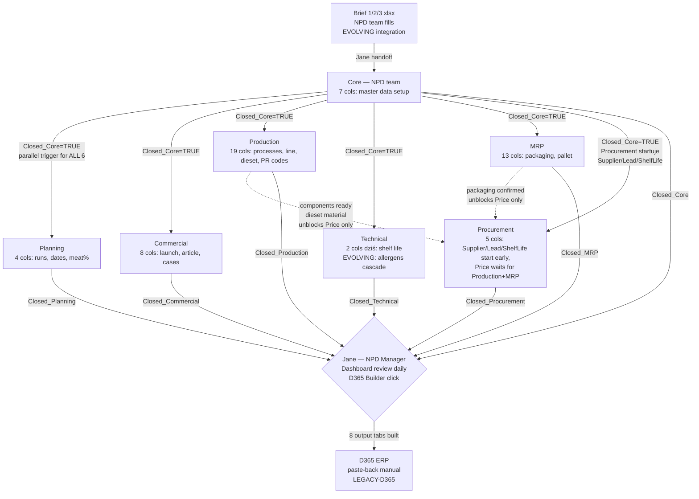

# DEPARTMENTS — 7 działów Forza w PLD v7

**Reality source:** `C:\Users\MaKrawczyk\PLD\v7\Smart_PLD_v7.xlsm` → 7 dept proxy tabs + `Reference.DeptColumns` config table
**Phase:** A Session 1 (capture)
**Related:** [`PROCESS-OVERVIEW.md`](./PROCESS-OVERVIEW.md), [`_foundation/META-MODEL.md`](../../../_foundation/META-MODEL.md), [`_foundation/decisions/ADR-030-configurable-department-taxonomy.md`](../../../_foundation/decisions/ADR-030-configurable-department-taxonomy.md)

---

## Purpose

Dokument kodyfikuje **7 działów Forza Foods** zaangażowanych w proces PLD v7, ich odpowiedzialności w kontekście wypełniania Main Table, handoffs pomiędzy nimi oraz rolę orchestratora (Jane, NPD Manager). Razem z [`PROCESS-OVERVIEW.md`](./PROCESS-OVERVIEW.md) stanowi pierwszy parę reality capture Phase A.

**Marker konwencja:** Nazwa taxonomy działów jest `[FORZA-CONFIG]` (inny klient ma inne działy — zobacz ADR-030). Poszczególne role są mieszanką `[FORZA-CONFIG]` (lokalne) i `[UNIVERSAL]` (np. Procurement = zamawianie, Technical = shelf life + allergens są uniwersalne dla food-mfg MES).

---

## §1 — Overview `[FORZA-CONFIG]`

Siedem działów Forza (lista 1:1 z sheet names w `Smart_PLD_v7.xlsm`; konfiguracja docelowo schema-driven per ADR-030):

1. **Core** (NPD team / Development)
2. **Planning**
3. **Commercial**
4. **Production**
5. **Technical** (Quality w starej terminologii meta-model)
6. **MRP**
7. **Procurement**

### 1.1 Reality check vs pre-Phase-0 docs

| Dział w v7 (reality) | Nazwa w pre-Phase-0 docs (meta-model skill przykład) | Mapping |
|---|---|---|
| Core | Development | Core = NPD team = "Development" w meta-model |
| Technical | Quality | Technical = QA owner (Shelf_Life dziś, Allergens `[EVOLVING]`) |
| Planning | Planning | 1:1 |
| Commercial | Commercial | 1:1 |
| Production | Production | 1:1 |
| MRP | MRP | 1:1 (narazie nie dzielimy — poprzednie "split na 2" jest nieaktualne) |
| Procurement | Procurement | 1:1 |

### 1.2 Reprezentacja w workbooku

Każdy dział ma dedykowany **thin proxy tab** zbudowany dynamicznie przez `M02_RefreshDeptView` (VBA) z Main Table. Edycja w proxy tab → `Worksheet_Change` (CLS_SheetEvents) → zapis do Main Table (`M03_WriteBack`) → cascade (`M04_Cascade`) → refresh.

Konfiguracja "który dział widzi które kolumny" znajduje się w **Reference.DeptColumns** tabeli (rzędy 3–60 — zobacz Session 2 REFERENCE-TABLES dla pełnego zrzutu). Mapa kolumn-na-dział jest **danymi**, nie kodem — to już jest elementem level "a" (schema-driven, ADR-028).

### 1.3 Autofilter Done

Każdy dept tab ma autofilter na `Done_[Dept]` (TRUE → wiersz znika). Każdy dział widzi tylko swoje "aktywne" FA. Done semantyka — po Session 2 (WORKFLOW-RULES).

---

## §2 — Jane: orchestrator (NPD Manager)

**Osoba:** Jane
**Rola:** NPD Manager, właściciel całego procesu PLD
**Zakres obowiązków:**
- Odbiera brief od NPD team, decyduje czy handoff do Core (PLD workflow start)
- Nadzoruje wypełnianie Main Table — monitoruje Dashboard **codziennie**, reaguje na RED/YELLOW launch alerts
- Komunikuje z działami (pinguje kto zalega, odblokowuje blockery między działami)
- **Wyłączny operator D365 Builder** — gdy wszystkie 7 `Closed_*` flags = TRUE, naciska przycisk Build D365 (M08_Builder), paste'uje 8 output tabs do D365 manualnie
- Zamyka cykl PLD (flag `Built` w Main Table = TRUE)

Jane jednocześnie **jest częścią NPD team** (3 osoby — Core section), więc operuje i w Core stage i jako orchestrator. Nie ma formalnego wyodrębnienia "NPD Manager" dept w workbooku — Jane jest "power user" z dodatkowymi uprawnieniami (D365 Builder button, Dashboard review).

**Marker:** Rola NPD Manager jako osobny byt architektoniczny = `[UNIVERSAL]` (każda firma food-mfg ma kogoś kto orchestrator'uje NPD). Konkretna osoba = `[FORZA-CONFIG]`.

---

## §3 — Per-department detail

Kolumny w każdej sekcji pochodzą z `Reference.DeptColumns` (row ranges podano w `PROCESS-OVERVIEW.md` §1 context). Wszystkie kolumny dept-owned = `[FORZA-CONFIG]`, chyba że oznaczono inaczej.

---

### 3.1 Core (NPD / Development)

**Ownership:** 3 osoby NPD team (w tym Jane). Core NIE jest osobnym "działem z własnym biurkiem" — to wspólna sekcja master data wypełniana przez ludzi z NPD na początku procesu.

**Rola biznesowa:** Master data setup. Core definiuje "co to za produkt, jakie komponenty, który template". Jest pierwszym etapem PLD po handoff z briefu.

**Kolumny (7, z `Reference.DeptColumns` R3–R9):**

| Kolumna | Typ / rola | Source |
|---|---|---|
| `Product_Name` | Nazwa produktu | Z briefu (Product) |
| `Pack_Size` | Rozmiar opakowania (20x30, 25x35, 18x24, 30x40, 15x20) | Decyzja Core; wpływa na Line + Dieset (cascade) |
| `Number_of_Cases` | **Ilość cases na jednej palecie** (palletizing constraint) | NIE pochodzi z briefu 1:1 — Core ustala na podstawie packaging + pallet plan |
| `Finish_Meat` | Komponenty mięsne (comma-separated, np. `PR123H, PR345A`) | Z briefu (Components) |
| `RM_Code` | Raw material code | Z briefu (Code, np. RM1939 / FRM7013) |
| `Template` | Template FA (z `Reference.Templates`: Standard Meat FA / Simple Pack FA / Roasting Chicken / Full Process FA) | Core decyzja |
| `Closed_Core` | Flag: Core fill complete | Core |

**Dodatkowe kolumny planowane (EVOLVING, wszystkie z zasadą "nie przenosimy wszystkiego naraz — budujemy pod łatwe rozszerzanie"):**
- `Volume` — z briefu: **całkowity wolumen zamówienia** (nie liczba cases). Różne od `Number_of_Cases` (palletizing) i `Cases_Per_Week_W1-3` (commercial volumes)
- `Dev_Code` — z briefu (np. `DEV26-037`), identyfikator development, poprzednik `Article_Number` (który dochodzi w Commercial po launch confirmation)
- `Price (from brief)` — tentative, cena wstępna z briefu (nie finalna — Procurement przekazuje finalną)
- `%` (meat content) — dziś w Planning jako `Meat_Pct`, rozważana migracja do Core (z briefu)
- `Packs_Per_Case` — z briefu: **ile pakietów produktu w jednym case**. Różne od `Number_of_Cases`. Brak mapowania w v7 dziś
- `Weights` — z briefu: waga pakunku
- `Benchmark_Identified` — z briefu: referencyjny produkt konkurencyjny (R&D context)
- `Comments` — z briefu: free-text notes

Pozostałe brief packaging fields (Primary/Secondary Packaging text, Top Web Type, Sleeve/Carton Price) — do zmapowania na MRP sekcję w kolejnych iteracjach albo do dedicated pól.

**Trigger handoff:** `Closed_Core=TRUE` → 5 działów (Planning, Commercial, Production, Technical, MRP) może zacząć pracę równolegle. Procurement **nie zaczyna** — czeka na Production + MRP components (§3.7).

**Marker scope:**
- Kolumny Main Table per dział = `[FORZA-CONFIG]` (inny org może mieć inny zestaw)
- Istnienie "Core / NPD setup stage" = `[UNIVERSAL]` (każda firma food-mfg potrzebuje master data setup na początku NPD)
- Konkretne kolumny (Pack_Size values, RM code format, Template list) = `[FORZA-CONFIG]`

---

### 3.2 Planning

**Ownership:** Planning dział Forza (osoby do doprecyzowania w kolejnej iteracji)

**Rola biznesowa:** Planuje produkcję — ile meat content, ile runów na tydzień, jak się rozkłada na date codes. Zapewnia mostek między commercial volumes a production scheduling.

**Kolumny (4, z `Reference.DeptColumns` R10–R13):**

| Kolumna | Typ / rola |
|---|---|
| `Meat_Pct` | Procent meat content (% w briefie) |
| `Runs_Per_Week` | Liczba runów produkcyjnych tygodniowo |
| `Date_Code_Per_Week` | Date code planning |
| `Closed_Planning` | Flag completion |

**Wejście:** `Closed_Core=TRUE` + bazowy brief (meat_pct z briefu)
**Wyjście:** Parametry planningowe do produkcji
**Zależności:** brak zewnętrznych — Planning może pracować natychmiast po Core closed

**Evolving:** `Meat_Pct` jest kandydat do migracji do Core (bo pochodzi bezpośrednio z briefu). Decyzja w Phase B.

---

### 3.3 Commercial

**Ownership:** Commercial dział Forza

**Rola biznesowa:** Interface z klientem — launch date, article numbers (katalog klienta), barcodes, commercial volumes (cases per week podział na W1/W2/W3 = pierwsze 3 tygodnie launch).

**Kolumny (8, z `Reference.DeptColumns` R14–R21):**

| Kolumna | Typ / rola |
|---|---|
| `Launch_Date` | Data startu produkcji/launch (napędza Dashboard alerts) |
| `Department_Number` | Numer działu klienta (retailer specific) |
| `Article_Number` | Item number w systemie klienta |
| `Bar_Codes` | Barcodes GS1/EAN |
| `Cases_Per_Week_W1` | Cases for launch week 1 |
| `Cases_Per_Week_W2` | Cases for launch week 2 |
| `Cases_Per_Week_W3` | Cases for launch week 3 |
| `Closed_Commercial` | Flag completion |

**Wejście:** `Closed_Core=TRUE` + kontrakt z klientem (poza PLD)
**Wyjście:** Commercial parameters napędzające Dashboard alerts (`Launch_Date`) i capacity planning
**Zależności:** brak — Commercial ma własne dane od klienta

**Evolving:** Commercial rozważany jako potencjalny upstream briefu (brief może pochodzić bezpośrednio od Commercial / klienta) — do doprecyzowania w Phase B.

---

### 3.4 Production

**Ownership:** Production dział Forza

**Rola biznesowa:** **Najszerszy dział w PLD** (19 kolumn). Definiuje procesy produkcyjne (1–4 stages), yields na każdym etapie, linię produkcyjną, dieset, staffing, rate produkcji, PR codes (process codes z suffixami).

**Kolumny (19, z `Reference.DeptColumns` R22–R40):**

| Grupa | Kolumny |
|---|---|
| Process stages | `Process_1`, `Process_2`, `Process_3`, `Process_4` (z `Reference.Processes`: Strip/Coat/Honey/Smoke/Slice/Tumble/Dice/Roast) |
| Yields | `Yield_P1`, `Yield_P2`, `Yield_P3`, `Yield_P4` |
| Line config | `Line` (cascade z Pack_Size via `Reference.Lines_By_PackSize`), `Dieset` (cascade z Line+Pack via `Reference.Dieset_By_Line_Pack`), `Yield_Line` |
| Capacity | `Staffing`, `Rate` |
| PR Codes | `PR_Code_P1`..`PR_Code_P4` (per process stage). `PR_Code_Final` = **nowy finalny kod w formacie `PR<digits><process_letter>`** (np. `PR123R` gdzie R = suffix Roast z `Reference.Processes`). NIE jest concat P1-P4 — to osobny kod produktu końcowego. Literka końcowa odpowiada suffixowi finalnego kroku produkcyjnego (A=Strip, B=Coat, C=Honey, E=Smoke, F=Slice, G=Tumble, H=Dice, R=Roast) |
| Closure | `Closed_Production` |

**Wejście:** `Closed_Core=TRUE` — w szczególności `Pack_Size` (cascade trigger) i `Finish_Meat` (components) + `Template` (auto-fill procesów)
**Wyjście:** Kompletna specyfikacja procesu produkcyjnego → napędza material consumption (dieset → folia m / each) dla MRP + Procurement
**Zależności:** `Pack_Size` MUSI być wypełnione w Core zanim Production może wybrać `Line`/`Dieset` (cascade constraint — Level "b" rule engine per META-MODEL §2.1 punkt 1).

**Evolving:**
- `Reference.Processes` — ruchomy zestaw, będzie rozszerzany `[EVOLVING]`. Musi być edytowalny w Settings (schema-driven configuration, zgodnie z ADR-028).
- Dieset → material consumption (m / each folii per dieset) — koncept wymaga dodania pól do dieset metadata lub osobnej tabeli `Reference.Dieset_Material_Consumption`. Nie istnieje dziś w v7 `[EVOLVING]`.

---

### 3.5 Technical (Quality)

**Ownership:** Technical dział Forza — funkcjonalnie odpowiada za Quality / QA / Food safety

**Rola biznesowa:** Zapewnia jakość żywnościową i zgodność regulatoryjną. Dziś wypełnia tylko `Shelf_Life`, ale rola szersza — dojdzie **Allergens** (w trakcie implementacji `[EVOLVING]`).

**Kolumny (dziś 2, z `Reference.DeptColumns` R41–R42):**

| Kolumna | Typ / rola |
|---|---|
| `Shelf_Life` | Termin przydatności (dni) |
| `Closed_Technical` | Flag completion |

**Kolumny planowane `[EVOLVING]`:**

| Kolumna | Opis |
|---|---|
| `Allergens` | Lista alergenów produktu (dziedziczona z RM_Code + manual override) |

### 3.5.1 Allergens mechanika (do implementacji) `[EVOLVING]`

**Reguła cascade:** Jeżeli `RM_Code` (np. ING101) zawiera alergen (np. orzechy w RM-poziomie), **alergen musi być dziedziczony do FA** automatycznie. Technical w PLD:
1. Widzi auto-wypełnione alergeny z RM → FA cascade
2. Sprawdza czy są kompletne
3. Jeśli brakuje alergenu (np. dodatkowy ingredient nie skodyfikowany w RM) — wybiera z listy (nowa tabela `Reference.Allergens` — **dziś nie istnieje**, do dodania)

**Nowa reference tabela planowana:** `Reference.Allergens` (lista alergenów z kodami). Forza prawdopodobnie używa 14 EU allergens (standard EU Regulation 1169/2011) — do potwierdzenia.

**Marker:**
- Allergens jako obszar wymagań = `[UNIVERSAL]` (każda firma food-mfg EU musi je obsługiwać)
- Konkretna lista `Reference.Allergens` = `[FORZA-CONFIG]` (seed = 14 EU, inne regiony mogą mieć inne)
- Cascade RM→FA logic = `[UNIVERSAL]` (fundamentalny wzorzec traceability allergens)

Dopóki cascade + Reference.Allergens nie są zaimplementowane, Technical jest "płytki" (2 kolumny). Po implementacji stanie się pełnym QA dept.

---

### 3.6 MRP

**Ownership:** MRP dział Forza (Material Requirements Planning)

**Rola biznesowa:** Packaging specs (boxes, labels, films, sleeves, cartons, tara weight, pallet plans). Potwierdza materiały opakowaniowe / jeśli brakuje — dodaje.

**NARAZIE NIE SPLIT** — wcześniejsze założenie "MRP → 2 działy" zostało wycofane. MRP pozostaje 1 dział.

**Kolumny (13, z `Reference.DeptColumns` R43–R55):**

| Kolumna | Typ / rola |
|---|---|
| `Box` | Primary box code |
| `Top_Label` | Top label code(s) (comma-separated dozwolone) |
| `Bottom_Label` | Bottom label code(s) |
| `Web` | Web (film/tray/bag) code — np. FTRA061, FFLM1501 (z briefu) |
| `MRP_Box` | MRP confirmation / quantity box |
| `MRP_Labels` | MRP confirmation labels |
| `MRP_Films` | MRP confirmation films |
| `MRP_Sleeves` | MRP confirmation sleeves |
| `MRP_Cartons` | MRP confirmation cartons |
| `Tara_Weight` | Packaging tare weight |
| `Pallet_Stacking_Plan` | Plan paletyzacji |
| `Box_Dimensions` | Wymiary boxa |
| `Closed_MRP` | Flag completion |

**Wejście:**
- `Closed_Core=TRUE` (Pack_Size, Number_of_Cases — wyznacza packaging requirements)
- Brief (Primary/Secondary Packaging specs — dziś manual rewrite do MRP cols)

**Wyjście:** Pełna specyfikacja packaging → Procurement zamówi materiały

**Zależności:** częściowo overlapping z Production (`Web` vs Production's dieset material) — do uporządkowania w Phase B.

**Evolving:**
- Mapping brief packaging (Primary/Secondary Packaging, Base Web/Tray/Bag Code/Price, Top Web Type, Sleeve/Carton Code/Price) → MRP kolumny — dziś manual, docelowo auto z briefu
- Material consumption cascade (dieset → folia m/each) przenoszony z Production do MRP reconciliation

---

### 3.7 Procurement

**Ownership:** Procurement dział Forza

**Rola biznesowa:** Realizacja zakupu — supplier management, cena (po potwierdzeniu components), lead time, shelf life z perspektywy dostawcy.

**Kolumny (5, z `Reference.DeptColumns` R56–R60):**

| Kolumna | Typ / rola |
|---|---|
| `Price` | Cena (dopiero gdy components znane) |
| `Lead_Time` | Czas dostawy per supplier |
| `Supplier` | Dostawca |
| `Proc_Shelf_Life` | Shelf life per supplier (może różnić się od Technical Shelf_Life) |
| `Closed_Procurement` | Flag completion |

**Wejście:**
- `Closed_Core=TRUE` (RM_Code, Finish_Meat) — wystarczy do startu `Supplier`, `Lead_Time`, `Proc_Shelf_Life`
- **Production + MRP components wypełnione** — wymagane tylko do `Price` (cena finalna)

**Wyjście:** Finalne parametry kosztowe produktu → input dla commercial pricing + D365 item setup

**Zależność punktowa (nie-blocking):** Procurement **rozpoczyna pracę równolegle** z pozostałymi działami od razu po `Closed_Core=TRUE`. Może wybierać wszystko (Supplier, Lead_Time, Proc_Shelf_Life) na podstawie `RM_Code`. **Tylko kolumna `Price`** czeka na Production + MRP components. Bez components = "see recipe" w briefie, nie finalna cena. Reszta Procurement aktywności niezależna.

**Relacja z MRP:** MRP = "co zamówić / ile" (planowanie materiałów, potwierdzenie dostępności, dodawanie brakujących). Procurement = "od kogo / za ile / kiedy" (supplier + price + lead time). Nie pokrywają się. Narazie wystarczające (nie potrzeba split).

**Evolving:** Price cascade z dieset material consumption — gdy Production + MRP mają pełny BOM, Procurement dostaje liczenie ceny automatyczne. Dziś manual.

---

## §4 — Handoff map (Mermaid)

**Kluczowe reguły (reality):**

1. **Core jest bramkarzem startu** — 6 działów (Planning, Commercial, Production, Technical, MRP, Procurement) czekają na `Closed_Core=TRUE`.
2. **6 działów pracuje równolegle** po Core — między nimi nie ma sztywnych dependency (Planning nie czeka na Commercial itd.). W praktyce mogą się pingować o dane (np. Commercial Launch_Date używany przez innych), ale nie jest to zakodowane w workflow.
3. **Procurement ma jedną punktową zależność** — kolumna `Price` czeka aż Production + MRP wypełnią components. Pozostałe Procurement kolumny (Supplier, Lead_Time, Proc_Shelf_Life) startują od razu po Closed_Core. Dependency NIE blokuje całego Procurement stage — tylko ostateczne Price.
4. **Jane zamyka cykl** — dopiero wszystkie 7 `Closed_*` flags TRUE pozwala na D365 Builder click.

---

## §5 — Role mapping (reality → meta-model docs)

Niezgodności z pre-Phase-0 docs do zafiksowania:

| Pre-Phase-0 docs wymieniały | Reality v7 | Wyjaśnienie |
|---|---|---|
| "Development" dział | `Core` (dział w proxy tab) | `Development` = NPD team = `Core`. NPD team (3 osoby w tym Jane) wypełnia Core columns. Nie ma osobnego "Development" dept w workbooku. |
| "Quality" dział | `Technical` (dział w proxy tab) | `Quality` = `Technical`. Dziś tylko Shelf_Life, dojdą Allergens. Po rozbudowie Technical = pełny QA. |
| MRP split na 2 | `MRP` (1 dział) | Split nieaktualny — MRP pozostaje 1 dział do odwołania. Usunąć z EVOLVING w dokumentacji. |

**Dla propagacji (Session B):**
- W modułach Monopilot używać nazwy `Core` (lub `NPD`) zamiast `Development`.
- W modułach Monopilot używać nazwy `Technical` (lub `Quality` — decyzja architektoniczna w Phase B) — do dyskusji.
- Nie wprowadzać MRP-split dopóki user nie potwierdzi.

---

## §6 — Non-PLD activities (poza zakresem tego docu)

Działy Forza mają szersze obowiązki biznesowe niż tylko wypełnianie PLD:

- **Commercial** — relacje z klientami, negocjacje, sprzedaż (poza PLD)
- **Production** — realne uruchomienie produkcji na linii (post-PLD)
- **Technical/Quality** — kontrola jakości ciągła, HACCP, audyty (poza PLD)
- **MRP** — dzienny re-planning materiałów niezależny od PLD
- **Procurement** — bieżące zakupy operacyjne, negotiations długoterminowe
- **Planning** — master production schedule, capacity planning poza PLD
- **Core / NPD** — research, trend analysis, benchmarking (upstream briefu)

PLD v7 pokrywa wyłącznie **launch-readiness snapshot** dla nowego produktu. Nie jest systemem zarządzania bieżącą operacją działów. Monopilot docelowo rozszerza scope — zastępuje także D365 (§8 PROCESS-OVERVIEW) — więc te non-PLD activities stopniowo też wejdą w zakres.

---

## §7 — Marker recap

Zestawienie markerów dla treści tego dokumentu (review before propagation w Session B):

| Obszar | Marker | Uzasadnienie |
|---|---|---|
| Istnienie "Core / NPD setup stage" | `[UNIVERSAL]` | Każda firma food-mfg ma setup stage |
| Istnienie "Technical / QA" stage | `[UNIVERSAL]` | Regulatoryjne (shelf life, allergens) — każda firma |
| Istnienie "Procurement" stage | `[UNIVERSAL]` | Każda firma kupuje materiały |
| Konkretna taxonomy 7 działów Forza | `[FORZA-CONFIG]` | Inna firma ma inne działy (ADR-030) |
| Konkretne nazwy działów (Core/Planning/Commercial/...) | `[FORZA-CONFIG]` | Naming per org |
| Liczba działów (7) | `[FORZA-CONFIG]` | Per org |
| Konkretne kolumny dept-owned | `[FORZA-CONFIG]` | Per org (ADR-028) |
| Cascade Pack_Size → Line → Dieset | `[FORZA-CONFIG]` (mechanizm cascading rule engine = `[UNIVERSAL]` META-MODEL §2) | Mechanizm uniwersalny, konkretne reguły Forza |
| Allergens cascade RM → FA | `[UNIVERSAL]` (pattern) + `[FORZA-CONFIG]` (Reference.Allergens list) | Food-mfg universal; lista seed EU14 FORZA-CONFIG |
| Procurement `Price` waits for Production+MRP components | `[FORZA-CONFIG]` | Inny org może mieć inną kolejność |
| Dashboard read access dla wszystkich dept managers | `[UNIVERSAL]` (pattern) + `[FORZA-CONFIG]` (per-role scoping) | Wszyscy managerowie widzą postęp (wzorzec uniwersalny), konkretne role mapping FORZA-CONFIG |
| Dashboard review daily by NPD Manager | `[FORZA-CONFIG]` | Cadence per org |
| D365 Builder execute tylko NPD Manager (Jane) | `[FORZA-CONFIG]` (scope) + `[LEGACY-D365]` (feature istnienie) | Per-role access (scope) zniknie gdy D365 zniknie |
| 24-week minimum brief-to-launch | `[FORZA-CONFIG]` | Per org biznes constraint |
| D365 Builder click | `[LEGACY-D365]` | Zniknie po zastąpieniu D365 |
| Jane (personalia) | `[FORZA-CONFIG]` | Konkretna osoba |
| NPD Manager role (abstrakcja) | `[UNIVERSAL]` | Każda firma ma orchestrator NPD |

Review markerów **odbywa się podczas Session B propagation** — nie w Session 1 (capture). Ta tabela to input-draft dla Session B brainstormu.

---

## §8 — HANDOFF (pending propagation do Session B)

**Moduły Monopilot do update (Session B / Phase B):**

- `09-npd/` — adresat #1. Taxonomy "7 działów" w stories NPD (gdzie PLD workflow jest opisany) musi zmienić się:
  - "Development" → "Core / NPD"
  - "Quality" → "Technical"
  - Usunąć referencje do MRP-split
- `02-products/` — Core columns mapping → products schema
- `12-production/` (Phase C) — Production scope
- `14-procurement/` (Phase C) — Procurement scope + dependency na Production+MRP

**Nowe reference do dodania w Monopilot (Phase C):**
- Schemat "departments as config-table" (ADR-030) — seed 7 działów Forza + ADMIN UI do add/rename/reorder
- Schemat "allergens as config-table" (ADR-030 extension) — seed EU14 + cascade RM→FA rule

---

## §9 — Related

- [`PROCESS-OVERVIEW.md`](./PROCESS-OVERVIEW.md) — siostra Session 1, end-to-end flow + upstream brief context
- [`_foundation/META-MODEL.md`](../../../_foundation/META-MODEL.md) §6 (markery), §2 (rule engine dla cascades)
- [`_foundation/decisions/ADR-030-configurable-department-taxonomy.md`](../../../_foundation/decisions/ADR-030-configurable-department-taxonomy.md) — departamenty jako config-table
- [`_foundation/decisions/ADR-028-schema-driven-column-definition.md`](../../../_foundation/decisions/ADR-028-schema-driven-column-definition.md) — kolumny dept-owned jako config
- [`_foundation/patterns/REALITY-SYNC.md`](../../../_foundation/patterns/REALITY-SYNC.md) — two-session discipline
- [`_foundation/skills/documentation-patterns/SKILL.md`](../../../_foundation/skills/documentation-patterns/SKILL.md) — markery reference
- HANDOFF Phase A bootstrap: [`_meta/handoffs/2026-04-17-phase-0-close-and-phase-a-bootstrap.md`](../../handoffs/2026-04-17-phase-0-close-and-phase-a-bootstrap.md)
- Reality files:
  - `C:\Users\MaKrawczyk\PLD\v7\Smart_PLD_v7.xlsm` (workbook)
  - `C:\Users\MaKrawczyk\PLD\v7\vba\M02_RefreshDeptView.bas` (proxy tab engine)
  - `C:\Users\MaKrawczyk\PLD\v7\vba\M03_WriteBack.bas` (dept → Main Table writeback)
  - `C:\Users\MaKrawczyk\PLD\v7\vba\M04_Cascade.bas` (Pack_Size → Line → Dieset)
  - `C:\Users\MaKrawczyk\PLD\v7\vba\M08_Builder.bas` (D365 Builder)
  - `C:\Users\MaKrawczyk\PLD\v7\vba\M11_AddProduct.bas` (AddProduct macro, Core create)
- User memory: `project_smart_pld` (do aktualizacji po Session 1)
