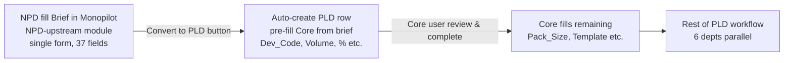

# EVOLVING — Obszary w trakcie zmian + zasada "easy extension"

**Reality source:** Wszystkie poprzednie reality docs (Session 1 + 2 + 3) + user Session 3 interview
**Phase:** A Session 3 (capture)
**Related:** [`PROCESS-OVERVIEW.md`](./PROCESS-OVERVIEW.md), [`DEPARTMENTS.md`](./DEPARTMENTS.md), [`MAIN-TABLE-SCHEMA.md`](./MAIN-TABLE-SCHEMA.md), [`CASCADING-RULES.md`](./CASCADING-RULES.md), [`WORKFLOW-RULES.md`](./WORKFLOW-RULES.md), [`REFERENCE-TABLES.md`](./REFERENCE-TABLES.md), [`D365-INTEGRATION.md`](./D365-INTEGRATION.md), [`_foundation/META-MODEL.md`](../../../_foundation/META-MODEL.md) §6.3, [`_foundation/decisions/ADR-028-schema-driven-column-definition.md`](../../../_foundation/decisions/ADR-028-schema-driven-column-definition.md)

---

## Purpose

Dokument kodyfikuje **obszary Smart PLD v7 które jeszcze się zmieniają** (marker `[EVOLVING]` w META-MODEL §6.3) oraz **zasadę architektoniczną "łatwa rozbudowa"** — Monopilot NPD module musi być zbudowany tak, żeby **dodawanie kolumn / reguł / tabel** nie wymagało developer round-tripa.

**User intent Session 3 zamknięcia Phase A:**

> "plan NPD jak najbardziej zbliżony do tego co teraz mamy. ale zakładamy łatwą rozbudowę."

To jest najważniejszy architectural constraint Phase B: **NPD module Monopilot = 1:1 reality v7 + extension points** (nie speculation, nie refactor, tylko faithful reproduction + clean add-column pathway).

Tym sposobem ten dokument jest **mostem Phase A → Phase B**: reality captured (Sessions 1-3) + extension roadmap (ten dokument) = wszystko co potrzebne dla NPD propagation.

---

## §1 — Zasada "easy extension" (architektoniczny kontrakt)

### 1.1 Dlaczego to kluczowe

v7 jest **częściowo** schema-driven. Tabele w `Reference` są danymi. Silnik renderu M02 czyta metadata z `Reference.DeptColumns`. To już realizuje ADR-028 pattern.

**Problem:** Dodanie nowej kolumny wymaga:
1. Edit Reference.DeptColumns (data) ✅ easy
2. Insert column w Main Table (data layout change) ⚠️ wymaga M01 constants awareness
3. Update cascade VBA gdy cascade-involved (M04) ❌ developer
4. Update validation VBA gdy validation-involved (M10) ❌ developer
5. Update Dashboard counters (M07) — rzadziej ale możliwe ❌ developer
6. Update PowerShell setup scripts (v7/03_setup_main_table.ps1 etc.) ❌ developer

Steps 3-6 łamią **ADR-028 intent** ("edytowalne bez dewelopera"). To jest **gap which Monopilot must close**.

### 1.2 Monopilot "easy extension" target

Admin UI w Monopilot (Settings module) pozwala:

| Action | Admin clicks | System generates |
|---|---|---|
| Add column | Settings → Columns → "+" → Name/Type/Dept/Required/Blocking | DB migration + UI render update + rule engine registration + Dashboard refresh |
| Add cascade rule | Settings → Rules → "+" → When X → Do Y | Rule engine DSL entry + validation |
| Add config table | Settings → Reference Tables → "+" → Schema | DB table created + UI CRUD enabled |
| Add validation rule | Settings → Validations → "+" → Rule (DSL) | Rule engine DSL entry + execution in validate() |
| Rename dept | Settings → Departments → dept → rename | Propagation across all references (cols, stories, permissions) |

**Zero VBA/TypeScript/SQL manual editing dla user**. Developer-ready repo structure, ale admin-facing customization.

**Value proposition Monopilot vs Excel v7:** te 6 steps (§1.1) → 1 click.

### 1.3 Architektura wspierająca easy extension

Z META-MODEL §1 + ADR-028:
- **Level "a" domain** (kolumny, reguły walidacji per col, reference tables, role permissions, module toggles, workflow stages, notification templates) = schema-driven, admin CRUD
- **Level "b" rule engine** (cascading, conditional required, gate criteria, workflow-as-data) = DSL interpretowany z danych, admin definiuje przez UI Settings

Wszystkie obszary `[EVOLVING]` z tego dokumentu **muszą** skończyć jako Level "a" lub "b" w Monopilot (nie kod-driven extensions).

### 1.4 Marker

Zasada "easy extension" jako kontrakt architektoniczny = `[UNIVERSAL]` (każda firma food-mfg benefituje). Konkretny realizacji w Monopilot UI = do Phase C design.

---

## §2 — Obszar 1: Brief ↔ PLD integration `[EVOLVING]`

### 2.1 Current state

Brief (brief 1.xlsx, brief 2.xlsx — 2 templates, patrz [`brief-excels/BRIEF-FLOW.md`](../brief-excels/BRIEF-FLOW.md)) jest **pre-PLD upstream** NPD stage. Dziś:

- NPD team wypełnia brief ręcznie
- Jane **ręcznie przepisuje** dane z brief → Core w PLD v7 (Main Table)
- Brief i PLD są **dwa różne Excel files** — nie ma sync

### 2.2 Brief fields bez odpowiednika w v7 today

Z brief Sheet V1 (37 cols) — co NIE mapuje się dziś:

| Brief field | Planowana docelowa lokalizacja |
|---|---|
| `Volume` (całkowity wolumen zamówienia) | Nowa kolumna w Core (Monopilot) |
| `Dev Code` (DEV26-037) | Nowa kolumna w Core (Monopilot) — identyfikator pre-launch |
| `Slice Count` (brief 2 multi-component) | Per-component field (ProdDetail albo new brief-linked structure) |
| `Weights` (brief 2 per-component + sum) | Core albo per-component |
| `%` (brief meat content) | Core (lub już w Planning.Meat_Pct — decyzja Phase B) |
| `Packs Per Case` | Nowa kolumna w Core (różny od Number_of_Cases) |
| `Comments` | Core free-text notes |
| `Benchmark Identified` | Core R&D reference |
| `Primary/Secondary Packaging` (text) | MRP context cols |
| `Base Web/Tray/Bag Price` | Procurement related (future price analysis) |
| `Top Web Type` (printed/plain) | MRP metadata |
| `Sleeve/Carton Price` | Procurement |

### 2.3 Docelowy workflow Monopilot



**Nie ma ręcznego przepisywania.** Brief fields → mapping → auto-create PLD row z Core section pre-populated.

### 2.4 Extension plan

**Short-term (v7 Excel continuation):**
- Option A: Dodać `brief-link.xlsx` pośredniczący z macros mapping brief → PLD v7. Hacky.
- Option B: Nie rozszerzamy v7 Excel. Accept manual rewrite.

**Long-term (Monopilot):**
- Brief module (NPD-upstream) z tymi samymi 37 polami jako UI form
- "Convert to PLD" button → API call create_pld_from_brief(brief_id) → auto-fill Core
- Brief mapping config jako data w Settings (admin może zmienić które brief field → który Core col)

### 2.5 Open questions

1. Czy brief jako **2 templates** (brief 1 single-component, brief 2 multi-component) pozostaje rozróżnieniem w Monopilot, czy 1 uniwersalny form z toggle "Single/Multi"?
2. Packaging fields brief → MRP mapping (24 cols brief Packaging section → ~10 MRP cols) — wiele-do-wielu, semantyka complex
3. Dev_Code vs FA_Code — czy DEV26-037 staje się FA<sequence> po launch, czy oba coexist?

### 2.6 Marker

Brief integration = `[EVOLVING]` do Phase B decision. Pattern "convert upstream document to downstream" = `[UNIVERSAL]` (standard NPD pipelines). Brief Sheet V1 format = `[FORZA-CONFIG]`.

---

## §3 — Obszar 2: Core columns expansion `[EVOLVING]`

### 3.1 Current Core (v7)

7 kolumn dept-owned + 1 FA_Code system (8 total):
- FA_Code, Product_Name, Pack_Size, Number_of_Cases, Finish_Meat, RM_Code (auto), Template, Closed_Core

### 3.2 Planowane additions (from brief)

W kolejności user-preference:

| Planowana kolumna | Source | Data_Type | Blocking | Required | Marker |
|---|---|---|---|---|---|
| `Volume` | Brief.Volume | Number | `""` | Yes | `[EVOLVING]` → `[FORZA-CONFIG]` |
| `Dev_Code` | Brief.Dev_Code (e.g. DEV26-037) | Text | `""` | No | `[FORZA-CONFIG]` (per-org naming) |
| `Price_Brief` | Brief.Price (może być "see recipe") | Text (hybrid) | `""` | No | `[FORZA-CONFIG]` |
| `Packs_Per_Case` | Brief.Packs Per Case | Number | `""` | Yes | `[FORZA-CONFIG]` |
| `Weights` | Brief.Weights (sum for multi-comp) | Number | `""` | Yes | `[FORZA-CONFIG]` |
| `Benchmark` | Brief.Benchmark Identified | Text | `""` | No | `[FORZA-CONFIG]` |
| `Comments` | Brief.Comments | Text (multi-line) | `""` | No | `[FORZA-CONFIG]` |

**Konsekwencja Main Table:** 7 → **14 Core cols**. Main Table grows from 69 → 76 cols. DeptColumns Reference table rośnie od 58 → 65 rows.

### 3.3 Extension mechanism (current v7)

Dodanie tych 7 kolumn w v7 wymaga:

1. **Edit `Reference.DeptColumns`** — insert 7 rows po R9 (Closed_Core), each with Column_Name/Dept=Core/Data_Type/Required_For_Done
2. **Insert columns w Main Table** — insert 7 columns po C8 (Closed_Core). Shift all downstream C9-C69 → C16-C76. **UWAGA:** to łamie system cols positions (C60-69 → C67-76)
3. **Update M01 constants** (MT_HEADER_ROW=3 stays, ale specific column references via GetMTColumnIndex pozostają OK, bo lookup by name)
4. **Update M04 cascade** — jeśli nowa kolumna cascades (np. `Dev_Code` → auto-gen FA_Code?), add case w CascadeFromChange
5. **Update M06 BOMAutoGen** — jeśli nowa kolumna materiał-type (like Box), add to componentMap
6. **Update M10 Validation** — jeśli nowa kolumna required validation, add rule V0X
7. **Update M07 Dashboard.BuildMissingDataText** — automatyczne, bo iteruje Reference.DeptColumns
8. **Update dept proxy tabs** — automatyczne (M02 re-renders from DeptColumns)

Steps **4, 5, 6 wymagają VBA dewelopera**. Kroki 1, 2, 7, 8 są data-level.

**Po 7 kolumn Core ~3-4 kroki wymagają deva.** To jest bottleneck — user musi czekać na release cycle.

### 3.4 Monopilot target (easy extension realized)

Admin UI "Add Core column":
1. Name: `Dev_Code`
2. Type: Text
3. Dept: Core
4. Required: No
5. Dropdown source: (none)
6. Blocking: (none)
7. **Save** → DB migration runs → UI auto-updates → rule engine registers → done

No VBA edit. No PowerShell script update. No deployment cycle. Same session.

### 3.5 Priority recommendation dla Phase B

User answer Session 3: **"nie wszystkie kolumny przenosimy teraz dlatego planujemy budowe tak zeby bylo latwo potem dodawac kolumny"**.

Konsekwencja: **nie implementujemy wszystkich 7 Core additions w Monopilot NPD Phase B day 1**. Zamiast tego:
- **Implementujemy aktualny state v7** (7 Core cols + 58 dept cols + 10 SYSTEM)
- **Infrastructure-ready dla extension** (schema-driven Settings UI, rule engine DSL, migration pipeline)
- **Extensions adding pilot** — po Phase B: dodać `Volume`, `Dev_Code` jako demo że easy extension works → walidacja value propositions

### 3.6 Marker

Core expansion items = `[EVOLVING]` (w trakcie rozwoju, pending decision). Mechanism ADR-028 level "a" = `[UNIVERSAL]`.

---

## §4 — Obszar 3: Technical — Allergens cascade `[EVOLVING]` → docelowo `[UNIVERSAL]`

### 4.1 Current state

Technical dept ma **tylko 2 kolumny**: Shelf_Life + Closed_Technical. Dla Quality / food safety role to stanowczo za mało.

### 4.2 Planned: Allergens cascade RM → FA

User Session 3:

> "alergeny sa przekazywane w brief. N alergenów na jednego RM a jezeli FA posiada wiecej RM albo ing ktore tez na alergeny to musi je wszystkie dziedziczyc. auto-fill dobry pomysl. 14 eu + custom."

**Aggregation logic** (z archived `_archive/new-doc-2026-02-16/09-npd/stories/08.5.allergen-aggregation-display.md`):
- Każdy ingredient/RM ma set alergenów (multi-value)
- FA aggregates alergeny wszystkich komponentów (deduplicated)
- 14 EU allergens baseline (Regulation 1169/2011)
- Plus org-specific custom
- Display: per language (code + translated name), icon_url
- Badge: 0 = "No Allergens" green, 1-5 = yellow, >5 orange

### 4.3 Wymagana infrastruktura

**Nowe reference tables (Monopilot, brak w v7):**

| Table | Cols | Rows seed | Marker |
|---|---|---|---|
| `allergens` | id, code (A01), name_en, name_pl, icon_url, is_eu_mandatory | 14 EU (Gluten, Crustaceans, Eggs, Fish, Peanuts, Soy, Milk, Nuts, Celery, Mustard, Sesame, Sulphites, Lupin, Mollusks) + custom | `[UNIVERSAL]` pattern + `[FORZA-CONFIG]` custom |
| `product_allergens` (junction) | product_id, allergen_id | per Forza RM | `[FORZA-CONFIG]` (data per org) |

**Derivation query:**
```
SELECT DISTINCT a.*
FROM allergens a
JOIN product_allergens pa ON a.id = pa.allergen_id
JOIN npd_formulation_items fi ON fi.product_id = pa.product_id
JOIN npd_formulations f ON f.id = fi.formulation_id
WHERE f.fa_code = :fa_code
ORDER BY a.code
```

### 4.4 Cascade trigger

Gdy user edytuje `Finish_Meat` w Core (Main Table) → M04 cascade `CascadeFromChange("Finish_Meat", mtRow)`:
- Already: auto-build RM_Code + SyncProdDetailRows
- **Add:** query allergens dla wszystkich RM → auto-fill Technical.Allergens col

Implementacja:
- W v7: nowa funkcja `M04.CascadeAllergens(mtRow)` czyta Main Table.RM_Code comma-sep → loop każdy RM → lookup Reference.Allergens (nowa tabela do dodania) → aggregate → write Main Table.Allergens
- W Monopilot: trigger reaction auto (React query invalidation) + backend derivation

### 4.5 Brief-delivered allergens

User mówi że alergeny często są przekazywane **w brief** (brief field może mieć "contains: gluten, eggs"). To znaczy:
- **Dziś:** NPD team pisze alergeny w brief, Technical manually przepisuje do Technical.Allergens (gdy pole istnieje)
- **Monopilot:** Brief ma pole `Allergens[]` które przy "Convert to PLD" wypełnia Core's RM allergens seed (pre-cascade)

### 4.6 UI wymaganie (z archive 08.5)

- Allergen Declaration Panel (per FA)
- Sorted by code (A01, A02, ...)
- Icon 24x24 per allergen
- Multi-language (EN/PL)
- Total count badge (0 green / 1-5 yellow / >5 orange)
- Fallback icon dla allergens bez icon_url

### 4.7 Scope decision

User Session 3: **"auto-fill to dobry pomysl. to juz tez jest w settings w projekcie."**

Reference (archive) confirms Monopilot already designed this. Phase B implementation = pull from archive + align z actual v7 Main Table / cascade shapes.

### 4.8 Marker ewolucja

- **Dzisiaj:** `[EVOLVING]` (brak w v7, designed w archive)
- **Po Phase B:** `[UNIVERSAL]` (allergens = food-mfg EU regulation 1169/2011, każda firma to ma) + `[FORZA-CONFIG]` dla custom non-EU allergens
- Seed EU14 = `[UNIVERSAL seed]`
- Forza custom allergens = `[FORZA-CONFIG]`

---

## §5 — Obszar 4: Reference.Processes expansion `[EVOLVING]`

### 5.1 Current state

8 procesów: Strip/A, Coat/B, Honey/C, Smoke/E, Slice/F, Tumble/G, Dice/H, Roast/R.

### 5.2 Planned

**User preference Session 1:** "ruchomy zestaw, będzie rozszerzany, musi być możliwość edycji".

Zestaw rośnie w miarę Forza rozszerzania scope (nowe linie, nowe typy produktów). Przykłady możliwe:
- Debone (suffix D — dziś reserved, gap w A-H)
- Marinate (?)
- Cool/Chill (?)
- Freeze (?)
- Bone-in/Bone-out variants

### 5.3 Extension mechanism

W v7:
1. Edit `Reference.Processes` — dodać row (Process_Name, Suffix)
2. Done — auto-cascade OK bo M04.LookupProcessSuffix czyta z Reference dynamicznie

**Single-point-of-truth** — Processes to clean config-table, extension trivialna w v7.

### 5.4 Single-letter suffix constraint

Obecna konwencja: **1 litera suffix**. Maksymalnie 26 (A-Z, skip D) = 25 unique procesów possible.

**Ograniczenie `[EVOLVING]`:** Gdy Forza przekroczy 25 procesów, konwencja musi się zmienić:
- Option A: Multi-letter suffix (AA, AB, ...)
- Option B: Numeric suffix (01, 02, ...)
- Option C: Different PR_Code_Final format

Dziś nie krytyczne (8 / 25 = 32% wypełnione).

### 5.5 Marker

Tabela Processes = `[FORZA-CONFIG]` + `[EVOLVING]`. Single-letter suffix = `[EVOLVING]` (scale constraint). Pattern config-table = `[UNIVERSAL]`.

---

## §6 — Obszar 5: EmailConfig activation `[EVOLVING]`

### 6.1 Current state

7 dept rows w Reference.EmailConfig. **Wszystkie Recipients puste.** Subject_Template = `PLD Update - {FA_Code}` dla każdego. M09.SendToDept pokazuje MsgBox warning gdy recipients empty.

### 6.2 Planned activation

Pierwszy simple extension:
1. Jane (lub admin) uzupełnia Recipients per dept (np. `core@forza.com; jane@forza.com`)
2. M09.SendToDept zaczyna działać (click → Outlook draft z attachment dept tab)

### 6.3 Deeper extension

- **Auto-triggers:** gdy `Closed_Core=Yes` → auto-email do Planning/Commercial/Technical/MRP/Procurement (wszyscy co czekali na Core)
- **Per-event subject:** różny subject dla "Core Closed" vs "All Complete" vs "Alert 10 days" vs "Built to D365"
- **Multi-language:** per-recipient language preference (EN dla non-Polish managerów)
- **Digest daily:** instead of per-event, daily digest dla manager
- **Unsubscribe / preferences:** per-user settings

### 6.4 Monopilot target

- Notification engine (code-driven `[UNIVERSAL]`)
- Event → recipient → channel (email/Slack/Teams/SMS) matrix jako schema-driven config per org
- Template repository (per event, per language, per org)
- Trigger rules as data (rule engine DSL)

### 6.5 Marker

EmailConfig extension = `[EVOLVING]`. Pattern notifications-as-data = `[UNIVERSAL]`. Outlook COM fallback = `[FORZA-CONFIG]` dziś (Monopilot docelowo SMTP/SendGrid/inne).

---

## §7 — Obszar 6: Dieset → Material consumption `[EVOLVING]`

### 7.1 Current state

`Reference.Dieset_By_Line_Pack` ma 3 cols (Line, Pack_Size, Dieset). Dieset code = pure identifier.

**Brak metadata:**
- Ile m folii per batch dla tego dieset?
- Ile each innych materiałów?
- Jak ta consumption wpływa na cost?

### 7.2 Planned schema

User Session 1:

> "material consumption i reszta bedzie obliczane za zasadzie dieset kazdy dieset bedzie mial podane zurzycie m albo each folii"

**Proposed:**

Option A — extend existing Dieset_By_Line_Pack:

| Line | Pack_Size | Dieset | Folia_m_per_batch | Folia_each_per_batch | ... |
|---|---|---|---|---|---|
| Line5 | 20x30 | DIE_20x30_L5 | X.XX | Y | ... |

Option B — osobna tabela `Dieset_Material_Consumption`:

| Dieset_Code | Material_Type | Quantity | Unit |
|---|---|---|---|
| DIE_20x30_L5 | Folia | X.XX | m |
| DIE_20x30_L5 | Label | Y | each |
| ... | | | |

**Option B benefit:** N materials per dieset (nie ograniczenie do 2 kolumn). **Option B downside:** complexity (kolejna junction table).

### 7.3 Trigger downstream

Gdy user wypełni Main Table.Dieset (cascade z Line), system może:
- Auto-lookup Material Consumption → populate BOM tab (M06.GenerateBOM) z correct quantities
- Feed D365 Builder Formula_Lines z quantities (nie hardcoded = 1)
- Feed Procurement Price estimation

### 7.4 Marker

`[EVOLVING]` → docelowe `[FORZA-CONFIG]` (konkretne quantities per dieset per org). Pattern "materials per production unit" = `[UNIVERSAL]`.

---

## §8 — Obszar 7: ProdDetail multi-component semantyka `[EVOLVING]`

### 8.1 Current state

ProdDetail (hidden) **aktywny w VBA**, 20 cols per-component. Dziś pusty. Main Table Process_1..4 (single set per FA) vs ProdDetail Process_1..4 (per-component) = niejasność.

User confirmed **Main Table = source of truth**. Ale:
- M02.RenderProductionView używa ProdDetail dla multi-row Production view
- M04.ApplyTemplate fills ProdDetail (nie Main Table)
- M04.Cascade pisze do Main Table PR_Code_* (nie ProdDetail)
- M03.DeptTab_WriteBack — Production writes ProdDetail; other depts write Main Table

**Konflikt:** Jeśli Main Table = source of truth, Main Table.Process_1..4 powinna być kanoniczna. Co robi ProdDetail?

### 8.2 Możliwe interpretacje

**A) Main Table = primary component, ProdDetail = all components:**
- Single-component FA (1 row w Finish_Meat): Main Table Process_1..4 = ta sama sekwencja. ProdDetail ma też 1 row z tymi samymi wartościami.
- Multi-component (N rows w Finish_Meat): Main Table Process_1..4 = primary component. ProdDetail ma N rows, każdy per component.

**B) Main Table = aggregate, ProdDetail = per-component detail:**
- Main Table.Process_N = np. "primary process" wybrany per kolejny stage. ProdDetail = per-component rozpisane.

**C) Main Table = legacy partial view, ProdDetail = real:**
- Po pełnej implementacji ProdDetail, Main Table Process_1..4 cols będą ukryte albo read-only derived.

### 8.3 Decyzja pilna (Phase B)

**Open question blocker** dla Phase B propagation. Dopóki nie zdecydujemy, 09-npd module stories dla Production nie mogą być 1:1 z reality.

**Recommended approach:**
- **Keep Main Table primary source** (per user preference)
- **ProdDetail as "extended detail" opcjonalne** — single-component FA używa tylko Main Table, multi-component fills ProdDetail dodatkowo
- **Display logic:** Production tab pokazuje multi-row ProdDetail gdy N>1 components, single row gdy N=1

### 8.4 Marker

Multi-component mechanism = `[EVOLVING]` aż do Phase B decision. Pattern per-component extension = `[UNIVERSAL]`.

---

## §9 — Obszar 8: Done_<Dept> logic settle `[EVOLVING]`

### 9.1 Current niejasność

`Done_<Dept>` system col (auto, boolean, C60-66). Nie zidentyfikowano explicit setter w M01-M11. Sample row 4 shows `False`.

Candidates (z WORKFLOW-RULES §5.2):
- (a) Excel formula `=IF(Closed_<Dept>="Yes", TRUE, FALSE)`
- (b) VBA compute `Done_<Dept> = IsAllRequiredFilled AND Closed_<Dept>="Yes"` (AND)
- (c) Same as IsDeptDone = `Closed_<Dept>="Yes"` (manual mirror)

User Session 3 answer na Status_Overall: **"tbd wydaje mi sie ze jest to validacja wypelnionych dzialow"**. To sugeruje że Done_<Dept> to **validation helper** — potentially (b) lub (c).

### 9.2 Impact

- Autofilter używa `Closed_<Dept>="Yes"` directly (NOT Done_<Dept>)
- Dashboard counter używa `IsDeptDone` (=Closed_<Dept>="Yes")
- M08 Builder używa `Status_Overall = "Complete"` jako gate
- Validation używa `IsDeptDone`

Done_<Dept> w SYSTEM cols **nie jest konsumowane** w żadnym czytanym module. Może być **dead column** legacy lub display-only.

### 9.3 Decision Phase B

- (A) **Remove Done_<Dept>** — redundantne z Closed_<Dept>. Monopilot bez tych 7 cols.
- (B) **Define semantyka** — Done = AllRequired filled (niezależne od Closed). Przydatne dla UI "Ready to Close" badge bez waiting na manual click
- (C) **Keep as Closed mirror** — formula-based, read-only, dla Dashboard

Recommended: **(B)** — Done = IsAllRequiredFilled. Przydatne dla:
- Automatic notification "Dept X has all required — ready to close"
- Dashboard "Ready" counter (separate from "Closed")
- Row status color logic

### 9.4 Marker

Done_<Dept> semantyka = `[EVOLVING]` do Phase B decision.

---

## §10 — Obszar 9: M08 D365 Builder WIP completion `[EVOLVING]` + `[LEGACY-D365]`

### 10.1 Current state

M08 Builder fills **3 z 8 D365 output tabs** (D365_Data, D365_Formula_Version, D365_Route_Headers). Pozostałe 5 tabs (Formula_Lines, Route_Versions, Route_Operations, Route_OpProperties, Resource_Req) są puste.

### 10.2 Roadmap

Priorytet user (Session 3 answer): **"wszystkie 8 tabow jest wypelniane docelowo. wczesniej powstawal plik Builder_FA5101.xlsx"**.

Reference Builder_FA5101.xlsx (patrz D365-INTEGRATION §3) pokazuje exact schema każdego taba.

**Implementation order:**

1. **Formula_Lines** (HIGH) — BOM w D365 format. Blokuje realną użyteczność Builder. Mapping z Finish_Meat + Box/Top_Label/etc. do 29 cols.
2. **Route_Operations** (HIGH) — sekwencja operacji. Mapping z Process_1..4 do N rows z OPERATIONNUMBER 10/20/30/40.
3. **Route_Versions** (MEDIUM) — versioning, 10 cols, mostly constants.
4. **Route_Operations&Properties** (MEDIUM) — 25 cols operacyjne details (PROCESSTIME from Rate, LOADPERCENTAGE, COSTINGOPERATIONRESOURCEID from Line mapping, itp.).
5. **Resource&Requirements** (LOW) — 7 cols, mostly constants.

### 10.3 Forza-specific constants

Hardcoded w Builder_FA5101 reference (§3.9 D365-INTEGRATION):
- `FNOR` (site)
- `FOR100048` (approver)
- `ForzDG` (warehouse)
- `FinGoods` (product group)
- `FProd01` (resource)
- `Formula0` (calc method)
- Itd.

Dziś **nie są w v7 Settings** — muszą być albo (a) dodane do `Reference.D365_Constants` nowa tabela config, albo (b) hardcoded w nowym M08 implementation.

Recommended: (a) — consistent z schema-driven pattern. Nowa tabela w Reference:

| Constant_Name | Value | Description |
|---|---|---|
| PRODUCTIONSITEID | FNOR | Forza North production site |
| APPROVERPERSONNELNUMBER | FOR100048 | Default approver |
| CONSUMPTIONWAREHOUSEID | ForzDG | Default warehouse |
| PRODUCTGROUPID | FinGoods | Finished goods group |
| COSTINGOPERATIONRESOURCEID | FProd01 | Default resource |
| ... | | |

**Marker:** `[LEGACY-D365]` + `[FORZA-CONFIG]` (per-org D365 config values).

### 10.4 Alternatywna ścieżka: osobny plik Builder_FA<code>.xlsx

User Session 3: **"odrebny plik excel"** per FA. To jest starszy workflow (jak Builder_FA5101.xlsx).

**Decision:** Czy Monopilot D365 Builder w Phase C:
- (a) Wszystkie FAs w shared workbook (current v7 direction) — jeden plik generowany z wielu buildów
- (b) Per-FA osobny plik (starszy workflow, user pref?)
- (c) Obie opcje (user wybiera: "Build single FA → one file" vs "Build all ready → shared file")

Recommended: **(c)** — max flexibility, user choice. Domyślnie (b) per-FA bo Forza tak robiło historycznie.

### 10.5 Marker

M08 WIP completion = `[EVOLVING]` + `[LEGACY-D365]`. Full schema implementation = kod-driven (engine Level "b" workflow-as-data potencjalnie — mapping rules jako data).

---

## §11 — Obszar 10: BOM Generator button + flow `[EVOLVING]`

### 11.1 Current state

M06.GenerateBOM istnieje ale **nie jest triggered** z cascade ani z M08. Wymaga explicit call.

### 11.2 Planned (user Session 3)

> "bom generator powinien miec swoj button ktory naciskamy jak zbiera on gotowe fa i buduje z nich buildery jeden po drogim albo wspolny z wypelnionymi kolumnami. odrebny plik excel."

**Interpretation:**
1. Button "Generate BOM" (probably Dashboard albo BOM tab)
2. Click → collect wszystkie FA gdzie Status_Overall="Complete" (albo selection)
3. Generate per-FA osobny plik Excel `BOM_FA<code>.xlsx` (lub shared `BOM_Batch_<date>.xlsx`)
4. Plik zawiera BOM rows (FA_Code + Component_Type + Component_Code + Quantity + Process_Stage + Source + D365_Status) — może w format zbliżonym do Builder_FA5101.xlsx lub innym

### 11.3 BOM vs Builder

Oba generują, niektóre functional overlap. **User preference:** oba są osobne:
- BOM generator = zbiera gotowe FA, generuje osobne pliki (BOM focus)
- D365 Builder = per-FA lub shared D365-format output

Oba mogą być wzajemnie uzupełniające:
- BOM = "what materials go in this product" (operational, for production planning)
- D365 Builder = "send this item to ERP" (integration)

### 11.4 Marker

BOM auto-generation button = `[EVOLVING]` (new feature). Pattern "batch generate" = `[UNIVERSAL]`. Format osobny plik per FA = `[FORZA-CONFIG]` preference.

---

## §12 — Obszar 11: Status_Overall logic settle `[EVOLVING]`

### 12.1 Current

C67 SYSTEM col, auto-calculated. Used by M08 Builder gate (`IF Status_Overall != "Complete" THEN block build`). Setter nie zidentyfikowany explicit w VBA.

User Session 3: **"tbd wydaje mi sie ze jest to validacja wypelnionych dzialow"**.

### 12.2 Recommended semantyka

```
Status_Overall = 
  IF Built = TRUE: "Built"
  ELSE IF all 7 Done_<Dept> = TRUE AND all V01-V06 PASS: "Complete"
  ELSE IF any Days_To_Launch <= 10: "Alert"
  ELSE IF any Closed_<Dept>=Yes but other not ready: "InProgress"
  ELSE: "Pending"
```

Values: **Pending / InProgress / Alert / Complete / Built** (5 values).

### 12.3 Decision Phase B

- Confirm semantyka enum (5 wartości sugested)
- Decide: Excel formula vs VBA compute vs computed view (Monopilot)
- Gate M08: `Status_Overall="Complete"` (obecne) + add `OR "Built"` (dla re-build after edit, auto-reset Built → back to Complete → re-build)

### 12.4 Marker

`[EVOLVING]` do Phase B decision. Pattern "computed status enum" = `[UNIVERSAL]`.

---

## §13 — Obszar 12: FA_Code generation policy `[EVOLVING]`

### 13.1 Current (M11)

Manual InputBox — user wpisuje FA_Code (np. "FA0001"). Validate: must start "FA" + not duplicate.

**Nie ma auto-sequence.**

### 13.2 Possible extension

- Option A: Auto-sequence `FA<year><month><sequence>` (e.g. FA2604001 = April 2026, FA001)
- Option B: Auto-sequence pure incremental `FA0001`, `FA0002`, ...
- Option C: User choice + suggested default
- Option D: Keep manual (today's state)

**No strong signal from user Session 3.** Keep manual jako baseline Phase B, extension Phase post-B.

### 13.3 Dev_Code vs FA_Code

Brief ma `Dev_Code` (np. `DEV26-037`). PLD ma `FA_Code`. Relationship TBD:
- Dev_Code = NPD phase identifier (pre-launch)
- FA_Code = PLD phase identifier (launched/launching)
- Transition: when brief → PLD, `Dev_Code` → `FA_Code` (rename) albo coexist (both cols)

**Monopilot recommended:** coexist (Dev_Code for NPD upstream traceability, FA_Code for PLD+production).

### 13.4 Marker

`[EVOLVING]` do Phase B decision. FA_Code format `FA*` = `[FORZA-CONFIG]`.

---

## §14 — Obszar 13: Alert thresholds config `[EVOLVING]`

### 14.1 Current

Hardcoded w M07:
- RED: Days_To_Launch ≤ 10 OR no Launch_Date
- YELLOW: Days_To_Launch ≤ 21 AND missing data
- GREEN: rest

### 14.2 Planned

User-configurable thresholds per org. Config table `Reference.Alert_Thresholds`:

| Level | Days_Threshold | Condition |
|---|---|---|
| RED | 10 | Days_To_Launch ≤ 10 OR no Launch_Date |
| YELLOW | 21 | Days_To_Launch ≤ 21 AND missing data |

Forza domyślnie 10/21. Inne firmy mogą chcieć np. 7/14 lub 14/30.

### 14.3 Marker

Thresholds = `[FORZA-CONFIG]` data. Pattern configurable thresholds = `[UNIVERSAL]`. W v7 dziś hardcoded w VBA = `[EVOLVING]` dopóki nie przeniesione do Settings.

---

## §15 — Obszar 14: Procurement Price blocking rule `[EVOLVING]`

### 15.1 Current

`Reference.DeptColumns` dla `Price` (Procurement) ma Blocking_Rule = `Core done` (tylko Core wymagane). 

**Ale** business rule (DEPARTMENTS.md §3.7): Price czeka na Production + MRP components.

**Inkonsystencja:** VBA enforces `Core done` (unlock gdy Core complete), ale Procurement **powinien** czekać aż Production + MRP are done. Dziś enforcement przez **manual discipline** (Procurement user nie wypełnia Price dopóki nie widzi components), nie przez VBA.

### 15.2 Fix option

Update Reference.DeptColumns row 56 (Price): Blocking_Rule = `Core + Production done` (zamiast `Core done`).

**Konsekwencja:** Supplier, Lead_Time, Proc_Shelf_Life startują po Core done (zachowane). Tylko Price zablokowany do Core + Production done.

**Wymaga:** separate blocking rules per cell w tym samym dept. Obecnie wszystkie Procurement mają `Core done` (from §3.7 MAIN-TABLE-SCHEMA). Po zmianie:

| Procurement col | Blocking_Rule |
|---|---|
| Supplier | `Core done` |
| Lead_Time | `Core done` |
| Proc_Shelf_Life | `Core done` |
| Price | `Core + Production done` ← **change** |
| Closed_Procurement | `Core done` |

### 15.3 Marker

`[EVOLVING]` + `[FORZA-CONFIG]` (decision Phase B). Pattern per-col blocking = `[UNIVERSAL]` (already in v7).

---

## §16 — Obszar 15: Close state enum expansion `[EVOLVING]`

### 16.1 Current

CloseConfirm ma 1 value ("Yes"). Binary: empty lub "Yes".

### 16.2 Possible extension

Approval chain state machine per dept:
- Draft (empty, initial)
- ReadyForReview
- Approved
- Closed (final)
- Rejected (loopback to Draft with reason)

Audit trail (ADR-008) — kto kiedy zmieni state.

### 16.3 Marker

Close state = `[EVOLVING]`. Simple binary (current) = `[FORZA-CONFIG]`. State machine expansion = potencjalnie `[UNIVERSAL]` (food-mfg MES pattern).

### 16.4 Phase B/C decision

Prawdopodobnie **w Monopilot od razu state machine** (nie binary), bo audit trail jest required anyway. State machine zastąpi prosty Closed_<Dept>.

---

## §17 — Priority matrix dla Phase B implementation

Po Phase B user powinien wiedzieć które `[EVOLVING]` areas są priorytetowe vs deferred.

### 17.1 MUST (Phase B day 1 = 1:1 reality v7)

Zapewniają "reality fidelity" — Monopilot NPD module wygląda jak v7:

- Main Table 69 cols (with capability add cols later) ← §1, §3
- 4 Blocking rules enforced ← §3.4, §15
- 8 Reference tables (config-driven) ← §2-9 REFERENCE-TABLES
- Cascade Pack→Line→Dieset, Process→PR_Code, Finish_Meat→RM_Code, Template→ProdDetail ← CASCADING-RULES
- Status colors (4 row) + autofilter Closed=Yes ← WORKFLOW-RULES
- Built flag + auto-reset ← WORKFLOW-RULES §7
- Dashboard alerts (10/21 thresholds) ← WORKFLOW-RULES §8
- V01-V06 validations ← MAIN-TABLE-SCHEMA §5

### 17.2 SHOULD (Phase B/C — infrastructure dla extension)

Zapewniają "easy extension" — admin może dodać nowe bez developera:

- Admin Settings UI (add/edit Reference tables + cols) ← §1.2, §3.4, REFERENCE-TABLES §11
- Rule engine DSL dla cascade + validation ← CASCADING-RULES §8
- ADR-028 full realization ← META-MODEL §1
- Done_<Dept> settled (semantyka decyzja) ← §9

### 17.3 COULD (Phase post-B, pilot extensions)

Demonstrują że easy extension works:

- Add Core cols `Volume`, `Dev_Code` z brief ← §3
- Allergens cascade RM→FA ← §4
- EmailConfig recipients + auto-triggers ← §6
- Dieset material consumption ← §7
- M08 Builder 5 remaining tabs ← §10
- BOM generator button ← §11

### 17.4 WON'T (poza scope Phase B/C — future phases)

- Full brief UI replacement (Monopilot NPD-upstream module) — osobny phase
- D365 API integration (replacing paste-back) — zależy od D365 API availability
- Approval chain state machine (replacing binary CloseConfirm) — Phase D decision
- FA_Code auto-sequence generation — future
- Multi-language config tables — future
- ProdDetail semantyka definitive (single vs multi-component) — Phase B decision, implementation Phase C

---

## §18 — HANDOFF do Phase D (architecture closure)

Po zamknięciu Phase A + przed Phase B:

**Phase D deliverable:** `_foundation/decisions/MONOPILOT-V2-ARCHITECTURE.md`

Input dla Phase D z tego docu:
- 15 `[EVOLVING]` areas (§§2-16) — każdy wymaga architectural decision
- Priority matrix §17 — MUST/SHOULD/COULD/WON'T
- "Easy extension" principle §1 — architectural contract
- NPD-first implementation order — reconfirm (Core → BOM → rest)

Phase D takes reality (Sessions 1-3) + this EVOLVING doc + META-MODEL + ADRs → final architecture decisions → pass to Phase B.

---

## §19 — Open questions summary (wszystkie Sessions 1-3)

**Schema:**
1. Multi-component Main Table vs ProdDetail semantyka (§8)
2. Done_<Dept> system col logic — formula/VBA/legacy (§9)
3. Status_Overall enum values (§12)
4. Days_To_Launch — persisted vs computed
5. FA_Code generation — auto-sequence? (§13)
6. Dev_Code vs FA_Code relacja (§13)
7. Price blocking rule — Core done vs Core+Production done (§15)
8. Built auto-reset — ProdDetail changes (WORKFLOW-RULES §7)

**Rule engine:**
9. DSL składnia (JSON/textual/Mermaid)
10. PR_Code_Final format per org
11. Blocking rules beyond 4 — extension

**Business:**
12. Technical vs Quality naming w Monopilot
13. Commercial upstream od briefu
14. Meat_Pct migracja Planning → Core
15. Materiał consumption tabela design (§7)
16. Reference.Allergens schemat EU14 + custom + cascade (§4)
17. Multi-component CloseProduction semantyka
18. Alert thresholds 10/21 user-configurable (§14)

**Integration:**
19. M08 Builder 5 pending tabs — implementacja priorytet (§10, D365-INTEGRATION §6)
20. BOM generator vs D365 Builder — relationship (§11)
21. Per-FA osobny plik Builder_FA<code>.xlsx (§10.4)
22. D365 constants tabela lokalizacja (§10.3)
23. Approval chain CloseConfirm (§16)

---

## §20 — Related

- Wszystkie poprzednie docs tej sesji (PROCESS-OVERVIEW, DEPARTMENTS, MAIN-TABLE-SCHEMA, CASCADING-RULES, WORKFLOW-RULES, REFERENCE-TABLES, D365-INTEGRATION)
- [`_foundation/META-MODEL.md`](../../../_foundation/META-MODEL.md) §6.3 — `[EVOLVING]` marker definition
- [`_foundation/decisions/ADR-028-schema-driven-column-definition.md`](../../../_foundation/decisions/ADR-028-schema-driven-column-definition.md) — Level "a" schema-driven = **target dla easy extension**
- [`_foundation/decisions/ADR-029-rule-engine-dsl-and-workflow-as-data.md`](../../../_foundation/decisions/ADR-029-rule-engine-dsl-and-workflow-as-data.md) — Level "b" rule engine = cascade/validation extension
- [`_foundation/decisions/ADR-030-configurable-department-taxonomy.md`](../../../_foundation/decisions/ADR-030-configurable-department-taxonomy.md) — departments jako config (pattern replication dla Processes, Allergens, etc.)
- [`_foundation/decisions/ADR-031-schema-variation-per-org.md`](../../../_foundation/decisions/ADR-031-schema-variation-per-org.md) — multi-tenant variation
- Archived stories potwierdzające niektóre `[EVOLVING]` decisions:
  - `_archive/new-doc-2026-02-16/09-npd/stories/08.5.allergen-aggregation-display.md` (allergens spec)
  - `_archive/new-doc-2026-02-16/09-npd/stories/08.4.formulations-crud-versioning.md`
  - `_archive/new-doc-2026-02-16/09-npd/stories/08.3.stage-gate-workflow.md` (workflow)
- User memory — Phase A Session 3 complete after this doc
