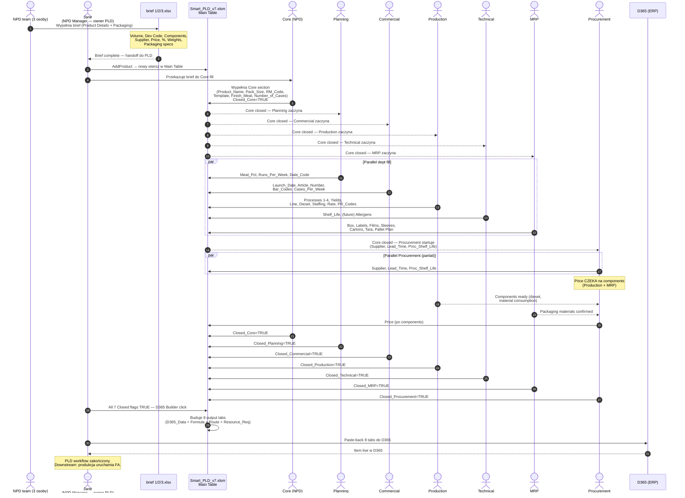

# PROCESS-OVERVIEW — Smart PLD v7 end-to-end flow

**Reality source:** `C:\Users\MaKrawczyk\PLD\v7\Smart_PLD_v7.xlsm` (122 552 B, mtime 2026-04-17 07:28)
**Phase:** A Session 1 (capture)
**Related:** [`DEPARTMENTS.md`](./DEPARTMENTS.md), [`_foundation/META-MODEL.md`](../../../_foundation/META-MODEL.md), [`_foundation/patterns/REALITY-SYNC.md`](../../../_foundation/patterns/REALITY-SYNC.md)

---

## Purpose

Dokument opisuje **jak rzeczywiście** Smart PLD v7 (Excel/VBA) jest używany w firmie Forza Foods od momentu pojawienia się pomysłu na nowy produkt do wpięcia go do D365 jako gotowego item-u. Reality capture — **nie projektujemy Monopilot**, dokumentujemy ground truth do której Monopilot ma być zakotwiczony.

Ten doc wraz z [`DEPARTMENTS.md`](./DEPARTMENTS.md) jest pierwszym parą deliverables Phase A. Pozostałe (Main Table schema, cascading rules, workflow rules, reference tables, D365 integration, evolving areas) powstają w Session 2+3 Phase A.

---

## §1 — Kontekst i zakres PLD v7

PLD = Product Launch Document. Excel/VBA workbook, single source of truth dla jednego wiersza-na-produkt w Main Table (69 kolumn, ~103 rzędów obecnie). Workbook zawiera **22 zakładki**:

| Grupa | Zakładki | Rola |
|---|---|---|
| Master | `Main Table` | 1 wiersz = 1 FA (Factory Article), 69 kolumn, single source of truth `[FORZA-CONFIG]` |
| Proxy views (działy) | `Core`, `Planning`, `Commercial`, `Production`, `Technical`, `MRP`, `Procurement` | Thin proxy views budowane przez `RefreshDeptView` — pokazują kolumny danego działu `[FORZA-CONFIG]` |
| Auxiliary | `BOM`, `D365 Import`, `Dashboard`, `Validation Status`, `Reference` | Generowane / read-only / konfiguracja `[FORZA-CONFIG]` |
| D365 Builder output | 8 tabów `D365_Data`, `D365_Formula_Version`, `D365_Formula_Lines`, `D365_Route_Headers`, `D365_Route_Versions`, `D365_Route_Operations`, `D365_Route_OpProperties`, `D365_Resource_Req` | Eksport do paste-back w D365 `[LEGACY-D365]` |
| Hidden | `ProdDetail` | Legacy, nieużywane dzisiaj `[LEGACY-D365]` |

**PLD v7 NIE jest początkiem procesu NPD.** Jest etapem środkowym. Upstream — briefy (`brief 1.xlsx`, `brief 2.xlsx`, plus trzeci brief dodany ~2026-04-17). Downstream — D365 (jeszcze produkcyjny system) oraz realna produkcja.

---

## §2 — Upstream: Brief stage (pre-PLD)

**Status:** `[EVOLVING]` — integracja brief ↔ PLD v7 nie jest jeszcze zautomatyzowana (dziś manualny rewrite), docelowo w Monopilot brief = pierwszy ekran NPD pipeline z handoff button "Przekaż do PLD".

### 2.1 Czym jest brief

Brief to Excel skoroszyt NPD team (Jane + jej zespół) zawierający **wstępne wymagania produktu** zanim PLD się uruchomi. Dwa znane dziś szablony:

| Brief | Rzędy | Przykład produktu |
|---|---|---|
| `brief 1.xlsx` — Brief Sheet V1 | 37 kolumn, 1 produkt = 1 wiersz | Pulled Chicken Shawarma (DEV26-037), Pulled Ham Hock (DEV26-038) |
| `brief 2.xlsx` — Brief Sheet V1 | 37 kolumn, 1 produkt = N wierszy (1 per component) + wiersz podsumowujący wagi | Italian Meat and Cheese Platter (DEV26-023) z 3 komponentami (Prosciutto / Pepperoni / Provolone) |

### 2.2 Struktura brief (37 kolumn, 2 sekcje)

Sekcje z row 1 nagłówkami:

**Product Details** (kolumny 1–13):
Product · Volume · Dev Code · Components · Slice Count · Supplier · Code · Price · Weights · % · Packs Per Case · Comments · Benchmark Identified

**Packaging** (kolumny 14–37):
Primary Packaging · Secondary Packaging · Base Web / Tray / Bag Code · Base Web / Tray / Bag Price · Top Web Type · Sleeve / Carton Code · Sleeve / Carton Price · (dalsze packaging cols)

### 2.3 Co brief przekazuje do PLD `[EVOLVING]`

Pola brief ↔ potencjalne kolumny Core w PLD (mapping nie jest jeszcze skodyfikowany w VBA — dziś Jane / NPD przepisuje manualnie):

| Brief | PLD (dzisiaj) | Uwaga |
|---|---|---|
| Product | `Product_Name` w Core | 1:1 |
| Volume | — (nie ma jeszcze kolumny w v7) | Całkowity wolumen zamówienia; do dodania `[EVOLVING]` |
| Dev Code | — (nie ma jeszcze kolumny w v7) | Dodać do Core jako `Dev_Code` `[EVOLVING]` |
| Components | `Finish_Meat` (Core, comma-separated) | 1:N z brief row → comma-sep w PLD |
| Slice Count | — | Wzmianka w `Comments` albo nowa kolumna `[EVOLVING]` |
| Supplier | `Supplier` (Procurement) | Dzisiaj per-row w brief, Procurement fill jednokrotnie w PLD |
| Code (brief) | `RM_Code` (Core) | Np. RM1939 / FRM7013 |
| Price (brief) | `Price` (Procurement) | "see recipe" → musi poczekać na components w PLD |
| Weights | — (nie ma jeszcze w v7) | `[EVOLVING]` — dodać do Core |
| % | `Meat_Pct` (Planning) | Procent meat content |
| Packs Per Case | — (brak odpowiednika w v7 dziś) | `[EVOLVING]` — **NIE** mapuje się na `Number_of_Cases`. Packs Per Case = ile pakietów produktu w jednym case. Dziś brak kolumny |
| — | `Number_of_Cases` (Core) | **Ilość cases na jednej palecie** — nie pochodzi z briefu 1:1; Core ustala z palletingu |
| (brak w PLD) | — | `Volume` z briefu = **całkowity wolumen zamówienia** — brak odpowiednika w v7 dziś, `[EVOLVING]` do dodania |
| Comments | — (nie ma dedykowanej kolumny) | `[EVOLVING]` |
| Benchmark Identified | — | `[EVOLVING]` |
| Primary Packaging | Częściowo w MRP (`Box`, `Top_Label`, itp.) | Rozbicie brief 1 pole → N pól MRP |
| Secondary Packaging | `MRP_Cartons` / `Pallet_Stacking_Plan` | Częściowe mapowanie |
| Base Web / Tray / Bag Code | `Web` (MRP) | `FTRA061`, `FFLM1501` |
| Base Web / Tray / Bag Price | — | `[EVOLVING]` |
| Top Web Type | — (raczej metadata dla drukarni) | `[EVOLVING]` |
| Sleeve / Carton Code | `MRP_Sleeves` / `MRP_Cartons` | Pokrywa |
| Sleeve / Carton Price | — | `[EVOLVING]` |

**Zasada reality:** dzisiaj brief żyje osobno, a Core ręcznie wpisuje dane do PLD. Docelowe Monopilot zasysa brief jako pierwszy etap NPD — ten mapping staje się danymi, nie przepisywaniem.

**Zasada migracji:** **NIE wszystkie kolumny brief są dziś przenoszone do PLD**. Budujemy architekturę (schema-driven, ADR-028) tak żeby **łatwo dodawać kolumny** w miarę rozszerzenia scope. Mapowanie z tabeli powyżej to stan dzisiejszy, nie docelowy — docelowo wszystkie brief fields mają jakieś miejsce w PLD (albo w Core, albo w nowych dedicated sections jak `Pallet_Plan`, `Benchmark`, `Comments`).

### 2.4 Decyzja architektoniczna (do Phase B/C)

Brief jako **osobny reality source** dokumentowany w `_meta/reality-sources/brief-excels/` (planowane w Phase A Session 2 lub Session 3). W Monopilot brief = osobny moduł NPD-upstream (hand-off do Core przez dedicated transition event). Nie jest scope Session 1, ale **PROCESS-OVERVIEW musi ten etap wymieniać**, bo end-to-end flow bez briefu jest niepełny.

---

## §3 — End-to-end flow (Mermaid sequence)

**Timing reference:** Brief → launch minimum **24 tygodnie** (twardy upstream constraint). Cały proces PLD trwa typowo **miesiące**, w ramach tego 24-tygodniowego okna.

---

## §4 — Etapy szczegółowo

### Stage 0 — Brief (upstream, pre-PLD) `[EVOLVING]`

**Kto:** NPD team (3 osoby z Core team)
**Co:** Wypełnia brief 1/2/3 (zależnie od typu produktu)
**Wejście:** Pomysł produktowy (komercyjny feedback, trend, insight) — nie jest formalnie skodyfikowany upstream
**Wyjście:** Brief complete → handoff do Jane / Core
**Stan w v7:** dziś osobny plik Excel, NIE jest importowany do PLD. Core przepisuje dane ręcznie.
**Ewolucja:** `[EVOLVING]` — docelowo brief = moduł NPD-upstream w Monopilot z przyciskiem "Convert to PLD" który tworzy wiersz w Main Table i mapuje fields.

### Stage 1 — Core setup `[FORZA-CONFIG]`

**Kto:** Core (NPD, 3 osoby) — owner Jane
**Co:**
- Tworzy nowy wiersz w Main Table (makro `AddProduct` — moduł VBA `M11_AddProduct`)
- Wypełnia 7 Core columns: `Product_Name`, `Pack_Size`, `Number_of_Cases`, `Finish_Meat`, `RM_Code`, `Template`, `Closed_Core`
- Dane pochodzą z briefu — dziś manual rewrite
- `Template` wybrany z `Reference.Templates` (4 templates dziś: Standard Meat FA, Simple Pack FA, Roasting Chicken, Full Process FA)

**Wyjście:** `Closed_Core=TRUE` — wyzwala pozostałe 6 działów (Planning/Commercial/Production/Technical/MRP/Procurement) do równoległej pracy.

**Uwaga:** Core jest **wspólną sekcją** — nie ma osobnego "zespołu Core". Wypełniają ją 3 osoby z NPD team, z Jane jako NPD Manager nadzorującą cały proces.

**Evolving:** W Core dojdą kolumny (z briefu): `Volume`, `Dev_Code`, prawdopodobnie `Price (from brief)`, prawdopodobnie `%`, potwierdzenie `PR` codes migracji do Core. Każda nowa kolumna = update schema + marker `[EVOLVING]`.

### Stage 2 — Parallel dept fill `[FORZA-CONFIG]`

**Kto:** 5 działów pracujących równolegle (Planning, Commercial, Production, Technical, MRP)
**Start:** Gdy `Closed_Core=TRUE`
**Podstawowa reguła:** Te 5 działów **NIE czeka na siebie nawzajem**. Pracują równolegle, niezależnie, wypełniają swoje kolumny w Main Table przez dept proxy views (VBA `RefreshDeptView` + `Worksheet_Change` write-back).

**Wypełniane kolumny per dział:** zobacz [`DEPARTMENTS.md`](./DEPARTMENTS.md) §3.

**Completion:** każdy dział ustawia `Closed_[Dept]=TRUE` gdy skończy. Osiem flag łącznie (Core + 7 depts, bo Procurement ma własny Closed).

### Stage 3 — Procurement (start równolegle, `Price` wait) `[FORZA-CONFIG]`

**Kto:** Procurement dział
**Start:** gdy `Closed_Core=TRUE` — **Procurement pracuje równolegle** z innymi 5 działami (Planning/Commercial/Production/Technical/MRP). **Korekta wcześniejszego opisu:** Procurement NIE jest sekwencyjny jako całość.

**Zależność punktowa:** Tylko kolumna `Price` czeka aż components będą znane (Production processes/dieset/line + MRP packaging materials). Pozostałe pola Procurement wypełniane samodzielnie na podstawie `RM_Code` i supplier relationships.

**Co:**
- `Supplier` — supplier selection / negotiation (start od razu, po Closed_Core)
- `Lead_Time` — per supplier (start od razu)
- `Proc_Shelf_Life` — potwierdzenie z dostawcą, może się różnić od `Shelf_Life` z Technical (start od razu)
- `Price` — **czeka** na components (Production + MRP). Bez components = "see recipe" w briefie, nie finalna cena.
- `Closed_Procurement=TRUE` — po uzupełnieniu Price

**Relacja Procurement ↔ MRP:** narazie **nie dzielimy** odpowiedzialności (wcześniejsze założenie split MRP na 2 działy było tylko przykładem, nie jest aktualne). MRP = "co zamówić / ile" (planowanie materiałów, potwierdzenie dostępności, dodawanie brakujących). Procurement = "od kogo / za ile / kiedy" (realizacja zakupu, cena, lead time, supplier management).

### Stage 4 — Closure + validation `[FORZA-CONFIG]`

**Kto:** Jane (NPD Manager)
**Co:**
- Sprawdza `Validation Status` tab — czy wszystkie Closed_* flagi są TRUE
- Sprawdza Dashboard — summary + launch alerts (RED ≤10 dni do launch, YELLOW ≤21 dni, GREEN)
- Decyzja o przekazaniu do D365 Builder

**Dashboard cadence:** **codziennie** (Jane — NPD Manager).

**Dashboard access:** wszyscy managerowie działów (Planning / Commercial / Production / Technical / MRP / Procurement) mają **read access** do Dashboard żeby widzieć co jest jeszcze do zrobienia po ich stronie (open FA, launch alerts). Write/D365-Builder uprawnienia — tylko Jane. Ten podział napędza role-permissions matrix w Monopilot (ADR-012 extension): `dashboard.view` = wszyscy dept managers; `d365_builder.execute` = NPD Manager role.

### Stage 5 — D365 Builder + paste-back `[LEGACY-D365]`

**Kto:** Jane (sama, via button click)
**Co:**
- Naciska przycisk "Build D365" — VBA moduł `M08_Builder`
- Buduje 8 output tabs: `D365_Data` (item master) + `D365_Formula_Version` + `D365_Formula_Lines` (BOM) + `D365_Route_Headers/Versions/Operations/OpProperties` (routes) + `D365_Resource_Req`
- Kopiuje zawartość tabów i paste'uje **ręcznie z powrotem do D365** (interfejs D365 nie ma API dla Forzy, paste manual)
- Flaga `Built` w Main Table = TRUE, auto-reset gdy edycja

**Marker:** `[LEGACY-D365]` — istnieje tylko dopóki D365 jest live. Po docelowym zastąpieniu D365 przez Monopilot te 8 tabs znikają (dane bezpośrednio w Monopilot, bez eksportu).

### Stage 6 — Downstream: Production launch (poza PLD) `[FORZA-CONFIG]`

**Poza scope PLD v7 Excel** — po wpięciu itemu do D365 produkcja uruchamia FA (Factory Article) jako realną pozycję. PLD ma flag `Built` i `Launch_Date`, ale samo uruchomienie produkcji następuje w D365 / na linii.

---

## §5 — Owner map

| Rola | Osoba / zespół | Odpowiedzialność |
|---|---|---|
| NPD Manager (orchestrator) | **Jane** | Owner całego procesu PLD, D365 Builder click, nadzór, komunikacja z działami |
| NPD team | 3 osoby (w tym Jane) | Brief fill + Core fill + Development decisions |
| Planning dział | — (nie ma imiennej osoby w tym docu) | Meat_Pct, Runs_Per_Week, Date_Code |
| Commercial dział | — | Launch_Date, Article_Number, Bar_Codes, Cases_Per_Week |
| Production dział | — | Processes, Yields, Line, Dieset, PR_Codes |
| Technical dział | — | Shelf_Life (dziś), Allergens (future `[EVOLVING]`) |
| MRP dział | — | Packaging (Box, Labels, Films, Sleeves, Cartons, Tara, Pallet) |
| Procurement dział | — | Price, Lead_Time, Supplier, Proc_Shelf_Life |

Jane = orchestrator (NPD Manager). Pozostali managerowie działów — osoby do dopisania w kolejnej iteracji.

**Dashboard access pattern:**
- **Write + D365 Builder execute** — tylko Jane (NPD Manager role)
- **Read (view)** — wszyscy dept managers (6 managerów + Jane) — żeby każdy widział co jest do zrobienia po jego stronie (open FA per dept, launch alerts)

Ten podział napędza role-permissions matrix w Monopilot (ADR-012 extension + schema-driven role matrix per ADR-028):
- Permission `dashboard.view` → role `dept_manager` (wszystkie 7 działów + NPD Manager)
- Permission `d365_builder.execute` → role `npd_manager` (Jane only)

---

## §6 — Timeline

### 6.1 Minimum 24-week rule

Brief MUSI zostać przekazany do PLD co najmniej **24 tygodnie przed launch date**. To twardy constraint biznesowy — zakup materiałów (Procurement lead time), proces testów Technical (shelf life validation), walidacja D365 item numbers oraz fizyczne uruchomienie produkcji wymagają tego okna.

### 6.2 Typowy czas życia FA w PLD

**Minimum:** kilka tygodni (fast-track produkty z istniejącą recepturą)
**Typowo:** miesiące (standard NPD produkty)
**Edge cases:** dłużej gdy wymagany nowy supplier / nowe packaging / regulatory

### 6.3 Launch alerts (Dashboard)

| Alert | Warunek | Kolor |
|---|---|---|
| RED | `Launch_Date - TODAY ≤ 10 dni` | 🔴 |
| YELLOW | `Launch_Date - TODAY ≤ 21 dni` | 🟡 |
| GREEN | pozostałe | 🟢 |

Manager review daily.

### 6.4 Wolumetria

- Main Table dziś: **~103 rzędów** (historia + aktywne FA) — dokładna liczba rośnie w czasie.
- Aktywnych FA (nie closed by Done) w danym momencie: nie jest zarejestrowane explicitly w tym dokumencie — do doprecyzowania. Dashboard powinien to pokazywać.

---

## §7 — Evolving areas (do Phase A Session 3 — EVOLVING.md)

Lista obszarów gdzie PLD v7 projekt jeszcze się zmienia. Szczegółowy capture trafi do `EVOLVING.md`. Tu wymienione żeby PROCESS-OVERVIEW był spójny:

| Obszar | Opis | Marker |
|---|---|---|
| Brief ↔ PLD integration | Dziś manual rewrite brief→PLD. Docelowo: brief = moduł NPD-upstream w Monopilot, handoff button "Convert to PLD" | `[EVOLVING]` |
| Core columns expansion | Dojdą: `Volume`, `Dev_Code`, potencjalnie `Price from brief`, `%` (z brief), `PR` migration to Core | `[EVOLVING]` |
| Technical — Allergens | Dziś Technical ma tylko Shelf_Life. Dodawana obsługa allergens z RM inheritance (RM→FA cascade). Wymaga: nowa kolumna `Allergens` w Main Table, nowa `Reference.Allergens` tabela, cascade logic `[UNIVERSAL for food-manufacturing]`. Dziś **nie istnieje** w v7 | `[EVOLVING]` → docelowo `[UNIVERSAL]` (allergens obowiązkowe food-mfg EU) |
| Reference.Processes | 8 procesów dziś (Strip/Coat/Honey/Smoke/Slice/Tumble/Dice/Roast, suffixes A..H,R). Zestaw ruchomy — będzie rozszerzany + edytowalny | `[EVOLVING]` + `[FORZA-CONFIG]` |
| Email config (Reference.EmailConfig) | Obecnie recipients puste dla wszystkich 7 działów | `[EVOLVING]` |
| MRP → 2 działy (split) | **Nieaktualne** — wcześniejsze założenie zostało wycofane. MRP zostaje jako 1 dział do odwołania | (usunięte z EVOLVING) |
| 3-ci brief template | Dodany ~2026-04-17. Może wymagać nowego mapping → Core | `[EVOLVING]` |

---

## §8 — Monopilot trajectory (kontekst docelowy)

Monopilot docelowo zastępuje **oba** systemy: PLD v7 Excel + D365. Kolejność:
1. **Faza A (dziś):** Monopilot-dokumentacja uchwyca PLD v7 reality (ten etap).
2. **Faza implementacji (post-Phase C):** Monopilot zastępuje PLD v7 (dept fill, cascade, BOM, dashboard). W tym okresie **D365 jeszcze żyje** — Monopilot ma D365 Builder jako bridge funkcjonalność (`[LEGACY-D365]` feature flag `integration.d365.enabled`).
3. **Później:** Monopilot zastępuje D365 — D365 Builder i wszystkie `[LEGACY-D365]` znikają.

**Konsekwencja projektowa (Meta-model §5 + ADR-031):** Monopilot musi mieć D365 Builder równoważnik (nie "tylko workaround"). To realny moduł, aktywny przez 12+ miesięcy dual-maintenance z D365.

---

## §9 — Zmiany w stosunku do dokumentacji pre-Phase-0

Reality capture ujawnił niezgodności z wcześniejszymi dokumentami (meta-model skill, memory `project_smart_pld`):

| Wcześniej w docs | Rzeczywistość v7 | Konsekwencja |
|---|---|---|
| 7 działów: Commercial, **Development**, Production, **Quality**, Planning, Procurement, MRP | 7 działów: Commercial, **Core**, Production, **Technical**, Planning, Procurement, MRP | `Development` = NPD team = `Core` (wspólna sekcja). `Quality` = `Technical` (ma Shelf_Life, dojdą Allergens) |
| MRP split na 2 działy (EVOLVING) | **Nie** — pozostaje 1 dział | Usuń z EVOLVING |
| "Main Table ~60-80 kolumn" | Main Table **69 kolumn** dokładnie | Precyzja w Phase A Session 2 (MAIN-TABLE-SCHEMA) |
| "21 tabów" w memory | **22 taby** (Dashboard + Main Table + 7 dept + BOM + D365 Import + Reference + Validation + 8 D365 Builder + ProdDetail hidden) | Aktualizacja memory |
| Brief stage upstream PLD | **Nieuwzględnione** w meta-model i handoffie | Nowy reality source `brief-excels/` — dodać w Phase A Session 2/3 |
| 8 procesów Strip/Coat/Honey/Smoke/Slice/Tumble/Dice/Roast | **Nieuwzględnione** explicitly | Do skodyfikowania w Reference w Session 2 |

Markery wchodzą w rachubę przy propagacji (Session B) — tu fixujemy reality.

---

## §10 — HANDOFF do Session 2 (pending propagation)

**Moduły do propagacji** (Session B / Phase B):

- `09-npd/` (NPD module) — główny adresat, bo PLD v7 pokrywa ~90% zakresu NPD. Cross-walk + aktualizacja stories + markery.
- `02-products/` — Core columns definition mapa na products schema.
- (Później w Phase C) `12-production/`, `14-procurement/` oraz moduły MRP/Technical/Planning/Commercial — każdy dostanie słupek z kolumn Main Table.

**Pozostałe reality-sources do utworzenia** (Phase A Session 2–3):
- `pld-v7-excel/MAIN-TABLE-SCHEMA.md` — wszystkie 69 kolumn z type/owner/validation/required/dependency
- `pld-v7-excel/CASCADING-RULES.md` — Pack_Size → Line → Dieset → Material, PR_Code_Final = P1+P2+P3+P4 suffixes
- `pld-v7-excel/WORKFLOW-RULES.md` — status colors (White/Gray/Green/Red), autofilter Done, Closed_[Dept] semantyka
- `pld-v7-excel/REFERENCE-TABLES.md` — 8 tables (DeptColumns, PackSizes, Lines_By_PackSize, Dieset_By_Line_Pack, Templates, EmailConfig, Processes, CloseConfirm)
- `pld-v7-excel/D365-INTEGRATION.md` — D365 Import (release product list paste), D365 Builder (8 output tabs), validation codes
- `pld-v7-excel/EVOLVING.md` — lista z §7 rozwinięta
- **Nowy reality source** `_meta/reality-sources/brief-excels/` — Brief Sheet V1 structure (37 cols, 2 sections), 2 known templates + 3rd added 2026-04-17, mapping do Core

---

## §11 — Related

- [`DEPARTMENTS.md`](./DEPARTMENTS.md) — siostra Session 1, 7 działów detail + handoffs map
- [`_foundation/META-MODEL.md`](../../../_foundation/META-MODEL.md) §5 (D365 mapping) + §6 (markery)
- [`_foundation/patterns/REALITY-SYNC.md`](../../../_foundation/patterns/REALITY-SYNC.md) — two-session discipline
- [`_foundation/skills/reality-sync-workflow/SKILL.md`](../../../_foundation/skills/reality-sync-workflow/SKILL.md)
- [`_foundation/skills/documentation-patterns/SKILL.md`](../../../_foundation/skills/documentation-patterns/SKILL.md) §Monopilot markery
- Spec: [`_meta/specs/2026-04-17-monopilot-migration-design.md`](../../specs/2026-04-17-monopilot-migration-design.md) §3.2 (Phase A detail)
- HANDOFF: [`_meta/handoffs/2026-04-17-phase-0-close-and-phase-a-bootstrap.md`](../../handoffs/2026-04-17-phase-0-close-and-phase-a-bootstrap.md)
- User memory: `project_smart_pld` (wymaga aktualizacji po tej sesji — zmiana Main Table 21→22 taby, dodane Processes table, MRP split usunięty)
- Reality source file: `C:\Users\MaKrawczyk\PLD\v7\Smart_PLD_v7.xlsm`
- Upstream reality (future): `C:\Users\MaKrawczyk\OneDrive - IPL LIMITED\Desktop\PLD\brief 1.xlsx`, `brief 2.xlsx`, `brief 3.xlsx (2026-04-17)`
