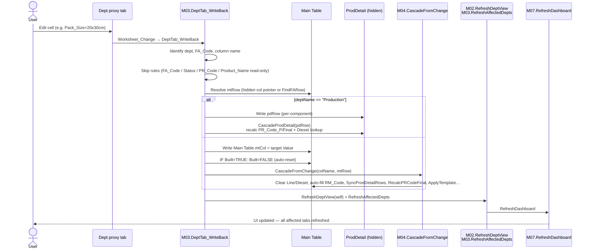
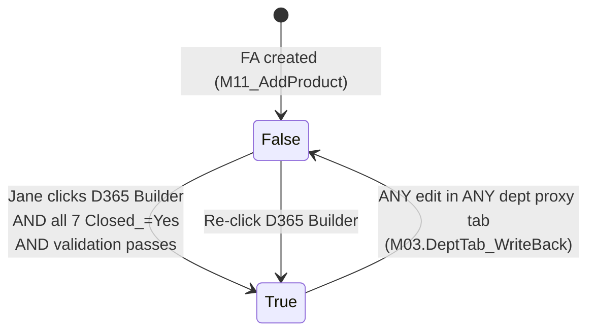
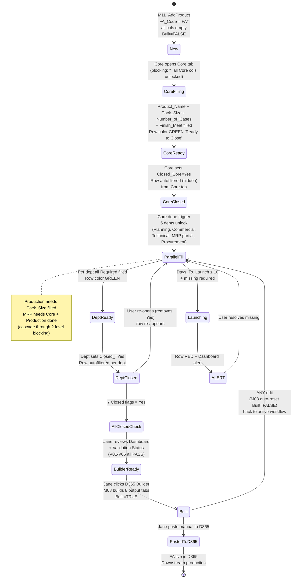

# WORKFLOW-RULES — Status colors, hard-lock, autofilter, Closed semantyka, Built flag

**Reality source:** VBA modules `M02_RefreshDeptView.bas`, `M03_WriteBack.bas`, `M07_Dashboard.bas`, `M10_Validation.bas`, `CLS_SheetEvents.cls` (injected into dept tabs)
**Phase:** A Session 2 (capture)
**Related:** [`MAIN-TABLE-SCHEMA.md`](./MAIN-TABLE-SCHEMA.md), [`CASCADING-RULES.md`](./CASCADING-RULES.md), [`PROCESS-OVERVIEW.md`](./PROCESS-OVERVIEW.md), [`DEPARTMENTS.md`](./DEPARTMENTS.md), [`_foundation/META-MODEL.md`](../../../_foundation/META-MODEL.md) §2 + §8

---

## Purpose

Dokument kodyfikuje **workflow rules** Smart PLD v7 — reguły interakcji użytkownika z workbookiem, które nie są cascade (osobny doc `CASCADING-RULES.md`), ale są **reakcjami systemu na user actions**:

- Status colors (cell-level + row-level)
- Hard-lock mechanism (blocking rules → cell locked/unlocked)
- Autofilter dept tabs (row hiding)
- Closed_<Dept> semantyka + Done_<Dept> (manual vs auto)
- Built flag (D365 Builder trigger + auto-reset on edit)
- Dashboard alerts (cadence + colors)
- Worksheet_Change event flow (proxy tab → Main Table writeback)

To są **Level "b" workflow** rules z META-MODEL §8 ("workflow-as-data"). V7 hardcode'uje je w VBA; Monopilot docelowo trzyma jako dane (JSON/DB).

---

## §1 — Cell-level status colors

### 1.1 Blocking (gray locked) vs unlocked vs auto (green locked)

W proxy dept tab (budowany przez `M02.RefreshDeptView`), każda cell w row ≥3 dostaje color + lock state per blocking rule:

| Stan | Cell background | Locked? | Wygląd dla usera |
|---|---|---|---|
| **Blocking rule NOT met** | 🔘 gray `#D0D0D0` | 🔒 yes | "Nie możesz wypełnić — czekaj na prereq" |
| **Blocking rule met**, editable | ⬜ white `#FFFFFF` | 🔓 no | "Możesz wypełnić" |
| **Data_Type = "Auto"** (np. RM_Code, Dieset, PR_Code_*) | 🟢 light-green `#E0FFE0` | 🔒 yes | "Auto-wypełnione przez system" |
| **FA_Code + Product_Name columns** (cross-dept reference) | 🟢 light-green `#E0FFE0` | 🔒 yes | "Read-only identyfikator produktu" |

**Logika (M02.RenderStandardDeptView lines 157-181):**
```
blocked = NOT IsBlockingMet(blockRule, mtRow)
IF blocked:
    cell.Color = #D0D0D0
    cell.Locked = TRUE
ELSE:
    cell.Color = #FFFFFF
    cell.Locked = FALSE
    IF dropdown_source != "": ApplyDropdown(cell)
IF dataType == "Auto":
    cell.Locked = TRUE
    cell.Color = #E0FFE0
```

### 1.2 D365 material validation colors (M05_D365Validate.ApplyD365Formatting)

Na kolumny zawierające codes materiałów (Box, Top_Label, Bottom_Label, Web, Finish_Meat, RM_Code), VBA dodaje dodatkowy overlay color po walidacji vs `D365 Import` tab:

| D365 status | Cell color | Cell comment |
|---|---|---|
| **Found** (code in D365 + has price) | 🟢 `#C0FFC0` | — |
| **NoCost** (code in D365 but price=0/empty) | 🟡 `#C0FFFF` | "Price missing in D365" |
| **Missing** (code not in D365) | 🔴 `#C0C0FF` | "Material not in D365 - request creation" |
| **Empty** (cell blank) | — | — |

**Zastosowanie:** `M05.ValidateAllCodes(mtRow)` w M10 validation loop + `M08_Builder` pre-check. Format renders w Main Table (bezpośrednio), nie w proxy dept tabs.

### 1.3 PR_Code_Final MISMATCH warning (M04 + M02)

Gdy Finish_Meat ends z innym suffixem niż last process suffix (V06 fail), PR_Code_Final cell dostaje:
- Color: 🔴 `#C0C0FF` (red-ish)
- Comment: `"MISMATCH: Finish_Meat ends 'X' but last process is 'Y'"` (w Main Table)
- W Production proxy tab: równoważny check per ProdDetail row (PR_Code vs PR_Code_Final comparison) — też red-ish + komentarz

### 1.4 Marker

- Cell colors system (blocking/auto/validation) = `[UNIVERSAL]` (wzorzec — każda firma powinna mieć feedback cell-level)
- Konkretne hex colors (#D0D0D0 dla blocked, itp.) = `[FORZA-CONFIG]` (theming per org)
- D365 validation colors = `[LEGACY-D365]` (gdy D365 zniknie, logika validate-against-ERP może zniknąć lub zmienić się na Monopilot items)

---

## §2 — Row-level status colors (ApplyRowStatus)

Poza cell-level, cały **wiersz dept tab** dostaje background color i `Status` text column (dodawana przez M02). Logika `M02.ApplyRowStatus` jest kaskadowa:

### 2.1 Algorytm (M02 lines 351-403)

```
IF IsAllRequiredFilled(dept, mtRow):
    Status = "Ready to Close"
    Row color = 🟢 #C0FFC0 (green)
ELSE IF Days_To_Launch <= 10:
    Status = "ALERT - N days to launch"
    Row color = 🔴 #C0C0FF (red)
ELSE IF NOT IsBlockingMet(first_dept_col_blocking_rule, mtRow):
    Status = "Waiting"
    Row color = ⬜ #E0E0E0 (gray)
ELSE:
    Status = "Ready"
    Row color = ⬜ #FFFFFF (white)
```

### 2.2 Tabela decyzyjna

| Priorytet | Warunek | Status text | Row color | Semantyka |
|---|---|---|---|---|
| 1 (najwyższy) | All Required_For_Done cols wypełnione | `Ready to Close` | 🟢 green `#C0FFC0` | Dept może kliknąć `Closed_<Dept>=Yes` |
| 2 | Days_To_Launch ≤ 10 (i nie Ready) | `ALERT - N days to launch` | 🔴 red `#C0C0FF` | Pilne, launch za < 10 dni, braki |
| 3 | Blocking rule dla pierwszej kolumny dept nie met | `Waiting` | ⬜ gray `#E0E0E0` | Czeka na upstream (np. Core done) |
| 4 (domyślny) | Aktywna praca, nic nie zgadza się z 1/2/3 | `Ready` | ⬜ white `#FFFFFF` | Normalna edycja, częściowo wypełnione |

### 2.3 Propagacja colors w Monopilot

Row-level colors = **global summary status** dla FA z perspektywy danego dept. W Monopilot staje się kolumną `dept_status` per (FA, dept) pair:

```
dept_status enum: "waiting" | "ready" | "alert" | "ready_to_close" | "closed"
dept_status color: gray | white | red | green | (hidden — filtered out)
```

Marker: pattern = `[UNIVERSAL]`, konkretne priorytety thresholds (10 days, 21 days) = `[FORZA-CONFIG]` (Dashboard alerts §5).

---

## §3 — Hard-lock mechanism (Blocking_Rule in Reference.DeptColumns)

Hard-lock = reguły które uniemożliwiają edycję kolumny **przed spełnieniem warunku**. Realizuje zasadę workflow progression ("Core musi skończyć zanim inni zaczną").

### 3.1 4 blocking rules (kanoniczne)

Zdefiniowane w `Reference.DeptColumns` col 5 (Blocking_Rule):

| Blocking_Rule | Semantyka | Implementacja (M01.IsBlockingMet) |
|---|---|---|
| `""` (pusty) | Zawsze unlocked | return TRUE |
| `Core done` | Core dept complete (all required filled) | `IsAllRequiredFilled("Core", mtRow)` |
| `Pack_Size filled` | Core.Pack_Size nie-puste | Main Table.Pack_Size != "" |
| `Line filled` | Production.Line nie-puste | Main Table.Line != "" |
| `Core + Production done` | Core required filled AND ProdDetail complete | `IsAllRequiredFilled("Core", mtRow) AND IsProdDetailComplete(mtRow)` |

### 3.2 Mapping kolumn na blocking rules

| Blocking_Rule | Kolumny |
|---|---|
| `""` | Wszystkie Core cols (Product_Name, Pack_Size, Number_of_Cases, Finish_Meat, RM_Code, Template, Closed_Core) + 5 Auto PR codes |
| `Core done` | Wszystkie 4 Planning + 8 Commercial + 2 Technical + 5 Procurement (łącznie 19 cols) |
| `Pack_Size filled` | Process_1..4 + Yield_P1..4 + Line + Closed_Production (10 cols) |
| `Line filled` | Dieset + Yield_Line + Staffing + Rate (4 cols) |
| `Core + Production done` | Wszystkie 13 MRP cols (Box, Top_Label, ..., Closed_MRP) |

### 3.3 UX effect

Przykład: User otwiera **Planning proxy tab** przed wypełnieniem Core. Widzi wszystkie 4 wiersze FA (które nie mają jeszcze `Closed_Planning=Yes`), ale cell `Meat_Pct`, `Runs_Per_Week`, `Date_Code_Per_Week` są **gray + locked**. Cell `Closed_Planning` też locked (ma blocking `Core done`).

User nie może fizycznie wpisać wartości. Row status = "Waiting" (gray bg).

### 3.4 Marker

- 4 hardcoded blocking rules ("Core done", "Pack_Size filled", "Line filled", "Core + Production done") = `[FORZA-CONFIG]` (konkretne Forza workflow rules)
- Blocking mechanism jako concept = `[UNIVERSAL]` (META-MODEL §2.1 obszar 2 "conditional required")
- **Ograniczenie v7:** tylko 4 reguły hardcoded. Rozszerzenie wymaga edit VBA (M01.IsBlockingMet switch). Monopilot z ADR-029 DSL pozwoli definiować dowolne nowe reguły jako dane.

---

## §4 — Autofilter dept tabs (Closed_<Dept> hiding)

### 4.1 Filter logic

Autofilter w dept proxy tabs **NIE jest Excel AutoFilter**, jest **skip w rendering loop**:

```vb
' M02.RenderStandardDeptView line 131-135:
closedCol = GetMTColumnIndex("Closed_" & deptName)
If closedCol > 0 Then
    If Trim(CStr(wsMT.Cells(mtRow, closedCol).Value)) = "Yes" Then GoTo NextStdRow
End If
```

**Efekt:** Gdy user ustawi `Closed_<Dept>=Yes` w Main Table (lub przez dept tab → writeback), przy następnym refresh dept tab (M02.RefreshDeptView) ten wiersz **nie jest renderowany**. Z perspektywy user — znika z "mojej listy".

### 4.2 Per-dept filter

Każdy dept tab filtruje na swój `Closed_<Dept>`. Czyli:

- **Core tab** hide'uje FA gdzie `Closed_Core=Yes`
- **Planning tab** hide'uje FA gdzie `Closed_Planning=Yes`
- (…) itd per dept

**Konsekwencja:** FA po zamknięciu w dept X (np. Core) **znika z Core tab** ale **jest widoczna w dept Y tab** (np. Planning) dopóki dept Y nie ustawi też Closed_Y=Yes.

### 4.3 Production specjalny

`Production` tab (RenderProductionView) używa per-component ProdDetail rows. Filter `Closed_Production=Yes` skip'uje cały FA (wszystkie ProdDetail rows) — nie per-component.

### 4.4 Re-activation

Gdy user odznaczy `Closed_<Dept>` (usuwa "Yes"), przy następnym refresh wiersz **wraca** do dept tab.

**Reality:** `Reference.CloseConfirm` ma tylko 1 opcję: "Yes". Unset = usuń zawartość cell (manualnie). Nie ma "No" w dropdown.

### 4.5 Marker

- Filter logic (hide closed rows) = `[UNIVERSAL]` (każdy workflow tool to ma)
- Per-dept `Closed_<Dept>` flag pattern = `[UNIVERSAL]`
- Dropdown z jedną opcją "Yes" = `[FORZA-CONFIG]` (Forza simplification)

---

## §5 — Closed_<Dept> vs Done_<Dept> (manual vs auto)

**Dwa systemy flag** istnieją w Main Table:

### 5.1 Closed_<Dept> (manual, dropdown)

- **Col type:** Dropdown (source: Reference.CloseConfirm = "Yes")
- **User action:** Dept manager ręcznie klika "Yes" gdy uznaje że skończył swoją sekcję
- **System effect:** Autofilter w dept tab skip'uje ten wiersz (hide)
- **Reality:** Brak enforcement "all required must be filled" przed kliknięciem. User może ustawić "Yes" nawet gdy Required_For_Done cols są puste — system nie blokuje. Tylko row status (green "Ready to Close") **sugeruje** że warto zamknąć

### 5.2 Done_<Dept> (auto, SYSTEM col C60-66)

- **Col type:** Boolean (auto-calculated)
- **Sample value:** `False` (w row 4 scan, empty FA)
- **Logic:** TBD — zidentyfikowane scenariusze:
  - (a) Formula Excel: `=IF(Closed_<Dept>="Yes", TRUE, FALSE)` — mirror manual Closed
  - (b) VBA compute: `Done_<Dept> = IsAllRequiredFilled AND Closed_<Dept>="Yes"` — AND condition
  - (c) VBA compute: `Done_<Dept> = IsDeptDone(dept, row)` = `Closed_<Dept>="Yes"` (bez AND)

VBA `M01.IsDeptDone` zwraca `Closed_<Dept>="Yes"` (wariant C). Ale gdzieś formula/VBA musi ustawiać Done_<Dept> w Main Table. **Nie zidentyfikowano explicit setter w czytanych modułach** (M01-M07, CLS). Do doprecyzowania z user / reverse-engineer.

### 5.3 Dashboard i Validation używają Closed_<Dept>, nie Done_<Dept>

- M07.RefreshDashboard — używa `IsDeptDone(dn, mtRow)` = `Closed_<Dept>="Yes"` → count deptDone/Pending/Blocked
- M10.RunValidation — używa `IsDeptDone(dn, mtRow)` dla V05-<Dept> rule
- M07.Dashboard alerts — iterate FA gdzie "allClosed" = wszystkie 7 IsDeptDone — jeśli allClosed, FA jest skipped w alerts (closed FA = poza scope alerts)

Czyli **Closed_<Dept> jest de-facto source of truth** dla "dept done" pytania. Done_<Dept> system col może być **legacy** albo **display-only mirror**.

### 5.4 Marker

- `Closed_<Dept>` pattern = `[UNIVERSAL]` (każdy workflow tool ma sign-off flag)
- `Done_<Dept>` auto mirror = `[EVOLVING]` (może być legacy, TBD)
- Zależność Autofilter ↔ Closed = `[UNIVERSAL]`

### 5.5 Open question (Phase B)

**Czy Done_<Dept> system cols mają być zachowane w Monopilot?**

Warianty:
- (A) Zachować jako computed view (dashboard counter source)
- (B) Usunąć — używać computed-on-the-fly w queries
- (C) Zachować jako event-sourced (każda zmiana Closed_<Dept> generuje event)

Decyzja w Phase D (architecture closure).

---

## §6 — Worksheet_Change event flow (dept tab → Main Table writeback)

### 6.1 Event handler per dept tab

Każdy dept tab (Core/Planning/Commercial/Production/Technical/MRP/Procurement) ma injected `Worksheet_Change` handler (z `CLS_SheetEvents.cls`):

```vb
Private Sub Worksheet_Change(ByVal Target As Range)
    On Error GoTo ErrOut
    If Target.Cells.Count > 1 Then Exit Sub       ' tylko single cell
    If Target.Row < 3 Then Exit Sub                ' row 1-2 = headers
    DeptTab_WriteBack Me, Target
    Exit Sub
ErrOut:
    Application.EnableEvents = True
End Sub
```

### 6.2 DeptTab_WriteBack flow (M03 lines 9-112)



### 6.3 Single-cell constraint

Event handler odrzuca multi-cell changes (paste, fill-down). **Ograniczenie reality:** user nie może paste'ować wielu wierszy danych na raz — musi cell-by-cell. Workaround dla bulk input: paste bezpośrednio w Main Table (ominie event handler).

**Konsekwencja dla Monopilot:** nie ma tego ograniczenia w Monopilot — formularz webowy pozwoli na batch editing z server-side validation.

### 6.4 Read-only cols w writeback (skip w M03 line 24)

Cols których writeback **nie dotyczy**:
- `FA_Code` — PK, nie do edycji
- `Status` — auto-calc (dodawane przez M02.ApplyRowStatus)
- `PR_Code` — ProdDetail identifier (display only)
- `Product_Name` — reference z Core, read-only w innych dept tabs

### 6.5 Marker

- Proxy tab writeback pattern = `[UNIVERSAL]` (schema-driven UI pattern)
- `CLS_SheetEvents` injection pattern = `[FORZA-CONFIG]` (Excel-specific implementacja, Monopilot używa reactive UI bez tego)

---

## §7 — Built flag + D365 Builder (M08) + auto-reset

### 7.1 Built flag lifecycle

`Main Table.Built` (col C69, SYSTEM section) = Boolean. Lifecycle:



### 7.2 Auto-reset mechanism (M03 lines 83-89)

```vb
Dim builtCol As Long
builtCol = GetMTColumnIndex("Built")
If builtCol > 0 Then
    If wsMT.Cells(mtRow, builtCol).Value = True Then
        wsMT.Cells(mtRow, builtCol).Value = False
    End If
End If
```

**Trigger:** Każde `DeptTab_WriteBack` non-Production cell (sprawdzane w non-Production branch tylko, lines 74-92). Production writeback pisze do ProdDetail, nie Main Table — prawdopodobnie nie trigger'uje auto-reset? TBD — może być bug albo intentional (ProdDetail changes don't reset Built). Do potwierdzenia z user.

**Powód auto-reset:** Gdy user edytuje cokolwiek po D365 Builder run, 8 output tabs są stale. `Built=FALSE` sygnalizuje "musisz re-run Builder zanim paste'niesz do D365".

### 7.3 D365 Builder gate (prawdopodobnie M08)

Jeszcze nie czytaliśmy M08_Builder w detailu (Session 3 D365-INTEGRATION.md), ale z M07.RefreshDashboard logic (line 37-39) wiemy:
- `totalBuilt` counter counts FA gdzie `Built=TRUE`
- Dashboard row 7 "Built for D365" = totalBuilt

Zakładana gate logic D365 Builder (do potwierdzenia w Session 3):
1. Check wszystkie 7 `Closed_<Dept>=Yes`
2. Run M10.RunValidation — check V01-V06 all PASS
3. Build 8 output tabs (D365_Data + Formula + Route + Resource_Req)
4. Set `Built=TRUE`
5. User paste'uje ręcznie do D365

### 7.4 Marker

- `Built` flag = `[LEGACY-D365]` (istnieje tylko bo D365 integration jest paste-based; zniknie po Monopilot → D365 replace)
- Auto-reset on edit pattern = `[UNIVERSAL]` (każdy eksport do external system musi się resetować przy edit source)

### 7.5 Monopilot trajectory

Gdy Monopilot zastąpi D365, `Built` flag przestaje mieć sens — dane są w Monopilot native, nie eksportowane. Ale pattern "staleness flag on derived artifact" może przetrwać w innych kontekstach (np. `Reports_Generated` flag, `Email_Sent_To_Depts`, itp.).

---

## §8 — Dashboard cadence + alerts (M07)

### 8.1 Dashboard refresh trigger

`RefreshDashboard` wywoływane:
- Na końcu każdego `DeptTab_WriteBack` (line 146)
- Manualnie przez button (zapewne na Dashboard tab — do potwierdzenia w Session 3)

### 8.2 Dashboard struktura (z scan row 1-21)

```
R1:  FORZA FOODS - Product Launch Dashboard                  (title)
R3:  SUMMARY
R4:  Total Active Products          | 0
R5:  Fully Complete                 | 0
R6:  Pending                        | 0
R7:  Built for D365                 | 0
R9:  DEPARTMENT PROGRESS
R10: Department | Done | Pending | Blocked                   (headers)
R11-17: 7 depts rows
R20: Open Products - Launch Alerts                           (section)
R21: FA_Code | Launch_Date | Days_Left | Alert | Missing Data (headers)
R22+: dynamic alert rows
```

### 8.3 Counters logic (M07 lines 29-67)

Per FA (z Main Table):
- `totalActive++` gdy FA_Code nie-pusty
- `totalBuilt++` gdy `Built=TRUE`
- Per dept: `deptDone++` gdy `IsDeptDone(dn, mtRow)` (Closed_<Dept>=Yes); else:
  - `deptBlocked++` gdy blocking rule dla pierwszej kolumny dept nie met
  - `deptPending++` gdy blocking met ale user jeszcze nie kliknął Closed
- `totalComplete++` gdy wszystkie 7 IsDeptDone = TRUE
- `totalPending = totalActive - totalComplete`

### 8.4 Alerts logic (M07 lines 80-156)

Tylko dla FA gdzie NOT allClosed (co najmniej 1 dept jeszcze nie zamknięty):

| Alert level | Warunek | Row color |
|---|---|---|
| 🔴 RED | `Launch_Date puste` OR `Launch_Date nie-date` OR `Days_Left ≤ 10` | `#C0C0FF` |
| 🟡 YELLOW | `Days_Left ≤ 21 AND missing data != ""` (są braki) | `#C0FFFF` |
| 🟢 GREEN | Pozostałe (ma launch date, > 21 dni, lub 11-21 dni + no missing) | `#C0FFC0` |

Thresholds `10` i `21` są **hardcoded** w M07 (linie 135, 139).

**Missing Data column** (`BuildMissingDataText`): lista wszystkich Required_For_Done kolumn z `Reference.DeptColumns` gdzie Main Table cell jest pusta. Format: `"Dept1: Col1. Dept2: Col2."`.

### 8.5 Cadence

Per `PROCESS-OVERVIEW.md` §4 Stage 4: **Jane sprawdza Dashboard codziennie**. Wszyscy dept managerowie **mają read access** — również sprawdzają codziennie, po ustaleniu z użytkownikiem.

### 8.6 Marker

- Alert thresholds (10 days / 21 days) = `[FORZA-CONFIG]` (per org business rule)
- Alert levels RED/YELLOW/GREEN pattern = `[UNIVERSAL]`
- Counters totalActive/Complete/Pending/Built = `[UNIVERSAL]` (każdy workflow ma takie metrics)
- Per-dept Done/Pending/Blocked breakdown = `[UNIVERSAL]`
- Dashboard daily review by manager = `[FORZA-CONFIG]` (cadence per org)

---

## §9 — Error handling + Application.EnableEvents discipline

### 9.1 EnableEvents guard pattern

Wszystkie VBA routines które modyfikują cells używają pattern:
```vb
Application.EnableEvents = False
' ... modifications
Application.EnableEvents = True
```

**Powód:** Zapobiega recursive trigger Worksheet_Change event gdy VBA pisze cell. Bez tego — infinite loop (cascade pisze → Worksheet_Change → cascade → ...).

### 9.2 Error handlers always restore EnableEvents

Każdy routine ma `On Error GoTo ErrOut` która ustawia `EnableEvents=True` w handler, żeby nigdy nie zostawić Excel z EnableEvents=False.

### 9.3 Application state saved/restored

M02.RefreshDeptView:
```vb
Application.ScreenUpdating = False
Application.Calculation = xlCalculationManual
Application.EnableEvents = False
' ... work
Application.EnableEvents = True
Application.Calculation = xlCalculationAutomatic
Application.ScreenUpdating = True
```

**Konsekwencja dla Monopilot:** ten pattern nie istnieje w web-app — brak global Excel state. Zastępują go server-side transactions (write wrapped in transaction, events dispatched after commit).

---

## §10 — Sheet protection

### 10.1 Dept tabs protection

`M02.RefreshDeptView` chroni każdy dept tab po renderze:
```vb
wsDept.Protect Password:="", UserInterfaceOnly:=True, _
    AllowFormattingCells:=True, AllowFormattingColumns:=True, _
    AllowFormattingRows:=True, AllowSorting:=True, AllowFiltering:=True
```

**Efekt:** 
- Wszystkie locked cells (blocked, Auto, headers) są untouchable
- Unlocked cells (blocking met) są editable
- User może sortować + filtrować + format
- `Password=""` — łatwo obejść (security by design, nie security by policy)
- `UserInterfaceOnly:=True` — VBA może pisać do cells, user nie

### 10.2 Main Table protection

Main Table **NIE jest protected** (z inspekcji scan). User może edytować bezpośrednio. To jest zamierzone — Main Table = "backend", power-users (Jane) mogą tam edytować.

### 10.3 Marker

- Protection-on-render pattern = `[UNIVERSAL]` (schema-driven UI locking)
- UserInterfaceOnly=True + empty password = `[FORZA-CONFIG]` (Forza low-security choice, Monopilot będzie row-level security ADR-003)

---

## §11 — FA Code format (V01) + AddProduct

### 11.1 V01 validation rule

`M10.RunValidation` sprawdza:
```
IF FA_Code Like "FA*":
    V01 = PASS
ELSE:
    V01 = FAIL ("Must start with FA")
```

### 11.2 AddProduct macro (M11_AddProduct)

Nie czytaliśmy M11 w detailu (Session 3 target). Zakładana logika (do potwierdzenia):
1. User triggers "Add Product" button
2. Input: FA_Code (user-entered?) albo auto-generated (sekwencja `FA001, FA002, ...`?)
3. Validate V01 (must start with `FA`)
4. Append wiersz do Main Table z `FA_Code` w C1, reszta pusta
5. Initial `Closed_*=""`, `Done_*=FALSE`, `Built=FALSE`

**Marker:**
- FA_Code format `FA*` = `[FORZA-CONFIG]` (Forza naming)
- Pattern "master record auto-create with PK" = `[UNIVERSAL]`

### 11.3 Open questions do Phase B

1. FA_Code generation — sekwencyjny numer? data? manual? Do odczytu z M11.
2. Dev_Code (z briefu, np. `DEV26-037`) vs FA_Code — dwa identyfikatory lub jeden?

---

## §12 — Workflow diagram (complete FA lifecycle v7)



---

## §13 — Monopilot projection (workflow-as-data, ADR-029 §8)

Wszystkie workflow rules z tego dokumentu są implementacjami **Level "b" workflow** z META-MODEL §8 (workflow-as-data). Mapping v7 → Monopilot:

| v7 rule | Monopilot realizacja |
|---|---|
| Status colors (4 row-level, 3 cell-level D365, 2 Auto) | CSS variables per org theme + state enum `dept_status` |
| Hard-lock blocking rules (4 hardcoded) | Rule engine DSL (ADR-029 obszar 2) — dowolnie rozszerzalne |
| Autofilter Closed_<Dept>=Yes | DB query `WHERE closed_<dept> != 'Yes'` + UI filter |
| Closed_<Dept> dropdown "Yes" | Button "Mark as Complete" + optimistic update + audit log |
| Done_<Dept> system col | Computed view (SQL or application level) |
| Built flag + auto-reset | Export status enum per item + stale-on-edit trigger |
| Worksheet_Change → writeback | Reactive form state + optimistic UI + server validation |
| Dashboard alerts (RED/YELLOW/GREEN thresholds) | Notification engine + config per org (thresholds as data) |
| FA_Code format V01 | Validation rule as data (ADR-029) |
| M10 validation rules (V01-V06) | Rule engine DSL validators (ADR-029) |

**Konsekwencja:** v7 workflow jest prostą ale kompletną realizacją ADR-029. Monopilot musi replikować **wszystkie** 10+ paternów wymienionych powyżej, z każdym parameterized per org jako dane.

---

## §14 — HANDOFF (pending propagation do Session B — Phase B/C)

**Moduły Monopilot do update:**

- `09-npd/` (Phase B adresat #1) — workflow stories:
  - Status colors (4 row levels) → UI spec
  - Hard-lock 4 rules → as config (not code)
  - Autofilter per dept → UI filter spec
  - Closed vs Done → single manual Done button + audit log
- `02-products/` — FA_Code format + AddProduct flow
- `04-integrations/d365/` (Phase C) — Built flag + auto-reset pattern + D365 Builder gate
- `20-dashboards/` lub równoważny (Phase C) — Dashboard alerts engine + RED/YELLOW/GREEN thresholds as config
- Wszystkie dept modules (Phase C) — per-dept workflow spec + blocking dependencies

---

## §15 — Open questions do Phase B

1. **Done_<Dept> system col — logic?** (§5.2) — Excel formula vs VBA vs legacy
2. **Built auto-reset — Production ProdDetail changes?** (§7.2) — czy edit ProdDetail też resetuje Built, czy tylko Main Table edits
3. **FA_Code generation** (§11.3) — sekwencja / data / manual? Read M11.
4. **Dev_Code vs FA_Code** (§11.3) — relacja.
5. **Alert thresholds (10/21 dni)** — confirmed `[FORZA-CONFIG]`, ale czy zmiany wymagają tylko edit VBA czy mają być user-configurable. Na wszelki wypadek w Monopilot → config table.
6. **Missing_Data format** — w Dashboard wyświetlane jako "Dept: Col. Dept: Col." (separator ". "). UX adequate?
7. **Multi-component CloseProduction** — co gdy FA ma 3 komponenty w ProdDetail, 2 są complete (Line/Dieset/Rate/≥1 process), 1 niekompletny? Obecnie `IsProdDetailComplete` wymaga all complete. Czy to business correct?
8. **Dept refresh order** — czy kolejność M03.RefreshAffectedDepts ma znaczenie (Refresh Production przed MRP)? Może cause subtle race.

---

## §16 — Related

- [`MAIN-TABLE-SCHEMA.md`](./MAIN-TABLE-SCHEMA.md) — schema context (cols, blocking rules)
- [`CASCADING-RULES.md`](./CASCADING-RULES.md) — cascade triggers (Pack_Size, Line, Process_N, Finish_Meat, Template)
- [`PROCESS-OVERVIEW.md`](./PROCESS-OVERVIEW.md) — end-to-end flow + stage 4 Dashboard review
- [`DEPARTMENTS.md`](./DEPARTMENTS.md) — per-dept scope
- [`_foundation/META-MODEL.md`](../../../_foundation/META-MODEL.md) §2 (Level "b" rule engine) + §8 (workflow-as-data)
- [`_foundation/decisions/ADR-029-rule-engine-dsl-and-workflow-as-data.md`](../../../_foundation/decisions/ADR-029-rule-engine-dsl-and-workflow-as-data.md)
- Reality files:
  - `C:\Users\MaKrawczyk\PLD\v7\vba\M02_RefreshDeptView.bas` — renderer + row status + autofilter + cell locks
  - `C:\Users\MaKrawczyk\PLD\v7\vba\M03_WriteBack.bas` — Worksheet_Change → Main Table writeback + Built auto-reset + RefreshAffectedDepts
  - `C:\Users\MaKrawczyk\PLD\v7\vba\M07_Dashboard.bas` — counters + alerts + thresholds
  - `C:\Users\MaKrawczyk\PLD\v7\vba\M10_Validation.bas` — V01-V06 rules
  - `C:\Users\MaKrawczyk\PLD\v7\vba\M05_D365Validate.bas` — D365 material validation codes
  - `C:\Users\MaKrawczyk\PLD\v7\vba\CLS_SheetEvents.cls` — Worksheet_Change injection template
  - `C:\Users\MaKrawczyk\PLD\v7\vba\M01_Config.bas` — IsBlockingMet + IsDeptDone + IsAllRequiredFilled + IsProdDetailComplete
