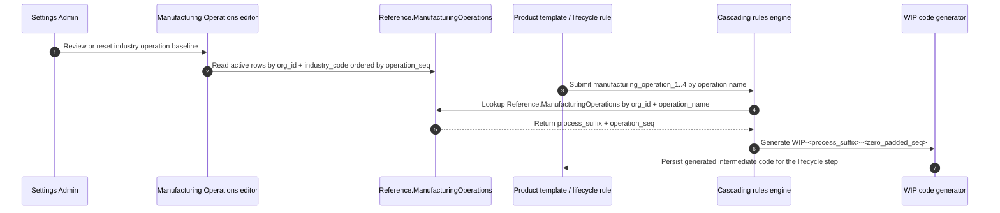

# Manufacturing Operations Integration

This page is the T-094 reference for how `Reference.ManufacturingOperations` supports generic product lifecycle naming in the Settings module. It connects PRD 02-SETTINGS §8.9.7, §8.9.8, and §8.9.14 to the seed file and the ADR decision record without changing the PRD or ADR sources.

## Generic Product Lifecycle Naming

[ADR-034 — Generic Product Lifecycle Naming & Industry Configuration](../../_foundation/decisions/ADR-034-generic-product-lifecycle-naming-and-industry-configuration.md) defines manufacturing operations as configurable lifecycle components. The table stores operation names, their short `process_suffix`, industry grouping, and `operation_seq` so product/WIP code generation can use generic names while each org keeps its industry-specific baseline.

`Reference.ManufacturingOperations` is the runtime reference table for these mappings. Current seeds are org-scoped with `org_id`, marked `APEX-CONFIG`, and remain tenant-safe by using the project-wide org context rather than legacy business-scope fields.

## ManufacturingOperations integration flow

The integration contract is intentionally narrow: consumers store or select operation names, then resolve them through `Reference.ManufacturingOperations` to obtain `process_suffix` and `operation_seq` for generated WIP/intermediate codes.

## Seed rows

Source SQL: `packages/db/seeds/manufacturing-operations.sql`.

The seed is idempotent via `ON CONFLICT (org_id, industry_code, process_suffix) DO NOTHING`, so rerunning it does not duplicate an operation suffix for the same org and industry. Bakery and FMCG can both use `MX` because `industry_code` is part of the uniqueness key.

| industry_code | operation_name | process_suffix | operation_seq | description |
|---|---|---:|---:|---|
| bakery | Mix | MX | 1 | Ingredient mixing stage |
| bakery | Knead | KN | 2 | Dough kneading stage |
| bakery | Proof | PR | 3 | Dough proofing / fermentation |
| bakery | Bake | BK | 4 | Oven baking stage |
| pharma | Synthesis | SY | 1 | API synthesis reaction |
| pharma | Separation | SE | 2 | Phase separation / extraction |
| pharma | Crystallization | CZ | 3 | Crystallization and filtration |
| pharma | Drying | DR | 4 | Final drying and sizing |
| fmcg | Mix | MX | 1 | Blending and mixing |
| fmcg | Fill | FL | 2 | Container filling |
| fmcg | Seal | SL | 3 | Container sealing / capping |
| fmcg | Label | LB | 4 | Label application |
| generic | Process_A | PA | 1 | Generic processing step A |
| generic | Process_B | PB | 2 | Generic processing step B |
| generic | Process_C | PC | 3 | Generic processing step C |
| generic | Process_D | PD | 4 | Generic processing step D |

## Source references

- `docs/prd/02-SETTINGS-PRD.md` §8.9.7 documents the industry seed rows and §8.9.8 documents the cascade lookup using `process_suffix` and `operation_seq`.
- `docs/prd/02-SETTINGS-PRD.md` §8.9.14 lists ADR-034, 01-NPD template/cascade dependencies, onboarding seed insertion, RBAC, and build-sequence cross-references.
- `packages/db/seeds/manufacturing-operations.sql` is the executable seed source for the 16 rows above.
- `lib/reference/ref-tables.enum.ts` registers `Reference.ManufacturingOperations` as a Settings reference table key.
