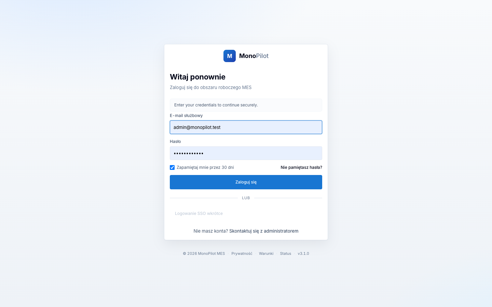
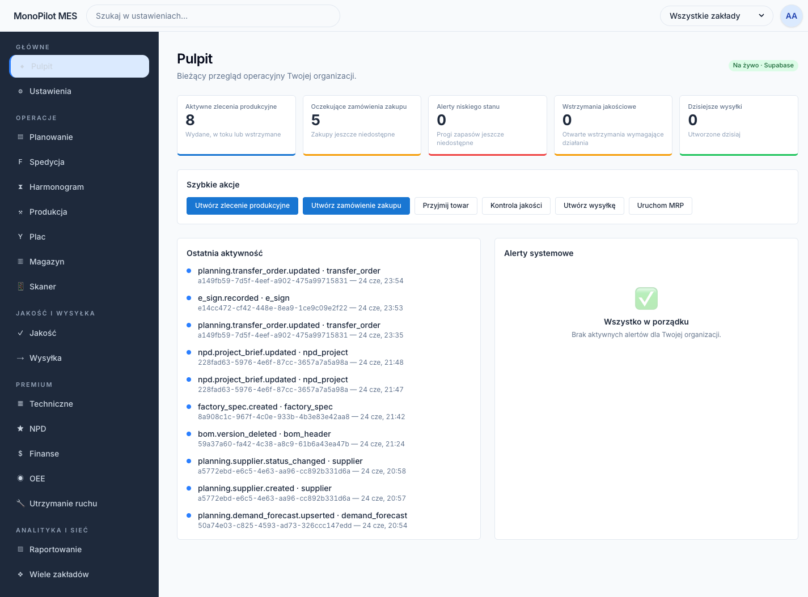

# Złoty przepływ — od stworzenia produktu do wysyłki (end-to-end)

> Jedna „ścieżka szczęśliwa" przez MonoPilot Kira: jak pozycja staje się produktem,
> otrzymuje recepturę i specyfikację fabryczną, zostaje zaplanowana, przyjęta, wyprodukowana,
> zwolniona przez QA i wysłana do klienta.
>
> Każdy krok poniżej zawiera odniesienie do **trasy** klikniętej przez użytkownika oraz do
> **akcji serwerowej / pliku**, który realizuje zapis. Elementy będące zaślepką lub częściową
> implementacją oznaczono **⚠️ PARTIAL** / **🔴 STUB**.
> Aplikacja = `apps/web` (Next.js App Router, Server Actions). DB = Supabase Postgres,
> w zakresie organizacji poprzez `withOrgContext` + RLS `app.current_org_id()`.
> Wspólna logika przyjęcia/produkcji znajduje się w `apps/web/lib/**`.
>
> Trasy zapisano bez folderów grup tras — np. `/technical/items` to plik
> `apps/web/app/[locale]/(app)/(modules)/technical/items/page.tsx`.
>
> Ostatni przegląd wykonano względem `HEAD` `4cf0a48c` oraz **niezatwierdzonego drzewa
> roboczego** (W11-R4 cofnięcia, E6 konwersja MRP + prognozy, E3 monitoring CCP,
> E-IO eksport PO, de-mockowanie skanera). Gdzie dana funkcja nie jest jeszcze zatwierdzona,
> zaznaczono to w tekście.

---

## Logowanie / Pierwsze kroki

Aby uzyskać dostęp do systemu MonoPilot Kira, zaloguj się na stronie logowania.



Zaloguj się jako `admin@monopilot.test` / `Admin2026!!!` — pojawi się pulpit operacyjny.



Na pulpicie widzisz bieżący stan produkcji: liczbę aktywnych zleceń produkcyjnych (WO), oczekujących zamówień zakupu (ZZ), oraz wstrzymań jakościowych (QA holds).

---

## 0. Dwa światy produktów (przeczytaj najpierw)

Istnieją **dwie** tabele master i NIE są tym samym:

| Tabela | Właściciel | Zawartość | Tworzona przez |
|---|---|---|---|
| `public.items` | 03-technical | Kanoniczny master pozycji — `rm`, `ingredient`, `intermediate`, `fg`, `co_product`, `byproduct`, `packaging`. BOMs/WOs/LPs odnoszą się DO NIEJ. | Kreator pozycji w Technical lub zwolnienie z NPD do fabryki |
| `public.product` | 01-npd | 69-kolumnowy agregat NPD „FA / produkt" (obszar roboczy Stage-Gate, formulacja, kalkulacja kosztów). | Kreator produktu/briefu NPD |

Enum `item_type`: `rm, ingredient, intermediate, fg, co_product, byproduct, packaging`
(`apps/web/.../technical/items/_actions/shared.ts:35`).
Cykl życia `items.status`: `draft → active → deprecated`, plus `blocked`
(`shared.ts:36`).

`product` z NPD staje się kanoniczną pozycją `fg` **item** dopiero gdy projekt NPD jest
*zwolniony do fabryki* (krok 2). Do tego momentu istnieje wyłącznie w świecie NPD.

---

## 1. Tworzenie pozycji (Technical)

**Trasa:** `/technical/items`
`apps/web/app/[locale]/(app)/(modules)/technical/items/page.tsx`

**Kliknij:** przycisk CTA nagłówka **"+ New item"** (`NewItemButton`, wymaga uprawnień `technical.items.create`)
→ otwiera wieloetapowy **kreator tworzenia pozycji**
(`items/_components/item-create-wizard.tsx`).

**Akcja tworzenia:** `createItem(...)`
`items/_actions/create-item.ts`
- Wymaga uprawnień `technical.items.create`; działa wewnątrz `withOrgContext` (RLS).
- `INSERT INTO public.items (...)` — item_code, item_type, name, status, podstawowa/dodatkowa
  jednostka miary, GS1, tryb ważenia + tolerancja catch-weight, termin przydatności,
  **hierarchia opakowań**
  (`output_uom, net_qty_per_each, each_per_box, boxes_per_pallet`), opcjonalne `cost_per_kg`
  (zapisuje księgę kosztów przez `cost/_actions/write-cost-ledger`).
- Zapisuje wiersz `audit_log` (`item.created`); unikalny klucz `(org_id, item_code)`.

**Szkic → aktywny:** `transitionItemStatus(...)`
`items/_actions/transition-item-status.ts`
- Wymaga uprawnień `technical.items.edit`. Dozwolone przejścia: `draft→active` (Aktywuj),
  `active→deprecated` (Wycofaj), `deprecated→active` (Reaktywuj). Nic nie wraca do
  `draft`; `blocked` jest własnością `deactivateItem` (`items/_actions/deactivate-item.ts`).
- **Brama aktywacji:** przejście `draft→active` jest odrzucane, jeśli `uom_base` nie jest
  kanoniczną jednostką miary (lista z migracji 267) — zapobiega przedostawaniu się
  historycznych jednostek tekstowych do BOM/planowania.

**Szczegóły / zakładki danych:** `/technical/items/[item_code]` — przegląd, alergeny,
wartości odżywcze, specyfikacje dostawcy (`items/[item_code]/page.tsx` + `_actions/*`).

**Zbiorczy import CSV:** `/technical/items/import` (podgląd + zatwierdzenie) —
`items/import/_actions/preview-import.ts` + `commit-import.ts`. *(Dotyczy wyłącznie pozycji
i jest odrębne od centrum Import/Export w ustawieniach opisanego w kroku 6 / lukach.)*

---

## 2. NPD → akceptacja / zwolnienie produktu

> „Pełen flow od akceptacji projektu": w tym systemie **akceptacja = NPD projekt
> przechodzący przez bramę Stage-Gate G4 i zwolniony do fabryki.** To zwolnienie tworzy
> kanoniczną pozycję `fg` + aktywny wspólny BOM + zatwierdzoną specyfikację fabryczną —
> czyli sprawia, że produkt staje się *produkowalny*. Nie ma osobnego przycisku „akceptuj";
> akceptacja jest sumą zatwierdzeń na bramach plus promocji podczas przekazania.

**Potok NPD:** `/pipeline` → projekt → `/pipeline/[projectId]`
`apps/web/app/[locale]/(app)/(npd)/pipeline/...`
Etapy (każdy z własną pod-trasą): brief · formulacja · żywienie · sensoryka · próba · pilot ·
opakowania · koszty · **brama** · **zatwierdzenie** · **przekazanie**.

**Utwórz projekt:** `createProject(...)`
`apps/web/app/(npd)/pipeline/_actions/create-project.ts`.

### Stage-Gate (G0–G4)

**Trasa:** `/pipeline/[projectId]/gate`

- **Przejście do następnego etapu:** `advanceProjectGate(...)`
  `apps/web/app/(npd)/pipeline/_actions/advance-project-gate.ts`
  - Natywnie etapowe: przechodzi przez `STAGE_ORDER` po jednym etapie operacyjnym naraz.
  - **Wejście w `packaging` (granica G3)** automatycznie tworzy **kandydata FG**
    (`createFgCandidate`) — pierwszy raz, gdy projekt otrzymuje właściwy uchwyt produktu.
  - **`approval → handoff`** wymaga ważnego **podpisu elektronicznego G4**
    (`assertG4ESignForHandoff`). `launched` jest etapem końcowym; ponowne przejście
    zwraca `ALREADY_CLOSED` (409).
- **Zatwierdź / odrzuć bramę:** `approveProjectGate(...)`
  `apps/web/app/(npd)/pipeline/_actions/approve-project-gate.ts`
  - Wymaga uprawnień `npd.gate.approve`; zapisuje wiersz zatwierdzenia bramy, podpis
    elektroniczny CFR-21 (`npd.gate.approved|rejected`), emituje `GATE_APPROVED_EVENT`.
  - `revert-npd-gate.ts` cofa jeden sąsiedni gate przez podpis PIN.

### Zwolnienie do fabryki (moment akceptacji)

**Trasa:** `/pipeline/[projectId]/handoff` → stopka **"✓ Promote to production BOM"**

**Akcja:** `promoteToProduction(...)`
`apps/web/app/[locale]/(app)/(npd)/pipeline/[projectId]/handoff/_actions/promote-to-production.ts`
1. RBAC `npd.handoff.promote` + lista kontrolna przekazania musi być **kompletna** (≥1 pozycja,
   wszystkie zaznaczone) → w przeciwnym razie `checklist_incomplete`.
2. **Wywołuje** właściwy flow zwolnienia do fabryki `releaseNpdProjectToFactory(...)`
   (`apps/web/app/(npd)/builder/_actions/release-npd-project-to-factory.ts`) — wykonuje
   własny **preflight** G4 / kandydatFG / aktywny-BOM / specyfikacja-fabryczna, upsertuje
   `factory_release_status` (`release_status='released_to_factory'`), i emituje
   `fg.released_to_factory`.
3. Jeśli preflight zablokuje operację, `promoteToProduction` **nie tworzy sztucznego BOM** —
   zwraca uczciwie `release_blocked` i pozostawia przekazanie bez promocji.
4. Po sukcesie: ustawia `handoff_checklists.bom_verification_status='promoted'` +
   `promote_to_production_date` + audyt `npd.handoff.promoted`.

**Co odblokowuje akceptacja:** kanoniczna pozycja `fg`, **aktywny** wspólny BOM oraz
**zatwierdzona/zwolniona** specyfikacja fabryczna — trzy rzeczy, których `releaseWorkOrder`
(krok 6) wymaga przed opuszczeniem przez WO stanu DRAFT.

---

## 3. BOM (lista materiałów)

**Trasa:** `/technical/bom`
`apps/web/app/[locale]/(app)/(modules)/technical/bom/page.tsx`
**Kliknij:** **"+ New BOM"** (wymaga uprawnień `technical.bom.create`) → wybór pozycji FG
→ szczegóły BOM.

Wspólne **SSOT BOM** = `bom_headers` + `bom_lines` (+ `bom_co_products`, migawki).
Maszyna stanów wersji: `draft → technical_approved → active` (poprzednio aktywna →
`superseded`).

| Krok | Akcja | Plik |
|---|---|---|
| Utwórz nagłówek szkicu | `createBomDraft(...)` | `bom/_actions/create-draft.ts` |
| Dodaj / edytuj / usuń linie (wielo-wierszowo) | akcje linii | `bom/_actions/line-actions.ts` |
| Zatwierdź `draft\|in_review → technical_approved` | `approveBom(...)` | `bom/_actions/workflow.ts` |
| Opublikuj `technical_approved → active` | `publishBom(...)` | `bom/_actions/workflow.ts` |

- `approveBom` ponownie sprawdza **brak cykli** (V-TEC-13) oraz **użyteczność surowców**
  (V-TEC-14) w momencie zatwierdzenia; zapisuje `approved_by/approved_at`.
- `publishBom` **wycofuje** poprzednią aktywną wersję dla danego produktu w **tej samej
  transakcji** (atomowo), a następnie emituje `fg.bom.released` do skrzynki nadawczej.
  Wycofanie = ponowne opublikowanie wcześniejszej wersji.
- **Zasada clone-on-write — linia czerwona:** zatwierdzona/aktywna *zawartość* BOM nigdy nie
  jest zmieniana — porusza się tylko kolumna statusu (trigger niezmienności migration-090).
- **Produkty uboczne / rozkład:** `bom_co_products` przechowuje produkty współwyprodukowane
  i uboczne; WO materializuje jeden wiersz `wo_outputs` na typ produktu przy uruchomieniu
  (krok 8).

Historia / różnice / migawki: `bom/_actions/history.ts`, `diff-action.ts`,
`/technical/boms/snapshots`.

---

## 4. Zwolnienie specyfikacji fabrycznej (pakiet zatwierdzeń Technical)

**Trasa:** `/technical/factory-specs`
`apps/web/app/[locale]/(app)/(modules)/technical/factory-specs/page.tsx`
`factory_specs.status`: `draft → in_review → approved_for_factory → released_to_factory`
(+ `superseded`, `archived`).

| Krok | Akcja | Plik |
|---|---|---|
| Utwórz specyfikację | `createFactorySpec(...)` | `factory-specs/actions/create-factory-spec.ts` |
| Prześlij do przeglądu (`draft→in_review`) | `submitFactorySpecForReview(...)` | `factory-specs/actions/factory-spec-flow.ts` |
| Powiąż wersję BOM ze specyfikacją | `linkFactorySpecBom(...)` | `factory-specs/actions/factory-spec-flow.ts` |
| **Zatwierdź pakiet** (specyfikacja **+** BOM łącznie) | `approveReleaseBundle(...)` | `apps/web/lib/technical/release-bundle-service.ts` |

**Zatwierdzenie pakietu (kluczowa brama):** specyfikacja fabryczna i jej **konkretna wersja
BOM** są zatwierdzane **RAZEM LUB WCALE** (atomowo) — obsługiwane przez panel Release bundle
(`factory-specs/_components/release-bundle-panel.client.tsx`):
- Wymaga uprawnień `technical.product_spec.approve` + `technical.bom.approve`; podpis
  elektroniczny CFR-21, cel `tech.fa.release`.
- W JEDNEJ transakcji: specyfikacja → `approved_for_factory`, BOM
  `draft|in_review → technical_approved` (lub pozostaje `active`), emituje
  **`technical.factory_spec.approved`** do skrzynki nadawczej, a adapter NPD zamyka pętlę
  zwolnienia (`factory_release_status`).
- **Clone-on-write:** edytowanie *zwolnionego* pakietu tworzy nową wersję roboczą; zwolniony
  rekord pozostaje niezmienialny (trigger migration-165 + `factory-spec-release-guards.ts`).

### NOWOŚĆ — Wycofanie specyfikacji (W11-R4 odwracalność)

**Akcja:** `recallFactorySpec(...)`
`factory-specs/_actions/recall-spec.ts`
- Wymaga uprawnień `technical.factory_spec.recall`. Przenosi specyfikację
  `released_to_factory` **z powrotem do `draft`**, czyszcząc `approved_by/at` +
  `released_by/at`.
- **Zablokowane**, jeśli jakikolwiek WO ze `status in (RELEASED, IN_PROGRESS)` się do niej
  odwołuje (`active_factory_spec_id`) — zwraca numery blokujących zleceń produkcyjnych.
- Audytowane jako `technical.factory_spec.recalled`. *(Podpis elektroniczny R4 jest
  udokumentowanym TODO.)*

---

## 5. Marszruty / operacje produkcyjne (skrót)

**Trasa:** `/technical/routings`
`apps/web/app/[locale]/(app)/(modules)/technical/routings/page.tsx`
- `createRouting(...)` → nagłówek marszruty ze `status='draft'`
  (`routings/_actions/create-routing.ts`), z zerem lub więcej operacjami.
- `approveRouting(...)` (`routings/_actions/approve-routing.ts`): `draft → approved`,
  a następnie przy aktywacji **wycofuje** poprzednią aktywną marszrutę
  (`status='superseded'`, `effective_to=today`).
- `cost-preview.ts` podgląda koszt robocizny/maszyny na operację.
- **Aktywna** marszruta jest migawkowana do `wo_operations` w momencie tworzenia WO (krok 6).

---

## 6. Planowanie — ZZ, TO, WO, MRP, prognozy

**Trasy modułu:** `/planning/...`
`apps/web/app/[locale]/(app)/(modules)/planning/...`
Brama zapisu dla zaopatrzenia = `npd.planning.write` (`hasPlanningWritePermission`,
`planning/_actions/procurement-shared.ts`).

### Zamówienia zakupu (zaopatrzenie)
**Trasa:** `/planning/purchase-orders` (szczegóły `/[id]`) — `purchase-orders/page.tsx`
- `createPurchaseOrder(...)` itd. — `purchase-orders/_actions/actions.ts`. Status ZZ:
  `draft → sent → confirmed → partially_received → received` (+ `cancelled`); serwerowa
  maszyna stanów `PO_TRANSITIONS`.
- **NOWOŚĆ — Eksport (E-IO, niezatwierdzone):** `createExportJob(...)`
  `purchase-orders/_actions/create-export-job.ts` — eksport CSV tej samej przefiltrowanej
  listy co na ekranie (czytelny dla człowieka, bez UUID), zapisuje wiersz
  `import_export_jobs`. Tylko eksport.

### Zlecenia transferu (między lokalizacjami/zakładami)
**Trasa:** `/planning/transfer-orders` — `transfer-orders/_actions/actions.ts`
(+ `reverse-receive.ts` dla cofnięcia przyjęcia TO w W11).

### Zlecenia produkcyjne
**Trasa:** `/planning/work-orders` (szczegóły `/[id]`) — `work-orders/page.tsx`
- **Utwórz:** `createWorkOrder(...)` — `work-orders/_actions/createWorkOrder.ts`
  - Wymaga, by pozycja FG miała **aktywny BOM** + specyfikację fabryczną w stanie
    `(approved_for_factory, released_to_factory)`.
  - Migawkuje `uom_snapshot` + materializuje `wo_materials` z aktywnego BOM oraz
    `wo_operations` z aktywnej marszruty w momencie tworzenia. Ilość wpisana w jednostce
    produktu jest przeliczana na podstawową przez `lib/uom`. *(To przeliczenie to
    „podgląd konwersji WO".)*
- **Zwolnienie (brama B9):** `releaseWorkOrder(...)` — `work-orders/_actions/releaseWorkOrder.ts`
  - Tylko `DRAFT → RELEASED`. Samodzielnie naprawia `active_bom_header_id` +
    `active_factory_spec_id` z pozycji FG; jeśli którykolwiek nadal brakuje →
    **`factory_release_incomplete`** (to jest brama „zwolnienie zablokowane do czasu
    zwolnienia specyfikacji"). Zapisuje `wo_status_history`.
- **Edycja szkicu (W11-R1):** `update-work-order.ts` umożliwia edycję DRAFT WO przed
  zwolnieniem.

### MRP
**Trasa:** `/planning/mrp` — akcje w `planning/_actions/mrp.ts`
- **`runMrp({ persist })`** — brama odczytu `scheduler.run.read`; bilansuje zapotrzebowanie
  versus dostawę (`wo_materials` pozostałe, `v_inventory_available`, pozostałość otwartego
  ZZ, `schedule_outputs`, `reorder_thresholds` + czas realizacji dostawcy). Przy
  `persist:true` zapisuje nagłówek `mrp_runs`, `mrp_requirements` i **`mrp_planned_orders`**
  (sugerowane), a następnie emituje `planning.mrp.completed`. *(Opis nagłówka pliku nadal
  twierdzi, że planowane zlecenia nie są zapisywane — jest to nieaktualne;
  `persistPlannedOrders` (mrp.ts:461) zapisuje je.)*
- **NOWOŚĆ — konwersja sugestii (E6, niezatwierdzone):**
  `convertPlannedToPo(plannedOrderIds)` i `convertPlannedToWo(plannedOrderIds)`
  (`mrp.ts:731` / `:802`) — wymaga uprawnień `planning.mrp.convert` **i** `npd.planning.write`;
  wywołuje właściwe `createPurchaseOrder` / `createWorkOrder`, a następnie oznacza planowane
  zlecenia `release_status='released'` z `released_order_id`.

### Prognozy (NOWOŚĆ, niezatwierdzone)
**Trasa:** `/planning/forecasts` — `planning/_actions/forecasts.ts`
- Edytowalna siatka zapotrzebowania (`demand_forecasts`, mig-302 unikalny klucz
  `(org, item, iso_week)`); brama zapisu na `planning.forecast.manage`.
  `upsertForecast` / `deleteForecast` / kopiowanie do przodu. Tylko typy pozycji kwalifikujące
  się do prognozowania (zbliżone do FG) niosą niezależne zapotrzebowanie; komponenty wynikają
  z rozwinięcia BOM.

---

## 7. Magazyn — przyjęcie, dokument GRN, etykiety LP, odłożenie, FEFO

> Zapis przyjęcia ZZ to **jedna wspólna funkcja** używana zarówno przez ścieżkę desktopową,
> jak i skanerową: `apps/web/lib/warehouse/scanner/receive-po.ts` (`receivePoLine`).
> Wywoływana jest przez trasę API skanera
> `apps/web/app/api/warehouse/scanner/receive-line/route.ts`.

**Przyjęcie linii ZZ** → w jednej transakcji `receivePoLine` (`receive-po.ts`):
1. `INSERT public.grns` (+ `grn_items`) — automatyczny `grn_number`, powiązanie ZZ +
   dostawca + magazyn.
2. `INSERT public.license_plates` — **LP** (jednostka partii/ilości), tworzona ze
   `status='received', qa_status='pending'` w docelowej lokalizacji (`toLocationId` lub
   domyślna magazynu), z migawką partii / daty ważności / okresu przydatności.
3. Zapisuje wiersz genezy LP (korzeń genealogii).
4. Aktualizuje status ZZ (`partially_received` / `received`); ustawia flagę `overReceived`.
5. **GRN-QC → blokada QA (zaktualizowane):** LP jest **zawsze** tworzone ze
   `qa_status='pending'` — **nigdy nie jest automatycznie zwalniane**. Gdy flaga dzierżawcy
   `feature_flags->require_grn_qc_inspection` jest WŁĄCZONA, `receivePoLine` *dodatkowo*
   otwiera oczekującą **inspekcję jakościową** dla LP (`requiresGrnQcInspection` →
   `insertQcInspectionForLp`). W obu przypadkach towar **nie nadaje się do zużycia** dopóki
   QA go nie zwolni (krok 9) — LP ze `qa_status='pending'` jest wykluczone z kandydatów
   FEFO do zużycia.

**Przepływ przyjęcia na skanerze (UI):** `/scanner/receive-po` → `[poId]` → `[lineId]`
(`apps/web/app/[locale]/(scanner)/scanner/receive-po/...`).

**Odłożenie / przeniesienie LP:** `/warehouse/movements` (oraz `/scanner/putaway`,
`/scanner/move`) →
`createStockMove(...)` `warehouse/_actions/stock-move-actions.ts` — zapisuje wiersz
`stock_moves` i aktualizuje `location_id` LP.

**FEFO:** odczyty zapasów porządkują LP wg daty ważności przez `v_inventory_available`
(mig-191); pozycje bez okresu przydatności sortują się na końcu (`NULLS LAST`).
Zapytanie o kandydatów do zużycia żyje w
`production/_actions/consume-material-actions.ts:listConsumableLps`
(`status='available' AND qa_status='released'`, minus zarezerwowane).

Pozostałe ekrany magazynowe (rzeczywiste, odczyt/zapis): `/warehouse/grns`,
`/license-plates`, `/inventory`, `/expiry`, `/reservations`, `/genealogy`, `/locations`.

---

## 8. Produkcja — start, zużycie, rejestracja wyrobu, odpad, odwracalność, CCP

**Trasy modułu:** `/production/...`
`apps/web/app/[locale]/(app)/(modules)/production/...`
Kanoniczny właściciel `wo_outputs`, `wo_waste_log`, `downtime_events`, migawek OEE.

### Uruchomienie zlecenia produkcyjnego
`startWo(...)` — `apps/web/lib/production/start-wo.ts`
- `RELEASED → IN_PROGRESS`. **Zamraża BOM** (`createBomSnapshot`, idempotentne dla
  `org/wo/bom_header`) i materializuje `wo_outputs` z `schedule_outputs` (jeden wiersz na
  typ wyrobu: fg / co_product / by_product).
- **Brama bezpieczeństwa żywności:** jeśli `allergen_profile_snapshot.segregation_required`
  jest true dla danego WO, **START jest twardą blokadą**.

### Zużycie materiału (pobranie LP wg FEFO)
`recordDesktopConsumption(...)` — `production/_actions/consume-material-actions.ts`
(odpowiednik skanerowy przez `app/api/production/scanner/wos/[id]/consume/route.ts`)
- Pobiera z LP posortowanych wg FEFO (`listConsumableLps`).
- **Brama bezpieczeństwa LP** (`lib/production/lp-safety-guard.ts:assertLpConsumableForProduction`):
  odrzuca `lp_not_released` (brak `qa_status='released'`), przestarzałość oraz deleguje
  **aktywne blokady jakościowe** do T-064 `holdsGuard`
  (`lib/production/holds-guard.ts`) → przy dopasowaniu blokady zwraca `quality_hold_active`
  (409) i emituje `production.consume.blocked`.
- **Dwupoziomowa brama nadmiernego zużycia** (ta sama transakcja): poziom **ostrzeżenia**
  oraz poziom **zatwierdzenia** przy `feature_flags->overconsume_threshold_pct`, który
  **blokuje** (wymagane zatwierdzenie przełożonego) powyżej limitu. Aktualizuje
  `wo_materials.consumed_qty` + dekrementuje LP.

### Rejestracja wyrobu (catch-weight)
`registerOutput(...)` — `apps/web/lib/production/output/register-output.ts`
(skaner przez `app/api/production/scanner/wos/[id]/output/route.ts`)
- INSERT do `wo_outputs` (unikalność partii w roku V-PROD-24) i tworzy **LP wyrobu**
  ze `status='received', qa_status='pending'` (gotowy wyrób również zaczyna na blokadzie QA).
- **Catch-weight:** gdy `weight_mode='catch'`, zapisuje `catch_weight_details` z tablicy kg
  na jednostkę i oblicza odchylenie ± tolerancja vs. wartość nominalna.
- **Powiązanie genealogii:** nowy LP wyrobu `parent_lp_id` = **pierwszy zużyty LP**;
  **wszystkie** zużyte LP zapisane w `ext_jsonb.consumed_lp_ids` (brak tabeli łączącej
  na razie). Emituje `PRODUCTION_OUTPUT_RECORDED_EVENT`.

### Odpad
`recordWaste(...)` — `apps/web/lib/production/waste/record-waste.ts` → `wo_waste_log`
(odpad zawsze w **kg**).

### Odwracalność (W11 R2 / R3 / R4 — dostarczone w tej fali)
`production/_actions/corrections-actions.ts`:
- **`voidWoOutput(...)`** (R2) — unieważnia wiersz `wo_outputs`, podpis elektroniczny
  `production.output.void`, **zapis storno** jako wpis przeciwny; LP wyrobu przechodzi do
  stanu unieważnionego innego niż `consumed`, aby nie zanieczyszczać zużycia.
- **`voidWasteEntry(...)`** (R2) — unieważnia wpis `wo_waste_log` z wpisem przeciwnym.
- **`reverseConsumption(...)`** (R3) — podpis elektroniczny
  `production.consumption.reverse`; przywraca `wo_materials.consumed_qty` i ilość LP.
  *(Brak dedykowanego zdarzenia cofnięcia w rodzinie skrzynki nadawczej `production.*` —
  audytowane jako `consumption_reversed`.)*

### NOWOŚĆ — Monitoring CCP (E3, niezatwierdzone)
**Trasa:** `/quality/ccp-monitoring`
`apps/web/app/[locale]/(app)/(modules)/quality/ccp-monitoring/page.tsx`
- Tablica CCP z ostatnim odczytem + znacznik W/POZA limitem; **"+ Record reading"**.
- Używa zweryfikowanego backendu HACCP `quality/_actions/haccp-actions.ts`
  (`listCcps`, `listMonitoringLog`, **`recordMonitoring`**). Odczyt poza limitem powoduje
  **odchylenie CCP → automatyczne NCR** (`ccp_deviation`, `breach_ncr_id`).
- ⚠️ PARTIAL: pasek filtrów / wykres osi czasu / pełna tabela odczytów z prototypu są
  udokumentowanym odroczeniem — to jest minimalny wycinek E3.

---

## 9. Jakość — blokady, NCR, specyfikacje, inspekcje, bramy HACCP/CCP

**Trasy modułu:** `/quality/...`
`apps/web/app/[locale]/(app)/(modules)/quality/...`

| Obszar | Trasa | Plik akcji |
|---|---|---|
| Blokady (założenie / zdjęcie) | `/quality/holds` | `_actions/hold-actions.ts` |
| Przepływ NCR | `/quality/ncrs` | `_actions/ncr-actions.ts` |
| Specyfikacje + kreator specyfikacji | `/quality/specifications` | `_actions/spec-actions.ts` |
| Inspekcje (w tym GRN-QC z kroku 7) | `/quality/inspections` | `_actions/inspection-actions.ts` |
| HACCP / CCP (w tym monitoring z kroku 8) | `/quality/ccp-monitoring` | `_actions/haccp-actions.ts` |

**Gdzie jakość bramkuje złoty przepływ:**
- **GRN-QC** wstrzymuje przyjęty towar na `qa_status='pending'` do czasu zwolnienia QA
  (`warehouse/_actions/lp-qa-actions.ts`), co zmienia LP na `qa_status='released'` i
  udostępnia go jako kandydata FEFO.
- **Brama zużycia (T-064):** aktywne blokady + niezwolnione LP blokują zużycie w kroku 8.
- **Naruszenie CCP:** odczyt poza limitem → odchylenie + automatyczne NCR.
- **Segregacja alergenów:** blokuje START WO (krok 8) gdy migawka wymaga segregacji.

---

## 10. Wysyłka — SO, alokacja, kompletowanie/pakowanie/wysyłka

> 🔴 **STUB — przeczytaj uważnie.** **Akcje serwerowe istnieją i zapisują rzeczywiste dane**,
> ale **strona `/shipping` jest szkieletem** (pokazuje tylko liczbę rekordów). Brak
> interfejsu SO / alokacja / kompletowanie / pakowanie / wysyłka podłączonego do tych akcji.

**Strona (zaślepka):** `/shipping`
`apps/web/app/[locale]/(app)/(modules)/shipping/page.tsx` — renderuje
`ModuleDataPanel` z licznikiem `getModuleCount('shipment')`. Brak siatki SO.

**Akcje (rzeczywiste):** `apps/web/app/[locale]/(app)/(modules)/shipping/_actions/so-actions.ts`
- `createSalesOrder(...)` — nagłówek SO + linie.
- `transitionSalesOrderStatus(...)` — serwerowa maszyna stanów `LEGAL_TRANSITIONS`:
  `draft → confirmed → allocated → partially_picked → picked → partially_packed → packed →
  shipped` (+ `cancelled`). Bramy: `ship.so.create` / `ship.so.confirm` / `ship.so.cancel`.
- Alokacja: potwierdzenie rezerwuje `inventory_allocations`; anulowanie
  `deallocateSalesOrderInContext(...)` zwalnia blokady LP (`InsufficientStockError` gdy
  brakuje zapasów).

⚠️ PARTIAL: statusy kompletowania/pakowania/wysyłki są zamodelowane w tabeli przejść, ale
**etykiety SSCC-18, generowanie BOL/POD i integracje z przewoźnikami nie są jeszcze
zaimplementowane** jako akcje w tym pliku.

---

## Diagram — cały złoty przepływ

### Mermaid (renderuje się na GitHub)

```mermaid
flowchart TD
    subgraph TECH["03-Technical / 01-NPD"]
        I["Item created<br/>public.items (draft)<br/>createItem"]
        I -->|transitionItemStatus| IA["Item active"]
        NPD["NPD project<br/>public.product"]
        NPD -->|advanceProjectGate G0-G4<br/>approveProjectGate (e-sign G4)| GATE["G4 passed"]
        GATE -->|promoteToProduction →<br/>releaseNpdProjectToFactory| FGITEM["Canonical fg item<br/>+ factory_release_status"]
        BOM["BOM draft<br/>bom_headers/lines<br/>createBomDraft"]
        BOM -->|approveBom / publishBom| BOMA["BOM active<br/>(fg.bom.released)"]
        FS["factory_spec draft"]
        FS -->|submit + linkFactorySpecBom| FSR["spec in_review"]
        FSR -->|approveReleaseBundle (e-sign)<br/>spec+BOM atomic| FSAP["spec approved_for_factory<br/>technical.factory_spec.approved"]
        BOMA -.bundled with.- FSAP
        FSAP -.recallFactorySpec R4.-> FS
    end

    subgraph PLAN["04/07-Planning"]
        MRP["runMrp → mrp_planned_orders<br/>(+ forecasts demand_forecasts)"]
        MRP -->|convertPlannedToPo / ToWo| PO
        PO["PO draft → sent<br/>createPurchaseOrder"]
        WO["WO draft<br/>createWorkOrder<br/>(snapshots wo_materials + wo_operations)"]
        WO -->|releaseWorkOrder<br/>needs active BOM + approved spec| WOR["WO RELEASED"]
    end

    subgraph WH["05-Warehouse"]
        GRN["receivePoLine →<br/>GRN + grn_items"]
        LP["License Plate<br/>status=received, qa_status=pending"]
        GRN --> LP
        LP -->|createStockMove| PUT["Put-away (location_id)"]
        LP -->|require_grn_qc_inspection| QHOLD["QA inspection (pending)"]
    end

    subgraph PROD["08-Production"]
        START["startWo<br/>freeze BOM snapshot<br/>materialize wo_outputs"]
        CONS["recordDesktopConsumption<br/>FEFO LP pick · holds/LP gate<br/>over-consume 2-tier"]
        OUT["registerOutput (catch-weight)<br/>wo_outputs + output LP"]
        WASTE["recordWaste → wo_waste_log (kg)"]
        START --> CONS --> OUT --> WASTE
        OUT -.voidWoOutput / reverseConsumption R2/R3.-> CONS
        CCP["CCP monitoring<br/>recordMonitoring → auto-NCR"]
    end

    subgraph QA["09-Quality"]
        REL["QA release LP<br/>qa_status=released (FEFO-consumable)"]
    end

    subgraph SHIP["11-Shipping (actions real, page STUB)"]
        SO["SO draft → confirmed → allocated<br/>createSalesOrder / transitionSalesOrderStatus<br/>inventory_allocations"]
        SHP["picked → packed → shipped"]
        SO --> SHP
    end

    IA --> BOM
    FGITEM --> BOM
    FGITEM --> FS
    BOMA --> WO
    FSAP --> WO
    PO --> GRN
    QHOLD --> REL
    LP --> REL
    REL --> CONS
    WOR --> START
    OUT --> REL
    REL --> SO

    %% data objects threading genealogy
    LP -. parent_lp_id .-> OUT
    OUT -. consumed_lp_ids[] .-> CONS
    OUT -. shipped LP .-> SO
```

### Wersja ASCII (zapasowa)

```
  ITEM (public.items, createItem) --draft→active (transitionItemStatus)--> ACTIVE ITEM
                                                                              |
  NPD project (public.product) --gate G0..G4 (advance/approveProjectGate, e-sign G4)--+
        |                                                                             |
        +-- promoteToProduction → releaseNpdProjectToFactory --> CANONICAL fg ITEM ---+
                                                                              |
                                            v---------------------------------+
                            BOM (bom_headers/lines) --approveBom→publishBom--> BOM ACTIVE  (fg.bom.released)
                            FACTORY_SPEC --submit+linkBom--> in_review                 |
                                   \                                                   |
                                    +-- approveReleaseBundle (spec+BOM ATOMIC, e-sign) +--> SPEC approved_for_factory
                                                                                       |     (technical.factory_spec.approved)
                                                                                       |     [recallFactorySpec R4 → back to draft]
        MRP (runMrp → mrp_planned_orders)  + FORECASTS (demand_forecasts)              |
                |                                                                      |
   convertPlannedToPo / convertPlannedToWo                                             |
                |                                                                      v
                +--> PO (createPurchaseOrder) ----> RECEIVE (receivePoLine) ==> GRN + LICENSE PLATE
                |                                       LP: status=received, qa_status=PENDING
                |                                            |               (require_grn_qc_inspection → QA inspection)
                +--> WO (createWorkOrder, snapshots wo_materials+wo_operations)        |
                          |                                  put-away (createStockMove) v
                   releaseWorkOrder  (needs active BOM + approved spec) --> WO RELEASED |
                          |                                                             |
                          v                                       QA release LP (qa_status=RELEASED, FEFO-consumable)
                     startWo (freeze BOM snapshot, materialize wo_outputs)             |
                          |                                                            |
                     recordDesktopConsumption  <---- FEFO consume RELEASED LP ---------+
                       (LP/holds gate T-064, 2-tier over-consume)
                          |          ^  reverseConsumption (R3)
                          v          |
                     registerOutput (catch-weight) → wo_outputs + OUTPUT LP
                          |          ^  voidWoOutput (R2, storno)
                          |          \---- genealogy: parent_lp_id = first consumed LP
                          |                            consumed_lp_ids[] = all consumed LPs
                          v
                     recordWaste → wo_waste_log (kg)
                          |
   (output LP) QA release → SO (createSalesOrder) → confirmed → allocated (inventory_allocations)
                          → picked → packed → shipped   [ACTIONS REAL · /shipping PAGE = STUB]

  Data objects threading the chain:
     item  →  bom_headers/bom_lines  →  wo_materials (BOM snapshot)  →  consume
     item  →  schedule_outputs       →  wo_outputs  →  output LP  →  SO / inventory_allocations
     LP genealogy: license_plates.parent_lp_id + ext_jsonb.consumed_lp_ids  (traceGenealogy)
```

---

## GDZIE TO SIĘ PSUJE / LUKI (zweryfikowane)

### ✅ W pełni działające (akcja + UI + rzeczywiste Supabase)
- **Pozycje**: lista/tworzenie/edycja/dezaktywacja/przejście + zakładki szczegółów + import CSV
  (`technical/items/_actions/*`).
- **BOM**: szkic → technical_approved → aktywny, wycofanie, migawki
  (`technical/bom/_actions/workflow.ts`).
- **Specyfikacje fabryczne**: tworzenie → przesłanie → powiązanie BOM → zatwierdzenie pakietu
  (atomowe, podpis elektroniczny) → wycofanie
  (`release-bundle-service.ts`, `recall-spec.ts`).
- **NPD Stage-Gate + zwolnienie**: przejście/zatwierdzenie bram + `promoteToProduction`
  (`(npd)/pipeline/_actions/*`, `handoff/_actions/promote-to-production.ts`).
- **Planowanie**: tworzenie ZZ/TO/WO + brama zwolnienia WO + edycja szkicu; uruchomienie+zapis
  MRP; **konwersja MRP** i **prognozy** (niezatwierdzone, ale podłączone)
  (`planning/_actions/*`, `work-orders/_actions/*`).
- **Przyjęcie magazynowe**: GRN + LP + odłożenie + FEFO, zarówno desktop jak i skaner
  współdzielą `lib/warehouse/scanner/receive-po.ts`.
- **Produkcja**: start / zużycie (FEFO + bramy) / rejestracja wyrobu (catch-weight) / odpad +
  odwracalność (unieważnienie wyrobu/odpadu, cofnięcie zużycia).
- **Jakość**: blokady, NCR, specyfikacje, inspekcje, HACCP; strona **monitoringu CCP**
  (niezatwierdzona).

### ⚠️ PARTIAL
- **Monitoring CCP (E3)**: tablica + rejestracja odczytu działają; pasek filtrów,
  wykres osi czasu i pełna tabela odczytów z prototypu są **udokumentowanym odroczeniem**
  (`quality/ccp-monitoring/page.tsx:7-11`).
- **Dryf komentarzy MRP**: nagłówek `mrp.ts` nadal twierdzi, że `mrp_planned_orders` nie
  są zapisywane; `persistPlannedOrders` (`mrp.ts:461`) *zapisuje je* — ścieżka konwersji
  na tym polega.
- **Model genealogii**: jeden `parent_lp_id` na LP; zużycie wielokrotnych rodziców jest
  przechowywane w `ext_jsonb.consumed_lp_ids` (brak tabeli łączącej `lp_genealogy` na razie —
  `register-output.ts:280-282`).
- **Linia skanera → zakład**: `production_line_id` WO / `site_id` operacji mogą być NULL
  w dniu 1; klucze linii są rozwiązywane uuid↔code przez `production_lines` i mogą być null
  w historycznych wierszach (`lib/production/start-wo.ts:53,155-160`). Odnotowane jako znana
  luka jakości danych.
- **Centrum Import/Export w ustawieniach**: **import** danych głównych + encji ustawień jest
  renderowany z `featureAvailable={false}` (wyłączony) — aktywny jest tylko **eksport**
  (`settings/import-export/page.tsx:322,348`; przycisk suchego przebiegu zamyka się
  z błędem gdy wywołujący nie ma uprawnień). *(To jest centralne centrum; import CSV
  tylko dla pozycji z kroku 1 jest odrębny i aktywny.)*

### 🔴 STUB
- **Strona wysyłki**: `/shipping` to szkielet strony docelowej (tylko liczba rekordów).
  Akcje SO / alokacja / kompletowanie / pakowanie / wysyłka w
  `shipping/_actions/so-actions.ts` są rzeczywiste i zapisują dane, ale **żaden interfejs
  nie jest do nich podłączony**, a **etykiety SSCC-18 / BOL / POD / przewoźnicy nie są
  zaimplementowane** w tym pliku akcji.
- **`apps/worker`**: aplikacja konsumenta skrzynki nadawczej / crona przywołana przez
  przepływ zdarzeń (`fg.bom.released`, `technical.factory_spec.approved`, `production.*`,
  `planning.mrp.completed`) zapisuje do `outbox_events`, ale **nie istnieje jeszcze** jako
  działający konsument (zgodnie z `MON-project-overview`) — zdarzenia są utrwalane,
  nie rozsyłane.
```
