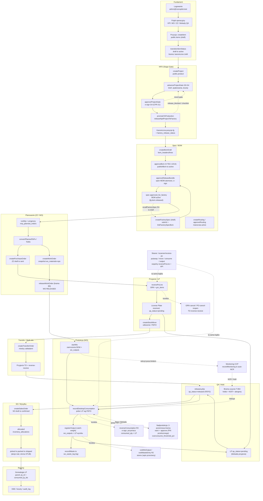
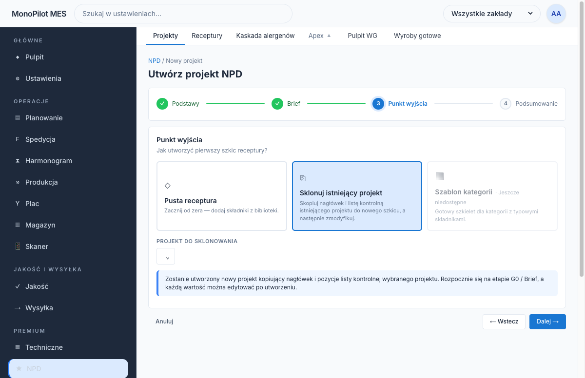
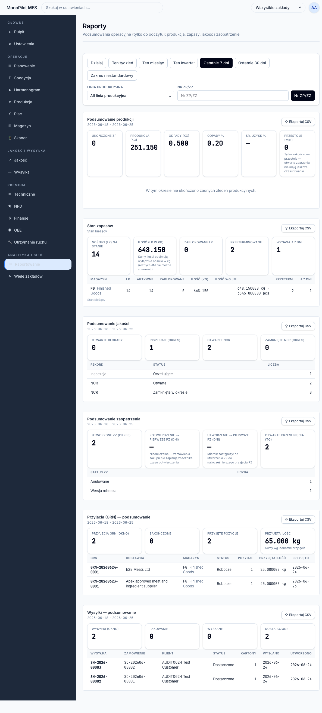

# MonoPilot Kira — Przepływ E2E testowy (przewodnik testera)

## 1. Wstęp

### Cel dokumentu
Ten dokument to **kompletny, drukowalny scenariusz testów E2E** całej ścieżki towaru w MonoPilot Kira — od konfiguracji infrastruktury, przez NPD (nowy produkt), dostawców i komponenty, specyfikację i BOM, zakupy, przyjęcie i ruchy magazynowe, produkcję (WO), jakość (hold/release), transfery i sprzedaż, aż po raporty i dashboardy. Każdy krok jest uziemiony w realnym kodzie aplikacji (Server Actions / route handlers / migracje) i opisuje też **rzeczy, które nie działają lub utkną** — żeby tester wiedział, czego się spodziewać.

### Jak używać
- **Idź od góry do dołu** — sekcja 3 (GŁÓWNY PRZEPŁYW) to jeden ciągły scenariusz z krokami ponumerowanymi 1..N. Wykonuj je w kolejności, bo każdy krok bazuje na danych utworzonych wcześniej.
- **Albo skacz po sekcjach** — jeśli testujesz tylko jeden obszar (np. produkcję), wejdź w odpowiednią część głównego przepływu; każdy krok ma własne **Warunki wstępne**, więc widać, co musi istnieć wcześniej.
- **Warianty** (sekcja 4) to ścieżki alternatywne (hold/release, korekty, skaner vs desktop, nadprodukcja, bramki NPD) — testuj je po przejściu głównego przepływu.
- **Aneks** (sekcja 5) zbiera wnioski krytyków: problemy kolejności, funkcje zapomniane oraz kroki, które zafailują na żywo.

### Dostęp
- **Login:** `admin@monopilot.test`
- **Hasło:** `Admin2026!!!`
- Konto jest super-userem organizacji (pełen zestaw uprawnień infrastrukturalnych, produkcyjnych, magazynowych i jakościowych).
- **Baza URL produkcji:** instancja na Vercel (deploy produkcyjny). **Przed testem potwierdź, że żywy deploy to bieżący commit** (Vercel dashboard / MCP) — „green push ≠ green deploy". Wszystkie trasy podawane są względem prefiksu locale `/pl/...`.

### Legenda symboli (struktura każdego kroku)
- **Cel** — co krok ma osiągnąć.
- **Gdzie** — trasa (`/pl/...`) + nazwa przycisku/ekranu; w nawiasach angielskie referencje akcji/route.
- **Warunki** (Warunki wstępne) — co musi istnieć/być prawdą przed wykonaniem.
- **Kroki** — ponumerowane czynności do wykonania.
- **Checklist** (Checklist testera) — konkretne rzeczy do zweryfikowania.
- **Cofnięcie** (Cofnięcie/korekta) — jak odwrócić lub poprawić efekt kroku.
- **Luki** (Znane luki) — co nie działa, jest niezbudowane, lub zachowuje się inaczej niż oczekiwano.

### Desktop vs Skaner
- **Desktop** — pełny interfejs webowy (logowanie e-mail + hasło, Server Actions). Większość kroków.
- **Skaner** — interfejs mobilny hali (`/pl/scanner/*`, logowanie PIN-em, API `/api/.../scanner/*`). Dotyczy przyjęć, ruchów LP, konsumpcji, wyjść, QC. Kroki skanera są wyraźnie oznaczone.

---

## 2. Diagram przepływu E2E

---

## 3. Główny przepływ (kroki 1..76)

> Jeden ciągły scenariusz. Kroki są numerowane bez przerw przez wszystkie segmenty A–J. Każdy krok bazuje na danych utworzonych wcześniej — **idź po kolei**.

### Część A — Fundament / konfiguracja

> Zakres: konfiguracja infrastruktury PRZED jakimkolwiek towarem — magazyn (+ pojęcie domyślnej lokalizacji wyjścia/OUTPUT), miejsce/zakład (site) i linia produkcyjna, maszyna, PRZYPISANIE maszyny do linii, lokalizacje (drzewo), oraz kontekst użytkowników/ról/uprawnień.
>
> ⚠️ Uwaga architektoniczna (do zapamiętania): zarządzanie liniami produkcyjnymi istnieje w DWÓCH miejscach naraz: (a) `Settings → Sites & lines` (`/settings/sites`) tworzy linię „lekko" (tylko site/kod/nazwa/status, BEZ maszyn) i (b) `Settings → Production lines` (`/settings/infra/lines`) tworzy/edytuje linię z sekwencją maszyn i bramką aktywacji V-SET-62. To DWA różne ekrany na ten sam byt `production_lines`. Do przypisania maszyn używaj WYŁĄCZNIE ekranu (b). (`apps/web/actions/infra/line.ts`)

---

#### Krok 1 — Logowanie i kontekst uprawnień (warunek wstępny całej ścieżki)
- **Cel:** Zalogować się jako administrator/właściciel org z pełnym zestawem uprawnień infrastrukturalnych (`settings.infra.read` / `settings.infra.update` / `settings.org.update`), bo bez nich wszystkie przyciski „Dodaj/Utwórz" są wyszarzone.
- **Gdzie:** `/pl/login` → potem `/pl/settings` (Desktop). Konto: `admin@monopilot.test` (super-user org po mig 332).
- **Warunki:** Istnieje org i zaseedowany użytkownik admin z rolą owner/admin (role mają uprawnienia w `role_permissions` + `roles.permissions` jsonb — muszą być zsynchronizowane).
- **Kroki:** 1) Otwórz `/pl/login`. 2) Wpisz e-mail i hasło admina. 3) Po zalogowaniu wejdź w `Ustawienia` (Settings) w menu bocznym.
- **Checklist:**
  1. Po wejściu w `Settings → Warehouses` przyciski `+ Dodaj magazyn` i `Utwórz magazyn` są AKTYWNE (dowód, że masz `settings.infra.update`).
  2. W `Settings → Sites & lines` widać przycisk `+ Add site` i (po wyborze site) `Add production line` jako klikalne.
  3. Jeśli przyciski są wyszarzone z komunikatem „Insufficient permissions: settings.infra.update is required…", rola NIE ma uprawnień — zgłoś, nie obchodź.
  4. Brak ról: sprawdź `Settings → Access → Users & roles` (`/settings/users`), czy admin ma rolę owner/admin.
- **Cofnięcie:** Wyloguj się i zaloguj na inne konto; uprawnienia zmienia się w `Settings → Users & roles` (edycja roli) — nie ma „undo" uprawnień per akcja.
- **Luki:** Nawigacja Ustawień jest celowo NIE-gated (`UI-128 keeps settings navigation ungated`), więc pozycje menu są widoczne nawet bez uprawnień — dopiero przyciski akcji są zablokowane serwerowo. To może mylić testera (widzi ekran, ale nie może nic zapisać). (`apps/web/lib/navigation/settings-nav.ts`)

---

#### Krok 2 — Utwórz Magazyn
- **Cel:** Utworzyć pierwszy magazyn, do którego później trafią dostawy i wyroby gotowe.
- **Gdzie:** `/pl/settings/infra/warehouses`, przycisk `+ Dodaj magazyn` → modal `Utwórz magazyn` (Desktop). Menu: `Settings → Organization → Warehouses`. (Stara ścieżka `/pl/settings/warehouses` przekierowuje tutaj.)
- **Warunki:** Zalogowany admin z `settings.infra.update` (krok 1).
- **Kroki:** 1) Wejdź w `Warehouses`. 2) Kliknij `+ Dodaj magazyn`. 3) Wypełnij `Kod` (Code) i `Nazwa` (Name); `Adres` (Address) opcjonalnie. 4) Kliknij `Utwórz magazyn`.
- **Checklist:**
  1. Po zapisie nowy wiersz pojawia się NA GÓRZE tabeli z „Warehouse created.".
  2. Kod wymuszany jako wielkie litery/cyfry/`-`/`_` (regex `^[A-Z0-9][A-Z0-9_-]{0,31}$`) — wpisz `mag-1`, sprawdź zapis jako `MAG-1`.
  3. Duplikat kodu = błąd „Warehouse could not be created." (`on conflict (org_id, code) do nothing` → `already_exists`).
  4. Kolumny `Zones`/`Bins`/`Capacity`/`Used` dla świeżego magazynu = `0`/`—`.
  5. Status nowego magazynu = `Aktywny`.
- **Cofnięcie:** Brak twardego usuwania — tylko DEAKTYWACJA: zaznacz checkbox → `Bulk Deactivate` (przy aktywnych WO miękkie ostrzeżenie `SOFT_WARNING_ACTIVE_WO`, potwierdź `Confirm deactivation`). Zapisuje `deactivated_at`, nie kasuje rekordu. (`apps/web/actions/infra/warehouse.ts`)
- **Luki:** Formularz przyjmuje TYLKO kod/nazwa/adres — NIE ma pola „site" ani „domyślnej lokalizacji wyjścia". `site` w tabeli jest derywowane z pola address jsonb.

---

#### Krok 3 — Ustaw reguły składowania magazynu (FEFO/FIFO + wygaśnięcie)
- **Cel:** Ustawić strategię przydziału koszy i obsługę wygasania zapasów (reguły są PER-magazyn).
- **Gdzie:** `/pl/settings/infra/warehouses`, sekcja `Storage rules` na dole strony, przycisk `Save storage rules` (Desktop).
- **Warunki:** Istnieje co najmniej jeden magazyn (krok 2); `settings.infra.update`.
- **Kroki:** 1) W wierszu magazynu kliknij `Storage rules`. 2) Ustaw `Bin assignment strategy` (FEFO/FIFO/LIFO/Manual). 3) Przełącz `Mixed lot bins`. 4) Ustaw `Expiry warning threshold` (dni). 5) Przełącz `Block expired stock`. 6) Kliknij `Save storage rules`.
- **Checklist:**
  1. Po zapisie „Storage rules saved.".
  2. Domyślne wartości nowego magazynu: FEFO / mixed-lot OFF / 7 dni / block-expired ON.
  3. Reguły PER-magazyn — przełącz na inny magazyn i potwierdź niezależność wartości.
  4. `Expiry warning threshold` przyjmuje tylko liczby 0–3650.
- **Cofnięcie:** Zmień wartości i zapisz ponownie (upsert `warehouse_storage_settings`, `on conflict (org_id, warehouse_id) do update`). Brak osobnego „void". (mig 245)
- **Luki:** Część etykiet panelu reguł nie jest przetłumaczona na polski (np. „Storage rules", „Bin assignment strategy" zostają po angielsku na `/pl`).

---

#### Krok 4 — (Pojęcie) Domyślna lokalizacja WYJŚCIA per magazyn — ⚠️ LUKA
- **Cel:** Sprawdzić, czy istnieje per-magazyn „domyślna lokalizacja OUTPUT", do której automatycznie trafia wyrób przy rejestracji produkcji.
- **Gdzie:** Nie dotyczy — taka konfiguracja nie istnieje w UI.
- **Warunki:** —
- **Kroki:** 1) Przejrzyj `Settings → Warehouses` (brak takiego pola). 2) Przejrzyj `Settings → Production lines` — kolumna `Default location` jest tylko WYŚWIETLANA (read-only). 3) Przejrzyj `Settings → Locations` — lokalizacje mają tylko typ (`storage`/`zone`/`bin`), bez flagi „output".
- **Checklist:**
  1. Potwierdź brak pola „default output location" w formularzu magazynu.
  2. Potwierdź brak pola do ustawienia `default location` w formularzu linii — kolumna tylko do odczytu.
  3. Potwierdź brak typu „output"/„wyjście" wśród typów lokalizacji.
- **Cofnięcie:** Brak (zgłoś jako lukę).
- **Luki:** ⚠️ **BRAK funkcji.** Nie istnieje per-magazyn domyślna lokalizacja wyjścia. Najbliżej: `production_lines.default_location_id` (domyślna lokalizacja LINII), ale (a) to lokalizacja linii, nie magazynu, oraz (b) NIE da się jej ustawić z UI — `upsertLine` nie przyjmuje `default_location_id`. Rejestracja wyjścia produkcji NIE odwołuje się do żadnej „domyślnej lokalizacji wyjścia". → W kroku rejestracji wyjścia lokalizację trzeba wskazać ręcznie. (mig 193, `apps/web/actions/infra/line.ts`)

---

#### Krok 5 — Utwórz Zakład / Site (wymagany przed linią)
- **Cel:** Utworzyć zakład (site), bo każda linia produkcyjna MUSI być przypisana do site (`production_lines.site_id`).
- **Gdzie:** `/pl/settings/sites`, przycisk `+ Add site` (Desktop). Menu: `Settings → Organization → Sites & lines`.
- **Warunki:** Zalogowany admin z `settings.org.update` (UWAGA: sites gate'uje na `settings.org.update`, NIE na `settings.infra.update` jak magazyny).
- **Kroki:** 1) Wejdź w `Sites & lines`. 2) Kliknij `+ Add site`. 3) Wypełnij `Site code`, `Name`; opcjonalnie `Timezone`, `Country`, `Legal entity`; ewentualnie `Primary site`. 4) Zapisz (`Save`).
- **Checklist:**
  1. Nowy zakład pojawia się na liście/mapie sites i można go wybrać.
  2. Duplikat `Site code` = błąd „duplicate_code" (unique `sites_org_code_uq`).
  3. Zaznaczenie `Primary site` czyści flagę primary u pozostałych (tylko jeden primary per org — `idx_sites_default`).
  4. Site bez timezone domyślnie dostaje `UTC` (`coalesce($3,'UTC')`).
- **Cofnięcie:** Brak twardego usuwania z UI; primary przełączasz przez `Site settings → Primary site` na innym zakładzie. (`createSite`)
- **Luki:** Ekran `Sites & lines` NIE ma polskiego tłumaczenia (etykiety angielskie: `Add site`, `Add production line`, „Site settings"). Przycisk „Import lines" z prototypu jest świadomie pominięty.
- **⚠️ Dla późniejszej wysyłki (Część I):** jeśli planujesz transfer multi-site, utwórz teraz **drugi zakład + jego magazyn + jego lokalizacje** (powtórz kroki 2, 5, 9 dla Site 2), inaczej przyjęcie TO wpisze LP bez lokalizacji.

---

#### Krok 6 — Utwórz Linię produkcyjną z przypisaniem maszyn — ekran właściwy
- **Cel:** Utworzyć linię produkcyjną i JEDNOCZEŚNIE przypisać sekwencję maszyn (przypisanie maszyny→linia odbywa się TU).
- **Gdzie:** `/pl/settings/infra/lines`, przycisk `Add line` → modal `Add production line` (Desktop). Menu: `Settings → Organization → Production lines`.
- **Warunki:** Istnieje co najmniej jeden site (krok 5); aby aktywować linię — istnieje co najmniej jedna maszyna (krok 7, V-SET-62); `settings.infra.update`.
- **Kroki:** 1) Wejdź w `Production lines`. 2) Kliknij `Add line`. 3) Wybierz `Site`. 4) (Opcjonalnie) wybierz `Warehouse`. 5) Wpisz `Code`, `Name`. 6) Ustaw `Status` (Draft/Active). 7) W `Machine sequence` zaznacz maszyny (kolejność = kolejność zaznaczenia, zapisywana w `line_machines.sequence`). 8) Kliknij `Create line`.
- **Checklist:**
  1. Linia ze statusem `Active` BEZ maszyn = błąd `line_requires_machine` / „No machines assigned… V-SET-62".
  2. Linia ze statusem `Draft` może powstać bez maszyn.
  3. W wierszu linii widać `Machine sequence preview` w zaznaczonej kolejności.
  4. Duplikat kodu linii w obrębie tego samego site = `duplicate_code` (mig 268).
  5. Kod linii wymuszany na wielkie litery (regex `^[A-Z0-9][A-Z0-9_-]{0,63}$`).
  6. Brak maszyn w org → „Create at least one machine before creating an active line."
- **Cofnięcie:** Edytuj linię (ten sam modal — `upsertLine` robi `on conflict (id) do update`, kasuje i wstawia `line_machines` na nowo) lub `Bulk Deactivate` (status → inactive; nie wymaga V-SET-62). (`activateProductionLine` / `deactivateProductionLine`)
- **Luki:** (a) Modal NIE pozwala ustawić `Default location` (read-only, patrz krok 4). (b) Etykiety modala (`Add line`, `Create line`, `Site`, `Machine sequence`, `Code`, `Name`) zostają po ANGIELSKU na `/pl`. (c) Tę samą linię można też „lekko" utworzyć w `Sites & lines` BEZ maszyn — uważaj, by nie pomylić ekranów.

---

#### Krok 7 — Utwórz Maszynę
- **Cel:** Utworzyć maszynę produkcyjną dostępną do przypisania do linii (krok 6).
- **Gdzie:** `/pl/settings/machines`, przycisk `Dodaj maszynę` → modal `Nowa maszyna` (Desktop). Menu: `Settings → Data → Machines`.
- **Warunki:** Zalogowany admin (gate: `settings.flags.edit` LUB rola owner/admin — UWAGA: maszyny gate'ują na INNE uprawnienie niż reszta infra).
- **Kroki:** 1) Wejdź w `Machines`. 2) Kliknij `Dodaj maszynę`. 3) Wypełnij `Kod`, `Nazwa`, `Typ`, `Status` (Aktywna/Nieaktywna/Konserwacja/Wycofana), opcjonalnie `Wydajność / godz.`. 4) `Zapisz`.
- **Checklist:**
  1. „Zapisano maszynę." i nowy wiersz w tabeli (sortowanej po kodzie).
  2. Duplikat kodu (unique `org_id, code`) = `duplicate_code`.
  3. `Wydajność / godz.` przyjmuje liczbę ≥ 0 lub puste (null).
  4. Status `Aktywna` przed przypięciem do aktywnej linii.
  5. Maszyna pojawia się w `Machine sequence` w `Production lines` (cross-reference do kroku 6).
- **Cofnięcie:** Edytuj maszynę `Edytuj` (upsert po `id`). Brak twardego delete — status `Wycofana` (retired). (`upsertMachine`)
- **Luki:** Ekran `/settings/machines` (grupa Data) jest właściwy; STARE `/settings/infra/machines` jest świadomie POMINIĘTE w nawigacji. `Typ` maszyny to wolny tekst (brak słownika).

---

#### Krok 8 — Utwórz drzewo Lokalizacji w magazynie (strefy → kosze)
- **Cel:** Zbudować hierarchię lokalizacji (magazyn → strefa → kosz; max 3 poziomy), bo bez lokalizacji nie da się robić przyjęć, LP, ruchów ani rejestracji wyjścia.
- **Gdzie:** `/pl/settings/infra/locations` (Desktop), przyciski `+ Dodaj lokalizację` / `+ Child` / `Import CSV`. Menu: `Settings → Organization → Locations`.
- **Warunki:** Istnieje magazyn (krok 2); `settings.infra.update`.
- **Kroki:** 1) Wejdź w `Locations`, wybierz magazyn w polu `Warehouse`. 2) Kliknij `+ Dodaj lokalizację` (poziom 1, np. strefa). 3) Uzupełnij `Kod`, `Nazwa`, `Typ`, opcjonalnie `Barcode` (auto jeśli pusty). 4) `Utwórz lokalizację`. 5) Dla zagłębienia: zaznacz węzeł → `+ Child` (poziom 2 = kosz). 6) (Opcjonalnie) `Import CSV` z kolumnami `warehouseId,parentPath,name,level,path`.
- **Checklist:**
  1. Lokalizacja pojawia się w drzewie pod właściwym rodzicem; „Location saved.".
  2. Próba 4. poziomu = „Maximum location depth … is 3 levels (warehouse → zone → bin)." (V-SET-60).
  3. Root musi mieć `level=1`; dziecko `level = parent+1` (import waliduje `INVALID_PARENT_LEVEL`).
  4. Kod unikalny w org (`on conflict (org_id, code)`); znaki A-Z0-9_-, max 64.
  5. Po dodaniu wróć do `Warehouses` i sprawdź wzrost licznika `Zones`/`Bins` (cross-reference).
  6. Usunięcie węzła z dziećmi = „Delete child locations first." (`deleteHasChildren`).
- **Cofnięcie:** `Delete` na liściu (modal) lub `Edit` (nazwa/typ/aktywność/barcode). Usuwanie tylko liści. (`upsertLocation`/`deleteLocation`)
- **Luki:** Typy lokalizacji: `storage`/`zone`/`bin`/`location` — BRAK typu „output/wyjście" (powiązane z kroku 4). Część etykiet nagłówka/pól na `/pl` zostaje po angielsku.

---

#### Krok 9 — (Kontekst) Użytkownicy i role — kto może robić powyższe
- **Cel:** Zapewnić, że osoby wykonujące dalsze kroki mają właściwe role/uprawnienia (magazynier, operator produkcji, kontroler jakości, admin).
- **Gdzie:** `/pl/settings/users` (`Settings → Access → Users & roles`) oraz `/pl/settings/roles` (Desktop).
- **Warunki:** Admin z dostępem do modułu Access.
- **Kroki:** 1) Wejdź w `Users & roles`. 2) Sprawdź listę użytkowników i ich role. 3) (Jeśli trzeba) przypisz/zmień rolę. 4) W `Roles` zweryfikuj komplet uprawnień (`settings.infra.*`, `settings.org.update`, produkcja, magazyn, jakość).
- **Checklist:**
  1. Konto admina ma rolę owner/admin i przechodzi wszystkie gate'y infra (z kroku 1).
  2. Uprawnienia żyją w DWÓCH miejscach (`role_permissions` + `roles.permissions` jsonb) — muszą być spójne; jeśli przycisk blokowany mimo „widocznego" uprawnienia, to desync (zgłoś).
  3. SoD (rozdzielność obowiązków): część flow (e-podpisy) wymaga DRUGIEGO, innego użytkownika — to runtime-check na „różny użytkownik".
- **Cofnięcie:** Zmiana roli w `Users & roles`; korekta uprawnień w `Roles`. Brak „undo" per zmiana — nadpisujesz stan.
- **Luki:** Nawigacja Ustawień jest niegated (krok 1), więc widoczność menu ≠ realny dostęp; realny gate jest serwerowy na przyciskach. (mig 332)

---

### Część B — NPD (projekt nowego produktu)

> Cała ścieżka NPD biegnie przez 8 stałych etapów: **Brief → Receptura → Opakowanie → Próba → Sensoryka → Pilotaż → Zatwierdzenie → Przekazanie** (potem terminalny `launched`). Etap jest autorytatywny (`npd_projects.current_stage`), bramka G0–G4/Launched jest z niego wyprowadzana (`GATE_BY_STAGE`). Projekt przesuwa się dokładnie o jeden etap naraz. Wszystkie ekrany po polsku na `/pl/...`, tylko Desktop.
>
> ⚠️ **Kolejność:** ten segment zakłada, że dostawcy i pozycje (Część C) już istnieją — receptura (krok 12) potrzebuje pozycji RM w katalogu. Jeśli idziesz ściśle E2E, wykonaj kroki 19–26 (suppliers + items) PRZED krokiem 12. Patrz Aneks, Finding 1.

---

#### Krok 10 — Otwarcie modułu NPD i orientacja w podnawigacji
- **Cel:** Wejść do modułu NPD i potwierdzić zakładki (Projekty, Receptury, Kaskada alergenów, grupa Apex → Pulpit WG, Wyroby gotowe).
- **Gdzie:** `/pl/pipeline` (Desktop). Pasek: **Projekty / Receptury / Kaskada alergenów / Apex ▲ (Pulpit WG, Wyroby gotowe)**.
- **Warunki:** Zalogowany użytkownik z dostępem do NPD.
- **Kroki:** 1) Z menu wejdź w NPD. 2) Sprawdź, że lądujesz na liście projektów `/pl/pipeline`. 3) Rozwiń grupę **Apex** i potwierdź zakładki Pulpit WG / Wyroby gotowe.
- **Checklist:**
  - Pasek podnawigacji po polsku (Projekty, Receptury, Kaskada alergenów).
  - Kliknięcie zakładki nie zwraca 404 i podświetla aktywną zakładkę.
  - Lista projektów ładuje się z realnych danych (w bazie jest 9 projektów NPD) — nie pusta tabela z błędem.
- **Cofnięcie:** Brak (tylko nawigacja).
- **Luki:** —

---

#### Krok 11 — Utworzenie projektu NPD (chleb sprzedawany w SZTUKACH)
- **Cel:** Założyć nowy projekt produktu — 4-krokowy kreator pełnoekranowy.
- **Gdzie:** `/pl/pipeline` → `/pl/pipeline/new` (Desktop). Kroki: **Podstawy / Brief / Punkt startowy / Podsumowanie**, przyciski **Anuluj / ← Wstecz / Kontynuuj → / ✓ Utwórz**.
- **Warunki:** Uprawnienie `npd.project.create`. Powinny istnieć szablony checklisty bramek (`Reference.GateChecklistTemplates`, 96 wpisów).
- **Kroki:**
  1) Klik tworzenie nowego projektu.
  2) **Podstawy:** **Nazwa** = np. „Chleb pszenny 500g" (wymagane); **Kategoria** = z listy (UWAGA: lista twarda/angielska, brak „Pieczywo"); opcjonalnie **Docelowa data startu**, **Format opakowania**, **Kanał sprzedaży**, **Wolumen**, **Waga opakowania (g)** = waga netto 1 sztuki (batch-size receptury / dzielnik kosztu na kg).
  3) **Kontynuuj →**. **Brief:** cena detaliczna docelowa (€), grupa docelowa, claimy, ograniczenia, notatki (opcjonalne).
  4) **Punkt wyjścia:** dostępne **Pusta receptura** ORAZ **Sklonuj istniejący projekt** (klonowanie DZIAŁA — #3/#4); po wybraniu „Sklonuj" pojawia się picker **„Projekt do sklonowania"** (kopiuje nagłówek + listę kontrolną źródła, nowy projekt startuje na G0/Brief, wszystko edytowalne). Kafelek **Szablon kategorii** zostaje uczciwie WYŁĄCZONY („· Jeszcze niedostępne" — brak schematu szablonów). *Gdzie patrzeć:* `screenshots/npd-wizard-clone-step.png`.
  5) **Podsumowanie:** sprawdź tabelkę, klik **✓ Utwórz**.
- **Checklist:**
  - **Kontynuuj →** zablokowany dopóki Nazwa pusta.
  - Po utworzeniu przekierowanie do `/pl/pipeline/{id}`, nadany kod **NPD-NNN**.
  - Waga sztuki tylko w **Waga opakowania (g)**; sprzedaż-w-sztukach jako jednostka NIE jest tu ustawiana.
  - Projekt startuje na etapie **Brief** / bramce **G0 (Idea)**.
- **Cofnięcie:** **Anuluj** wraca do `/pl/pipeline` bez zapisu. Po utworzeniu projekt można **usunąć** (przycisk **Usuń projekt**) — blokowane gdy ma zależności (`HAS_DEPENDENTS`).
- **Luki:** Lista Kategorii na sztywno i po angielsku (brak „pieczywo/chleb"). Sprzedaż w SZTUKACH nie deklarowana w kreatorze. **Sklonuj istniejący projekt** DZIAŁA (#3/#4 `8f2209a0`, `cloneProject`); pozostaje wyłączony tylko kafelek **Szablon kategorii** (brak schematu szablonów — uczciwie disabled).

---

#### Krok 12 — Etap Receptura (formulacja) — dodaj składniki
- **Cel:** Zbudować recepturę (warunek przejścia z etapu Receptura).
- **Gdzie:** `/pl/pipeline/{id}/formulation` (Desktop). Przyciski **Utwórz wersję roboczą**, **Zapisz wersję roboczą**, **Zablokuj recepturę**, **Wyślij do próby →**.
- **Warunki:** Projekt na etapie `recipe`. Pozycje (RM) w master items (kroki 21–22), by item-picker miał co podpowiadać.
- **Kroki:** 1) Wejdź w **Receptura**. 2) Jeśli brak wersji — **Utwórz wersję roboczą**. 3) Dodaj wiersze składników przez item-picker, wpisz ilości; batch-size = „Waga opakowania (g)". 4) **Zapisz wersję roboczą**. 5) Opcjonalnie **Zablokuj recepturę** / **Wyślij do próby**.
- **Checklist:**
  - Panele Kosztu / Wartości odżywczej / Alergenów przeliczają się po dodaniu składnika.
  - **Twardy blocker:** nie da się wyjść z etapu Receptura bez **min. 1 składnika** — awans zwraca `RECIPE_INGREDIENTS_REQUIRED`.
  - Po **Zablokuj recepturę** wersja przestaje być edytowalna (kryterium C1 zatwierdzenia: `locked_at`).
  - Jednostki składników: KG vs SZT — item-picker bierze jednostkę z item-mastera (mix KG/szt).
- **Cofnięcie:** **Utwórz wersję roboczą** tworzy nową edytowalną wersję; zablokowanej nie cofniesz w miejscu — nowy draft.
- **Luki:** —

---

#### Krok 13 — Etapy Opakowanie / Próba / Sensoryka / Pilotaż
- **Cel:** Przejść przez etapy środkowe (wszystkie wyprowadzają bramkę G3 — „Development").
- **Gdzie:** kolejno `/pl/pipeline/{id}/packaging`, `/trial`, `/sensory`, `/pilot` (Desktop).
- **Warunki:** Receptura ma min. 1 składnik (krok 12).
- **Kroki:** 1) **Opakowanie** — dodaj komponenty/wersje grafiki. 2) **Próba** — zaloguj partię próbną. 3) **Sensoryka** — panel sensoryczny/radar (read-only z Technical). 4) **Pilotaż** — checklist + materiały. 5) Po każdym etapie **Przejdź dalej →**.
- **Checklist:**
  - **WAŻNE — kandydat FG powstaje przy wejściu na etap Opakowanie** (3. etap = wejście w G3): tworzy się produkt-KANDYDAT `product` o kodzie `FG-NPD-NNN`, event `fg.created` + `npd.fg_candidate_mapped`. Sprawdź, że projekt dostał `product_code`.
  - Blocker `FG_ALREADY_LINKED` jeśli ten sam FG jest już przypięty do innego aktywnego projektu.
  - Etapy trial/sensory/pilot bez twardych blockerów awansu (checklisty doradcze).
  - Sensoryka read-only (źródło Technical).
- **Cofnięcie:** Wpisy próby edytowalne; pozycje checklist pilotu przełączalne. Cofnięcie etapu = tylko admin (revert).
- **Luki:** —

---

#### Krok 14 — Zatwierdzenie G4 — 7 kryteriów C1–C7 + e-podpis
- **Cel:** Przejść bramkę zatwierdzenia G4: spełnić kryteria C1–C7 i podpisać e-podpisem.
- **Gdzie:** `/pl/pipeline/{id}/approval` (Desktop). Karta **Bramki zatwierdzające** + karta **Łańcuch zatwierdzeń** z **Wyślij do zatwierdzenia** → modal e-podpisu.
- **Warunki:** Projekt na etapie `approval`/G4, istnieje `product_code` (kandydat FG z kroku 13). Uprawnienie `npd.gate.approve`.
- **Kroki:**
  1) Wejdź w **Zatwierdzenie**.
  2) Sprawdź C1–C7 — każde `pass` lub „nie wymagane": **C1** receptura zablokowana, **C2** Nutri-Score policzony, **C3** marża ≥ próg, **C4** sensoryka, **C5** audyt alergenów, **C6** brak otwartych ryzyk High, **C7** dokumenty zgodności ważne.
  3) Gdy wszystkie spełnione — **Wyślij do zatwierdzenia** odblokowuje się; klik otwiera modal.
  4) W modalu podaj **notatkę** + **e-podpis** i zatwierdź (decyzja `approved`).
- **Checklist:**
  - **Wyślij do zatwierdzenia** zablokowany dopóki którekolwiek z C1–C7 nie spełnione; żółty alert wyjaśnia czemu.
  - Linki remediacyjne prowadzą do właściwego ekranu.
  - Po zatwierdzeniu powstaje niezmienny wpis `gate_approvals` (G4, `decision=approved`, `esigned_at`, `esign_hash`).
  - **UWAGA — e-podpis:** zadanie ESIGN-1 naprawione — `signEvent` przyjmuje teraz HASŁO konta LUB PIN. Zweryfikuj na żywo, że hasło konta przechodzi.
  - E-podpis sam **nie awansuje** projektu — to checkpoint; awans `approval→handoff` jest osobny (`assertG4ESignForHandoff`).
- **Cofnięcie:** Decyzja **rejected** zapisuje powód bez e-podpisu. Nie ma „un-approve" — korekta przez nowy wpis lub admin-revert.
- **Luki:** **To NIE są „dynamiczne pola działów ze Settings".** Ekran opiera się na stałych C1–C7, nie na konfiguratorze `npd_departments`/`npd_field_catalog`. Konfigurator istnieje w `/pl/settings/npd-fields` (14 dept + 130 pól), ale **żaden ekran projektu/bramki/FA nie czyta `getDepartmentFieldConfig`** — nie steruje renderowaniem (zadanie #57 in_progress). Pasek działów FA czyta osobne `Reference.DeptColumns`. Łańcuch multi/single wyświetla się z `approval_mode`, ale realny podpis to pojedynczy e-podpis G4.

---

#### Krok 15 — FA — karta Wyrobu Gotowego i pasek 7 działów
- **Cel:** Sprawdzić kandydata FG i statusy działów (Core/Planning/Commercial/Production/Technical/MRP/Procurement) zanim wydasz produkt na fabrykę.
- **Gdzie:** `/pl/fa` → `/pl/fa/{productCode}` (Desktop). Zakładki: **Core / Technical / Commercial / Planning / Procurement / Production / Historia / BOM** + **pasek statusu działów**.
- **Warunki:** Kandydat FG utworzony (krok 13) — produkt ma kod `FG-NPD-NNN`.
- **Kroki:** 1) Z zakładki **Wyroby gotowe** otwórz FG po kodzie. 2) Przejdź po zakładkach działów, uzupełnij wymagane pola. 3) Zamknij dział (flaga `closed_<dział> = Yes`). 4) Obserwuj pasek statusu (done/blocked/inprog/pending).
- **Checklist:**
  - Pasek: **done** = dział zamknięty + wszystkie wymagane pola; **blocked** = zamknięty, ale brak wymaganego pola; **inprog** = coś wypełnione; **pending** = nic.
  - Zestaw pól per dział z **`Reference.DeptColumns`** (org-konfigurowalne), dropdowny z `Reference.<source>`.
  - Pozycje checklisty bramki „FA-derived" / „Closed in FA →" są zablokowane na ekranie bramki i sterowane z FA (zadanie #54).
  - Kod produktu to **kod (FG-NPD-NNN), nie UUID**.
- **Cofnięcie:** Pola FA edytowalne; odznaczenie `closed_<dział>` cofa status na „inprog/pending".
- **Luki:** **Dwa równoległe modele działów** — pasek FA = `Reference.DeptColumns` (7 stałych), konfigurator Settings = dynamiczny `npd_departments` (14). Edycja w Settings nie zmienia pól na FA.

---

#### Krok 16 — Awans Zatwierdzenie → Przekazanie (checkpoint e-podpisu G4)
- **Cel:** Przejść z `approval` na `handoff` — wymusza ważny e-podpis G4 i seeduje checklistę przekazania.
- **Gdzie:** `/pl/pipeline/{id}` nagłówek **Przejdź dalej →** lub ekran **Bramka** (Desktop).
- **Warunki:** Zatwierdzenie G4 podpisane e-podpisem (krok 14).
- **Kroki:** 1) Na etapie `approval` klik **Przejdź dalej →**. 2) Potwierdź w modalu.
- **Checklist:**
  - Bez ważnego e-podpisu G4 awans zwraca **`ESIGN_REQUIRED`**.
  - Po awansie projekt na etapie `handoff`, **checklist przekazania zaseedowana** (6 pozycji: Receptura zablokowana, Etykieta zatwierdzona, Grafika finalna, Pilotaż OK, Materiały szkoleniowe, Pierwsze zlecenie zaplanowane).
- **Cofnięcie:** Cofnięcie etapu = admin-revert. Awans zawsze ręczny.
- **Luki:** —

---

#### Krok 17 — Przekazanie → Wydanie na fabrykę (Promote to production BOM)
- **Cel:** Wydać projekt na fabrykę — realny krok tworzący spec produkcyjny + BOM.
- **Gdzie:** `/pl/pipeline/{id}/handoff` (Desktop). Checklist przekazania + **BOM docelowy** + przyciski **Eksportuj pakiet przekazania** i **✓ Promuj do BOM produkcyjnego**.
- **Warunki:** Etap `handoff`, e-podpis G4 (krok 16). Uprawnienie `npd.handoff.promote`. Bramki wydania spełnione.
- **Kroki:**
  1) Odhacz **wszystkie** pozycje checklisty.
  2) Sprawdź panel **Bramki wydania** — każda ✓: `G4_REQUIRED`, `FG_CANDIDATE_REQUIRED`, `ACTIVE_SHARED_BOM_REQUIRED`, `FACTORY_SPEC_REQUIRED`, `V18_OPEN_HIGH_RISK`.
  3) Gdy checklist 100% + wszystkie bramki ✓ — **✓ Promuj do BOM produkcyjnego**; klik.
  4) Po sukcesie zielony pasek „Promowano" + CTA (Przejdź do Launched / Zobacz BOM / Zobacz projekt).
- **Checklist:**
  - Wydanie reużywa realnej ścieżki `releaseNpdProjectToFactory` — po promocji `release_status` ustawiony, pojawia się **BOM docelowy**. Bramki `FACTORY_SPEC_REQUIRED` / `ACTIVE_SHARED_BOM_REQUIRED` wymuszają aktywny spec/BOM.
  - Jeśli BOM/spec nie istnieje → promocja **uczciwie zwraca `release_blocked`** (NIE udaje BOM) i pokazuje, która bramka nie przeszła.
  - Przycisk **Promuj** zablokowany z jasnym powodem (checklist niekompletny / bramka nieprzeszła).
  - Powstaje audyt `npd.handoff.promoted` + event `fg.released_to_factory`.
  - **Edycja BOM:** BOM jest własnością **Technical** — edytujesz go w module Technical (Część D), nie tu. Konwersje „1 box = 3 chleby" definiowane są w BOM/pack-hierarchy po stronie Technical.
- **Cofnięcie:** **Eksportuj pakiet przekazania** (JSON) działa zawsze. Po promocji brak „un-promote" — korekta przez Technical (clone-on-write BOM) lub admin-revert.
- **Luki:** Promocja **nie** przesuwa od razu na `launched` (osobny krok, krok 18).

---

#### Krok 18 — Oznaczenie „Launched" (terminal)
- **Cel:** Domknąć projekt do stanu uruchomionego (terminalnego).
- **Gdzie:** `/pl/pipeline/{id}` nagłówek/Bramka → awans `handoff → launched` (Desktop).
- **Warunki:** Przekazanie promowane (krok 17).
- **Kroki:** 1) Na etapie `handoff` klik **Przejdź dalej →** (lub „Przejdź do Launched"). 2) Potwierdź.
- **Checklist:**
  - Po awansie `current_stage='launched'`, bramka = **Launched**; przycisk awansu znika, zostaje zielony badge „Launched".
  - Ponowny awans zwraca **`ALREADY_CLOSED` (409)** — uczciwy konflikt.
- **Cofnięcie:** Tylko **admin-revert** bramki cofa z Launched.
- **Luki:** —

---

### Część C — Dostawcy + komponenty (składniki i opakowania)

> Zakres: załóż 2–3 dostawców, utwórz komponenty/pozycje (mix KG i sztuki) plus opakowania, oraz przypisz składniki do receptury projektu NPD. Dostawcy żyją w module Planowanie, pozycje w module Technologia, przypisanie składników w edytorze receptury projektu NPD.
>
> ⚠️ **Kolejność:** te kroki tworzą dane wymagane przez recepturę (krok 12). W ścisłym przepływie E2E wykonaj kroki 19–25 PRZED krokiem 12, a krok 26 (przypisanie składników) jest właściwie tym samym co krok 12. Patrz Aneks, Finding 1.

---

#### Krok 19 — Utwórz dostawcę #1 (np. surowce/mąka)
- **Cel:** Założyć pierwszego dostawcę, do którego później wystawimy PO.
- **Gdzie:** `/pl/planning/suppliers` (Dostawcy i klienci → Dostawcy), przycisk **„Nowy dostawca"** (Desktop). Modal → formularz.
- **Warunki:** Zalogowany użytkownik z uprawnieniem do zapisu w planowaniu (`hasPlanningWritePermission`).
- **Kroki:**
  1) Wejdź na `/pl/planning/suppliers` (lub `?new=1` auto-otwiera modal).
  2) Kliknij **„Nowy dostawca"**.
  3) Wypełnij: **Kod** (kapitaliki, np. `SUP-MAKA`), **Nazwa**, **Waluta** (EUR/GBP/PLN/USD), **Czas dostawy** (0–3650 dni), **Status** (Aktywny/Nieaktywny/Zablokowany), opcjonalnie **Kraj** (2 litery), **E-mail**, **Telefon**, **Uwagi**.
  4) Kliknij submit.
- **Checklist:**
  - Po zapisie dostawca w tabeli z właściwym **Kodem**/**Nazwą**/statusem (badge).
  - **E-mail** trafia do `contact_jsonb` (nie osobna kolumna) — sprawdź w podglądzie dostawcy.
  - Walidacja: pusty kod → blokada; nazwa < 2 znaków → błąd; zły e-mail → „E-mail nieprawidłowy"; kraj nie-2-literowy → błąd.
  - Duplikat kodu → `already_exists`.
  - Licznik w zakładkach statusów (Wszyscy/Aktywni/...) +1.
- **Cofnięcie:** Brak twardego usunięcia. Korekta = zmiana statusu na **Zablokowany** (`transitionSupplierStatus`).
- **Luki:** **Modal tylko do TWORZENIA.** Brak ekranu/akcji edycji istniejącego dostawcy (nazwa, kontakt, czas dostawy) — dostępna tylko zmiana statusu.

---

#### Krok 20 — Utwórz dostawcę #2 i #3
- **Cel:** Mieć 2–3 dostawców, by później wystawić PO do różnych źródeł.
- **Gdzie:** `/pl/planning/suppliers`, **„Nowy dostawca"** (Desktop).
- **Warunki:** Jak krok 19.
- **Kroki:** 1) Powtórz krok 19 dla #2 (np. `SUP-OPAK`, waluta PLN). 2) Powtórz dla #3 (np. `SUP-DODATKI`, inny czas dostawy).
- **Checklist:**
  - Lista pokazuje 3 wiersze, licznik „Pokazano N z total" się zgadza.
  - Każdy dostawca ma unikalny **Kod**.
  - Wyszukiwarka znajduje po kodzie i nazwie.
  - Różne **waluty** i **czasy dostawy** zapisane.
- **Cofnięcie:** Jak krok 19 — tylko zmiana statusu na Zablokowany.
- **Luki:** Jak krok 19 (brak edycji/usuwania).

---

#### Krok 21 — Utwórz komponent w KG (surowiec, np. mąka)
- **Cel:** Założyć pozycję typu surowiec mierzoną w **kg** — składnik receptury, później zamawiana w PO i konsumowana w WO.
- **Gdzie:** `/pl/technical/items` (Technologia → Pozycje), **„+ Nowa pozycja"** (Desktop). Kreator 4-krokowy.
- **Warunki:** Uprawnienie `technical.items.create` (mig 154).
- **Kroki:**
  1) Wejdź, kliknij **„+ Nowa pozycja"**.
  2) **Podstawowe:** **Kod pozycji** (alfanumeryczny + `. _ -`, np. `RM-MAKA-T550`), **Nazwa**, opcjonalny **Opis**.
  3) **Klasyfikacja:** **Typ** = „Surowiec" (rm), **Status** (Aktywny), **Jednostka bazowa** = `kg` (dropdown kg/g/l/ml/szt — bez wolnego tekstu), opcjonalnie **Grupa produktowa**.
  4) **Waga i przydatność:** tryb wagi `fixed`, **ustaw przydatność (dni + tryb use_by/best_before)** — wymagane, jeśli pozycja będzie przyjmowana (krok 33) lub produkowana, bo data ważności liczy się z `shelf_life_days`.
  5) **Pakowanie:** dla surowca pozostaw **Jednostka wyjściowa** = „Jednostka bazowa".
  6) **Podgląd** → **„Utwórz pozycję"**.
- **Checklist:**
  - Pozycja w liście z badge „Surowiec" i jednostką **kg**.
  - **Jednostka bazowa** to dropdown, NIE pole tekstowe (naprawiony bug „eac").
  - Walidacja: pusty kod / pusta nazwa → błąd; duplikat kodu → `already_exists`.
  - W bazie audyt `item.created`.
  - Opcjonalny `costPerKg` idzie przez historię kosztów.
- **Cofnięcie:** **„Edytuj"** (`update-item.ts`) — kod niezmienny, reszta edytowalna. „Usunięcie" = **Dezaktywuj** (status → blocked). Brak twardego delete.
- **Luki:** —

---

#### Krok 22 — Utwórz komponent w SZTUKACH (np. dodatek liczony na sztuki)
- **Cel:** Założyć pozycję mierzoną w **szt**, by przetestować mieszany UoM w recepturze.
- **Gdzie:** `/pl/technical/items`, **„+ Nowa pozycja"** (Desktop).
- **Warunki:** Jak krok 21.
- **Kroki:** 1) Kod (np. `RM-DROZDZE-PACZKA`), Nazwa. 2) Klasyfikacja: **Typ** = „Surowiec"/„Składnik", **Jednostka bazowa** = `szt`. 3) Pakowanie: zostaw „Jednostka bazowa". 4) **„Utwórz pozycję"**.
- **Checklist:**
  - Jednostka bazowa jako **szt** (sztuka), nie „pcs".
  - **Mix UoM:** masz teraz pozycję kg (krok 21) i szt (krok 22).
  - Walidacja: niedozwolony znak (spacja) → błąd regex.
- **Cofnięcie:** Edytuj / Dezaktywuj jak krok 21.
- **Luki:** —

---

#### Krok 23 — Utwórz opakowanie (packaging) — np. karton i etykieta
- **Cel:** Założyć pozycję typu **Opakowanie**, potrzebną do specyfikacji pakowania i BOM finalnego.
- **Gdzie:** `/pl/technical/items`, **„+ Nowa pozycja"** (Desktop).
- **Warunki:** Jak krok 21.
- **Kroki:** 1) Kod (np. `PKG-KARTON-3`), Nazwa „Karton na 3 chleby". 2) Klasyfikacja: **Typ** = „Opakowanie" (packaging), **Jednostka bazowa** = `szt`. 3) Opcjonalnie etykieta/folia. 4) **„Utwórz pozycję"**.
- **Checklist:**
  - Typ „Opakowanie" dostępny w dropdownie (rm/ingredient/intermediate/fg/co_product/byproduct/**packaging**).
  - Opakowanie w liście z właściwym badge.
  - Można je dodać jako linię w BOM (cross-reference do kroku 30).
  - GS1 GTIN jeśli podany: 8/12/13/14 cyfr.
- **Cofnięcie:** Edytuj / Dezaktywuj jak krok 21.
- **Luki:** Pełna specyfikacja pakowania (folia/tacka/dieset z PLD) żyje w osobnym ekranie pakowania NPD.

---

#### Krok 24 — (Wariant) Pozycja z hierarchią pakowania kg → szt → karton (1 karton = 3 chleby)
- **Cel:** Zdefiniować przelicznik output-unit dla produktu sprzedawanego w sztukach/kartonach.
- **Gdzie:** `/pl/technical/items`, **„+ Nowa pozycja"**, krok **„Pakowanie / jednostka wyjściowa"** (Desktop). (mig 267)
- **Warunki:** Jednostka bazowa np. `kg`.
- **Kroki:** 1) **Jednostka wyjściowa** = „Karton" (box) lub „Sztuka" (each). 2) **Zawartość netto na sztukę** (`net_qty_per_each`, np. 0,5 kg na chleb). 3) Dla box **Sztuk w kartonie** (`each_per_box` = 3). 4) Opcjonalnie **Kartonów na paletę**.
- **Checklist:**
  - Przy „Sztuka"/„Karton" formularz WYMUSZA zawartość netto > 0.
  - Dla „Karton" wymusza **Sztuk w kartonie** > 0.
  - 1 karton = 3 sztuki realnie zapisane (`each_per_box=3`) — źródło konwersji w BOM i wyjściu produkcji.
  - Podgląd pokazuje „Hierarchia pakowania".
- **Cofnięcie:** Edytuj pozycję i zmień output_uom/przeliczniki.
- **Luki:** —

---

#### Krok 25 — (Opcjonalnie) Powiąż dostawcę z pozycją (supplier spec)
- **Cel:** Przypisać i zatwierdzić dostawcę dla surowca, by przeszedł bramkę używalności RM w BOM (inaczej WO/BOM blokuje `SUPPLIER_NOT_APPROVED`).
- **Gdzie:** `/pl/technical/items/<kod_pozycji>` → szczegóły, zakładka specyfikacji dostawcy (Desktop).
- **Warunki:** Pozycja (kroki 21/22) i dostawca (krok 19) istnieją. Uprawnienie `technical.items.edit`.
- **Kroki:** 1) Wejdź w szczegóły surowca. 2) Dodaj specyfikację: wybierz **dostawcę**, ustaw status zatwierdzenia. 3) Zapisz (`supplier_specs`, supplier_status=approved, lifecycle=active, review=approved).
- **Checklist:**
  - Ostrzeżenie „Dostawca niezatwierdzony" znika.
  - Pozycja przestaje być blokowana jako składnik w BOM (cross-reference do Części D).
  - `supplier_code` = **Kodowi** dostawcy z kroku 19 (to TEXT, nie FK).
  - Druga aktywna-zatwierdzona spec dla tej samej pary → konflikt unikalności.
- **Cofnięcie:** Zmień status spec / dodaj nową wersję.
- **Luki:** Krok POMOCNICZY — jeśli go pominiesz, blokadę RM zobaczysz dopiero przy tworzeniu BOM/WO. Powiązanie supplier↔item przez `supplier_code` jest tekstowe — literówka nie zostanie wychwycona.

---

#### Krok 26 — Przypisz składniki/komponenty do receptury projektu NPD
- **Cel:** Wciągnąć utworzone pozycje (kg i szt) oraz opakowania jako składniki receptury projektu NPD.
- **Gdzie:** `/pl/pipeline/<projectId>/formulation` → edytor receptury (Desktop). Wejście z `/pl/formulations` lub z osi czasu projektu. Przycisk **„+ Dodaj składnik"**.
- **Warunki:** Istnieje projekt NPD (kroki 11–12) z aktywną wersją receptury w stanie edytowalnym. Pozycje 21–23 istnieją.
- **Kroki:** 1) Otwórz projekt → ekran Receptura. 2) **„+ Dodaj składnik"**. 3) W pickerze wyszukaj i wybierz pozycję (np. `RM-MAKA-T550`). 4) Podaj ilość i jednostkę; powtórz dla pozycji w szt i opakowania. 5) Obserwuj panele po prawej: kompozycja, alergeny, wartości odżywcze, koszt.
- **Checklist:**
  - **Mix jednostek:** dodaj składnik w **kg** i w **szt** w tej samej recepturze; pasek kompozycji liczy się poprawnie.
  - Składnik ma realne `item_id` (te same pozycje co w `/pl/technical/items`), nie wolny tekst.
  - Panel **alergenów** aktualizuje się (kaskada z profili pozycji).
  - Panel **kosztu** liczy z `cost_per_kg` pozycji.
  - Walidacja: ilość 0/ujemna → blokada; brak wyboru pozycji → wiersz nie zapisuje item_id.
- **Cofnięcie:** Usuń/edytuj wiersz, dopóki wersja edytowalna. Po **„Zablokuj recepturę"** korekta = nowa wersja.
- **Luki:** Edytor receptury per-projekt; `/pl/formulations` tylko linkuje, nie pozwala edytować inline.

---

#### Krok 27 — Weryfikacja kompletności (dostawcy + komponenty)
- **Cel:** Potwierdzić, że przed zatwierdzeniem NPD i PO wszystkie dane bazowe są na miejscu.
- **Gdzie:** `/pl/planning/suppliers` + `/pl/technical/items` + `/pl/formulations` (Desktop).
- **Warunki:** Wykonane kroki 19–26.
- **Kroki:** 1) Sprawdź listę dostawców: ≥2–3 aktywnych. 2) Lista pozycji: ≥1 w kg, 1 w szt, 1 opakowanie. 3) Lista receptur: receptura projektu zawiera dodane składniki.
- **Checklist:**
  - Receptura ma składniki w **obu** jednostkach (kg i szt).
  - Opakowanie zarejestrowane jako pozycja typu packaging (potrzebne w BOM 1 karton = 3 chleby).
  - Surowce mają zatwierdzonego dostawcę (krok 25), jeśli planujesz WO.
- **Cofnięcie:** Brak — krok kontrolny. Błędy poprawiaj wracając do kroków 19–26.
- **Luki:** **Brak twardego usuwania** dostawców i pozycji (tylko blokada/dezaktywacja) oraz **brak ekranu edycji dostawcy** — planuj kody z góry.

---

### Część D — Specyfikacja + BOM

> To, co dzieje się PO wydaniu projektu NPD na halę: czy powstaje specyfikacja fabryczna, czy powstaje BOM, jak działa przeliczenie „1 pudełko = 3 bochenki", jak edytować BOM i jaki jest cykl życia zatwierdzania. Wyłącznie Desktop.
>
> KLUCZOWE: wydanie z NPD automatycznie mintuje pozycję WG, **aktywny** BOM oraz **zatwierdzoną** specyfikację — ale zmaterializowany BOM zawiera **tylko linie receptury (surowce w kg)**. Przeliczenie opakowaniowe „1 pudełko = 3 bochenki" NIE jest w liniach BOM — żyje na **kartotece pozycji WG** (`output_uom`/`net_qty_per_each`/`each_per_box`, mig 267) i jest zrzucane do WO. To dwa różne miejsca.

---

#### Krok 28 — Sprawdź, że wydanie NPD utworzyło specyfikację fabryczną
- **Cel:** Potwierdzić, że krok 17 (wydanie na halę) automatycznie utworzył specyfikację (`factory_spec`) dla nowego WG.
- **Gdzie:** `/pl/technical/factory-specs` (Desktop). Pozycja: `FS-<KOD>-v1` ze statusem **Zatwierdzona do fabryki** / **approved_for_factory**.
- **Warunki:** Część C/B zakończona — projekt NPD przeszedł bramki i został wydany (`releaseNpdProjectToFactory`). WG istnieje jako aktywna pozycja `fg`.
- **Kroki:** 1) Wejdź **Technical → Specyfikacje fabryczne**. 2) Znajdź `FS-<KOD>-v1`. 3) Sprawdź status = **approved_for_factory**, z `bom_header_id` i `bom_version`. 4) Otwórz panel **Pakiet wydania**.
- **Checklist:**
  1. Specyfikacja powstała auto (bez ręcznego tworzenia) — jeśli lista pusta, wydanie NPD nie domknęło materializacji (patrz Luki).
  2. `spec_code` ma wzorzec `FS-<kodWG>-v1`, `version = 1`.
  3. Status = **approved_for_factory** (nie `draft`).
  4. BOM sparowany (`bom_header_id` niepusty).
  5. Cross-reference: kod WG widnieje na `/pl/technical/items` jako pozycja `fg` aktywna.
- **Cofnięcie:** **Wycofaj specyfikację** — `recallFactorySpec` (`released_to_factory → draft`). Zablokowane, jeśli jakieś WO `released`/`in_progress` referuje tę specyfikację.
- **Luki:** Jeśli projekt NPD **nie miał zablokowanej formulacji** (`state='locked'`) lub formulacja miała 0 składników, `materializeNpdBom` mintuje samą pozycję WG, ale **NIE tworzy BOM ani specyfikacji** (`bom=null`). Wtedy lista specyfikacji będzie pusta mimo wydania — to brak danych wejściowych, nie błąd UI. Cofnij się do NPD i zablokuj formulację.

---

#### Krok 29 — Ręczne utworzenie specyfikacji (gdy auto-seed nie zadziałał)
- **Cel:** Utworzyć specyfikację ręcznie dla WG, dla którego wydanie NPD nie zaszło.
- **Gdzie:** `/pl/technical/factory-specs` (Desktop) → **Nowa specyfikacja**.
- **Warunki:** Istnieje aktywna pozycja WG. Uprawnienie `technical.product_spec.approve` lub `technical.factory_spec.approve`.
- **Kroki:** 1) **Nowa specyfikacja**. 2) Wybierz WG z pickera (tylko `fg`). 3) Wpisz **Kod specyfikacji** (1–120 znaków) + opcjonalne **Notatki**. 4) Zapisz — specyfikacja w stanie **draft**, `version = max+1`.
- **Checklist:**
  1. Picker pokazuje wyłącznie `fg`.
  2. Walidacja odrzuca pusty `spec_code` i kod > 120 znaków.
  3. Pozycja nie-WG → błąd „specyfikacja musi być zakotwiczona w pozycji WG".
  4. Duplikat → **already_exists**.
  5. Po zapisie status **draft**.
- **Cofnięcie:** W `draft` można edytować i powiązać BOM (`linkFactorySpecBom`). Brak twardego „delete draft" w UI.
- **Luki:** Brak akcji usunięcia specyfikacji-szkicu w UI (jest tylko recall dla wydanej).

---

#### Krok 30 — Sprawdź, że wydanie utworzyło BOM (receptura, surowce w kg)
- **Cel:** Potwierdzić aktywny BOM: linie składników z zablokowanej formulacji, każda w **kg**, plus % udziału i yield.
- **Gdzie:** `/pl/technical/bom` (lista), szczegóły `/pl/technical/bom/<KOD_WG>`, zakładka **Składniki** (Desktop).
- **Warunki:** Krok 28 zaliczony. Projekt NPD miał zablokowaną formulację z ≥1 składnikiem `qty_kg > 0`.
- **Kroki:** 1) **Technical → BOM**. 2) Znajdź wiersz nowego WG; status **Aktywny**, wersja **v1**. 3) Otwórz szczegóły. 4) Zakładka **Składniki** — kod, ilość, jednostka (**kg**), % wsadu, operacja. 5) Nagłówek: **Yield %** (z `target_yield_pct`, domyślnie 100,000).
- **Checklist:**
  1. BOM **active** od razu po wydaniu (auto-publish w ścieżce NPD).
  2. Liczba linii == liczba składników w formulacji (`qty_kg>0`).
  3. Wszystkie linie surowcowe mają `uom = kg` i `component_type = RM`.
  4. Yield % zgadza się z `target_yield_pct`.
  5. Notatka nagłówka: „Materialized from locked NPD formulation version N", `origin_module='npd'`, `approved_by`/`approved_at` ostemplowane.
- **Cofnięcie:** Aktywnego BOM nie edytuje się w miejscu (clone-on-write). Korekta = nowa wersja-szkic (krok 35) albo `recallFactorySpec`.
- **Luki:** **Przeliczenia „1 pudełko = 3 bochenki" NIE ma w liniach BOM** — BOM to czysta receptura surowcowa w kg. Brak też linii opakowań w auto-BOM — packaging trzeba dodać ręcznie (krok 32).

---

#### Krok 31 — Zrozum i zweryfikuj przeliczenie pudełko↔sztuka↔kg
- **Cel:** Potwierdzić, gdzie zdefiniowane jest przeliczenie opakowaniowe WG („1 pudełko = 3 bochenki").
- **Gdzie:** `/pl/technical/items` (Desktop) → szczegóły/kreator pozycji WG, krok **Jednostka wyjściowa / hierarchia opakowań**. Pola: **Jednostka wyjściowa** (`output_uom`: base/each/box), **Masa netto na sztukę** (`net_qty_per_each`, kg), **Sztuk w pudełku** (`each_per_box`), **Pudełek na palecie**. (mig 267)
- **Warunki:** Istnieje pozycja WG (po wydaniu NPD: `uom_base='kg'`, `output_uom='base'` — pola opakowaniowe **puste**, wymagają ręcznego uzupełnienia).
- **Kroki:** 1) **Technical → Pozycje**, otwórz pozycję chleba (WG). 2) Sekcja **Jednostka wyjściowa / hierarchia opakowań**. 3) **Jednostka wyjściowa = pudełko (box)**. 4) **Masa netto na sztukę** = masa bochenka (np. 0,5 kg), **Sztuk w pudełku** = **3**. 5) Zapisz.
- **Checklist:**
  1. Matematyka: `box`, `each_per_box=3`, `net_qty_per_each=0,5` → 1 pudełko = 3 bochenki = 1,5 kg. Ten przelicznik pojawi się jako `uom_snapshot` na zleceniu.
  2. Walidacja: `each` wymaga `net_qty_per_each > 0`; `box` wymaga **i** `net_qty_per_each > 0` **i** `each_per_box > 0` (constraint `items_output_uom_pack_factors_check` + zod).
  3. Wartości ujemne/zero odrzucane.
  4. W tworzeniu WO ilość można podać w **box/each/kg**; `wo_outputs.units_uom` przyjmuje `each`/`box` — przelicznik z kartoteki, nie z BOM.
  5. Po wydaniu NPD pola opakowaniowe **puste** — uzupełnij ręcznie, inaczej nie ma jak liczyć pudełek.
- **Cofnięcie:** Edytuj pozycję ponownie (`updateItem`); zmiana nie wymaga forka.
- **Luki:** BOM i hierarchia opakowań to **dwa rozłączne miejsca** — wydanie NPD nie przenosi „3 bochenków w pudełku" do BOM ani nie wypełnia pól opakowaniowych WG automatycznie. **Trzeba uzupełnić kartotekę WG ręcznie.**

---

#### Krok 32 — Dodaj opakowanie do BOM (folia/taca/pudełko/etykieta) — ręcznie
- **Cel:** Uzupełnić auto-BOM (sama receptura) o materiały opakowaniowe (PM).
- **Gdzie:** `/pl/technical/bom/<KOD_WG>` (Desktop) → **Dodaj składnik**.
- **Warunki:** Istnieją pozycje `packaging` (krok 23). BOM edytowalny (`draft`/`in_review`); jeśli `active` (po wydaniu NPD), dodanie składnika **forkuje nową wersję-szkic** (clone-on-write). Uprawnienie `technical.bom.create`.
- **Kroki:** 1) **Dodaj składnik**. 2) Wyszukaj pozycję opakowaniową. 3) **Ilość na opakowanie** (jednostka = `uom_base`) + **% braków/scrap**. 4) **Operacja produkcyjna** (wymagane). 5) **Dodaj składnik**.
- **Checklist:**
  1. Typ auto-mapuje się: opakowanie → **PM**, półprodukt → **WIP**, surowiec → **RM**.
  2. Pozycja bez gotowości dostawcy → **żółte ostrzeżenia**, ale przycisk **Dodaj** aktywny (w draft to warningi).
  3. Pozycja z twardą blokadą (`ITEM_NOT_ACTIVE`, `ALLERGEN_CONFLICT`) → **zablokowana** (czerwony alert).
  4. Dodanie do **aktywnego** BOM tworzy **nową wersję-szkic** (v2 draft); v1 active zostaje — sprawdź **Wersje**.
  5. Ilość ≤ 0 odrzucana; pusta operacja blokuje zapis.
  6. Linia opakowania w `uom_base` pozycji (np. „szt") — nie miesza się z kg receptury.
- **Cofnięcie:** Usuń linię (gdy wersja edytowalna) lub usuń wersję-szkic (**Usuń wersję** — tylko `draft`, brak snapshotów WO).
- **Luki:** Picker **wyklucza pozycje `fg`** (celowe).

---

#### Krok 33 — Edycja BOM — nowa wersja (clone-on-write)
- **Cel:** Zmienić recepturę/ilości i potwierdzić regułę: aktywnego/zatwierdzonego BOM **nigdy** nie edytuje się w miejscu — każda zmiana otwiera nową wersję-szkic.
- **Gdzie:** `/pl/technical/bom/<KOD_WG>` (Desktop) → **Zapisz wersję** (lub **Dodaj składnik** na wersji aktywnej).
- **Warunki:** Istnieje BOM (np. v1 active). Uprawnienie `technical.bom.create`. Edycja w miejscu tylko gdy `draft`/`in_review`.
- **Kroki:** 1) Zmodyfikuj linie lub na wersji aktywnej kliknij **Zapisz wersję**. 2) **Etykieta wersji** (domyślnie `v<+1>`) + **Powód zmiany** (min. 10 znaków — wymagane). 3) Zatwierdź. 4) **Wersje** — sprawdź nową **v(n+1) draft**, poprzednia zostaje.
- **Checklist:**
  1. Na **active/technical_approved** edycja **forkuje** v(n+1) draft; na **draft/in_review** dopisuje linię w miejscu. Zweryfikuj oba.
  2. **Powód zmiany < 10 znaków** blokuje zapis.
  3. Nowy fork **przenosi wszystkie linie + produkty uboczne + yield** (poprawka F-B01).
  4. V-TEC-12: suma alokacji parent + produkty uboczne niebędące odpadami = **dokładnie 100** (3 miejsca).
  5. V-TEC-13: składnik = własny rodzic / cykl → odrzucone.
- **Cofnięcie:** **Usuń wersję** (`deleteBomVersion`) — tylko `draft`, blokowane gdy jedyna wersja lub są snapshoty WO.
- **Luki:** Brak ekranu „edytuj linię" z wieloma polami naraz — edycja przez dodawanie linii + zapis nowej wersji.

---

#### Krok 34 — Cykl życia BOM — zatwierdzenie i publikacja (draft → technical_approved → active)
- **Cel:** Przeprowadzić wersję-szkic przez bramki do statusu aktywnego (lub przez pakiet wydania z e-podpisem); publikacja **supersedu­je** poprzednią aktywną.
- **Gdzie:** `/pl/technical/bom/<KOD_WG>` (Desktop) → **Zatwierdź** i **Publikuj**. Alternatywnie `/pl/technical/factory-specs` → **Pakiet wydania** (z PIN-em).
- **Warunki:** Istnieje wersja-szkic. **Zatwierdź** → `technical.bom.approve`; **Publikuj** → `technical.bom.version_publish`. Wszystkie linie muszą przejść przydatność RM.
- **Kroki:** 1) **Zatwierdź** — `draft|in_review → technical_approved` (`approved_by`/`approved_at`, kontrola V-TEC-13/14). 2) **Publikuj** — `technical_approved → active`; inna wersja `active` → atomowo **superseded**. 3) (Pakiet) na specyfikacji **Pakiet wydania** → **Zatwierdź** + **Powód** (min. 10) + **PIN** (CFR 21 Part 11).
- **Checklist:**
  1. **Publikuj** odrzuca wersję niezatwierdzoną (V-TEC-10).
  2. Po publikacji poprzednia aktywna = **superseded**, nowa jedyna **active**.
  3. Zatwierdzenie ze składnikiem o nieaktualnej spec dostawcy **zablokowane** (V-TEC-14).
  4. Pakiet: przy blokerach radio **Zatwierdź** wyłączone; wymaga **niepustego PIN** + powodu ≥ 10.
  5. Emisja `fg.bom.released` / `technical.factory_spec.approved`.
- **Cofnięcie:** Do `active` brak „cofnij" na samym BOM — rollback = ponowne `publishBom` wcześniejszej wersji. Dla specyfikacji: **odrzuć pakiet** (`rejectReleaseBundleAction`) przed zatwierdzeniem, albo **wycofaj** wydaną (`recallFactorySpec`).
- **Luki:** W ścieżce NPD BOM jest publikowany **automatycznie jako active**, więc Zatwierdź/Publikuj dotyczą głównie BOM-ów ręcznych. Tester „od NPD" zobaczy BOM już aktywny — to oczekiwane.

---

#### Krok 35 — (kontrola) Weryfikacja kompletności spec + BOM przed produkcją
- **Cel:** Upewnić się, że WG ma aktywny BOM + zatwierdzoną specyfikację + ustawioną hierarchię opakowań — to warunek release WO (krok 37).
- **Gdzie:** `/pl/technical/factory-specs` + `/pl/technical/bom` + `/pl/technical/items` (Desktop).
- **Warunki:** Wykonane kroki 28–34.
- **Kroki:** 1) Spec = approved_for_factory. 2) BOM = active z liniami w kg. 3) Pozycja WG ma `output_uom`/`each_per_box`/`net_qty_per_each` (krok 31).
- **Checklist:**
  - Spec + BOM sparowane w pakiecie wydania.
  - Pack-hierarchy ustawiona (inaczej krok 39 nie policzy pudełek).
  - Linie opakowań dodane do BOM (krok 32), jeśli wymagane.
- **Cofnięcie:** Brak — krok kontrolny.
- **Luki:** Jeśli pominiesz krok 31, output w box/each w produkcji nie policzy się (patrz Aneks, Finding 3).

---

#### Krok 36 — (opcjonalnie) Marszruta (routing) i koszt/kg
- **Cel:** Zdefiniować marszrutę/operacje (napędza operacje WO + koszt robocizny) i zaksięgować koszt/kg surowca (zasila raport finansowy).
- **Gdzie:** `/pl/technical/routings` (**Utwórz/Zatwierdź/Publikuj marszrutę**) + `/pl/technical/cost` (**postCost**) (Desktop).
- **Warunki:** Istnieje WG/pozycja. Uprawnienia technical.routing.* / technical.cost.*.
- **Kroki:** 1) Utwórz marszrutę z operacjami, zatwierdź, publikuj. 2) Zaksięguj koszt/kg surowca (delta > 20% wymaga approvera — V-TEC-53).
- **Checklist:**
  - Marszruta active widoczna na WG.
  - Koszt/kg zapisany w `item_cost_history` — zasila raport finansowy (krok 73).
- **Cofnięcie:** Nowa wersja marszruty / nowy wpis kosztu.
- **Luki:** Bez zaksięgowanego koszt/kg raport finansowy (krok 73) pokaże null/niepełne koszty materiału.

---

### Część E — Zakupy (PO do dostawców)

> Utworzenie pierwszego PO, dodanie pozycji (mix KG/SZT + opakowania), cykl życia (szkic → wysłane → potwierdzone → przyjmowanie), edycja szkicu, anulowanie + ponowne otwarcie, sprawdzenie e-maila. Moduł: **Planowanie → Zamówienia zakupu** (`/pl/planning/purchase-orders`). Uprawnienie serwerowe: `npd.planning.write`.

---

#### Krok 37 — Utwórz pierwsze PO i dodaj pozycje
- **Cel:** Założyć PO w statusie „Wersja robocza" z nagłówkiem (dostawca, waluta, data) i ≥1 pozycją.
- **Gdzie:** `/pl/planning/purchase-orders` (Desktop). Przycisk **„Utwórz zamówienie"** (`po-list-create`). Skrót: `?new=1`.
- **Warunki:** ≥1 dostawca (krok 19); komponenty/towary (kroki 21–23); uprawnienie `npd.planning.write`.
- **Kroki:**
  1) **„Utwórz zamówienie"** → modal „Utwórz zamówienie zakupu".
  2) **Numer** zostaw pusty (placeholder „Auto (np. PO-202606-0007)") → serwer wygeneruje przez `nextDocumentNumber`.
  3) **Dostawca** (wymagane).
  4) Opcjonalnie: **Oczekiwana dostawa**, **Waluta** (domyślnie EUR), **Notatki**.
  5) **„+ Dodaj pozycję"** dla każdej linii: **Pozycja** (`searchPoItems`, wszystkie typy kupowane), **Ilość** (>0, max 3 dp), **JM** (dropdown, NIE wolny tekst), **Cena jedn.** (≥0, max 4 dp). Dodaj 2–3 pozycje mieszane: część w **kg**, część w **szt**.
  6) **„Utwórz zamówienie"** → `createPurchaseOrder`. PO w statusie `draft`.
- **Checklist:**
  1. PO na liście z auto-numerem (`PO-202606-XXXX`) i statusem „Wersja robocza".
  2. Kolumna „Pozycje" = liczbie linii.
  3. Każda pozycja ma WŁAŚCIWĄ jednostkę z dropdowna (kg vs szt); nie da się wpisać wolnego tekstu.
  4. „Razem" = suma (ilość × cena) liczona klient-side.
  5. Walidacja: bez dostawcy → „Wybierz dostawcę."; bez pozycji → „Dodaj co najmniej jedną pozycję…".
- **Cofnięcie:** Dopóki `draft` — edytuj (krok 40) lub anuluj (krok 41).
- **Luki:** Brak rollupu kwotowego z rabatem, brak podsumowania podatku — tylko nagłówek + pozycje. Razem = czysto kliencka suma qty × cena.

---

#### Krok 38 — Wyślij PO do dostawcy + SPRAWDŹ wysyłkę e-maila
- **Cel:** Przesunąć PO `draft → sent` i zweryfikować, czy wychodzi e-mail.
- **Gdzie:** `/pl/planning/purchase-orders/[id]` (Desktop). Panel „Status" → **„Wyślij"** (`po-transition-sent`).
- **Warunki:** PO `draft` z ≥1 pozycją; dostawca ma e-mail.
- **Kroki:** 1) Otwórz PO (klik numeru / **„Podgląd"**). 2) **„Wyślij"**. 3) Potwierdź prompt → `transitionPurchaseOrderStatus(id,'sent')`.
- **Checklist:**
  1. Badge → „Wysłane".
  2. Panel statusu pokazuje legalne przyciski dla `sent`: **„Potwierdź"** i **„Anuluj zamówienie"**.
  3. Znikają afordancje edycji — PO edytowalne TYLKO w `draft`.
  4. **E-MAIL:** brak miejsca w UI z wysłanym e-mailem (brak „Historia wysyłek"/„Wysłano do"/PDF).
  5. Audyt `planning.purchase_order.status_changed` (tylko w Audit log w Settings).
- **Cofnięcie:** Z `sent` można **„Anuluj zamówienie"** (krok 41) albo serwerowo `reopenPurchaseOrder` — ale przycisk „Przywróć do wersji roboczej" NIE pojawia się dla `sent` (patrz krok 41 Luki).
- **Luki:** **KRYTYCZNE — wysyłka e-maila NIE ISTNIEJE.** Brak jakiejkolwiek logiki e-mail w module PO (brak handlera outbox dla `purchase_order.sent`, brak PDF, brak logu). „Wyślij" zmienia tylko status w bazie. **Krok „sprawdź e-mail" zafailuje na żywo — zgłoś jako brakującą funkcję.**

---

#### Krok 39 — Potwierdź PO (potwierdzenie dostawcy)
- **Cel:** Przesunąć PO `sent → confirmed` — odblokowuje przyjmowanie towaru.
- **Gdzie:** `/pl/planning/purchase-orders/[id]` (Desktop). Panel „Status" → **„Potwierdź"** (`po-transition-confirmed`).
- **Warunki:** PO `sent`.
- **Kroki:** 1) **„Potwierdź"**. 2) Potwierdź prompt → `transitionPurchaseOrderStatus(id,'confirmed')`.
- **Checklist:**
  1. Status = „Potwierdzone".
  2. Panel pokazuje **„Oznacz jako częściowo przyjęte"**, **„Oznacz jako przyjęte"**, **„Anuluj zamówienie"**.
  3. PO „otwarte" do przyjęć (`OPEN_PO_STATUSES`) — pojawi się na skanerze w „Receive (PO)".
  4. W normalnym przepływie NIE klikasz „Oznacz jako przyjęte" ręcznie — robi to przyjęcie towaru (Część F).
- **Cofnięcie:** Z `confirmed` możliwe **„Anuluj zamówienie"** — tylko jeśli nie ma AKTYWNYCH przyjęć (`po_has_receipts`). Brak cofnięcia `confirmed → sent`.
- **Luki:** „Oznacz jako (częściowo) przyjęte" — ręczne księgowanie statusu, nie tworzy GRN ani LP. Ręczne kliknięcie zafałszuje status bez stocku — używać świadomie.

---

#### Krok 40 — Edytuj szkic PO (nagłówek + pozycje)
- **Cel:** Poprawić PO przed wysłaniem — dostawca/data/waluta/notatki oraz dodać/edytować/usunąć pozycje. (Wave R1.)
- **Gdzie:** `/pl/planning/purchase-orders/[id]` (Desktop). Nagłówek: **„Edytuj zamówienie"**. Tabela: **„+ Dodaj pozycję"**, w wierszu **„Edytuj"** / **„Usuń"**.
- **Warunki:** PO w statusie `draft`.
- **Kroki:** 1) **„Edytuj zamówienie"** → modal (dostawca/dostawa/waluta/notatki) → „Zapisz zmiany" → `updatePurchaseOrder`. 2) **„+ Dodaj pozycję"** → wybierz towar/ilość/JM/cena → `addPurchaseOrderLine`. 3) Wiersz **„Edytuj"** → `updatePurchaseOrderLine`. 4) Wiersz **„Usuń"** → `deletePurchaseOrderLine`.
- **Checklist:**
  1. Zmiana nagłówka zapisana, widoczna po odświeżeniu.
  2. Nowa pozycja dostaje kolejny line_no i przelicza „Razem".
  3. Edycja ilości/ceny aktualizuje „Wartość pozycji" i „Razem".
  4. Walidacja: usunięcie OSTATNIEJ pozycji → odmowa „Zamówienie zakupu musi mieć co najmniej jedną pozycję." (`last_line`).
  5. JM tylko z dropdowna; ilość ≤3 dp, cena ≤4 dp.
  6. **Test qty 100→120:** zmień ilość pozycji (100 → 120) i sprawdź przeliczenie — to korekta na poziomie PO (korekta ilości na LP jest osobno, Część F/G).
- **Cofnięcie:** Edytuj ponownie (audytowane) albo usuń i dodaj na nowo. Po `sent` edycja zablokowana → `invalid_state`.
- **Luki:** **Brak „przywróć do wersji roboczej" z `sent` w UI** — by edytować wysłane PO trzeba anulować i utworzyć nowe. Czyszczenie pola (np. notatka/data) działa po fixie coalesce (Wave R) — zweryfikuj, że puste pole zapisuje się jako puste.

---

#### Krok 41 — Anuluj PO + ponowne otwarcie (cancel + reopen)
- **Cel:** Anulować PO (terminalny `cancelled`) i — jeśli dozwolone — ponownie otworzyć do edytowalnej wersji roboczej.
- **Gdzie:** `/pl/planning/purchase-orders/[id]` (Desktop). Anuluj: **„Anuluj zamówienie"**. Reopen: **„Przywróć do wersji roboczej"** w nagłówku.
- **Warunki:** Anuluj: PO w stanie nieterminalnym i BEZ aktywnych przyjęć. Reopen (serwerowo): PO `sent` i bez przyjęć/linii GRN.
- **Kroki (Anuluj):** 1) **„Anuluj zamówienie"**. 2) Potwierdź prompt → `transitionPurchaseOrderStatus(id,'cancelled')`. 3) „Zamówienie zakupu anulowane.", status → „Anulowane".
- **Kroki (Reopen):** 4) Klik **„Przywróć do wersji roboczej"** → potwierdź → `reopenPurchaseOrder(id)` → status `draft`.
- **Checklist:**
  1. Po anulowaniu status = „Anulowane", znikają wszystkie przejścia (terminalny).
  2. Anulowanie PO ze ZREALIZOWANYM przyjęciem → „Nie można anulować — zamówienie ma przyjęcia." (`po_has_receipts`).
  3. Anulowane PO znika z list otwartych (skaner go nie pokazuje).
  4. Reopen z przyjęciami → `po_has_receipts`.
- **Cofnięcie:** `cancelled` to stan terminalny — NIE ma „od-anulowania". Utwórz nowe PO (krok 37).
- **Luki:** **BUG gating reopen (dead-end).** Przycisk **„Przywróć do wersji roboczej"** w UI pojawia się TYLKO dla statusu `cancelled` (`po-detail-view.tsx:248-249`), ale akcja `reopenPurchaseOrder` akceptuje TYLKO `status==='sent'` (`actions.ts:741`). Efekt: na anulowanym PO przycisk jest widoczny, ale kliknięcie zwróci błąd; a odwracalny `sent` NIE pokazuje przycisku wcale. **Tester nie odtworzy „cancel + reopen" przez UI — zgłoś jako rozjazd UI/serwer.**

---

#### Krok 42 — (Opcjonalnie) Eksport listy PO / import zbiorczy
- **Cel:** Wyeksportować listę PO do CSV (E-IO) lub zaimportować PO zbiorczo.
- **Gdzie:** `/pl/planning/purchase-orders` (Desktop). **„Eksportuj"** i **„Importuj"** (`/pl/planning/import?source=po`).
- **Warunki:** `npd.planning.write` (eksport reużywa tego uprawnienia).
- **Kroki:** 1) Ustaw filtry. 2) **„Eksportuj"** → CSV z czytelnym kodem dostawcy (bez UUID); wpis `kind='export'`. 3) (Import) **„Importuj"** → `/pl/planning/import?source=po`; wiersze grupowane po `(supplier_code, external_ref)`, walidacja `validatePoImport`, commit `commitPoImport`.
- **Checklist:**
  1. Eksport ściąga CSV z bieżącym filtrem.
  2. Plik ma kody dostawców i nazwy towarów, NIE UUID-y.
  3. Import: walidacja per-wiersz zgłasza błędy; istniejący `external_ref` jako `po_number` jest pomijany.
- **Cofnięcie:** Eksport read-only. PO z importu anulujesz pojedynczo (krok 41).
- **Luki:** Centralny panel **importu** w Settings bywa renderowany jako wyłączony (`featureAvailable={false}`); żywy import działa przez deep-link — **zweryfikuj, czy trasa jest podłączona**. Eksport reużywa `npd.planning.write` (TODO dedykowane uprawnienie).

---

### Część F — Przyjęcie + LP + ruchy magazynowe

> **Uwaga ogólna:** GRN (dokument przyjęcia) tworzy się WYŁĄCZNIE przez Skaner (przepływ „Przyjęcie PO"). Pulpit `/warehouse/grns` to widok tylko-do-odczytu plus korekta (anulowanie pozycji) — NIE ma na pulpicie przycisku „Utwórz GRN" ani „Przyjmij PO". Pierwsza paleta (LP) powstaje automatycznie przy przyjęciu na skanerze (origin='grn'), albo z korekty stanu (origin='adjustment'), albo z wyjścia produkcji. NIE ma osobnego przycisku „Utwórz LP" na pulpicie.

---

#### Krok 43 — (Skaner) Przyjęcie towaru — tworzy GRN + pierwszą paletę (LP)
- **Cel:** Przyjąć fizyczną dostawę pod PO; system zakłada (lub dokłada do) dzisiejszego roboczego GRN i tworzy nową paletę LP z partią i datą ważności.
- **Gdzie:** `/pl/scanner/receive-po` → wybór PO → `/pl/scanner/receive-po/{poId}` → wybór pozycji → `/pl/scanner/receive-po/{poId}/{lineId}`; przycisk **„Przyjmij"** (Skaner).
- **Warunki:** PO `sent`/`confirmed`/`partially_received` (Część E). Skaner zalogowany z wybranym **site** (`/pl/scanner/login/site`). **Site MUSI mieć przypisany magazyn** — inaczej `no_warehouse_for_site`. Pozycja ma `shelf_life_days` (krok 21), by data ważności policzyła się sama.
- **Kroki:** 1) `/pl/scanner/receive-po`, dotknij PO. 2) Dotknij pozycji (Zamówiono/Przyjęto/Pozostało). 3) Wpisz **Partia/lot** (opcjonalnie), **Data przydatności** (opcjonalnie — z shelf_life), opcjonalnie **Lokalizacja docelowa**. 4) Ustaw ilość (domyślnie = Pozostało) — zwróć uwagę na jednostkę (KG vs SZT). 5) **„Przyjmij"**; po sukcesie numer LP + **„Drukuj etykietę"** + **„Następna pozycja PO"**.
- **Checklist:**
  1. Ekran sukcesu z numerem **LP-...** i podsumowaniem.
  2. Jednostka zgadza się z pozycją PO (chleb SZT vs surowiec KG).
  3. `/pl/warehouse/grns` — GRN ze statusem **Szkic (draft)** z dzisiejszą datą.
  4. `/pl/warehouse/license-plates` — nowa paleta status **received**, QA = **pending**.
  5. Przyjęcie ponad zamówienie do 10% — banner **„Przekroczenie zamówienia"**; powyżej 110% odrzucone (`over_receive_cap`).
  6. Status PO → `partially_received`/`received`; `Przyjęto` rośnie (cross-reference Część E).
- **Cofnięcie:** Pojedynczą linię cofa się NA PULPICIE: `/pl/warehouse/grns/{grnId}` → **„Anuluj przyjęcie…"** (krok 45). Skaner sam nie ma cofnięcia.
- **Luki:** Site bez magazynu → `no_warehouse_for_site` (NIE bug — brak konfiguracji; popraw w Część A). Lokalizacja docelowa musi należeć do magazynu site — inaczej `invalid_location` (422). Etykieta drukuje się tylko gdy skonfigurowano drukarkę.

---

#### Krok 44 — (Pulpit) Podgląd dokumentu przyjęcia (GRN) i zwolnienie QA palety
- **Cel:** Zweryfikować, że przyjęcie utworzyło GRN z poprawnymi liniami/paletami; w razie potrzeby zwolnić paletę z holdu QA.
- **Gdzie:** `/pl/warehouse/grns` (lista; zakładki Wszystkie/Szkic/Zakończone/Anulowane) → `/pl/warehouse/grns/{grnId}` (Desktop).
- **Warunki:** Wykonano krok 43.
- **Kroki:** 1) Otwórz listę, użyj zakładek/wyszukiwarki, kliknij numer GRN. 2) Sprawdź pasek faktów (PO, dostawca, data, magazyn) i tabelę linii. 3) Aby zwolnić paletę: na `/pl/warehouse/license-plates/{lpId}` użyj akcji QA (Część H).
- **Checklist:**
  1. Liczba linii i ilości zgadzają się z przyjęciem na skanerze.
  2. Kolumna „LP" linkuje do realnej palety.
  3. Jednostka na linii = jednostka pozycji (KG/SZT).
  4. Status GRN to **Szkic** dopóki nie zostanie domknięty.
- **Cofnięcie:** Patrz krok 45.
- **Luki:** Na tym widoku NIE ma „Utwórz GRN", „Domknij GRN" ani „Eksport" (read-only + korekta). Kolumny supplier-batch / QA per-linia mogą pokazywać „—".

---

#### Krok 45 — (Pulpit) Korekta przyjęcia — anulowanie pojedynczej linii GRN
- **Cel:** Cofnąć błędne przyjęcie pojedynczej pozycji — unieważnia paletę i zwalnia ilość z powrotem na PO.
- **Gdzie:** `/pl/warehouse/grns/{grnId}` → w wierszu **„Anuluj przyjęcie…"** → modal; **„Anuluj przyjęcie"** (Desktop). (`cancelGrnLine`)
- **Warunki:** Linia NIE anulowana; paleta „świeża" — status `received`/`available`, QA `pending`/`released`, ilość = przyjęta, brak rezerwacji/dzieci/zużycia. Uprawnienie `warehouse.receipt.correct`.
- **Kroki:** 1) **„Anuluj przyjęcie…"**. 2) Wybierz **Powód** (Błąd wprowadzenia / Błędna ilość / Błędna partia / Błędny produkt / Inny) + opcjonalna notatka. 3) **„Anuluj przyjęcie"**.
- **Checklist:**
  1. Linia **przekreślona** z plakietką **„Anulowano"**.
  2. Paleta → status **returned**, ilość = 0.
  3. `Przyjęto` na PO maleje; PO może wrócić do `partially_received`.
  4. Anulowanie palety przesuniętej/zarezerwowanej/zużytej → „…popraw za pomocą korekty stanu magazynowego" (`lp_not_cancellable`).
  5. Ponowne anulowanie → „…została już anulowana" (`already_cancelled`).
- **Cofnięcie:** Anulowanie jednokierunkowe. Jeśli towar fizycznie jest, dodaj przez korektę-zwiększenie (krok 48) lub przyjmij ponownie na skanerze.
- **Luki:** Brak e-podpisu na tej korekcie (świadome). Brak „masowego" anulowania GRN — tylko linia po linii.

---

#### Krok 46 — (Pulpit, opcjonalnie) Korekta metadanych palety — data ważności / partia (NIE ilość)
- **Cel:** Poprawić błędną datę ważności lub partię, bez ruszania ilości.
- **Gdzie:** `/pl/warehouse/license-plates/{lpId}` → **„Edytuj"** (metadane) (Desktop). (`updateLpMetadata`)
- **Warunki:** Paleta NIE terminalna. Uprawnienie `warehouse.receipt.correct`.
- **Kroki:** 1) Otwórz paletę. 2) Zmień **datę ważności** i/lub **partię**, wybierz powód, opcjonalnie notatka. 3) Zapisz.
- **Checklist:**
  1. Karta palety pokazuje nową datę/partię.
  2. **Historia stanów** zawiera `metadata_corrected` (przed/po).
  3. Edycja ukryta dla palet terminalnych (serwer: `lp_not_editable`).
- **Cofnięcie:** Ponowna edycja metadanych.
- **Luki:** **Tym modalem NIE zmienisz ilości.** Krok „zmień 100 → 120" realizuje się przez korektę stanu (krok 48) lub inwentaryzację (krok 47).

---

#### Krok 47 — (Pulpit) Pierwsza LP + zmiana ilości „w drugą stronę" — Inwentaryzacja
- **Cel:** Zweryfikować/skorygować stan policzony „w ciemno"; nadwyżka → nowa paleta, niedobór → pomniejszenie (FEFO).
- **Gdzie:** `/pl/warehouse/counts` → **„Nowa inwentaryzacja"** → `/pl/warehouse/counts/{id}` (Desktop).
- **Warunki:** Magazyn z lokalizacjami i ≥1 paleta (krok 43). Uprawnienie `warehouse.stock.adjust`. Operator ma PIN/hasło (e-podpis).
- **Kroki:** 1) **„Nowa inwentaryzacja"**, wybierz **Magazyn** + **Typ** (Cykliczne/Pełne/Wyrywkowe), **„Utwórz"**. 2) Licz „w ciemno" — ilości systemowe ukryte; wpisz policzone. 3) Przegląd **Różnic**, **„Zatwierdź i zastosuj"**, wpisz **e-podpis**.
- **Checklist:**
  1. Ilości systemowe ukryte do wpisania policzonej.
  2. Nadwyżka → NOWA paleta (origin = stock-count); niedobór → pomniejszenie (FEFO).
  3. Wpis różnicy w `stock_adjustments` + ruch **adjustment** w `/pl/warehouse/movements`.
  4. E-podpis zapisany (audyt).
- **Cofnięcie:** Brak bezpośredniego „cofnij różnicę" — odwracasz przeciwną korektą (krok 48) lub kolejnym liczeniem.
- **Luki:** To NIE edycja „w miejscu" — nadwyżka zawsze rodzi nową paletę.

---

#### Krok 48 — (Pulpit) Test „100 → 120": Korekta stanu — ZWIĘKSZENIE
- **Cel:** Zwiększyć stan pozycji o brakującą ilość (+20, by z 100 zrobić 120) — tworzy nową paletę „znalezionego towaru".
- **Gdzie:** `/pl/warehouse/adjustments/new` → kierunek **„Zwiększ"** → **„Zastosuj korektę"** (Desktop). (`applyDirectAdjustment`)
- **Warunki:** Lokalizacja w magazynie + pozycja. Uprawnienie `warehouse.stock.adjust`. Operator ma PIN/hasło.
- **Kroki:** 1) `/pl/warehouse/adjustments/new`. 2) Wybierz **Lokalizację** + **Pozycję**. 3) Kierunek **„Zwiększ"**, **Ilość = 20**, **Jednostka** (KG/SZT zgodnie z pozycją), **Powód** (np. „Znaleziony towar"), opcjonalnie partia + data ważności. 4) Wpisz **hasło/PIN**, **„Zastosuj korektę"**.
- **Checklist:**
  1. Baner: **„…Utworzono nową paletę…"** z linkiem do nowej LP.
  2. Stan w `/pl/warehouse/inventory` rośnie o 20 (100 + nowa paleta 20 = 120). Zwiększenie NIE modyfikuje palety ze 100.
  3. Nowa paleta origin = **adjustment**, status **available**, QA **pending**.
  4. Ruch **adjustment** (dodatni) w `/pl/warehouse/movements`.
  5. Jednostka musi pasować do pozycji.
- **Cofnięcie:** Przeciwna korekta — **„Zmniejsz"** o tę samą ilość (krok 49).
- **Luki:** Zwiększenie tworzy ZAWSZE nową paletę — nie ma „dopisania +20 do istniejącej palety". Jeśli owner oczekuje edycji liczby na tej samej palecie — funkcji NIE ma (FEAT-1).

---

#### Krok 49 — (Pulpit) Korekta stanu — ZMNIEJSZENIE (z kontrasygnatą przełożonego)
- **Cel:** Pomniejszyć stan (uszkodzenie, spisanie, błąd) — destrukcyjny zapis wymagający DRUGIEJ osoby.
- **Gdzie:** `/pl/warehouse/adjustments/new` → kierunek **„Zmniejsz"** → **„Zastosuj korektę"** (Desktop).
- **Warunki:** Paleta z dostępnym (nierezerwowanym, QA released) stanem. Inicjator ma `warehouse.stock.adjust` + PIN. DRUGI użytkownik (przełożony, RÓŻNY) też ma `warehouse.stock.adjust` i własny PIN.
- **Kroki:** 1) Lokalizacja + pozycja, kierunek **„Zmniejsz"**. 2) Ilość + jednostka + powód; opcjonalnie konkretna paleta (domyślnie **FEFO auto**). 3) Twój PIN + w bloku **„Kontrasygnata przełożonego"** wyszukaj przełożonego i wpisz JEGO PIN. 4) **„Zastosuj korektę"**.
- **Checklist:**
  1. Bez przełożonego/PIN-u → `supervisor_pin_required`.
  2. Ten sam użytkownik jako przełożony → `supervisor_self_approval` (SoD).
  3. Stan FEFO maleje; paleta do 0 → **destroyed**.
  4. Niedobór wolnego stanu → `insufficient_stock`/`insufficient_unreserved`.
  5. Ruch **adjustment** (ujemny) z `supervisor_approved_by`.
- **Cofnięcie:** Odwrotna korekta **„Zwiększ"** (krok 48).
- **Luki:** Pole „Twój podpis elektroniczny / hasło" weryfikuje **PIN** (lub hasło po fixie ESIGN-1). Przełożony bez PIN → `supervisor_pin_not_enrolled`.

---

#### Krok 50 — (Pulpit) Ruch palety — przesunięcie LP do innej lokalizacji
- **Cel:** Przenieść całą paletę (put-away/relokacja) i zobaczyć ślad ruchu.
- **Gdzie:** `/pl/warehouse/license-plates/{lpId}` → **„Przesuń"** → modal lokalizacji docelowej (Desktop). (`createStockMove`)
- **Warunki:** Paleta NIE terminalna. Uprawnienie `warehouse.stock.move`. Istnieje inna lokalizacja docelowa.
- **Kroki:** 1) Otwórz paletę. 2) **„Przesuń"**, wybierz lokalizację, opcjonalnie powód. 3) Potwierdź.
- **Checklist:**
  1. Karta palety pokazuje nową lokalizację.
  2. Zakładka **Ruchy** + `/pl/warehouse/movements` zawierają ruch **transfer**.
  3. Cała ilość przenosi się razem.
  4. Paleta zablokowana przez innego usera → `locked`; terminalna → `immovable_status`.
- **Cofnięcie:** Kolejny **„Przesuń"** z powrotem.
- **Luki:** Przyciski **Podziel / Scal / Zniszcz** wyłączone („Wkrótce"). Move przenosi całą paletę; częściowego przeniesienia ilości tu nie ma.

---

#### Krok 51 — (Skaner) Ruch palety — Przenieś LP (Move) i Put-away
- **Cel:** Mobilnie odłożyć/przenieść paletę: zeskanuj LP → wskaż lokalizację → potwierdź.
- **Gdzie:** `/pl/scanner/move` oraz `/pl/scanner/putaway`; **„Skanuj etykietę LP"** → **„Przenieś"/„Potwierdź"** (Skaner).
- **Warunki:** Skaner zalogowany z site; paleta istnieje (krok 43). Lokalizacja docelowa należy do magazynu site.
- **Kroki:** 1) `/pl/scanner/move`, zeskanuj/wpisz kod LP. 2) Wpisz/zeskanuj **kod lokalizacji** docelowej lub dotknij **Sugestii**; opcjonalnie powód. 3) **„Przenieś"** — „Przeniesiono" z „z → do".
- **Checklist:**
  1. Lokalizacja palety zmienia się (zweryfikuj na pulpicie).
  2. Ruch w `/pl/warehouse/movements` (skaner pisze, pulpit czyta).
  3. Nieistniejący LP → `lp_not_found`; zablokowany → `lp_not_movable` (409).
  4. Lokalizacja spoza magazynu site → „Nie znaleziono lokalizacji".
- **Cofnięcie:** Kolejny ruch z powrotem (skaner lub pulpit, krok 50).
- **Luki:** Kamera skanera ma Code-128 (zadanie #52); jeśli nie łapie kodu, użyj ręcznego wpisania (pole zawsze działa).

---

#### Krok 52 — Weryfikacja zbiorcza ruchów — Rejestr „Ruchy magazynowe"
- **Cel:** Potwierdzić, że WSZYSTKIE operacje zostawiają ślad w jednym rejestrze.
- **Gdzie:** `/pl/warehouse/movements` (Desktop). (`listStockMoves` — UNIA `stock_moves` + `lp_state_history`)
- **Warunki:** Wykonano ≥ krok 43 + jeden ruch (48/49/50/51).
- **Kroki:** 1) Otwórz `/pl/warehouse/movements`. 2) Filtruj po typie; znajdź: **receipt**, **adjustment**, **transfer**, później **consume_to_wo**/**production** (Część G).
- **Checklist:**
  1. Przyjęcie z kroku 43 jako **receipt** (z `lp_state_history`).
  2. Korekta jako **adjustment**, transfer jako **transfer**.
  3. Każdy ruch ma numer LP, ilość + jednostkę, znacznik czasu, powód.
- **Cofnięcie:** N/d (read-only).
- **Luki:** Ruchy z `lp_state_history` (np. receipt) nie mają lokalizacji „z" (kolumna „—") i numer ruchu jest syntetyczny `LPH-...` — ograniczenie modelu, nie błąd.

---

### Część G — Produkcja (zlecenie WO od startu do zamknięcia)

> **Architektura:** w Produkcji NIE ma stanu DRAFT i przycisku „Zwolnij/Release". WO tworzy się i zwalnia w module **Planowanie** (`/pl/planning/work-orders`: DRAFT → RELEASED). Po zwolnieniu WO pojawia się w Produkcji (`/pl/production/wos`) jako `planned`. Cykl wykonania: `planned → in_progress (Rozpocznij) → paused (Wstrzymaj) → in_progress (Wznów) → completed (Zakończ) → closed (Zamknij)`; `cancelled` terminalny.
>
> **UWAGA:** krok „przenieś WO do lokalizacji produkcyjnej" NIE istnieje jako akcja. Stan `planned → in_progress` nie ma pośredniego „przeniesienia". Linia jest atrybutem WO, palety przenosi się osobno w magazynie (Część F).

---

#### Krok 53 — Utwórz i zwolnij WO w Planowaniu (warunek wstępny)
- **Cel:** Doprowadzić WO do `RELEASED`, by pojawiło się w Produkcji jako `planned`.
- **Gdzie:** `/pl/planning/work-orders` (Desktop). **„+ Utwórz WO"**, w wierszu DRAFT akcja **„Zwolnij"**.
- **Warunki:** Produkt (FG) z **aktywnym BOM** (`status='active'`) i **zatwierdzoną/zwolnioną specyfikacją** (`approved_for_factory`/`released_to_factory`) — z Części B/D. Bez tego release zwróci `factory_release_incomplete`. **NOWE (O-2 2026-06-25):** jeśli wyrób jest pakowany w **sztuki/kartony** (`output_uom` = `each`/`box`), MUSI mieć komplet współczynników opakowania w kartotece pozycji (**waga netto na sztukę** `net_qty_per_each` + **sztuki w kartonie** `each_per_box`) — inaczej release zwróci `pack_hierarchy_incomplete`.
- **Kroki:** 1) **„+ Utwórz WO"**, wybierz produkt, podaj ilość planowaną (w `szt./karton/kg` — przeliczy się na bazowe UoM), opcjonalnie linię/maszynę/termin → zapisz (DRAFT). 2) W wierszu DRAFT **„Zwolnij"**, potwierdź. 3) DRAFT → RELEASED; `releaseWorkOrder` „samonaprawia" snapshot (`active_bom_header_id`, `active_factory_spec_id`, `uom_snapshot`).
- **Checklist:**
  1. Status w Planowaniu = **RELEASED**.
  2. WO widoczne w `/pl/production/wos` jako `planned` (badge „Zaplanowane").
  3. Brak BOM/spec → `factory_release_incomplete` z listą braków — poprawne.
  4. **Niekompletna pack-hierarchy FG (szt./karton bez współczynników)** → release ZABLOKOWANY z `pack_hierarchy_incomplete` i komunikatem PL: „Ten produkt jest pakowany w kartony/sztuki, ale współczynniki opakowania (waga netto na sztukę, sztuki w kartonie) nie są ustawione — uzupełnij kartotekę pozycji w module Technicznym przed wydaniem." Uzupełnij `net_qty_per_each`/`each_per_box` w **Technical** (kartoteka pozycji) i ponów. (Wcześniej brakujące współczynniki cicho przepuszczały release i psuły przeliczenia — Aneks, Finding 3.)
  5. Numer WO zgodny z numeracją org (`nextDocumentNumber`).
- **Cofnięcie:** W DRAFT edytuj/usuń szkic. Po RELEASED jedyne „cofnięcie" to `Anuluj` w Produkcji (→ `cancelled`).
- **Luki:** —

---

#### Krok 54 — Otwórz WO w Produkcji i Rozpocznij (planned → in_progress)
- **Cel:** Rozpocząć realizację — zamrozić BOM, zmaterializować wiersze wyjść, przejść do `in_progress`.
- **Gdzie:** `/pl/production/wos` → klik WO → `/pl/production/wos/[id]`. Pasek akcji, **„Rozpocznij"** (`wo-action-start`). (`startWo`)
- **Warunki:** WO `planned`; uprawnienie `production.wo.start`; linia bez otwartego, niepodpisanego przezbrojenia alergenowego medium+; snapshot bez `segregation_required`.
- **Kroki:** 1) **„Rozpocznij"**. Modal opcjonalnie pyta o **Linię** i **Zmianę**. 2) Zatwierdź. `startWo`: preflight release → `createBomSnapshot` → bramka przezbrojenia → materializacja `wo_outputs` (placeholder qty 0 na rolę) → event `production.wo.started`.
- **Checklist:**
  1. Status → **W realizacji** (`in_progress`); pojawiają się Wstrzymaj/Zakończ/Anuluj.
  2. Zakładka **Wyjście** ma wiersze-placeholdery (qty 0) — celowo, NIE 100%.
  3. Pasek postępu „Wyjście" pokazuje `0 / N szt.`.
  4. **Bramka alergenowa:** zablokowany start → żółty baner `wo-changeover-gate` z linkiem do `/pl/production/changeovers?lineId=…` (`changeover_signoff_required`).
  5. Numer partii placeholderów `WO-xxxxxxxx-PRIMARY` itp.
- **Cofnięcie:** Nie ma „od-startu". Jedyna droga w tył → **„Anuluj"** (→ `cancelled`, wymagany kod powodu).
- **Luki:** **Brak osobnego kroku „przenieś WO do lokalizacji produkcyjnej"** — w maszynie stanów nie istnieje.

---

#### Krok 55 — (Desktop) Zużyj LP (konsumpcja materiału, FEFO)
- **Cel:** Zużyć surowiec z konkretnej palety (LP) wg FEFO, aktualizując `wo_materials.consumed_qty` i stan LP.
- **Gdzie:** `/pl/production/wos/[id]` → **„Zużycie"** → **„Zarejestruj zużycie"** (Desktop). (`recordDesktopConsumption`)
- **Warunki:** WO `in_progress`/`paused`; uprawnienie `production.consumption.write`; dostępne LP (`available`, `released`) dla produktu i jego UoM.
- **Kroki:** 1) Wybierz **materiał/komponent**. 2) **Ilość** (w **UoM komponentu** — KG dla ważonych, SZT. dla liczonych). 3) Wybierz **sugerowaną LP** (FEFO) albo zużyj **bez LP** z **kodem powodu**. 4) Zatwierdź.
- **Checklist:**
  1. **Zużyte** rośnie, **Pozostało** maleje, pasek się aktualizuje (jednostka komponentu).
  2. Stan LP maleje; przy 0 → `consumed`.
  3. Lista LP była **FEFO**; wybór późniejszej oznaczany w genealogii jako odstępstwo.
  4. **Nadkonsumpcja:** tier `overconsume_warn_pct` → sukces + ostrzeżenie; tier `overconsume_threshold_pct` → **blokada** `overconsume_blocked` (na desktopie twarda).
  5. LP wstrzymane jakościowo / nie-released → `quality_hold_active` / `lp_not_released`.
  6. Retry (ten sam `clientOpId`) nie dubluje (idempotencja `transaction_id`).
- **Cofnięcie:** **„Cofnij…"** w zakładce Genealogia (krok 62) — `reverseConsumption` z e-podpisem.
- **Luki:** — (KG vs SZT. zależy od `uom` komponentu w BOM).

---

#### Krok 56 — (Skaner) Zużyj LP (konsumpcja)
- **Cel:** Ta sama konsumpcja z ręki na hali, ze ścieżką zatwierdzenia nadkonsumpcji PIN-em przełożonego.
- **Gdzie:** `/pl/scanner/home` → Produkcja/Zlecenia → wybierz WO → **Consume/Zużyj** (`/scanner/wos/[woId]/consume`) (Skaner).
- **Warunki:** Sesja skanera (e-mail + PIN); wybrany kontekst site/linia/zmiana; uprawnienie `production.consumption.write`; WO w stanie pozwalającym (`in_progress`/`paused`/`completed`).
- **Kroki:** 1) Zeskanuj/wpisz **LP** (kamera — overlay ZXing) lub wybierz materiał. 2) Wpisz/potwierdź **Qty** (domyślnie = dostępna ilość LP). 3) **Receive/Zatwierdź**. 4) Jeśli powyżej tieru zatwierdzenia → ekran prosi o **e-mail + PIN przełożonego** (inny user z `production.consumption.override_approve`).
- **Checklist:**
  1. Zapis daje ten sam efekt co desktop (ta sama SQL).
  2. Nadkonsumpcja bez approvera → `overconsume_approval_required` (409); po PIN-ie **innego** uprawnionego → przejście.
  3. PIN tego samego operatora odrzucony.
  4. Double-tap nie dubluje (idempotencja `scanner_audit_log(org_id, client_op_id)`).
  5. `401` (wygasła sesja) → `/scanner/login`.
- **Cofnięcie:** Skaner ma osobny ekran **reverse-consume** (`/wos/[id]/reverse-consume`) z PIN/e-podpisem; lub cofnij z desktopu (krok 62).
- **Luki:** — (approver musi być INNYM użytkownikiem — SoD runtime).

---

#### Krok 57 — Zarejestruj wyjście (output) + domyślny magazyn wyjściowy
- **Cel:** Zapisać wyprodukowany wyrób do `wo_outputs` i automatycznie utworzyć LP wyrobu.
- **Gdzie:** `/pl/production/wos/[id]` → **„Wyjście"** → **„Zarejestruj wyjście"** (Desktop) | Skaner: ekran **Output**. (`registerOutput`)
- **Warunki:** WO recordable (`in_progress`/`paused`/`completed`); uprawnienie `production.output.write`; brak aktywnego wstrzymania jakości; w org ≥1 magazyn.
- **Kroki:** 1) **„Zarejestruj wyjście"**. 2) **Typ wyrobu** (Główny/Współprodukt/Produkt uboczny). 3) Ilość: **kg**, albo **szt./karton + UoM**, albo **waga rzeczywista (kg)**. Numer partii opcjonalny (autogenerowany `{WO}-OUT-NNN`). 4) Zatwierdź. Tworzy `wo_outputs` (`qa_status='PENDING'`) + **LP wyrobu** (`received`, `pending`).
- **Checklist:**
  1. Nowy wiersz; pasek postępu rośnie (`X / N szt.`); termin = dziś + `shelf_life_days`.
  2. Utworzono **LP wyrobu**; NIE od razu `available` (czeka na QA).
  3. **Domyślny magazyn/lokalizacja:** LP ląduje wg `resolveWarehouseForSessionSite`: magazyn site → `is_default` → pierwszy magazyn org; lokalizacja = pierwsza (`order by level, code`).
  4. Org bez magazynu → `no_warehouse_for_site` („Skonfiguruj magazyn w Ustawienia → Sites").
  5. Genealogia: `parent_lp_id` = **pierwsza zużyta LP**, wszystkie w `ext_jsonb.consumed_lp_ids` + `lp_genealogy`.
  6. Dla `szt./karton` LP qty = przeliczenie wg `uom_snapshot` (1 karton = N szt.).
- **Cofnięcie:** **„Anuluj wyjście…"** (`voidWoOutput`, e-podpis, krok 62) — tylko gdy LP `received`/`pending`, rezerwacja 0, bez konsumpcji/dzieci.
- **Luki:** **Brak konfigurowalnej „domyślnej lokalizacji wyjściowej" per magazyn** — resolver bierze *pierwszą* lokalizację (po `level, code`). Druk etykiety FG zaślepiony (T-033, PDF stub).

---

#### Krok 58 — Waga zmienna (catch-weight) przy rejestracji wyjścia
- **Cel:** Dla wyrobów `weight_mode='catch'` zapisać wagi sztuk i policzyć wariancję (ostrzeżenie, nigdy blokada).
- **Gdzie:** ten sam modal co krok 57 — sekcja **„Wagi jednostkowe (kg)"** dla pozycji catch (Desktop/Skaner).
- **Warunki:** Produkt `weight_mode='catch'`; `nominal_weight` jako referencja; opcjonalnie `variance_tolerance_pct`.
- **Kroki:** 1) Wpisz **wagę każdej sztuki (kg)**. 2) Modal pokazuje **sumę (Σ)** i średnią. 3) Zatwierdź — `catch_weight_details` zapisane, wariancja NUMERIC-exact.
- **Checklist:**
  1. Suma kg = suma wpisanych sztuk (dokładnie).
  2. Wariancja `|avg - nominal| / nominal`; przekroczenie tolerancji → **MIĘKKIE** ostrzeżenie (nie blokuje).
  3. Wagi catch dla `fixed` → `invalid_input`.
  4. Produkt catch bez wag → `invalid_input`.
- **Cofnięcie:** Jak krok 57 (void output).
- **Luki:** — (tolerancja domyślna 10%).

---

#### Krok 59 — Ostrzeżenie nadprodukcji (mass-balance) — warn, nigdy blokada
- **Cel:** Wykryć, że wyjście przekracza możliwy uzysk i oflagować WO.
- **Gdzie:** automatyczne przy **Zarejestruj wyjście** (krok 57); badge **„Nadprodukcja"** na nagłówku WO i liście. (`evaluateMassBalanceGate`)
- **Warunki:** Zaksięgowana konsumpcja w kg (`posted_consumption_kg > 0`) i uzysk > 0.
- **Kroki:** 1) Zużyj materiał (kroki 55/56), zarejestruj wyjście (krok 57) w ilości wyższej niż pozwala uzysk. 2) Obejrzyj nagłówek WO.
- **Checklist:**
  1. Powyżej progu warn (`MASS_BALANCE_WARN_PCT` = 2%) → badge **„Nadprodukcja"** (`wo-over-production-badge`); `over_production_flagged=true`.
  2. **Zapis wyjścia i tak się udaje** — ostrzeżenie, nie blokada.
  3. Flaga idempotentna i **nie znika** po anulowaniu wyjścia.
  4. Osobny badge **„Wyjście bez zużycia"** (`wo-no-consumption-badge`).
- **Cofnięcie:** Flagi nie da się „wyczyścić". Błędne wyjście cofa void output.
- **Luki:** Twardy próg blokujący (`massbalance_threshold_pct`/409) istnieje, ale domyślnie = 0 (wyłączony). Zweryfikuj, czy konfiguracja progu blokującego jest w UI Ustawień.

---

#### Krok 60 — Zarejestruj odpad (waste) — zawsze w KG
- **Cel:** Zapisać skategoryzowany odpad dla WO.
- **Gdzie:** `/pl/production/wos/[id]` → **„Odpady"** → **„Zarejestruj odpad"** (Desktop) | Skaner: Waste. (`recordWaste`)
- **Warunki:** WO recordable; uprawnienie `production.waste.write`; aktywne **kategorie odpadu** i **zmiany**.
- **Kroki:** 1) **Kategoria odpadu** (dropdown). 2) **Ilość (kg)** — ZAWSZE w kg. 3) **Zmiana**, opcjonalnie powód/notatka. Zatwierdź.
- **Checklist:**
  1. Nowy wiersz; stopka pokazuje **łączną sumę kg**.
  2. Jednostka wymuszona na **kg**.
  3. Nieznana kategoria → `invalid_reference`.
  4. Aktywne wstrzymanie jakości → blokada.
- **Cofnięcie:** **„Anuluj wpis…"** (`voidWasteEntry`, **bez e-podpisu**). Storno z ujemną ilością + audyt.
- **Luki:** —

---

#### Krok 61 — Wyniki QA wyjścia (zwolnienie partii) — PASS/FAIL
- **Cel:** Zwolnić/odrzucić wyprodukowane wyjście — odblokowuje (lub blokuje) LP wyrobu.
- **Gdzie:** `/pl/production/wos/[id]` → **„Wyjście"** → w wierszu `PENDING` przyciski **PASS/FAIL** (Desktop). (`releaseWoOutputQa`)
- **Warunki:** Wiersz `qa_status='PENDING'`; uprawnienie `quality.batch.release`.
- **Kroki:** 1) Znajdź wiersz `PENDING`. 2) **PASS** (zwolnij) lub **FAIL** (odrzuć).
- **Checklist:**
  1. **PASS** → wyjście `PASSED` + LP `released` (FEFO-konsumowalne/wysyłkowe).
  2. **FAIL** → wyjście `FAILED` + LP `rejected`.
  3. Działa tylko z `PENDING`; `ON_HOLD` odrzucany (przez przepływ holds).
  4. Po PASS LP dostępne do pobrania/wysyłki (Część F/I).
- **Cofnięcie:** Jednokierunkowe. Błędne wyjście → void output (krok 62).
- **Luki:** Uprawnienie **pożyczone z 09-quality** (`quality.batch.release`).

---

#### Krok 62 — Korekty: cofnij konsumpcję / anuluj wyjście / anuluj odpad (e-podpis)
- **Cel:** Odwrócić błędny wpis bez kasowania historii — storno + przywrócenie/zniszczenie LP + audyt CFR-21.
- **Gdzie:** `/pl/production/wos/[id]` (Desktop): **Genealogia** → **„Cofnij…"**; **Wyjście** → **„Anuluj wyjście…"**; **Odpady** → **„Anuluj wpis…"**.
- **Warunki:** Wiersz nieskorygowany; uprawnienie (`production.consumption.correct`/`production.output.correct`/`production.waste.correct`); dla cofnięcia konsumpcji i wyjścia — **e-podpis**; dla WO `closed` dodatkowo `production.corrections.closed_wo`.
- **Kroki:** 1) **Cofnij zużycie:** Genealogia → „Cofnij…" → **Powód** + notatka + **PIN/hasło** → Zatwierdź (`reverseConsumption`). 2) **Anuluj wyjście:** → Powód + notatka + e-podpis (`voidWoOutput`). 3) **Anuluj odpad:** → Powód + notatka (**bez e-podpisu**) (`voidWasteEntry`).
- **Checklist:**
  1. Oryginał: **przekreślony** + badge; wpis przeciwny dowiązany.
  2. **Cofnięcie konsumpcji:** `consumed_qty` maleje; LP przywrócona (`consumed → available` jeśli `released`, inaczej `received`).
  3. **Anulowanie wyjścia:** LP → `destroyed`, qty 0; dzieci odpięte; storno `{batch}-VOID-…`.
  4. Powtórna korekta → `already_corrected`.
  5. Zły PIN/hasło → `esign_failed`.
  6. Anulowanie wyjścia tylko gdy LP voidowalna → inaczej `lp_not_voidable`.
- **Cofnięcie:** Same korekty terminalne (to JEST mechanizm cofania).
- **Luki:** E-podpis **przyjmuje hasło konta** (pierwsze) lub PIN (ESIGN-1 naprawione). Reverse-consume na skanerze osobny (krok 56).

---

#### Krok 63 — Genealogia (śledzenie partii input → output)
- **Cel:** Pokazać, które LP wejściowe poszły w to WO i ich zgodność z FEFO.
- **Gdzie:** `/pl/production/wos/[id]` → **„Genealogia"** (Desktop).
- **Warunki:** WO ma ≥1 konsumpcję LP (kroki 55/56).
- **Kroki:** 1) Otwórz zakładkę. Lista „Materiały wejściowe (N)" z LP, kg i badgem FEFO OK/odstępstwo.
- **Checklist:**
  1. Każda zużyta LP jako wiersz (skrócone id, ilość, FEFO ok/dewiacja).
  2. Pusty stan gdy brak konsumpcji (`wo-genealogy-empty`).
  3. Po cofnięciu konsumpcji wiersz przekreślony + „Cofnięto".
  4. LP wyrobu z kroku 57 ma `parent_lp_id` = pierwsza z LP wejściowych.
- **Cofnięcie:** N/d (widok); korekty przez „Cofnij…" (krok 62).
- **Luki:** **Modelowy limit** — relacyjnie tylko JEDEN `parent_lp_id`; pełna lista N rodziców w `ext_jsonb.consumed_lp_ids` + `lp_genealogy`. Pełne drzewo N-rodziców w UI to znany brak.

---

#### Krok 64 — Zakończ WO (in_progress → completed)
- **Cel:** Zamknąć realizację z bramką uzysku i zapisem snapshotu OEE.
- **Gdzie:** `/pl/production/wos/[id]` → **„Zakończ"** (`wo-action-complete`) (Desktop). (`completeWo`)
- **Warunki:** WO `in_progress`; uprawnienie `production.wo.complete`; **bramka uzysku**: ≥1 wyjście `primary` z `qty_kg>0` (skorygowane wykluczone) — albo **kod powodu obejścia**.
- **Kroki:** 1) **„Zakończ"**. Modal opcjonalnie pyta o **Kod powodu obejścia**. 2) Zatwierdź. `completeWo`: holdsGuard na LP wyjść → bramka uzysku → `oee_snapshots` → event `production.wo.completed`.
- **Checklist:**
  1. Status → **Zakończone**; pojawia się „Zamknij".
  2. Bez wyjścia `primary>0` i bez obejścia → `output_yield_gate_failed`.
  3. Powstał wiersz `oee_snapshots` (08-production jedyny producent).
  4. Aktywne wstrzymanie jakości na LP wyjścia → blokada.
- **Cofnięcie:** Z `completed` jeszcze **Anuluj** lub **Zamknij**. Brak „od-zakończenia".
- **Luki:** —

---

#### Krok 65 — Zamknij WO (completed → closed) — e-podpis przełożonego
- **Cel:** Finalne, terminalne zamknięcie z atestacją CFR-21 (zasila finanse/raporty/D365).
- **Gdzie:** `/pl/production/wos/[id]` → **„Zamknij"** (`wo-action-close`) (Desktop). (`closeWo`)
- **Warunki:** WO `completed`; uprawnienie `production.wo.close`; przełożony z ważnym PIN-em/hasłem; **obowiązkowy powód**.
- **Kroki:** 1) **„Zamknij"**. Modal: **„PIN e-podpisu lub hasło konta"** + **Powód** (wymagany) + tekst CFR-21. 2) Zatwierdź. `closeWo`: pre-gate → `signEvent` (atestacja PRZED zmianą stanu) → `closed` → event `production.wo.closed`.
- **Checklist:**
  1. Status → **Zamknięte**; brak dalszych akcji.
  2. Brak powodu → `invalid_input`.
  3. Zły PIN/hasło → `esign_failed`; podpis i przejście atomowe.
  4. Wiersz w `e_sign_log` + `audit_events`.
  5. Po zamknięciu korekty wpisów wymagają `production.corrections.closed_wo`.
- **Cofnięcie:** **brak (zgłoś)** — `closed` terminalny. Pojedyncze wpisy korygowalne przez krok 62 (z prawem `closed_wo`).
- **Luki:** — (D365 zamknięcie finansowe tylko async przez outbox+DLQ).

---

#### Krok 66 — Warianty wykonania (Wstrzymaj/Wznów, Anuluj)
- **Cel:** Pokryć gałęzie hold/release i terminalne anulowanie.
- **Gdzie:** nagłówek WO: **„Wstrzymaj"** / **„Wznów"** / **„Anuluj"** (Desktop).
- **Warunki:** Wstrzymaj z `in_progress` (wymaga **Linii** + kategoria przestoju + opcj. Zmiana); Wznów z `paused`; Anuluj z `planned`/`in_progress`/`paused`/`completed` (wymaga **kodu powodu**).
- **Kroki:** 1) **Wstrzymaj:** wybierz **Powód przestoju** + **Linię** + Zmianę → Zatwierdź (otwiera `wo_pause`). 2) **Wznów:** (opcjonalnie czas przestoju) → zamyka przestój, wraca do `in_progress`. 3) **Anuluj:** podaj **kod powodu** → `cancelled` (terminalny).
- **Checklist:**
  1. Wstrzymanie → `paused` (ON_HOLD); otwarty `downtime_events`/`wo_pause`.
  2. Wznowienie zamyka przestój (`duration_min` GENERATED).
  3. Anulowanie z nie-terminalnego stanu działa; z `closed`/`cancelled` odrzucone.
  4. Brak Linii/kategorii w Wstrzymaj → dropdowny blokują submit.
- **Cofnięcie:** Wstrzymaj↔Wznów odwracalne; Anuluj **terminalne**.
- **Luki:** Uprawnienie `production.wo.cancel` jest seeded (mig 225) ale **nie w enumie `Permission`** — w razie problemu z dostępem do Anuluj sprawdź RBAC.

---

### Część H — Jakość / wstrzymania (QA, hold/release)

> Bramą egzekwującą jest **T-064 `holdsGuard` / `v_active_holds`** (mig 197): LP pod aktywną blokadą ma `qa_status='on_hold'` i jest odrzucany na każdej ścieżce konsumpcji/wyjścia/odpadu oraz alokacji w wysyłce. Ścieżki kończące (zwolnienie blokady, decyzja kontrolna, zamknięcie krytycznego NCR) wymagają **e-podpisu CFR-21 Part 11** — na komputerze przez hasło konta (`signEvent`); skaner świadomie pomija e-podpis (tożsamość = sesja PIN).

---

#### Krok 67 — Otwarcie kontroli QA + rejestracja wyników + decyzja z e-podpisem
- **Cel:** Sformalizować kontrolę QA LP/GRN/wyjścia WO i zdecydować o losie LP (Pass→released, Fail→rejected, Hold→on_hold + blokada). To „krok 24" QA check.
- **Gdzie:** `/pl/quality/inspections` → **„New inspection"**; szczegóły `/pl/quality/inspections/[id]` → **Test parameters** → **„Save results"** → karta **Decision** → **„Electronic signature (21 CFR Part 11)"** → **„Sign & submit"** (Desktop).
- **Warunki:** Istnieje LP (po przyjęciu/produkcji, Część F/G). Uprawnienia `quality.inspection.assign` (otwarcie) i `quality.inspection.execute` (wyniki/decyzja). Znajomość hasła/PIN.
- **Kroki:** 1) **„New inspection"** → **Typ referencji** (License plate / GRN / WO output), wyszukaj referencję (`searchInspectionLps`, bez UUID), opcjonalnie inspektor + due date. 2) W **Test parameters** wprowadź wartości + Pass/Fail per parametr, **„Save results"**. 3) W **Decision** wybierz **Pass**/**Fail**/**Hold**, wpisz **hasło konta**, **„Sign & submit"**.
- **Checklist:**
  1. Numer **INSP-NNNNNNNN** (8 znaków, mig 272).
  2. Referencja czytelna (LP/GRN/partia), nie UUID.
  3. **Pass** → LP `released`; **Fail** → LP `rejected`; **Hold** → LP `on_hold` ORAZ nowa blokada w `quality_holds` (`/quality/holds` Aktywne + event `quality.hold.created`).
  4. Decyzja jednostronna — podpisany niezmienny baner; przyciski znikają.
  5. Błędne hasło → błąd podpisu; status bez zmian.
  6. Wiersz w `e_sign_log` (intent `qa.inspection.submit`).
- **Cofnięcie:** **Jednostronne — decyzja ostateczna.** Aby cofnąć skutek na LP: ponowna blokada (krok 68) lub zwolnienie błędnej blokady (krok 69). Brak „anulowania kontroli" w UI.
- **Luki:** Parametry NIE są pobierane z zatwierdzonej specyfikacji — dowolne per-kontrola. **Skaner** (`/pl/scanner/qa` → PASS/FAIL/HOLD) rejestruje TĘ SAMĄ decyzję **bez e-podpisu** (`signature_hash=NULL`) — celowa różnica audytowa.

---

#### Krok 68 — Ręczne założenie blokady (HOLD) + weryfikacja bramy T-064
- **Cel:** Skwarantannować zapas/zlecenie poza ścieżką kontroli i udowodnić, że hold BLOKUJE produkcję i wysyłkę.
- **Gdzie:** `/pl/quality/holds` → **„Create hold"** (Desktop). Brama: próba konsumpcji w `/pl/production/wos/[id]` (desktop) lub `/pl/scanner/wos/[id]/consume` (skaner).
- **Warunki:** Istnieje referencja (LP/partia/WO/PO/GRN). Uprawnienie `quality.hold.create`. Kody powodów w `reference.quality_hold_reasons`.
- **Kroki:** 1) **„Create hold"** → **Typ referencji** (LP/Partia/WO/PO/GRN). Dla **LP** wyszukaj numer (`searchLps`), opcjonalnie **Dodatkowe LP**. 2) Wybierz **Powód**, **Priorytet**, opcjonalnie **Szacowaną datę zwolnienia**. 3) **„Create hold"**. 4) Spróbuj skonsumować to LP w WO.
- **Checklist:**
  1. Blokada status **open** + numer (np. HLD-...), widoczna w **Aktywne**.
  2. Objęte LP → `on_hold`; nie jest wybieralne do konsumpcji.
  3. Dla **WO**: wyjścia (`wo_outputs.qa_status`) → **ON_HOLD**.
  4. **Brama T-064:** konsumpcja odrzucona kodem **`quality_hold_active`** (skaner: `lpOnHold`; HTTP 409) + event **`production.consume.blocked`**.
  5. Żaden zapas nie odjęty (`consumed_qty` bez zmian).
  6. Wyjście WO z `ON_HOLD` zwraca `on_hold_requires_holds_flow`.
- **Cofnięcie:** Zwolnienie blokady (krok 69). Brak „usuń hold".
- **Luki:** **Brak przejść pod-statusów** (`investigating`/`escalated`/`quarantined` istnieją w schemacie, ale żadna akcja ich nie ustawia — blokada tylko `open` aż do `released`). Brama fail-open tylko gdy widok `v_active_holds` nie istnieje (`42P01`) — na produkcji istnieje, więc blokuje.

---

#### Krok 69 — Zwolnienie blokady z e-podpisem i dyspozycją + NCR + CCP
- **Cel:** Odblokować materiał z dyspozycją (Release as-is/Scrap/Rework/Partial) i podpisem CFR-21; oraz domknąć pętle NCR i auto-blokad CCP.
- **Gdzie:** `/pl/quality/holds/[id]` → **„Release hold"** → modal z **„Electronic signature (21 CFR Part 11)"** (Desktop). NCR: `/pl/quality/ncrs`. CCP: `/pl/quality/ccp-monitoring` + `/pl/quality/ccp-deviations`.
- **Warunki:** Aktywna blokada (krok 67-Hold / krok 68). Uprawnienie `quality.hold.release`. Hasło konta. SoD: podpisujący może być wymagany inny niż zakładający.
- **Kroki:** 1) **„Release hold"**. 2) **Dyspozycja**: **Release as-is** / **Scrap** / **Rework** / **Partial release** (nie Pending). 3) **Uwagi** + **hasło konta**. 4) **„Release hold"**. 5) (NCR) `/pl/quality/ncrs` → **„Create NCR"** (Typ + Waga: krytyczny 24h/poważny 48h/drobny 7 dni, Tytuł + Opis ≥20 znaków, powiąż blokadę), dochodzenie **„Save changes"**, **„Close NCR"** (Uwagi ≥10; krytyczny → e-podpis). 6) (CCP) **„Record reading"** poza limitem → auto-krytyczny NCR + blokada; **„Resolve deviation"** (Działanie korygujące + Dyspozycja + hasło) → auto-zwalnia blokadę.
- **Checklist:**
  1. Blokada → **released** (końcowy); podpisany niezmienny baner; zakładka **Zwolnione**.
  2. **Release as-is/Rework/Partial** → LP `released`; **release** dodatkowo `blocked → available`.
  3. **Scrap** → LP `rejected`.
  4. Każde LP: wiersz w `lp_state_history`; dla **WO** wyjścia `ON_HOLD → PENDING`.
  5. Wiersz w `e_sign_log` (intent `qa.hold.release`) + event `quality.hold.released`.
  6. Ponów krok 68 — konsumpcja zwolnionego LP teraz przechodzi.
  7. NCR krytyczny: zamknięcie wymaga hasła + `e_sign_log` (intent `qa.ncr.close`).
  8. CCP: odczyt poza limitem auto-otwiera krytyczny NCR + (jeśli `woId` wskazał LP wyjścia) krytyczną blokadę; `resolveCcpDeviation` zwalnia ją automatycznie.
- **Cofnięcie:** **Brak „cofnięcia zwolnienia"** — `released` końcowy. Błędne zwolnienie → nowa blokada (krok 68). Po zamknięciu NCR — brak ponownego otwarcia.
- **Luki:** Pole podpisu = **hasło konta** (nie PIN z prototypu). **Brak akcji ponownego otwarcia/anulowania/wersji roboczej NCR** (statusy w typie istnieją, ale żadna akcja ich nie zapisuje) — błędnie zamkniętego NCR nie da się otworzyć → **zgłoś**. Podwójny podpis przy `resolveCcpDeviation` (intent `qa.haccp.ccp.deviation` + wewnętrznie `qa.hold.release`) → dwa wiersze `e_sign_log` z jednego działania. Odblokowanie LP od strony magazynu (`releaseHoldFromWarehouseLpUnblock`, uprawnienie `warehouse.lp.block`) jest BEZ e-podpisu.

---

### Część I — Transfer (TO) + multi-site + sprzedaż (SO) + wysyłka

> **Uwaga modelowa:** w MonoPilot **site = magazyn** (ta sama encja, `site_id`/`warehouse_id`). TO przesuwa zapas między **magazynami** — to mechanizm „między site". „Site 2" = drugi magazyn w tej samej organizacji (utworzony w kroku 5).

---

#### Krok 70 — Transfer (TO): utwórz → wyślij → przyjmij na Site 2
- **Cel:** Przesunąć gotowy wyrób z magazynu produkcyjnego (Site 1) do magazynu docelowego (Site 2), z genealogią LP między magazynami.
- **Gdzie:** `/pl/planning/transfer-orders` → **„Utwórz zlecenie"**; szczegóły `/pl/planning/transfer-orders/<id>` → **„Wyślij"** → **„Przyjmij"** (Desktop).
- **Warunki:** ≥2 magazyny (Site 1, Site 2 — krok 5). Gotowy wyrób (FG) jako dostępny zapas LP (`available`+`released`) na Site 1. **Site 2 ma lokalizacje** (krok 8 powtórzony dla Site 2). Uprawnienie `npd.planning.write`; cofnięcie przyjęcia: `warehouse.transfer.correct`.
- **Kroki:**
  1) **„Utwórz zlecenie"** → **Magazyn źródłowy** = Site 1, **Magazyn docelowy** = Site 2 (muszą się różnić), opcjonalnie **Termin**/**Notatki**. **„Dodaj pozycję"** → **Wybierz produkt** (FG), **Ilość**, **JM** (domyślnie szt dla chleba). **„Zapisz i zaplanuj"** (status **Szkic**).
  2) Otwórz TO → **„Wyślij"** → potwierdź („W transporcie"). Pobranie FEFO ze źródła; LP źródłowa wyczerpana → `shipped`, częściowo → `available` z mniejszą ilością; ruch `transfer`.
  3) **„Przyjmij"** → potwierdź („Przyjęte"). Dla każdej pozycji NOWA paleta LP w magazynie docelowym (`available`, z zachowaniem partii/daty/QA `released` — transfer wewnętrzny nie re-kwarantannuje), `origin='transfer'`, `parent_lp_id` = LP źródłowa, lokalizacja = domyślna magazynu docelowego.
- **Checklist:**
  1. Numer TO auto `TO-RRRRMM-NNNN`; duplikat → „Zlecenie o tym numerze już istnieje".
  2. Ten sam magazyn źródłowy/docelowy → „Magazyn docelowy musi różnić się od źródłowego".
  3. Brak pozycji → „Dodaj co najmniej jedną pozycję"; ilość 0 → „Ilość musi być większa od 0".
  4. **Wyślij** pobiera FEFO (najstarsza partia pierwsza); ruch `transfer` ze źródła w `/pl/warehouse/movements`.
  5. **Niedobór** przy Wyślij → błąd, NIC nie zapisane (atomowo): „line N: short by X szt at source warehouse".
  6. **Przyjmij** tworzy nowe LP w Site 2; znacznik „Przyjęto · Paleta docelowa <nr LP>".
  7. Jeśli Site 2 nie ma lokalizacji → LP wpisane BEZ lokalizacji (sprawdź konfigurację).
- **Cofnięcie:** Szkic: **„Edytuj zlecenie"** / edycja/usunięcie pozycji (nie da się usunąć ostatniej — „last_line") / **„Anuluj"**. W transporcie: **„Anuluj"** przywraca zapas (`shipped → available`). Przyjętą pozycję: **„Cofnij przyjęcie…"** (`warehouse.transfer.correct` + **e-podpis PIN**, powód) — zeruje LP docelową (`returned`), zwraca na LP źródłową.
- **Luki:** **Bezpośrednie „Anuluj" TO z przyjętymi pozycjami zablokowane** — najpierw „Cofnij przyjęcie" każdej. **Brak UI częściowego przyjęcia per pozycja** — „Przyjmij" przyjmuje wszystkie naraz; stan `partially_received` powstaje tylko po „Cofnij przyjęcie" i **nie ma etykiety PL**. **Skaner NIE obsługuje przyjęcia TO** (desktop-only). Brak realnego dokumentu transportowego dla TO.

---

#### Krok 71 — Sprzedaż (SO): utwórz zamówienie + nowy klient + rezerwacja
- **Cel:** Utworzyć zamówienie sprzedaży na gotowy wyrób dla klienta (zakładając w locie nowego klienta) i zarezerwować zapas (FEFO).
- **Gdzie:** `/pl/shipping` (Zamówienia sprzedaży) → **„Nowe zamówienie sprzedaży"** (z **„+ Nowy klient"**); szczegóły `/pl/shipping/<soId>` → **„Potwierdź"** → **„Rezerwuj"** (Desktop).
- **Warunki:** Gotowy wyrób (FG) — picker ograniczony do FG. Zapas FG `available`+`released` (najczęściej przyjęta paleta z TO, krok 70). Uprawnienie `ship.so.create`.
- **Kroki:**
  1) **„Nowe zamówienie sprzedaży"**. Jeśli brak klienta: **„+ Nowy klient"** → **Nazwa klienta** → **„Utwórz"** (auto-kod CUST-RRRR-NNNNN, kategoria Detal, od razu wybrany). (Pełna kartoteka: `/pl/shipping/customers` → **„Utwórz klienta"**.)
  2) Opcjonalnie **Żądana data wysyłki**/**Uwagi**. **„+ Dodaj wyrób gotowy"** → wybierz FG, **Ilość**, **JM** (szt). **„Utwórz zamówienie sprzedaży"** (status **Wersja robocza**).
  3) **„Potwierdź"** (→ Potwierdzone). **„Rezerwuj"** (→ Zarezerwowane).
- **Checklist:**
  1. Nowy klient natychmiast w dropdownie i na `/pl/shipping/customers`.
  2. Walidacja: brak klienta → „Wybierz klienta."; brak pozycji → „Dodaj co najmniej jedną pozycję…".
  3. SO ma numer ZS i status **Wersja robocza**; „Razem" = ilość × `list_price_gbp` (waluta GBP — znana niespójność).
  4. Picker tylko FG; JM dropdown (nie free-text).
  5. Po „Rezerwuj" każda pozycja **Zarezerwowano = Zamówiono**; rezerwacja FEFO podbija `reserved_qty` na LP.
  6. **Niedobór** przy rezerwacji → „Brak wystarczającego zwolnionego zapasu…" (atomowo).
  7. **Brama bezpieczeństwa żywności (G-QA-07, NOWE 2026-06-25 `246e8851`):** rezerwacja SO **pomija LP wstrzymane (hold) / QA-niezwolnione / przeterminowane** — taki zapas nie jest alokowany. Jeśli cały dostępny zapas jest wstrzymany/przeterminowany, rezerwacja zachowa się jak niedobór.
- **Cofnięcie:** **„Zwolnij rezerwację"** (deallocate, cofa do Potwierdzone). **„Anuluj"** też zwalnia rezerwację. SO w Wersji roboczej → **„Anuluj"** (brak twardego „usuń szkic").
- **Luki:** Modal „+ Nowy klient" tworzy klienta **tylko z nazwą** (kategoria Detal); pełne pola (NIP/limit/e-mail) tylko w `/pl/shipping/customers`. **Brak edycji pozycji SO po utworzeniu** — błędna pozycja = anuluj i utwórz nowe SO. UI **nie ma osobnego kroku „Pick"** — `allocateSalesOrder` od razu ustawia `allocated`; statusy `picked`/`partially_picked` bez przycisku.

---

#### Krok 72 — „Zeskanuj część wyrobu do SO" + pakowanie (SSCC) + wysyłka + BOL + POD
- **Cel:** Zeskanować/wpisać konkretne palety LP do kartonów (część zamówienia), nadać SSCC-18, wysłać, wygenerować BOL i zarejestrować POD.
- **Gdzie:** `/pl/shipping/<soId>` → **„Utwórz wysyłkę"** → `/pl/shipping/shipments/<shipmentId>` → **„Spakuj nośnik"** (pole **„Kod nośnika"** + **„Karton"**) → **„Spakuj"** → **„Zamknij pakowanie wysyłki"** → prawy panel: **„Wyślij wysyłkę"**, **„Generuj BOL"**, **„Zarejestruj POD"** (Desktop).
- **Warunki:** SO w stanie **Zarezerwowane** (krok 71). Palety zaalokowane do tego SO. Uprawnienie `ship.pack.close` (pakowanie/wysyłka/BOL).
- **Kroki:**
  1) **„Utwórz wysyłkę"** (jeśli zablokowane: „Zaalokuj zamówienie sprzedaży przed utworzeniem wysyłki").
  2) W **„Spakuj nośnik"** zeskanuj kod palety LP (lub wpisz + Enter); pozostaw **„Karton" = „Nowy karton"**. **„Spakuj"** — paleta w kartonie, generowany **SSCC** (`generate_sscc`).
  2b) **ALTERNATYWA — SKANER (#13, NOWE 2026-06-25):** na skanerze wejdź w kafelek **„Pakuj dla SO"** (`/pl/scanner/ship`), wybierz otwartą wysyłkę („packing"), zeskanuj nośnik LP wyrobu → trafia do kartonu wysyłki (`POST /api/warehouse/scanner/ship`, ta sama logika `packLpIntoBoxCore`). LP `held`/QA-niezwolniony/przeterminowany jest ZABLOKOWANY przy pakowaniu (`lp_blocked_for_pack`).
  3) Aby spakować **część**: dodaj tylko wybrane palety (np. 1 z 2). Kolejne → istniejący „Karton N" lub nowy.
  4) **„Zamknij pakowanie wysyłki"** (packing → packed).
  5) **„Wyślij wysyłkę"** (status → Wysłano; SO → Wysłane; LP → `shipped`; event `warehouse.lp.shipped`).
  6) **„Generuj BOL"** → **Przewoźnik** / **Poziom usługi** / **Numer śledzenia** → **„Generuj BOL"** (hash SHA-256).
  7) **„Zarejestruj POD"** → opcjonalnie URL podpisanego PDF → **„Oznacz jako dostarczone"** (status → Dostarczone; ostatnia wysyłka SO → SO Dostarczone).
- **Checklist:**
  1. Skan palety niezaalokowanej → „Ten nośnik nie jest zaalokowany do tego zamówienia sprzedaży."; już spakowana → „…już spakowany."; nieznany kod → „Nie znaleziono tego nośnika."
  2. Karton pokazuje **SSCC** (18 cyfr, mod-10) + zawartość.
  3. **Część wyrobu:** niespakowana paleta zostaje zaalokowana/na stanie.
  4. „Zamknij pakowanie" wymaga ≥1 kartonu.
  5. Po wysyłce LP `shipped` i pomniejszony stan (powiązanie z raportem mass-balance, Część J).
  6. „Wyślij" zablokowany bez kartonu / przed zamknięciem pakowania (tooltipy).
  7. BOL: dostępny w oknie `packed`/`shipped`; POD: tylko dla `shipped`.
- **Cofnięcie:** Przed wysyłką: **„Cofnij/Anuluj wysyłkę"** (e-sign, `ship.so.cancel`) — odblokowuje palety. Po wysyłce brak cofnięcia w UI. POD terminalny. (Reverse pakowania: `unpackShipment`; void POD: `voidPod` — patrz Aneks zapomniane funkcje.)
- **Luki:** **✅ Ścieżka skanera do SO ISTNIEJE od 2026-06-25 (#13 `082f919e`):** kafelek **„Pakuj dla SO"** (`/pl/scanner/ship`) skanuje wyrób LP do kartonu wysyłki (z bramą food-safety). Skaner **„Kompletacja"** (`/pl/scanner/pick`) nadal dotyczy WYŁĄCZNIE kompletacji materiałów pod WO/BOM — to osobny przepływ. **BOL/POD to metadane + hash, bez realnego PDF** — POD = ręcznie wklejony URL. Waluta SO/BOL = GBP (niespójność). Brak statusu `manifested` w UI (packed → shipped bezpośrednio).

---

### Część J — Raporty + dashboardy + widoki TV

> **AKTUALIZACJA 2026-06-25 — strona Reporting ROZBUDOWANA.** Strona `/reporting` to nadal JEDEN ekran (brak katalogu/presetów/harmonogramów), ale ma teraz **SZEŚĆ sekcji**: **Produkcja / Stan zapasów / Jakość / Zaopatrzenie (PO+TO) / Przyjęcia (GRN) / Wysyłki**. Tym samym dawne „brakujące raporty" wysyłek i przyjęć są **już dostępne jako sekcje** (kroki 74/75 poniżej zaktualizowane). Dodatkowo sekcja **Stan zapasów** ma nową kolumnę **Ilość wg JM** z rozbiciem na jednostki (np. „648.150000 kg · 3545.000000 pcs") — sztuki/kartony NIE są już ukryte. Raport finansowy to wciąż osobny moduł `/finance`. Wciąż BRAK osobnego raportu **bilansu masy / rekoncyliacji** (wejście–wyjście–odpad–stan w jednym zestawieniu). Cała strona ładuje się teraz z **jednego połączenia DB** (`reportingBundle` — sekwencyjnie, jeden `withOrgContext`, #64) — koniec z wyczerpywaniem puli Supabase pod obciążeniem. (commity #9 `036e3f85`, #8 `f874d1fb`, #7 `15b363ef`, #64 `d3ba289a`; `reporting/_actions/report-read-actions.ts`)

---

#### Krok 73 — Raporty na ekranie Reporting (Produkcja / Stan zapasów / Jakość / Zaopatrzenie / Przyjęcia / Wysyłki) + Finanse + OEE
- **Cel:** Obejrzeć skondensowane sekcje raportowe całej ścieżki oraz raport kosztów WO i OEE.
- **Gdzie:** `/pl/reporting` (Desktop) — **6 sekcji: Produkcja / Stan zapasów / Jakość / Zaopatrzenie / Przyjęcia (GRN) / Wysyłki**; `/pl/finance` (koszty WO); `/pl/oee` (dashboard) + `/pl/oee/andon` (TV). *Gdzie patrzeć:* zrzut całej strony niżej — `screenshots/reporting-overview-sections.png`.
- **Warunki:** Przeszedłeś kroki 53–65 (WO COMPLETED/CLOSED), istnieje wyjście (`wo_outputs`), LP, holdy/inspekcje/NCR (Część H). Uprawnienia `rpt.dashboard.view`, `fin.costs.read`, `oee.dashboard.read`.
- **Kroki:**
  1) **Reporting** (grupa Analityka). Ustaw okres (**Dziś/Tydzień/Miesiąc/Kwartał/Ostatnie 7/30 dni/Własny**) + filtr **Linia** + **Szukaj** (numer WO). Sekcja **Produkcja**: **Ukończone WO / Wyjście (kg) / Odpad (kg) / % odpadu / Średni yield % / Minuty przestoju** + tabela 20 ostatnich WO.
  2) Sekcja **Stan zapasów**: **Nośniki (LP) na stanie / Ilość (LP w kg) / Zablokowane LP / Przeterminowane / Wygasa ≤ 7 dni** + tabela per-magazyn. **NOWA kolumna „Ilość wg JM"** (#9) pokazuje rozbicie na jednostki, np. „648.150000 kg · 3545.000000 pcs" — sztuki/kartony NIE są już ukryte (kolumna „Ilość (kg)" sumuje TYLKO kg, „Ilość wg JM" pokazuje wszystkie JM osobno).
  3) Sekcja **Jakość**: **Otwarte holdy / Inspekcje / NCR otwarte / NCR zamknięte w oknie**.
  4) **NOWA** sekcja **Przyjęcia (GRN) — podsumowanie** (#8): kafle **Przyjęcia GRN (okno) / Zakończone / Przyjęte pozycje / Przyjęta ilość** + tabela GRN (**GRN / Dostawca / Magazyn / Status / Pozycje / Przyjęta ilość / Przyjęto**), gdzie „Przyjęta ilość" jest sumowana **wg jednostki przyjęcia** (np. „25.000000 kg").
  5) **NOWA** sekcja **Wysyłki — podsumowanie** (#7): kafle **Wysyłki (okno) / Pakowanie / Wysłane / Dostarczone** + tabela wysyłek (**Wysyłka / Zamówienie / Klient / Status / Kartony / Wysłano / Utworzono**).
  6) **Finance** (grupa Premium): tabela kosztów WO (do 25, okno 30 dni): **WO / Produkt / Wyjście (kg) / Materiały / Robocizna / Razem / Koszt/kg**; rozwiń wiersz dla rozbicia.
  7) **OEE**: kafle **OEE / Dostępność / Jakość / Liczba snapshotów** + **OEE wg linii** + **Ostatnie snapshoty**; kafelek **Andon** → siatka linii (TV) → kafel linii = żywa karta (auto-odświeżanie).
- **Checklist:**
  1. **Ukończone WO** = liczbie WO zamkniętych w oknie (COMPLETED/CLOSED). Jeśli WO zamknięte wcześniej, kliknij Ostatnie 30 dni / Własny (produkcja domyślnie ostatnie 7 dni).
  2. **Wyjście (kg)** = sumie outputów — liczone TYLKO w kg (`sum(wo_outputs.qty_kg)`); produkt w sztukach ma wyjście w kg z wagi netto, NIE w sztukach.
  3. Liczba LP per-magazyn zgadza się z krokiem 48 (LP 100→120) i ruchami; kafel/kolumna **Ilość (kg)** liczy TYLKO LP w `uom='kg'`, ale nowa kolumna **„Ilość wg JM"** pokazuje też sztuki/kartony (np. „… kg · … pcs") — sprawdź, że dla magazynu z FG w sztukach widać niezerową wartość pcs.
  4. **Przyjęcia (GRN):** liczba i suma „Przyjęta ilość" zgadzają się z przyjęciami z Części E; suma jest grupowana per JM (kg osobno od szt).
  5. **Wysyłki:** liczba/statusy zgadzają się z wysyłkami z Części I (`/pl/shipping`); kolumna „Klient" = nazwa odbiorcy, „Kartony" = liczba kartonów wysyłki.
  6. Otwarte holdy/NCR zgadzają się z modułem Jakość po Części H.
  5. **Finance Materiały** = suma(`qty_consumed` × `cost_per_kg`) — zgadza się z krokiem 55; **Robocizna/Maszyna** wypełnia się tylko gdy operacja dopasuje wiersz `processes` (inaczej honest null/0).
  6. **OEE Liczba snapshotów** > 0 po zamknięciu WO (snapshot powstaje tylko przy zamknięciu); kafle bez danych pokazują **„—"**, nie 0.
  7. Andon: status linii (Running/Paused/Idle/Down) zgodny z runtime WO; karta linii sama się odświeża.
- **Cofnięcie:** Brak (raporty read-only). Zmiana liczb = korekta źródeł (void output, reverse consume, koszt/kg w Technical). Eksport: **każda z 6 sekcji** ma teraz przycisk **⇪ Eksportuj CSV** (wspólnie gated `rpt.export.csv` — bez uprawnienia przycisk wyszarzony z tooltipem).
- **Luki:**
  - **Przestoje liczone niepełnie** — `downtime_events.duration_min` jest GENERATED i NULL dopóki przestój otwarty.
  - **OEE:** andon ma TODO kiosk-token (działa na sesji usera); tabele Six Big Losses/heatmapa/eksport niezbudowane.
  - **Finance:** read-only; brak wyceny zapasów (FIFO/WAC), wariancji, P&L, eksportu; robocizna zależy od ręcznych wierszy `processes`.
  - Sekcja Zaopatrzenie: tylko proxy „PO→pierwsze GRN" (brak `confirmed_at` → metryka „potwierdzenie → GRN" zwraca null).
  - Wciąż BRAK osobnego **raportu bilansu masy / rekoncyliacji** (wejście–wyjście–odpad–stan w jednym zestawieniu) — patrz krok 75.

---

#### Krok 74 — Raport WYSYŁEK — ✅ DOSTĘPNY (#7, commit `15b363ef`)
- **Cel:** Zobaczyć wysłane SO/transporty z Części I jako sekcję raportu.
- **Gdzie:** `/pl/reporting` → sekcja **Wysyłki — podsumowanie** (na dole strony, pod „Przyjęcia"). *Gdzie patrzeć:* `screenshots/reporting-overview-sections.png`.
- **Warunki:** Istnieją wysyłki (`shipments`) z Części I (krok 72). Uprawnienie `rpt.dashboard.view`.
- **Kroki:** 1) Wejdź w **Reporting**. 2) Przewiń do sekcji **Wysyłki — podsumowanie**. 3) Sprawdź kafle **Wysyłki (okno) / Pakowanie / Wysłane / Dostarczone** i tabelę (**Wysyłka / Zamówienie / Klient / Status / Kartony / Wysłano / Utworzono**).
- **Checklist:**
  1. Liczba wysyłek i statusy zgadzają się z modułem `/pl/shipping`.
  2. Kolumna **Klient** = nazwa odbiorcy (z `customers`); **Kartony** = liczba kartonów wysyłki.
  3. Filtr okresu działa na `created_at` wysyłki; **Eksportuj CSV** dostępny (gated `rpt.export.csv`).
- **Cofnięcie:** Brak (read-only).
- **Luki:** ✅ **RESOLVED 2026-06-25** — sekcja istnieje. Pozostaje: nadal jest to sekcja na wspólnym ekranie (brak osobnego ekranu raportu z presetami/harmonogramem); brak rozbicia per linia/przewoźnik. BOL/POD nadal oglądasz w module `/pl/shipping`.

---

#### Krok 75 — Raport PRZYJĘĆ — ✅ DOSTĘPNY (#8, commit `f874d1fb`) · BILANS MASY — ⚠️ wciąż BRAK
- **Cel:** Zobaczyć przyjęcia (GRN) jako sekcję raportu oraz (docelowo) zbilansować wejście vs wyjście vs odpad vs stan na LP.
- **Gdzie:** `/pl/reporting` → sekcja **Przyjęcia (GRN) — podsumowanie** (nad sekcją „Wysyłki"). *Gdzie patrzeć:* `screenshots/reporting-overview-sections.png`. Bilansu masy nadal BRAK jako osobnego ekranu.
- **Warunki:** Istnieją przyjęcia (`grns`/`grn_items`) z Części E. Uprawnienie `rpt.dashboard.view`.
- **Kroki:** 1) Wejdź w **Reporting**. 2) Przewiń do sekcji **Przyjęcia (GRN) — podsumowanie**. 3) Sprawdź kafle **Przyjęcia GRN (okno) / Zakończone / Przyjęte pozycje / Przyjęta ilość** i tabelę (**GRN / Dostawca / Magazyn / Status / Pozycje / Przyjęta ilość / Przyjęto**).
- **Checklist:**
  1. Liczba GRN i suma „Przyjęta ilość" zgadzają się z przyjęciami z kroku 39+.
  2. **Przyjęta ilość** jest sumowana **per jednostka przyjęcia** (kafel + kolumna pokazują np. „25.000000 kg"); różnych JM nie miesza.
  3. Kolumna **Dostawca** = nazwa dostawcy GRN; **Eksportuj CSV** dostępny (gated `rpt.export.csv`).
- **Cofnięcie:** Brak (read-only).
- **Luki:**
  - ✅ **Raport PRZYJĘĆ — RESOLVED 2026-06-25.** Sekcja „Przyjęcia (GRN)" pokazuje dostawcę + przyjętą ilość per-JM. (Sekcja Zaopatrzenie nadal ma osobny proxy „PO→pierwsze GRN" z honest-gap braku `confirmed_at` — to inna metryka.)
  - ✅ **Per-JM w stanie zapasów — RESOLVED 2026-06-25 (#9).** Kafel/kolumna „Ilość (kg)" wciąż liczy tylko `uom='kg'`, ALE nowa kolumna „Ilość wg JM" pokazuje pełne rozbicie (kg + szt + kartony), więc produkt w sztukach nie jest już niewidoczny.
  - ⚠️ **Raport BILANSU MASY / rekoncyliacji NADAL NIE ISTNIEJE.** Brak jednego ekranu zestawiającego wejście (przyjęcia) – wyjście (produkcja/wysyłki) – odpad – stan w jeden bilans z różnicą. Dane są dostępne w 6 sekcjach, ale tester musi je zsumować ręcznie. **Pozostaje do zbudowania — zgłoś.**

---

#### Krok 76 — Dashboard główny (KPI + aktywność + alerty)
- **Cel:** Szybki przegląd całej fabryki po przejściu ścieżki.
- **Gdzie:** `/pl/dashboard` (grupa Rdzeń — strona startowa po logowaniu) (Desktop). (`getDashboardData`)
- **Warunki:** Dowolne dane z poprzednich kroków; audit log dla timeline.
- **Kroki:** 1) Kliknij **Dashboard** (lub zaloguj się — to landing). 2) 5 kafli KPI: **Aktywne WO / Oczekujące PO / Niski stan / Holdy jakości / Dzisiejsze wysyłki**. 3) Pasek **Szybkich akcji** (Utwórz WO, Utwórz PO, Przyjmij, Kontrola jakości, Utwórz wysyłkę, Uruchom MRP). 4) **Ostatnia aktywność** (10 zdarzeń) i **Alerty systemowe**.
- **Checklist:**
  1. Badge u góry pokazuje **Na żywo** (zielony); jeśli **Niedostępne** (amber), odczyt DB się nie powiódł.
  2. KPI spójne z modułami (Aktywne WO vs lista WO; Holdy vs Reporting Jakość).
  3. Kafel pokazuje **„—"** gdy wartość nie jest live (`notLive`).
  4. Szybkie akcje prowadzą do właściwych modułów (część do landing modułu, nie od razu do modala — honest).
  5. Ostatnia aktywność pokazuje zdarzenia z Twojej ścieżki.
- **Cofnięcie:** Brak (read-only).
- **Luki:** Część KPI może być `notLive` (placeholder). Szybkie akcje częściowo lądują na landing modułu zamiast otwierać modal.

---
## 4. Warianty / ścieżki alternatywne

> Nietypowe ścieżki obok głównego „golden flow". Każdy wariant zawiera opis, kroki, checklistę i sposób cofnięcia. Wszystkie oparte o realny kod. Tam gdzie czegoś NIE ma, jest to wyraźnie zaznaczone jako **ślepy zaułek / niezbudowane**.

---

### Wariant 1 — Wstrzymanie → Zwolnienie (hold + brama T-064 + e-podpis)

**Opis.** Quality może założyć *hold* na LP / partii / WO / PO / GRN. Aktywny hold blokuje konsumpcję w produkcji (i pośrednio wysyłkę), dopóki nie zostanie zwolniony z **e-podpisem**. Mechanizm: `createHold` → brama `holdsGuard` w `assertLpConsumableForProduction` → `releaseHold` (`signEvent`, intent `qa.hold.release`).

> **ROZSZERZONE BRAMY BEZPIECZEŃSTWA ŻYWNOŚCI (2026-06-25).** LP **wstrzymane / QA-niezwolnione / przeterminowane** są teraz blokowane na WIELU powierzchniach, nie tylko przy konsumpcji desktop:
> - **kompletacja na skanerze** i **alokacja SO** (G-WH-01 / G-QA-07, `246e8851`),
> - **ręczna rezerwacja LP → WO** (G-WH-02, `8267c0fe`),
> - **pakowanie** (desktop i skanerowy „Pakuj dla SO" → `lp_blocked_for_pack`) ORAZ **wysyłka** (`b36089f7`, `082f919e`).
> Tester może to sprawdzić: załóż hold (lub poczekaj na LP przeterminowany), a następnie spróbuj go zeskanować do kompletacji, zarezerwować do SO, dodać ręcznie do rezerwacji WO oraz spakować do wysyłki — wszystkie ścieżki muszą odmówić (nie „udało się").

**Kroki.**
1. `/quality/holds` → utworzenie holdu (`createHold`, `quality.hold.create`). `referenceType` = `lp` (lub `batch`/`wo`/`po`/`grn`), wskaż LP, priorytet, powód. Hold w `quality_holds` status `open`, w widoku `v_active_holds`.
2. Spróbuj skonsumować LP w produkcji (desktop `recordDesktopConsumption`, skaner consume).
3. Brama T-064 odrzuca z `quality_hold_active` (409) + event `production.consume.blocked`.
4. `/quality/holds` → otwórz hold → **Release**. `releaseHold` wymaga `quality.hold.release` + **e-podpisu** + `disposition` (`release`/`partial`).
5. LP wraca do obiegu (o ile `qa_status='released'`).

**Checklist.**
- Hold w `/quality/holds` status `open`, poprawny priorytet.
- Konsumpcja zwraca dokładnie `quality_hold_active` / 409 (nie 500, nie „udało się").
- Hold krytyczny przebija mniej pilne (sort po `priority`).
- Release wymaga e-podpisu; pusty → błąd walidacji.
- Po release LP konsumowalne tylko jeśli `qa_status='released'`.
- Release przez warehouse = odrębna ścieżka `releaseHoldFromWarehouseLpUnblock` (`warehouse.lp.block`).

**Cofnięcie.** Hold cofa się przez `releaseHold` (audytowane). Brak „usuń hold".

---

### Wariant 2 — Korekty / reversale (storno + e-podpis)

**Opis.** Rodzina odwracalności (fale W11 R1–R4). Wszystkie korekty piszą **przeciw-zapis (storno)** zamiast usuwać oryginał; większość wymaga e-podpisu.

**2a. Reverse consumption.** WO → konsumpcja → Odwróć (`reverseConsumption`). Powód + PIN/hasło. Przeciw-zapis (ujemna ilość), zmniejsza `consumed_qty`, **przywraca LP** (`consumed → available` jeśli `released`, inaczej `received`).

**2b. Void output.** WO → Outputs → Void (`voidWoOutput`, PIN/hasło). Przeciw-zapis (batch `…-VOID-xxxx`). Output-LP → `destroyed` (qty=0), genealogia dzieci odpinana. Warunek: LP `received`/`pending`, rezerwacja 0, bez konsumpcji/dzieci — inaczej `lp_not_voidable`.

**2c. Anuluj/popraw linię GRN.** `/warehouse/grns/[id]` → linia → Cancel (`cancelGrnLine`, `warehouse.receipt.correct`). LP → `returned` (qty=0). Metadane: `updateLpMetadata` poprawia tylko `expiry_date`/`batch_number`. **Bez e-podpisu** (tylko reason code).

**2d. PO cancel + reopen.** Anulacja (`cancelled` terminalny). Reopen tylko `sent → draft`; blokowany gdy są przyjęcia (`po_has_receipts`).

**2e. Edycja DRAFT PO/TO/WO.** Tylko w stanie draft (WO: twardy warunek `status='DRAFT'`). Po wyjściu ze stanu draft edycja zablokowana.

**Checklist (rodzina).**
- Reverse/void NIE usuwają rekordu — drugi rekord z ujemną ilością (storno); ten sam zapis nie odwróci się dwukrotnie → `already_corrected`.
- `reverseConsumption` przy **powtórzonym komponencie** w BOM dekrementuje właściwą linię (`wo_materials`), nie sumarycznie — zweryfikowany bug CORR-1.
- Reverse/void wymagają **PIN/hasła** (ESIGN-1: przyjmuje hasło konta lub PIN).
- Korekta na WO `closed` wymaga `production.corrections.closed_wo`.
- GRN cancel poprawnie cofa rollup statusu PO.
- PO reopen z przyjęciem → `po_has_receipts`.
- Edycja DRAFT WO po `RELEASED` → `invalid_state`.

**Cofnięcie.** Storno jest formą cofnięcia oryginału; samego storna NIE da się odwrócić. Anulacje GRN i PO terminalne — powrót = nowe przyjęcie / nowe PO.

---

### Wariant 3 — Skaner vs Desktop (gdzie i jak się różnią)

**Opis.** Operacje magazynowo-produkcyjne mają dwie ścieżki: **skaner** (hala, PIN, `/scanner/*`, API `/api/.../scanner/*`) i **desktop** (Server Actions). Kluczowe: write PO-receive to **jedna wspólna funkcja** `receivePoLine`.

**Podział.**
1. **Logowanie.** Skaner: PIN (`/scanner/login`, blokady `pin_locked`/`pin_not_enrolled`). Desktop: e-mail+hasło.
2. **Receive.** Skaner: `/scanner/receive-po/.../[lineId]` → `receive-line`. Desktop: `/warehouse/grns`. Oba → `receivePoLine`.
3. **Putaway/Move.** Skaner: `/scanner/putaway`, `/scanner/move`. Desktop: `/warehouse/movements` (`createStockMove`). Ta sama `stock_moves`.
4. **Pick.** Skaner: `/scanner/pick` (WO/BOM). Desktop: brak realnego UI pickingu wpiętego do akcji.
5. **Consume/Output/Waste/Reverse-consume.** Skaner: `/scanner/wos/[woId]/...`. Desktop: WO detail.

**Gdzie się różnią (testowalne).**
- **Domyślna ilość konsumpcji** — skaner proponuje ilość **wymaganą przez BOM**, nie całą dostępność LP (bug SCAN-1 naprawiony).
- **Reverse-consume na skanerze** miał ten sam bug duplikatu komponentu (naprawiony) — zweryfikuj na BOM z powtórzonym komponentem.
- **Kamera/Code-128** — skanowanie wymagało poprawek (zadanie #52); potwierdź, że skanuje na żywo, pole ręczne zawsze działa.
- **Lock LP** — skaner blokuje LP (`/api/scanner/lock-lp`); brama honoruje 5-min staleness locka innego usera.

**Checklist.**
- Te same dane po obu stronach: przyjmij na skanerze, sprawdź GRN/LP na desktopie — jeden rekord, nie duplikat.
- Bramy (hold, nie-released LP, over-consume) działają identycznie (wspólne `lib/production/*` + `receive-po.ts`).
- PIN zablokowany po N próbach → `pin_locked` (423).
- Skanerowy consume/output zwraca te same kody błędów co desktop (np. `quality_hold_active` 409).

**Cofnięcie.** Wylogowanie skanera (`/api/scanner/logout`). Operacje cofa się tymi samymi reversalami (Wariant 2).

---

### Wariant 4 — Nadprodukcja (WARN + trwała FLAGA, nie blokada)

**Opis.** Rejestracja wyjścia większego niż pozwala uzysk jest **ostrzeżeniem (WARN) + trwałą flagą** na WO, NIE twardą blokadą — „warn, never block". Wyjątek: jeśli właściciel ustawi `massbalance_threshold_pct > 0`, powyżej progu brama blokuje (`insufficient_input_for_output`, 409).

**Kroki.**
1. Wystartuj WO i skonsumuj materiały (`posted_consumption_kg > 0`).
2. Zarejestruj output z ilością przekraczającą uzysk ponad `MASS_BALANCE_WARN_PCT`.
3. Output **zapisuje się**; system zwraca `mass_balance_warning` (bursztynowy pasek) i ustawia trwale `over_production_flagged = true` + `over_production_flagged_at`.
4. Badge `⚠` (`wo-over-production-badge`) na detalu WO.

**Checklist.**
- Przy przekroczeniu output NIE jest blokowany (gdy `massbalance_threshold_pct` = 0/brak).
- Ostrzeżenie z liczbami (`expected_input_kg`, `posted_consumption_kg`, `effective_yield_pct`).
- Trwały badge — pozostaje po odświeżeniu i kolejnych outputach (`coalesce(..., now())`).
- Uzysk z `wo_operations.expected_yield_percent` → fallback `bom_headers.yield_pct` → 100%.
- Output bez konsumpcji → osobny badge `wo-no-consumption-badge`.
- Tylko gdy `massbalance_threshold_pct > 0`: powyżej progu output zablokowany (409).

**Cofnięcie.** `voidWoOutput` (Wariant 2b). Flaga `over_production_flagged` jest **trwała** i z założenia nie czyszczona przez void (ślad audytowy).

---

### Wariant 5 — NPD gate — ścieżki zatwierdzania + co blokuje awans

**Opis.** Projekt NPD idzie przez stage'e (`brief → recipe → packaging → trial/sensory/pilot → approval → handoff → launched`); z każdego wyliczany gate G0–G4. Awans = `advanceProjectGate` (jeden krok). Zatwierdzenie e-podpisem = osobny **checkpoint** `approveProjectGate` (G3/G4), który **nie** awansuje samodzielnie.

**Kroki.**
1. **Edycja FA / sekcje działów.** `updateFaCell`, gate per dział (`npd.<dept>.write`). Zamknięcie = `closeDeptSection`; reopen = `reopenDeptSection` (`npd.closed_flag.unset`).
2. **Advance stage.** `advanceProjectGate` (jeden stage); uruchamia blokery (`getBlockers`).
3. **Approve gate (G3/G4).** `approveProjectGate(decision='approved', PIN/hasło)` → `signEvent` (intent `npd.gate.approved`) → `gate_approvals`. Projekt **zostaje** na stage'u.
4. **Handoff.** Wejście w `handoff` wymaga ważnego **G4 e-signu** (`assertG4ESignForHandoff`) — bez niego `ESIGN_REQUIRED`. Promocja: `promoteToProduction` → `releaseNpdProjectToFactory`.

**Co blokuje awans.**
- `recipe → ...`: brak składników → `RECIPE_INGREDIENTS_REQUIRED`.
- wejście w `packaging`: `FG_ALREADY_LINKED` (gdy FG pod innym projektem).
- `approval → handoff`: brak G4 e-signu → `ESIGN_REQUIRED`.
- **Release do fabryki:** `PRECONDITION_BLOCKERS`: `G4_REQUIRED`, `FG_CANDIDATE_REQUIRED`, `ACTIVE_SHARED_BOM_REQUIRED`, `FACTORY_SPEC_REQUIRED`/`FACTORY_SPEC_MISMATCH`, **`V18_OPEN_HIGH_RISK`**.
- Handoff checklist musi być kompletna (`checklist_incomplete`).

**Checklist.**
- Edycja komórki FA **auto-resetuje** `built=false` (flaga legacy D365, NIE stan release'u).
- Edycja per dział respektuje `npd.<dept>.write`.
- Seedowana checklista gate jest **doradcza** — niezahaczone pozycje NIE blokują advance (blokują tylko twarde blokery).
- `approveProjectGate` z `rejected` zapisuje powód bez podpisu i nie cofa stage'a.
- Approve wymaga PIN/hasła (ESIGN-1).
- Otwarte ryzyko High blokuje release (`V18_OPEN_HIGH_RISK`).

**Cofnięcie / ślepe zaułki.**
- Cofnięcie gate'a: **tylko admin** `revertGate` (do G0–G3); NIE można cofnąć z/przez `Launched`.
- Reopen sekcji działu: `reopenDeptSection`. Formulacja: draft edytowalny, `locked` — nie (nowa wersja draft).
- **Ślepe zaułki:** brak revert-from-Launched, brak e-signed „reject" cofającego stage, brak un-launch, brak cofnięcia promocji handoff/release (terminalne). Dynamiczne działy (NPD-DYN) **w trakcie przebudowy** (zadanie #57) — testuj istniejące 7 działów / DeptColumns.

---
## 5. Aneks — Kompletność i znane luki

Streszczenie wniosków krytyków podzielone na trzy części: (a) problemy kolejności/warunków, (b) funkcje, które TEŻ warto przetestować (zapomniane), (c) kroki, które zafailują / dead-endy.

---

### 5a. Problemy kolejności i warunków wstępnych

Kroki, które jak zaplanowano nie wykonają się, bo prerekwizyt nie jest tworzony przez wcześniejszy krok.

**Finding 1 (KRYTYCZNE) — Część C (dostawcy + komponenty) vs Część B (NPD): inwersja kolejności.**
Część B (NPD, kroki 10–18) jest opisana przed Częścią C (kroki 19–27), ale **krok 12 (Receptura)** wymaga pozycji RM w katalogu, które powstają dopiero w krokach 21–22. Co więcej, krok 26 (przypisanie składników) sam deklaruje zależność od istniejącego projektu NPD — to **cykliczna zależność**. **Fix:** wykonaj kroki 19–25 (dostawcy + pozycje + opakowania + supplier-spec) PRZED krokiem 12. Czysta kolejność: A → C(19–25) → B(formulacja, która konsumuje pozycje) → reszta.

**Finding 2 (WYSOKIE, pochodna 1) — krok 17 (Promote to factory BOM) wymaga niepustej zablokowanej formulacji.**
Bramki release `ACTIVE_SHARED_BOM_REQUIRED` + `FACTORY_SPEC_REQUIRED` materializują się z zablokowanej formulacji. Jeśli przez Finding 1 formulacja jest pusta, krok 17 zwróci `release_blocked`. **Fix:** zapewnij niepustą zablokowaną formulację (rozwiązuje Finding 1).

**Finding 3 (WYSOKIE) — pack-hierarchy FG (box=3) nigdy nie ustawiona przez krok obowiązkowy. → ✅ CZĘŚCIOWO RESOLVED 2026-06-25 (O-2 `e390748e`).**
Krok 57 (output w box/each) i przeliczenie „1 karton = 3 chleby" zależą od `output_uom`/`each_per_box`/`net_qty_per_each`, które po wydaniu NPD są **puste**. Ustawia je tylko krok 31, oznaczony jako „pojęcie/luka". **Teraz jednak release WO (krok 53) BLOKUJE** wydanie FG pakowanego w szt./karton z niekompletną pack-hierarchy (`pack_hierarchy_incomplete`) — tester nie przejdzie dalej z dziurą w danych, dostaje jasny komunikat „uzupełnij kartotekę pozycji w module Technicznym". Pozostała część findingu (uczyń ustawianie współczynników jawnym krokiem PRZED Częścią G) nadal aktualna jako wygoda — bramka łapie błąd, ale dopiero przy release.

**Finding 4 (KRYTYCZNE) — żaden krok nie wiąże site skanera z magazynem.**
Krok 43 (skaner receive) i krok 57 (output LP) wymagają, by site skanera miał magazyn (`no_warehouse_for_site`). Część A nigdy tego nie tworzy — formularz magazynu (krok 2) nie ma pola „site", krok 5 (site) nie ma pola magazynu. **Fix:** dodaj w Części A jawny krok ustanawiający powiązanie site↔magazyn (lub polegaj na `is_default`/pierwszy-magazyn fallback) i zweryfikuj, że site skanera rozwiązuje się do magazynu.

**Finding 5 (ŚREDNIE) — `shelf_life_days` nigdy pewnie nieustawiony.**
Krok 43 i 57 (auto-expiry) zakładają `shelf_life_days` na pozycji, ale krok 21 traktuje przydatność jako opcjonalną, a 22/23 jej nie ustawiają. **Fix:** uczyń ustawienie `shelf_life_days` obowiązkowym w kroku 21 dla pozycji przyjmowanych/produkowanych. (Uwzględnione w treści kroku 21.)

**Finding 6 (WYSOKIE) — Site 2 / magazyn docelowy nie ma lokalizacji.**
Krok 70 (przyjęcie TO) ostrzega: brak lokalizacji w magazynie docelowym → LP bez lokalizacji. Część A buduje lokalizacje tylko dla jednego magazynu. **Fix:** wykonaj kroki 2 + 5 + 8 **dwukrotnie** (po jednym na site/magazyn) PRZED Częścią I. (Uwzględnione jako uwaga w krokach 5 i 70.)

**Findings 7–8 (zależne/info):** krok 71 (SO) potrzebuje aktywnej pozycji FG — rozwiązuje się z Findings 1–2. „Sprawdź e-mail" (krok 38) to brakująca funkcja, nie problem kolejności.

**Podsumowanie blokerów kolejności (priorytet):** (1) C przed krokiem 12; (4) powiązanie site↔magazyn w A; (6) Site 2 + lokalizacje przed I; (3) pack-hierarchy obowiązkowa przed G; (5) `shelf_life_days` obowiązkowy w kroku 21.

---

### 5b. Funkcje, które TEŻ warto przetestować (zapomniane przez główny przepływ)

Główny przepływ pomija całe obszary. Najwartościowsze do dodania:

**Planowanie:** MRP (`runMrp`, `convertPlannedToPo`, `convertPlannedToWo`, `cancelPlannedOrder`) — rdzeń pętli planowania, nieobecny; prognozy popytu (`upsertForecast`, `importForecastCsv`); progi reorder (`upsertReorderThreshold`); scorecard dostawcy (`getSupplierScorecard` na `/planning/suppliers/[id]/scorecard`); przewoźnicy + pasy transportowe (`upsertCarrier`, `upsertTransportLane`).

**Jakość:** specyfikacje (`createSpec`/`approveSpec`/`supersedeSpec` — źródło parametrów kontroli z kroku 67); reklamacje + CAPA (`createComplaint`→`convertComplaintToNcr`→`createCapaAction`→`resolveCapaAction`); **trace report + recall drill** (`runTraceReport`, `startRecallDrill`, `completeRecallDrill` na `/quality/trace` — 4h timer, flagowa traceability); HACCP plan (`upsertHaccpPlan`/`upsertCcp`/`activateHaccpPlan` — tworzy limity dla kroku 69).

**Produkcja:** **changeover dual-sign** (`createChangeoverEvent`/`signChangeover` — brama, którą krok 54 napotyka, ale nigdy nie czyści); robocizna (`clockInToWo`/`clockOutFromWo`/`upsertLaborRate` — zasila finanse); ekrany `/production/downtime`/`waste`/`shifts`/`analytics`.

**Technical:** marszruty (`createRouting`/`approveRouting`/`publishRouting` — napędzają operacje WO + koszt robocizny); koszt/kg (`postCost` z bramą >20% V-TEC-53 — konsumowany przez raport finansowy); ECO (`createChangeOrder`...`closeChangeOrder`); **odrzucenie pakietu wydania** (`rejectReleaseBundleAction`); nutrition/sensory/lab/shelf-life override.

**Magazyn:** rezerwacje (`reserveLp`/`releaseReservation` — mechanizm, na którym opiera się alokacja SO i konsumpcja WO); block/unblock LP od strony magazynu (`blockLp`/`unblockLp`); apply-variance inwentaryzacji (`approveAndApplyVariance`); expiry dashboard + widoki inventory-by-batch/location/product.

**Wysyłka:** **unpack** (`unpackShipment` — reverse pakowania); **void POD** (`voidPod` z blokadą downstream-financial); RMA reason codes (Settings).

**NPD:** **nutrition** (`computeNutrition` — kryterium C2 zależy); **costing** (`computeCosting`/`saveCostingScenario` — C3); **ryzyka V18** (`createRisk`/`updateRisk` — C6 + brama `V18_OPEN_HIGH_RISK`); **compliance docs** (`uploadDoc` — C7); artwork versions; NPD dashboard + launch alerts.

**Settings:** sign-off policies (`upsertSignoffPolicy` — dual-sign config); over-consume thresholds (`setOverconsumeThresholds` — kroki 55/56); scanner reverse-auth toggle; GRN QC-inspection toggle; units + conversions master (`createUnit`/`createCustomConversion` — źródło każdego dropdowna UoM); feature flags; reference-data import; label templates; NPD field config (`/settings/npd-fields`).

**Całe pominięte moduły:** **Maintenance** (`createMwo`/`transitionMwo`, PM schedules na `/maintenance`); **Scheduler** (`runScheduler`/`applySchedule`/`sequenceWorkOrders` + **changeover matrix** `upsertChangeoverMatrixEntry`); **Yard** (`bookAppointment`/`gateIn`/`gateOut`/`recordWeighing` na `/yard` — brak dokumentacji modułu, smoke-test + zgłoś braki). **Scanner:** clock labor (`/api/scanner/labor`), print/reprint label, offline sync queue.

**Najwyższa wartość:** MRP + prognozy (planowanie); trace/recall-drill + specyfikacje + reklamacje/CAPA (jakość); changeover dual-sign + robocizna (produkcja); marszruty + koszt/kg (technical, zasila finanse); unpack/voidPOD (wysyłka); nutrition/costing/risks/docs (NPD — źródła kryteriów C2/C3/C6/C7); sign-off policies + over-consume thresholds + units master (settings); oraz trzy nietknięte moduły Maintenance / Scheduler / Yard.

---

### 5c. Kroki, które ZAFAILUJĄ lub utkną na żywym appie

Tylko kroki, które zatrzymają testera (funkcja niezbudowana, znany bug, rozjazd UI/serwer, brak seed, 409). Pozostałe działają.

#### Dead-endy twarde (tester nie ukończy kroku przez UI)

1. **Krok 38 — „Sprawdź wysyłkę e-maila do dostawcy" → FUNKCJA NIE ISTNIEJE.** „Wyślij" zmienia tylko status w bazie. Brak jakiejkolwiek logiki e-mail w module PO. **SKIP** „sprawdź e-mail", zgłoś.
2. **Krok 41 — „Anuluj + ponowne otwarcie PO" → ✅ RESOLVED 2026-06-25 (`2b9027ed`).** `reopenPurchaseOrder` obsługuje teraz status `cancelled`, więc cykl „anuluj → przywróć do wersji roboczej" przechodzi przez UI. **EXPECT-WORKS.**
3. **Krok 11 — kafelki „Klonuj"/„Z szablonu" → CZĘŚCIOWO RESOLVED 2026-06-25 (#3/#4 `8f2209a0`).** **„Sklonuj istniejący projekt" DZIAŁA** (real `cloneProject` + picker źródła). Tylko **„Szablon kategorii"** zostaje uczciwie WYŁĄCZONY (brak schematu szablonów). **EXPECT-CLONE-WORKS / TEMPLATE-DISABLED.**
4. **Krok 12/B2 — przyciski „Obserwuj"/„Duplikuj" → CZĘŚCIOWO RESOLVED 2026-06-25 (#3/#4 `8f2209a0`).** **„Duplikuj" DZIAŁA** (real `cloneProject` z poziomu nagłówka projektu; zob. `screenshots/npd-project-duplicate-button.png`). Tylko **„⚑ Obserwuj"** zostaje uczciwie WYŁĄCZONY (brak tabeli watcherów — wymaga migracji). **EXPECT-DUPLICATE-WORKS / WATCH-DISABLED.**
5. **Kroki 14+15 — „Settings-driven dynamic dept fields" → NIEPODŁĄCZONE.** `getDepartmentFieldConfig` nie czytane przez żaden ekran projektu/bramki/FA (zadanie #57 in_progress). Edycja w `/settings/npd-fields` NIE daje efektu na projekcie. **EXPECT-NO-EFFECT**, zgłoś (najważniejsza luka do decyzji właściciela).
6. **Krok 48/46 — „Zmień 100 → 120 na palecie" → BRAK edycji w miejscu.** LP-metadata edytuje tylko datę/partię. Zwiększenie ZAWSZE tworzy NOWĄ paletę (+20). Zadanie #26 FEAT-1 pending. **WORKAROUND** = korekta-zwiększenie (łączny stan 120); edycji liczby na tej samej palecie NIE ma.
7. **Krok 74 — raport WYSYŁEK → ✅ RESOLVED 2026-06-25 (#7 `15b363ef`).** `/reporting` ma teraz sekcję **Wysyłki — podsumowanie** (SO/shipments/klient/status/kartony). **EXPECT-SECTION-EXISTS.**
8. **Krok 75 — raport PRZYJĘĆ/GRN → ✅ RESOLVED 2026-06-25 (#8 `f874d1fb`).** `/reporting` ma teraz sekcję **Przyjęcia (GRN) — podsumowanie** (dostawca + przyjęta ilość per-JM). (Osobny proxy „PO→pierwsze GRN" w sekcji Zaopatrzenie wciąż ma honest-gap braku `confirmed_at` — to inna metryka.) **EXPECT-SECTION-EXISTS.**
9. **Krok 75 — produkt w sztukach niewidoczny w stanie → ✅ RESOLVED 2026-06-25 (#9 `036e3f85`).** Sekcja **Stan zapasów** ma nową kolumnę **„Ilość wg JM"** (np. „… kg · … pcs"), więc sztuki/kartony są pokazane. Kafel „Ilość (kg)" wciąż sumuje tylko kg — to świadome (różnych JM nie sumuje się). **Raport BILANSU MASY (jedno zestawienie wejście–wyjście–odpad–stan z różnicą) NADAL NIE ISTNIEJE — zgłoś.**

#### Dead-endy warunkowe (utkną przy braku seed/konfiguracji — nie bug, ale zatrzymają test)

10. **Kroki 43 + 57 — `no_warehouse_for_site` (409).** Jeśli site nie ma magazynu, przyjęcie/wyjście nie przejdzie. **PREREKWIZYT:** skonfiguruj magazyn dla site w Części A (patrz Finding 4).
11. **Krok 4/57 — „domyślna lokalizacja WYJŚCIA per magazyn" → BRAK pola.** Resolver bierze *pierwszą* lokalizację magazynu. **EXPECT-MISSING**, wskaż lokalizację ręcznie, zgłoś brak konfiguratora.
12. **Krok 50 — „Podziel/Scal/Zniszcz" na palecie → MARTWE („Wkrótce").** **EXPECT-DISABLED.** Tylko „Przesuń" działa (cała paleta).
13. **Krok 72 — „Zeskanuj część wyrobu do SO" przez SKANER → ✅ RESOLVED 2026-06-25 (#13 `082f919e`).** Skaner ma teraz kafelek **„Pakuj dla SO"** (`/pl/scanner/ship`): zeskanuj nośnik LP wyrobu do kartonu wysyłki SO (`POST /api/warehouse/scanner/ship`). Pakowanie używa tej samej logiki co desktop (`packLpIntoBoxCore`) + **bramy bezpieczeństwa żywności** (LP w `held`/QA-niezwolniony/przeterminowany → `lp_blocked_for_pack` 409). **EXPECT-SCANNER-PACK-WORKS.**
14. **Krok 70 — częściowe przyjęcie TO per pozycja → CZĘŚCIOWO RESOLVED 2026-06-25 (`956e0278`).** Status `partially_received` ma teraz etykietę PL + komunikat błędu. Nadal BRAK przycisku „przyjmij część per pozycja" w UI — „Przyjmij" przyjmuje wszystkie naraz; skaner nie obsługuje przyjęcia TO. **EXPECT-NO-PARTIAL-RECEIVE-UI (ale status czytelny).**

#### Pułapki, które wyglądają jak błąd, ale są oczekiwane

- **Kroki 1/9:** nawigacja Settings celowo NIE-gated (`UI-128`) — menu widoczne bez uprawnień, przyciski blokowane serwerowo. **Nie zgłaszaj jako bug.**
- **E-podpis = „hasło" vs PIN:** zadanie #61 ESIGN-1 COMPLETED — `signEvent` przyjmuje teraz HASŁO konta LUB PIN. Segmenty G/H to opisują; **zweryfikuj na żywo, że hasło konta przechodzi też w NPD G4** (krok 14).
- **Kroki 54/66:** brak kroku „przenieś WO do lokalizacji produkcyjnej" — nie istnieje w maszynie stanów. **EXPECT-MISSING.**
- **Kroki 18/65:** ponowny awans Launched → `ALREADY_CLOSED (409)`; zamknięcie WO terminalne — uczciwy konflikt, nie cichy błąd.
- **Krok 72 BOL/POD:** zapisują metadane + hash SHA-256, ale BEZ generowania PDF (POD = ręcznie wklejony URL). **EXPECT-PARTIAL.**
- **Krok 51 skaner kamera:** zadanie #52 COMPLETED (Code-128 + TRY_HARDER) — kamera działa; gdy nie złapie kodu, pole ręcznego wpisania zawsze działa.

#### Uwaga środowiskowa (przed całym testem)
Vercel deploy bywał cicho zepsuty (Hobby crony, checksum migracji, brak `GRANT TO app_user`). **Przed testem potwierdź, że żywy deploy to bieżący commit** (Vercel dashboard/MCP) — „green push ≠ green deploy". Login: `admin@monopilot.test` / `Admin2026!!!`.

**Pliki load-bearing:** `pipeline/_actions/clone-project.ts` (real cloneProject — #3/#4), `create-project-wizard.tsx` (krok „Punkt wyjścia" z klonem), `settings/npd-fields/_actions/get-department-field-config.ts` (0 konsumentów), `warehouse/_actions/receipt-corrections-actions.ts` (updateLpMetadata bez qty), `reporting/_actions/report-read-actions.ts` (`reportingBundle` + `inventorySnapshot` qty_by_uom + `receiptsSummary` + `shipmentsSummary` — #9/#8/#7/#64; wciąż BRAK mass-balance), `lib/shipping/pack-lp-into-box.ts` (`packLpIntoBoxCore` + brama food-safety przy pakowaniu), `api/warehouse/scanner/ship/route.ts` (skaner „Pakuj dla SO" — #13), `planning/work-orders/_actions/releaseWorkOrder.ts` (brama pack-hierarchy O-2), `lib/production/output/register-output.ts` (no_warehouse_for_site + resolver pierwszej lokalizacji), `actions/infra/line.ts` (brak default_location_id).

---

*Koniec dokumentu. Wszystkie 76 kroków głównego przepływu + 5 wariantów + aneks zostały uziemione w realnym kodzie aplikacji (stan na 2026-06).*
